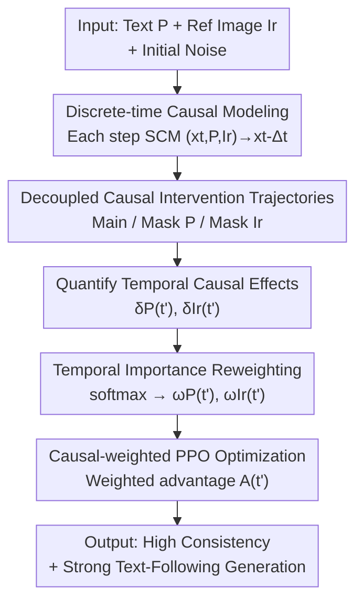

# Consis-GCPO: Consistency-Preserving Group Causal Preference Optimization for Vision Customization

**Conference**: ICLR2026  
**OpenReview**: [https://openreview.net/forum?id=OswqOlTYR2](https://openreview.net/forum?id=OswqOlTYR2)  
**Code**: To be confirmed  
**Area**: Image Generation / Diffusion Models / RL Alignment  
**Keywords**: Subject-driven generation, GRPO, Causal intervention, Timestep reweighting, Text-reference decoupling

## TL;DR
Consis-GCPO reformulates GRPO reinforcement learning in subject-driven generation (reference-to-image/video) as a "discrete-time causal optimization" problem. By performing counterfactual interventions—specifically "masking text" and "masking reference images"—at each denoising step, it quantifies the instantaneous causal contribution of linguistic and visual conditions. These are converted into timestep-weighted advantages for targeted optimization, achieving higher subject consistency and stronger text following in complex multi-subject scenarios.

## Background & Motivation
**Background**: Subject-driven generation aims to generate images or videos that preserve the identity of given reference subjects while following textual instructions. For images, methods from DreamBooth and IP-Adapter to recent DiT-based models (UNO, XVerse, DreamO, MOSAIC) enable multi-reference multi-subject synthesis; for videos, VACE, Phantom, and MAGREF extend this to the temporal dimension. Recently, GRPO-based reinforcement learning (Flow-GRPO, DanceGRPO) has been popularized to align generative models with human preferences.

**Limitations of Prior Work**: Existing methods often struggle to balance "subject fidelity" and "semantic alignment"—generated images either closely resemble the reference subject but ignore text (semantic drift), or follow the text well but lose the subject's identity (fidelity degradation), especially in complex compositions with multiple interacting subjects.

**Key Challenge**: The authors identify two structural flaws in GRPO-based methods. The first is **temporal blindness**: they apply **uniform** optimization weights across all denoising timesteps, ignoring the fact that the importance of text and visual conditions varies at different denoising stages. The second is **entangled feedback**: providing only a global reward at the end of generation prevents disentangling the specific contributions of text and reference conditions, hindering targeted improvement.

**Key Insight**: The authors observe a "coarse-to-fine" pattern in the denoising process—**text dominates global structural layout during early high-noise stages, while reference images take over fine-grained identity and texture during late low-noise stages**. Since different conditions are responsible for different characteristics at different moments, optimizations should not treat all steps equally.

**Core Idea**: Model multi-condition guided generation as a **Discrete-time Structural Causal Model (SCM)**. At each timestep, perform counterfactual interventions by "cutting off text" or "cutting off reference" to measure the instantaneous causal effect of each modality. These effects are normalized into temporal importance weights to reweight the advantage—replacing the "uniform weights" of GRPO with "causally measurable temporal weights."

## Method

### Overall Architecture
Consis-GCPO is built upon Flow-GRPO, which treats the SDE denoising process of flow-matching models as a sequential decision problem. The policy is defined as the transition distribution $\pi(t)\triangleq p_\theta(x_{t-\Delta t}\mid x_t)$, optimized using a PPO-style clipped objective with KL regularization. The modification in Consis-GCPO lies in **how the advantage is calculated**: instead of a uniform advantage for all timesteps, it uses causal intervention to measure the importance of text/reference at each step and reweights accordingly.

The workflow is: given initial noise, a **main trajectory** is generated; for each timestep $t'$, a **text-masked intervention trajectory** and a **reference-masked intervention trajectory** are executed; reward functions compare the quality drop between the main and intervention trajectories to obtain instantaneous causal effects $\delta_P(t')$ and $\delta_{I_r}(t')$; these effects are normalized via softmax into temporal weights $\omega_P(t')$ and $\omega_{I_r}(t')$; finally, the weights are multiplied by their respective advantages and fused into a total advantage for the PPO update.

### Key Designs

**1. Discrete-time Structural Causal Model: Providing an Intervenable Causal Skeleton**

Existing methods feed text and references into the denoising network simultaneously, making it impossible to determine which condition is active at a specific step. Consis-GCPO explicitly models each step of reverse diffusion as an SCM: at timestep $t$, the denoised state $x_{t-\Delta t}$ is causally determined by four parent variables—current noisy latent $x_t$, text prompt $P$, reference image $I_r$, and independent noise $\epsilon_t$, i.e., $(x_t, P, I_r)\rightarrow x_{t-\Delta t}$. Based on this, **step-wise causal intervention** is defined: the condition $C\in\{P, I_r\}$ is removed only at the target step $t'$, while others remain normal:

$$do(C=\varnothing, t'):\quad x_{t-\Delta t}=\begin{cases} f_\theta(x_t,\cdot,\cdot,\epsilon_t)\setminus C, & t=t'\\ f_\theta(x_t,P,I_r,\epsilon_t), & t\neq t'\end{cases}$$

This serves as the foundation: it transforms "condition importance" from an abstract concept into a quantity that can be **precisely measured via counterfactual operations**. Unlike global ablation, it isolates causal effects to individual timesteps.

**2. Decoupled Causal Intervention Trajectories: Separating Text and Reference Contributions**

To perform causal analysis for each initial noise $x_1^{(g)}$, three types of trajectories are generated in parallel: the **main trajectory** $x_{t-\Delta t}^{(g)}=f_\theta(x_t^{(g)},P,I_r,\epsilon_t)$; a **text-intervention trajectory** where $P$ is nullified only at step $t'$; and a **reference-intervention trajectory** where $I_r$ is nullified only at step $t'$. This ensures the causal contributions are **structurally separated** at the advantage estimation level (rather than the loss level): masking text only affects text-related counterfactuals, decoupling their gradients mathematically.

**3. Quantifying Temporal Causal Effects: Measuring Step-wise Performance Drops**

Using the three trajectories, specialized rewards assess generation quality: $R_P^{(g)}=\psi_P(x_0^{(g)},P)$ for text-alignment and $R_{I_r}^{(g)}=\psi_{I_r}(x_0^{(g)},I_r)$ for visual consistency. The **instantaneous causal contribution** at step $t'$ is defined as the performance drop after intervention:

$$\delta_P^{(g)}(t')=R_P^{(g)}-\psi_P(x_0^{(P,t',g)},P),\quad \delta_{I_r}^{(g)}(t')=R_{I_r}^{(g)}-\psi_{I_r}(x_0^{(I_r,t',g)},I_r)$$

Larger $\delta$ indicates stronger causal dependence on that condition at that step. $\psi_P$ uses ImageReward (image) or VideoAlign (video); $\psi_{I_r}$ uses DINOv3 to calculate visual similarity.

**4. Temporal Importance Reweighting + Causal-weighted PPO: Targeted Optimization Signals**

Finally, instantaneous effects are converted into weights using softmax with temperature $\tau$:

$$\omega_P^{(g)}(t')=\frac{\exp(\delta_P^{(g)}(t')/\tau)}{\sum_t \exp(\delta_P^{(g)}(t)/\tau)},\quad \omega_{I_r}^{(g)}(t')=\frac{\exp(\delta_{I_r}^{(g)}(t')/\tau)}{\sum_t \exp(\delta_{I_r}^{(g)}(t)/\tau)}$$

These weights characterize which steps should be "trusted" for each condition. They are multiplied by group-normalized advantages: $A_P^{(g)}(t')=\omega_P^{(g)}(t')\cdot\frac{R_P^{(g)}-\mu_P}{\sigma_P}$ (similarly for reference). The total advantage is fused: $A^{(g)}(t')=\lambda_P A_P^{(g)}(t')+\lambda_{I_r}A_{I_r}^{(g)}(t')$, which is then plugged into the PPO clipped objective:

$$\mathcal{L}_{\text{Consis-GCPO}}(\theta)=-\frac{1}{G}\sum_{g=1}^{G}\sum_{t'}\big(\min(r_{t}^{g}(\theta)A^g(t'),\ \mathrm{clip}(r_{t}^{g}(\theta),1-\sigma,1+\sigma)A^g(t'))-\beta D_{KL}(\pi_\theta\|\pi_{\text{ref}})\big)$$

By amplifying text gradients at steps with high text causal impact and reference gradients at their respective steps, **targeted credit assignment** is achieved.

### Loss & Training
Training data combines Subject200K and FFHQ, with 5,000 diverse text-image pairs generated by GPT. The authors selected **Joint optimization** over alternating or sequential optimization because it avoids gradient oscillation and catastrophic forgetting while being 1.8× faster.

## Key Experimental Results

### Main Results
Evaluated on DreamBench (image) using UNO as the backbone, and Dream-VBench (video) using Vace-1.3B.

| Task | Metric | Consis-GCPO | Best Baseline | Description |
|------|------|-------------|---------------|------|
| Multi-subject R2I | CLIP-T ↑ | **0.331** | 0.325 (UNO+Flow-GRPO) | Text Alignment |
| Multi-subject R2I | CLIP-I ↑ | **0.772** | 0.750 (UNO+Dance-GRPO) | Cross-modal Consistency |
| Multi-subject R2I | DINO ↑ | **0.572** | 0.561 (UNO+Dance-GRPO) | Identity Fidelity |
| Single-subject R2V | CLIP-T ↑ | **0.305** | 0.287 (VACE+DanceGRPO) | +6.3% over best baseline |
| Single-subject R2V | DINO-I ↑ | **0.746** | 0.732 | Reference Fidelity |
| Single-subject R2V | Consistency ↑ | **0.984** | 0.981 | Temporal Consistency |

Consis-GCPO achieved the best performance across all metrics for both image and video tasks, with statistically significant improvements ($p<0.05$).

### Ablation Study
Ablation of step-wise counterfactual intervention:

| Config | R2I CLIP-T | R2I DINO-I | R2V CLIP-T | R2V DINO-I | Description |
|------|-----------|-----------|-----------|-----------|------|
| No Intervention (Flow-GRPO) | 0.325 | 0.551 | 0.265 | 0.587 | Uniform weights (Baseline) |
| Text Intervention Only | 0.338 | 0.544 | 0.310 | 0.556 | Improved text, lower fidelity |
| Ref Intervention Only | 0.322 | 0.570 | 0.255 | 0.615 | Improved fidelity, lower text |
| Full (Ours) | 0.331 | 0.572 | 0.300 | 0.608 | Best overall |

### Key Findings
- **Temporal division of labor is confirmed**: Causal diagnostics show text weights $\omega_P$ dominate early high-noise steps, while reference weights $\omega_{I_r}$ take over later.
- **Modality-specific intervention reveals bias**: Text-only intervention improves CLIP-T but degrades DINO-I. Independent temporal credit assignment is necessary for both consistency and alignment.
- **Joint optimization is Pareto optimal**: It avoids oscillation (alternating) and forgetting (sequential) while maintaining efficiency.

## Highlights & Insights
- **Quantifying responsibility**: Instead of heuristic weights, it uses counterfactual intervention to "measure" the instantaneous causal effect, turning the "coarse-to-fine" intuition into a measurable mechanism.
- **Decoupling at advantage level**: The gradients are isolated mathematically through independent counterfactuals, avoiding the conflicts common in multi-objective loss optimization.
- **Coarse-to-fine prior**: The observation that text governs layout early while references govern texture late is a valuable prior for any multi-condition diffusion design.

## Limitations & Future Work
- **Limitations**: The current work focuses on algorithmic innovation rather than scaling the reward model; future work could introduce multi-modal foundation models for rewards.
- **Computational Cost**: Executing masked intervention trajectories for every timestep during training adds sampling overhead, which is not fully quantified.
- **Dependency on Reward Quality**: The reliability of the causal effects depends directly on the accuracy of the external reward models (ImageReward, DINOv3, etc.).

## Related Work & Insights
- **vs Flow-GRPO**: Flow-GRPO uses uniform weights across timesteps and global rewards; Consis-GCPO addresses "temporal blindness" and "feedback entanglement" via causal credit assignment.
- **vs DanceGRPO**: While DanceGRPO focuses on policy stability and prompt scaling, Consis-GCPO outperforms it in multi-subject scenarios through finer-grained temporal control.
- **vs UNO/XVerse/DreamO**: These are architectural customization models; Consis-GCPO serves as a plug-and-play RL alignment layer to further enhance their consistency.

## Rating
- Novelty: ⭐⭐⭐⭐⭐ Explicitly quantifying and decoupling importance via step-wise counterfactuals is a fresh and self-consistent approach.
- Experimental Thoroughness: ⭐⭐⭐⭐ Complete evaluation across image/video and single/multi-subject.
- Writing Quality: ⭐⭐⭐⭐ Clear logical chain from modeling to optimization.
- Value: ⭐⭐⭐⭐ A transferable paradigm for temporal credit assignment in multi-condition diffusion models.

<!-- RELATED:START -->

## Related Papers

- [\[ICLR 2026\] Reinforcing Diffusion Models by Direct Group Preference Optimization](reinforcing_diffusion_models_by_direct_group_preference_optimization.md)
- [\[ICLR 2026\] Group Critical-token Policy Optimization for Autoregressive Image Generation](group_critical-token_policy_optimization_for_autoregressive_image_generation.md)
- [\[ICLR 2026\] Diffusion Negative Preference Optimization Made Simple](diffusion_negative_preference_optimization_made_simple.md)
- [\[ICLR 2026\] ViPO: Visual Preference Optimization at Scale](vipo_visual_preference_optimization_at_scale.md)
- [\[ICLR 2026\] PCPO: Proportionate Credit Policy Optimization for Preference Alignment of Image Generation Models](pcpo_proportionate_credit_policy_optimization_for_preference_alignment_of_image_.md)

<!-- RELATED:END -->
