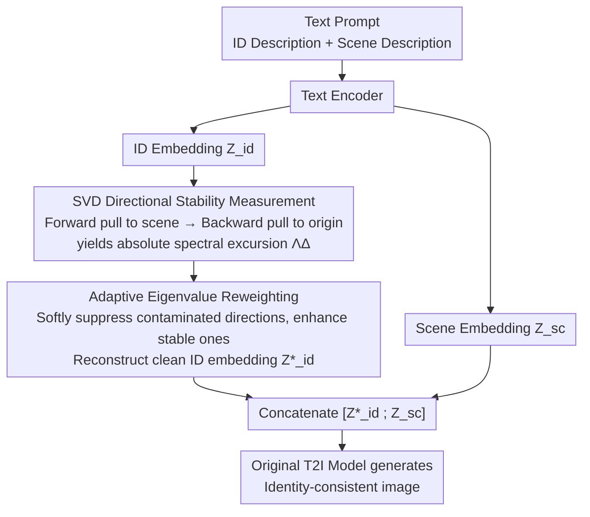

# Consistent Text-to-Image Generation via Scene De-Contextualization

**Conference**: ICLR 2026  
**arXiv**: [2510.14553](https://arxiv.org/abs/2510.14553)  
**Code**: [https://github.com/tntek/SDeC](https://github.com/tntek/SDeC)  
**Area**: Diffusion Models / Consistent Generation  
**Keywords**: consistent T2I, identity preservation, scene contextualization, SVD, training-free, prompt embedding

## TL;DR
Reveals that the root cause of ID shift in T2I models is "scene contextualization" (scene tokens injecting contextual information into ID tokens) and proposes a training-free Scene De-Contextualization (SDeC) method. By analyzing the directional stability of SVD eigenvalues, SDeC identifies and suppresses potential scene-ID associations in prompt embeddings to achieve per-scene identity-consistent generation.

## Background & Motivation

**Background**: Consistent T2I generation requires the same subject to maintain identity across different scenes. Existing methods (ConsiStory, 1P1S, etc.) typically require prior knowledge of all target scenes or necessitate model training/fine-tuning.

**Limitations of Prior Work**: (a) Assuming all target scenes are available beforehand is unrealistic in practice (e.g., scenes are determined iteratively in film/game production); (b) Training-based methods need to retrain models, which is inefficient; (c) The fundamental cause of ID shift has not been systematically investigated.

**Key Challenge**: T2I models are trained on large-scale natural images and naturally learn priors associating subjects with scenes (e.g., cows are usually in grass rather than the sea), leading the model to change the subject's appearance under different scene prompts. The attention mechanism inevitably allows scene token information to be injected into ID tokens.

**Goal**: (a) Theoretically explain the source of ID shift; (b) Propose a training-free, per-scene solution that does not require knowing all scenes in advance.

**Key Insight**: Starting from the attention mechanism, it is proven that scene contextualization (scene-to-ID information leakage) is almost inevitable (requiring $W_V$ to be exactly block-diagonal to avoid—a zero-measure event). This association is then identified and suppressed through SVD analysis in the prompt embedding space.

**Core Idea**: Scene contextualization is the root of ID shift and is nearly unavoidable, but it can be decoupled in the prompt embedding space through SVD directional stability analysis.

## Method

### Overall Architecture

This paper addresses the problem of "subjects changing appearance when moved to different scenes" (ID shift) under two strict constraints: no model training and no prior knowledge of all target scenes (processing one scene at a time). The logic of SDeC is as follows: it first theoretically defines the root of ID shift as "scene contextualization" and proves its inevitability. Since the source cannot be modified, a "reverse operation" is performed on the **prompt embedding** to identify and suppress the components in the ID text embedding that are "contaminated" by the scene before feeding it back into the original T2I model.

The pipeline is: text prompts are encoded into ID embeddings $\mathcal{Z}_{\text{id}}^o$ and scene embeddings $\mathcal{Z}_{\text{sc}}^k$. Operating only on $\mathcal{Z}_{\text{id}}^o$, it first uses a "forward-backward" eigenvalue optimization to measure the susceptibility of each SVD direction to scene influence. Then, it adaptively reweights eigenvalues based on this measure to reconstruct a clean ID embedding $\mathcal{Z}_{\text{id}}^*$. Finally, it is concatenated with the original scene embeddings as $[\mathcal{Z}_{\text{id}}^*; \mathcal{Z}_{\text{sc}}^k]$ and sent to the T2I model for generation. Since it only processes the prompt for the current scene, it naturally satisfies the per-scene requirement without needing other scenes.

> Note: The above represents the actual SDeC workflow (Key Designs 2 and 3). Key Design 1 provides the theoretical analysis supporting this path—explaining "why post-processing on embeddings is necessary"—but is not a data node in the pipeline itself.

### Key Designs

**1. Scene Contextualization Theory: Proving ID shift is destined to happen**

SDeC starts by clarifying why subjects change appearance. The authors split the cross-attention output into an ID term $T_{\text{id}}$ and a scene term $T_{\text{sc}}$. For the scene term to be non-zero (i.e., scene information leaking into the ID token), two conditions must hold: (A) non-zero scene attention weights $\alpha_{\text{sc}} \neq 0$; (B) $\Pi_{\text{id}} \circ W_V|_{\mathcal{H}_{\text{sc}}} \neq 0$, meaning the value projection matrix $W_V$ is not block-diagonal with respect to the ID and scene subspaces. Theorem 1 and Corollary 1 state that for $T_{\text{sc}}=0$, $W_V$ must be exactly block-diagonal—a zero-measure event in real models with continuous parameters, which almost never holds. In other words, scene contamination of the ID is not a bug of a specific backbone but a structural consequence of the attention mechanism. This conclusion determines the technical route: since it cannot be avoided at the source, it must be removed via post-processing on prompt embeddings.

**2. SVD Directional Stability Measurement: Identifying "contaminated" directions via forward-backward optimization**

Knowing contamination is inevitable, the next step is locating it. Theoretically, "contaminated directions" correspond to the shared projection $P_\cap$ of the ID and scene subspaces, but direct construction is numerically unstable in high dimensions. Instead, the authors use a "forward-and-backward" eigenvalue optimization for soft estimation. First, SVD is performed on the original ID embedding $\mathcal{Z}_{\text{id}}^o = U_{\text{id}}^o \Lambda_{\text{id}}^o V_{\text{id}}^{o\top}$. Keeping left and right singular vectors fixed, only the diagonal eigenvalues $\Lambda_{\text{id}}$ are learned; the forward phase pulls the reconstruction closer to the scene embedding $\mathcal{Z}_{\text{sc}}^k$ (revealing which directions align with the scene), and the backward phase pulls it back to the original position $\mathcal{Z}_{\text{id}}^o$ (recovering directions that carry identity info and should not be deleted). The phases switch via weight $\beta$ after $M$ iterations:

$$\Lambda^* = \min_{\Lambda_{\text{id}}} \|U_{\text{id}}^o \Lambda_{\text{id}} V_{\text{id}}^{o\top} - \mathcal{Z}_{\text{sc}}^k\|_2 + \beta \|U_{\text{id}}^o \Lambda_{\text{id}} V_{\text{id}}^{o\top} - \mathcal{Z}_{\text{id}}^o\|_2$$

After optimization, the **absolute spectral excursion** measures the influence intensity of the scene on each direction: $\Lambda_\Delta = |\Lambda^* - \Lambda_{\text{id}}^o| = \mathrm{diag}(v_1,\dots,v_r)$, where $v_i = |\lambda_i^* - \lambda_i^o|$. A larger excursion indicates a direction more likely to belong to the scene-ID association subspace; directions with near-zero excursion are robust.

**3. Adaptive Eigenvalue Reweighting: Reconstructing after suppressing contaminated directions**

The final step is rewriting the embedding using the excursion scores. The authors avoid "hard-cutting" (direct deletion) because some directions might carry both slight scene associations and crucial identity information. Instead, they use **robust subspace filtering**: mapping normalized $\Lambda_\Delta$ to a weight matrix that relatively enhances stable directions and suppresses contaminated ones:

$$\mathcal{Z}_{\text{id}}^* = U_{\text{id}}^o (\Lambda_\omega \Lambda_{\text{id}}^o) V_{\text{id}}^{o\top}, \quad \Lambda_\omega = 1 + \Omega\left(\frac{\Lambda_\Delta - \Delta_{\min}}{\Delta_{\max} - \Delta_{\min}}\right)$$

The hyperparameter $\Omega \ge 1$ controls reweighting intensity, with weights in $[1, 1+\Omega]$. By **relatively amplifying stable directions**, it effectively suppresses contaminated directions, allowing for soft selection without a threshold to avoid accidental deletion of identity information in shared subspaces.

### Loss & Training

- **Training-free**: SDeC operates entirely on prompt embeddings during inference and does not modify model parameters.
- Compatible with various T2I backbones: SDXL, SD3, Flux, PlayGround-v2.5, etc.
- Can be used complementarily with attention adapter methods like ConsiStory.

## Key Experimental Results

### Main Results (Based on SDXL)

| Method | DreamSim-F ↓ | CLIP-I ↑ | DreamSim-B ↑ | CLIP-T ↑ | Type |
|------|-------------|---------|-------------|---------|------|
| SDXL Baseline | 0.2778 | 0.8558 | 0.3861 | 0.8865 | — |
| ConsiStory | 0.2729 | 0.8604 | **0.4207** | **0.8942** | Training-free |
| 1P1S | **0.2238** | **0.8798** | 0.2955 | 0.8883 | Training-free |
| **SDeC** | 0.2589 | 0.8655 | 0.3675 | 0.8946 | Training-free |
| **SDeC+ConsiStory** | 0.2542 | 0.8744 | 0.4155 | 0.8967 | Training-free |

User study win rate: SDeC **42.67%** vs 1P1S 15% vs ConsiStory 20.83%

### Ablation Study

| Method Variant | DreamSim-F ↓ | CLIP-I ↑ | CLIP-T ↑ |
|---------|-------------|---------|---------|
| **SDeC (Full)** | **0.2589** | **0.8655** | **0.8946** |
| w/o soft-estimation | 0.2646 | 0.8603 | 0.8912 |
| w/o abs-excursion | 0.2631 | 0.8627 | 0.8893 |

### Key Findings
- While 1P1S performs best on ID metrics, it has the worst scene diversity (DreamSim-B only 0.2955), indicating severe inter-scene interference. SDeC achieves the best balance between ID consistency and scene diversity.
- SDeC and ConsiStory are highly complementary—the former processes prompt embeddings while the latter handles attention, with combined results showing significant improvement.
- Training-based methods (BLIP-Diffusion, PhotoMaker) are actually inferior to training-free methods in ID consistency.
- SDeC has extremely low computational overhead (POT 0.61s), causing almost no additional burden on inference time or VRAM.

## Highlights & Insights
- **Solid Theoretical Depth**: It does not just qualitatively explain ID shift but derives the "inevitability" of scene contextualization from the attention mechanism. The logic of "proving a problem is inevitable before solving it" is compelling.
- **Training-free + Per-scene**: Meeting these two constraints simultaneously makes the method highly practical for production. It can be transferred to any scenario requiring the "decoupling of conditional signals."
- **SVD Directional Stability Analysis**: The idea of identifying "contaminated" directions by observing eigenvalue changes under perturbation is a novel and generalizable technique.

## Limitations & Future Work
- 1P1S still performs better in ID purity (CLIP-I 0.8798 vs 0.8655), suggesting SDeC's de-contextualization is not fully exhaustive.
- Validated only under text-only prompt settings; lacks testing for image-conditioned (e.g., IP-Adapter) scenarios.
- Theoretical analysis focuses on the first attention layer; cumulative multi-layer effects are not quantified.
- Forward-backward optimization for stability measurement adds an extra 0.61s delay.
- Dependence on SVD may lead to efficiency drops for extremely long prompts with many tokens.

## Related Work & Insights
- **vs 1P1S**: 1P1S requires prompt restructuring across all scenes + IPCA adapters. SDeC outperforms it on composite metrics without these dependencies. They operate at different levels: 1P1S restructures prompt syntax, while SDeC edits prompt embeddings.
- **vs ConsiStory**: Handles self-attention consistency in attention layers, complementing SDeC’s embedding-level operations.
- **vs DreamBooth/PhotoMaker**: Training methods learn ID from reference images; SDeC starts from the prompt text and requires no reference images.

## Rating
- Novelty: ⭐⭐⭐⭐⭐ First to theorize scene contextualization and prove its inevitability; novel SVD stability analysis.
- Experimental Thoroughness: ⭐⭐⭐⭐ Extensive backbones (SDXL/SD3/Flux), user studies, and ablations, though image-conditioned experiments are missing.
- Writing Quality: ⭐⭐⭐⭐⭐ Clear and fluent logic chain from theory to insight to method to experiments.
- Value: ⭐⭐⭐⭐ The training-free, per-scene approach has strong practical value and inspiring theoretical contributions.

<!-- RELATED:START -->

## Related Papers

- [\[ICLR 2026\] WithAnyone: Toward Controllable and ID Consistent Image Generation](withanyone_toward_controllable_and_id_consistent_image_generation.md)
- [\[AAAI 2026\] Infinite-Story: A Training-Free Consistent Text-to-Image Generation](../../AAAI2026/image_generation/infinite-story_a_training-free_consistent_text-to-image_gene.md)
- [\[ICLR 2026\] Generate Any Scene: Scene Graph Driven Data Synthesis for Visual Generation Training](generate_any_scene_scene_graph_driven_data_synthesis_for_visual_generation_train.md)
- [\[CVPR 2026\] StyleTextGen: Style-Conditioned Multilingual Scene Text Generation](../../CVPR2026/image_generation/styletextgen_style-conditioned_multilingual_scene_text_generation.md)
- [\[ICLR 2026\] TIPO: Text to Image with Text Pre-sampling for Prompt Optimization](tipo_text_to_image_with_text_pre-sampling_for_prompt_optimization.md)

<!-- RELATED:END -->
