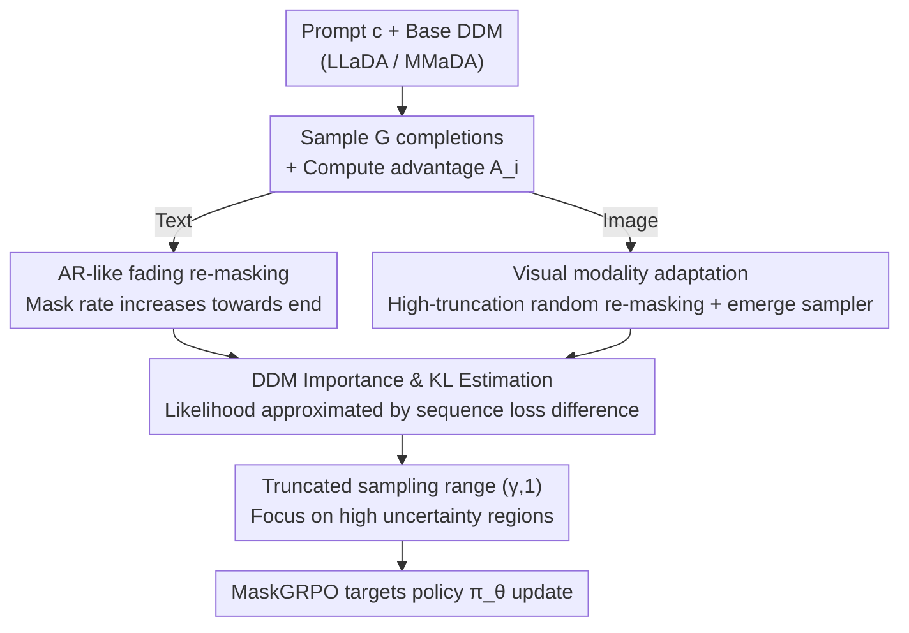

# Consolidating Reinforcement Learning for Multimodal Discrete Diffusion Models

**Conference**: ICLR2026  
**OpenReview**: [https://openreview.net/forum?id=9nxCJP4q0i](https://openreview.net/forum?id=9nxCJP4q0i)  
**Code**: https://github.com/martian422/MaskGRPO  
**Area**: Diffusion Models / Multimodal Generation  
**Keywords**: Discrete Diffusion, GRPO, Reinforcement Learning, Importance Sampling, Text-Image Alignment

## TL;DR
This paper proposes MaskGRPO, the first GRPO reinforcement learning framework capable of stably scaling to multimodal Discrete Diffusion Models (DDM). By providing a computable importance estimation and KL approximation for the intractable likelihood of DDM, and customizing re-masking and sampling strategies for "language" and "vision" modalities—fading-out AR re-masking for text and high-truncation random re-masking with the emerge sampler for images—it nearly doubles RL gains in mathematical reasoning, code, and text-to-image generation while accelerating training by up to 30%.

## Background & Motivation
**Background**: The reinforcement learning paradigm of "group relative advantage + importance sampling," represented by GRPO (Group Relative Policy Optimization), has become a primary tool for enhancing reasoning capabilities and aligning generation preferences in Auto-Regressive (AR) large models. Its core involves calculating normalized advantages $A_i$ for a set of rollouts and performing clipped policy updates using the token-level importance ratio $\rho^k_i = \pi_\theta(o^k_i\mid c,o^{<k}_i) / \pi_{\theta_{old}}(o^k_i\mid c,o^{<k}_i)$.

**Limitations of Prior Work**: Directly applying GRPO to Discrete Diffusion Models (DDM) is nearly infeasible. DDM does not decode sequentially but reconstructs from masked tokens in parallel at arbitrary positions. This breaks the two pillars of GRPO: first, **rollout generation**—parallel decoding struggles to produce samples with both randomness and coherence for exploration; second, **importance estimation**—the conditional likelihood $\pi(o^k\mid o^{<k})$ used in AR models cannot be formulated in DDM (intractable likelihood and importance sampling).

**Key Challenge**: Existing patches only solve half the problem. Semi-autoregressive samplers on the text side alleviate inference issues, but low-confidence re-masking on the image side lacks the stochastic flexibility required for robust group comparison. Early methods for importance estimation (such as masking prompts in diffu-GRPO or iteratively masking different ratios in UniGRPO) either destroy conditional dependencies or rely on high-cost Monte Carlo estimation. The root cause is that **linguistic and visual structures possess entirely different properties; using a "modality-agnostic random mask" to estimate likelihood is neither accurate nor stable**.

**Goal**: To provide a truly computable, low-variance likelihood/importance estimation for DDM and ensure that both rollouts and estimations are "modality-aware."

**Key Insight**: The authors observe exploitable biases in each modality—language, even when trained with native diffusion, retains "ARness" during prediction (tokens closer to the observed context are more certain, with divergence appearing as length increases). Conversely, image tokens exhibit strong global correlation and lack sequential structure, being almost insensitive to small mask ratios.

**Core Idea**: Replace "modality-agnostic randomness" with "modality-awareness"—text uses a fading-out mask probability to focus on high-uncertainty regions, while images utilize high-truncation random re-masking with an emerge sampler. This marks the first systematic and stable integration of GRPO into multimodal discrete diffusion.

## Method

### Overall Architecture
MaskGRPO addresses "how to run GRPO on DDM with intractable likelihoods." It follows the outer loop of GRPO: for each prompt $c$, a group of complete completions $\{o_1, \dots, o_G\}$ is sampled, normalized advantages $A_i$ are calculated using rewards $r_i$, and the policy is updated. The key difference lies in the inner loop: since DDM cannot calculate token-level conditional likelihoods, this paper uses "timestep inversion" as a bridge. For each completion $o$, a re-masking function $\hat o^t\sim\mathrm{Rev}(o,t)$ is used to revert it to a masked intermediate state. The **difference in loss terms across the entire sequence** is then used to approximate the likelihood fluctuation of new masked tokens, yielding computable importance $\hat\rho^t$ and KL divergence $\hat D^t_{KL}$ for gradient ascent.

There are two "branches" in this pipeline: the re-masking method ($\mathrm{Rev}$) and the rollout sampler both switch based on modality—text adopts fading-out AR re-masking + semi-autoregressive sampling, while images adopt high-truncation random re-masking + emerge sampling. The overall process is as follows:

### Key Designs

**1. DDM Importance and KL Estimation: Approximating Intractable Likelihood via Sequence Loss Difference**

The inability to write token-level conditional likelihoods for DDM is the primary barrier to adopting GRPO. Starting from the DDM ELBO, the loss for each completion is denoted as $\ell_{\pi_\theta}(x_t,x_0)$ (the sum of reconstruction log-likelihoods at masked positions weighted by $1/t$, see Eq. 2). The core approximation is: for a small interval $\delta t$, let $\dot o^t=o^t-o^{t+\delta t}$ be the new tokens decoded from $t+\delta t$ to $t$. The log-likelihood difference of these new tokens can be approximated by the **prediction difference of the entire sequence at time $t$**:

$$\log\pi_1(\dot o^t\mid c,o^{t+\delta t})-\log\pi_2(\dot o^t\mid c,o^{t+\delta t})\approx \ell_{\pi_1}(o^t,o\mid c)-\ell_{\pi_2}(o^t,o\mid c)$$

This yields the computable importance ratio $\hat\rho^t_i=\exp\big(\ell_{\pi_\theta}(o^t_i,o_i\mid c)-\ell_{\pi_{\theta_{old}}}(o^t_i,o_i\mid c)\big)$ and the corresponding $\hat D^{i,t}_{KL}$ (Eq. 9–10). Substituting these back into GRPO, the objective becomes accumulating $\sum_j(\hat\rho^{t_j}_i-\beta\hat D^{i,t_j}_{KL})$ along a series of timesteps $t_j=j/\mu$, weighted by advantage $A_i$. Compared to diffu-GRPO (which only takes likelihood at full mask $o^{t=1}$, breaking conditional dependency) and UniGRPO (which uses iterative masking and high-cost Monte Carlo estimation), this estimation preserves conditional structure without expensive sampling. The authors emphasize that this approximation, though overlooked in previous work, is critical for derivation and implementation (⚠️ structural details in Appendix C).

**2. Truncated Sampling Range: Investing Timestep Budget in High-Uncertainty Regions**

Estimating over the entire $(0,1)$ mask ratio interval wastes budget on low-mask scenarios where the model is already highly certain—the likelihood barely shifts at these positions, providing no useful gradient. This work constrains the sampling range from $(0,1)$ to $(\gamma,1)$, where $\gamma$ serves as a mask ratio lower cut-off. The intuition is that reconstruction likelihood fluctuations are only "informative" when the mask rate is high enough that the sequence still contains sufficient uncertain tokens. This truncation is applied to both modalities with different values: text defaults to $\gamma=0.6$, while images require a more aggressive $\gamma=0.8$ due to global token correlation and low sensitivity to small masks.

**3. Text-side Fading-out AR Re-masking: Leveraging ARness to Focus Attention on Late Tokens**

Even with diffusion training, language predictions exhibit "ARness"—tokens near the context are more certain, and divergence appears as the length extends. Combined with semi-autoregressive samplers, rollouts diverge more towards the end of a block. Modality-agnostic random re-masking ignores this, spreading estimation across early, already certain tokens. The AR-like re-masking (Alg. 1) constructs a linearly decreasing weight $d=\mathrm{linspace}(1,0,L_o)$ for non-prompt parts, normalized to a mask probability $p_n=d\cdot\frac{(1-r)L_o}{\sum d}$. Thus, tokens further back have a higher probability of being masked, concentrating estimation on the high-uncertainty end. This plug-and-play module significantly improves performance without extra computation.

**4. Visual-side High-truncation Random Re-masking + Emerge Sampler: Allowing Visual Tokens to "Emerge" Naturally**

Images lack sequential structure, so the visual side takes the opposite approach: re-masking remains random (Alg. 2), but inversion intensity must be high ($\gamma=0.8$) to avoid variance explosions. More critically, the rollout sampler—specifically the confidence-based MaskGIT sampler designed for 1024-word vocabularies—fails on high-fidelity tokenizers with vocabularies like 8192. Drawing from continuous diffusion sampling intuition, the authors propose the emerge sampler (Alg. 4): it does not force a fixed number of tokens per step but allows visual tokens to "emerge" naturally based on probability ($q_s=\frac{\alpha_s-\alpha_t}{1-\alpha_t}\pi+\delta_m\frac{1-\alpha_s}{1-\alpha_t}$ with CFG guidance). While the emerge sampler shows lower GenEval before RL (0.51 vs 0.56 due to boundary instability), it expands the exploration space, allowing RL to converge to a superior local optimum (0.81 vs 0.77).

### Loss & Training
The final objective is the DDM version of the GRPO "reward-penalty" tradeoff: $G$ completions are sampled for each prompt to calculate advantages, and $\mu$ gradient updates are run in the inner loop. Each update selects a timestep $t_j=\gamma+(1-\gamma)\frac{j}{\mu}$, constructs a masked completion $\hat o_{i,t_j}\sim\mathrm{Rev}(o_i,t_j,S_j)$ with a controlled random seed, estimates $\hat\rho$ and $\hat D_{KL}$ per Eq. 9–10, and maximizes $\frac{1}{G}\sum_i\frac{A_i}{|o_i|}\sum_j(\hat\rho^{t_j}_i-\beta\hat D^{i,t_j}_{KL})$. Rewards for language tasks include a simple combination of format and correctness; image tasks combine UnifiedReward (alignment), HPSv3 (aesthetic + alignment), and CLIP Score. Base models are LLaDA-8B-Instruct (text) and MMaDA-8B-Base (multimodal).

## Key Experimental Results

### Main Results
Mathematical Reasoning and Code (Pass@1, Base: LLaDA-8B-Instruct):

| Method | GSM8K-256 | GSM8K-512 | MATH500-256 | MBPP-256 |
|------|-----------|-----------|-------------|----------|
| LLaDA-8B-Instruct | 76.7 | 78.2 | 32.4 | 39.0 |
| diffu-GRPO | 79.8 (+3.1) | 81.9 (+3.7) | 34.4 (+2.0) | 42.1 (+3.1) |
| UniGRPO† | 81.1 (+4.4) | 82.0 (+3.8) | 35.0 (+2.6) | 43.1 (+4.1) |
| TraceRL† | 82.1 (+5.4) | 83.3 (+5.1) | 35.9 (+3.5) | 43.9 (+4.9) |
| **MaskGRPO** | **84.7 (+8.0)** | **85.6 (+7.4)** | **37.6 (+5.2)** | **45.4 (+6.4)** |

MaskGRPO achieves 5%+ absolute gains across three benchmarks, nearly doubling the RL benefits of previous methods with fewer steps (6000 vs 7000+).

Text-Image Alignment and Preference (GenEval / Preference Scores, Base: MMaDA):

| Model | GenEval | DPG-Bench | DeQA | ImageReward | HPSv3 |
|------|---------|-----------|------|-------------|-------|
| MMaDA | 0.56 | 0.71 | 3.99 | 0.93 | 8.81 |
| w/ UniGRPO | 0.63 | – | – | – | – |
| **w/ MaskGRPO** | **0.81** | 0.75 | 4.10 | 1.18 | 9.40 |
| **w/ SFT+MaskGRPO** | **0.90** | **0.82** | **4.18** | **1.30** | **9.63** |

MaskGRPO is the first method to effectively optimize "aesthetic quality + text-image alignment" via GRPO on discrete diffusion.

### Ablation Study

| Configuration (Math/Vision) | Metric | Description |
|------|------|------|
| Baseline diffu-GRPO | GSM8K 79.8 | Starting point |
| + Managed Randomness | 80.4 | Controlled random seeds |
| + AR-like Rev. | 83.5 | Fading-out re-masking (Single largest gain) |
| + Truncation etc. | 84.7 | Truncation stabilizer |
| Baseline UniGRPO | GenEval 0.63 | Starting point |
| + Truncation etc. | 0.75 | Universal stabilizer |
| + Emerge Sampler | 0.81 | Visual sampler (Contribution of 20+ points) |

### Key Findings
- **Text's biggest contribution is AR-like re-masking**: Changing from random to fading-out re-masking brought the largest single-step jump ($80.4\to83.5$), confirming that leveraging language ARness for importance estimation is key.
- **Vision's biggest contribution is the emerge sampler**: In the image domain, it amplified gains by 20+ points ($0.63\to0.81$).
- **Truncation ratio $\gamma$ requires a trade-off**: Ablations show that both lack of truncation and over-truncation harm stability.
- **Healthier KL behavior**: Unlike UniGRPO's high and volatile divergence, MaskGRPO achieves a balance—staying stable while retaining the divergence necessary for effective exploration.

## Highlights & Insights
- **The "likelihood difference ≈ sequence loss difference" approximation is the fulcrum**: It transforms DDM's intractable conditional likelihood into a computable loss difference, avoiding the high cost of Monte Carlo while preserving conditional dependencies.
- **"Modality-awareness" is integrated at the lowest levels of re-masking and sampling**: Instead of just adding reward terms, it changes how samples are reverted to masked states and decoded.
- **The emerge sampler reveals a counter-intuitive pattern**: It performs worse before RL (boundary instability), yet its larger exploration space allows RL to reach superior optima unreachable by MaskGIT.
- **Plug-and-play**: AR-like re-masking adds no extra computation; simply replacing the original re-masking yields gains, making it essentially zero-cost to implement.

## Limitations & Future Work
- **Strictness of the approximation**: The core derivation depends on a perfect reconstruction assumption; its bias in long sequences or complex conditions is not fully quantified.
- **Hyperparameter sensitivity**: The dependence on empirical $\gamma$ values (0.6 for text, 0.8 for image) suggests a lack of an adaptive mechanism for new tokenizers or modalities.
- **Metric mismatch in visual evaluation**: The drop in GenEval for the emerge sampler before RL stems from penalty on boundary instability, highlighting a gap between automated metrics and real visual quality.
- **Reward engineering remains heavy**: Image-side results rely on a complex combination of rewards; the impact of reward hacking and weights requires further discussion.

## Related Work & Insights
- **vs diffu-GRPO**: It masks prompts and takes likelihood at full completion $o^{t=1}$, breaking conditional dependencies. This work uses sequence loss difference, preserving conditional structure with lower variance.
- **vs UniGRPO**: It uses iterative masking for Monte Carlo estimation, which is expensive and results in unstable KL. MaskGRPO is cheaper and steadier.
- **vs TraceRL**: It relies on recorded generation trajectories and deterministic inversion, limiting exploration. The stochastic AR-like re-masking in this work consistently outperforms TraceRL by retaining a larger exploration space.
- **vs MaskGIT Sampler**: MaskGIT fails on large-vocabulary high-fidelity tokenizers; the emerge sampler better reflects DDM principles and shows significantly better visual expressiveness.

## Rating
- Novelty: ⭐⭐⭐⭐⭐ First scalable multimodal discrete diffusion GRPO, with authentic likelihood approximation and modality-aware re-masking/sampling.
- Experimental Thoroughness: ⭐⭐⭐⭐ Covers math, code, and text-to-image tasks with detailed ablations, though visual metrics exhibit some baseline mouth-to-mouth misalignment.
- Writing Quality: ⭐⭐⭐⭐ Clear logic from theoretical foundation to modality adaptation, though the core approximation derivation is relegated to the appendix.
- Value: ⭐⭐⭐⭐⭐ Successfully bridges GRPO to discrete diffusion, establishing a reusable foundation for multimodal preference optimization.

<!-- RELATED:START -->

## Related Papers

- [\[NeurIPS 2025\] Co-Reinforcement Learning for Unified Multimodal Understanding and Generation](../../NeurIPS2025/image_generation/coreinforcement_learning_for_unified_multimodal_understandin.md)
- [\[ICLR 2026\] RePrompt: Reasoning-Augmented Reprompting for Text-to-Image Generation via Reinforcement Learning](reprompt_reasoning-augmented_reprompting_for_text-to-image_generation_via_reinfo.md)
- [\[ICML 2026\] ViewMask-1-to-3: Multi-View Consistent Image Generation via Multimodal Discrete Diffusion Models](../../ICML2026/image_generation/viewmask-1-to-3_multi-view_consistent_image_generation_via_multimodal_discrete_d.md)
- [\[CVPR 2026\] Leveraging Verifier-Based Reinforcement Learning in Image Editing](../../CVPR2026/image_generation/leveraging_verifier-based_reinforcement_learning_in_image_editing.md)
- [\[CVPR 2026\] Goal-Driven Reward by Video Diffusion Models for Reinforcement Learning](../../CVPR2026/image_generation/goal-driven_reward_by_video_diffusion_models_for_reinforcement_learning.md)

<!-- RELATED:END -->
