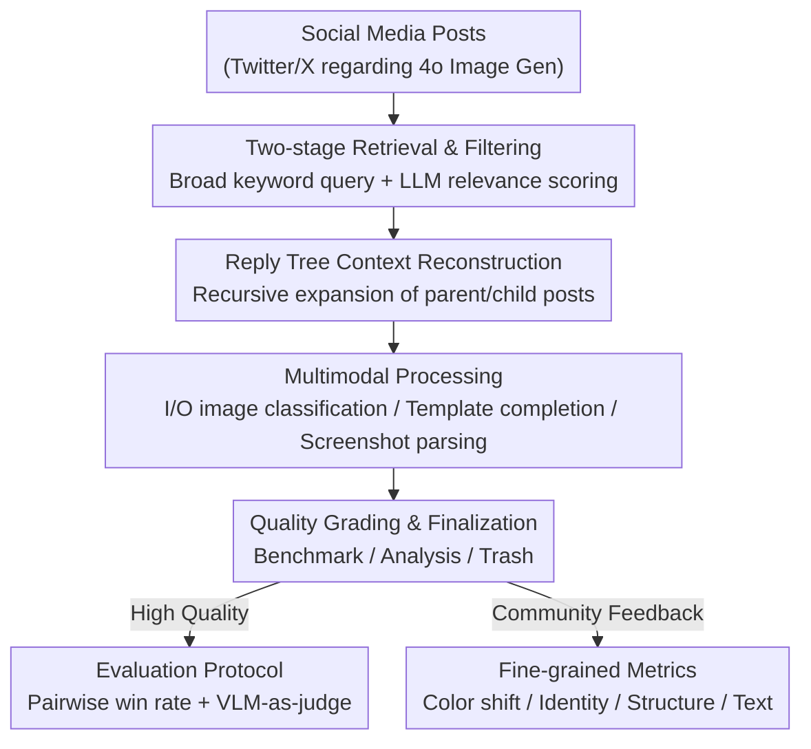

# Constantly Improving Image Models Need Constantly Improving Benchmarks

**Conference**: ICLR2026  
**OpenReview**: [https://openreview.net/forum?id=nOcy5NvNI1](https://openreview.net/forum?id=nOcy5NvNI1)  
**Code**: [echo-bench.github.io](https://echo-bench.github.io)  
**Area**: Image Generation Evaluation / Benchmark Construction  
**Keywords**: Image generation evaluation, benchmark construction, social media crowdsourcing, VLM-as-judge, GPT-4o Image Gen

## TL;DR
This paper proposes the ECHO framework, which automatically distills real user discussions from social media (creative prompts + qualitative feedback) into structured benchmarks. By extracting over 31,000 in-the-wild prompts regarding GPT-4o Image Gen, it uncovers new tasks not covered by existing benchmarks, increases the performance gap between SOTA and other models by 3.2x, and converts community complaints into quantifiable fine-grained metrics.

## Background & Motivation
**Background**: Image generation models iterate extremely quickly. Every generation (especially closed-source systems like GPT-4o Image Gen) reveals unanticipated capabilities, such as "Ghiblification" (turning photos into a specific animation studio style). These new use cases are immediately shared and discussed on social platforms like Twitter/X as quality benchmarks, whereas formal benchmarks often lag behind.

**Limitations of Prior Work**: Current mainstream text-to-image crowdsourced benchmarks (e.g., Pick-a-Pic, PartiPrompts) often consist of keyword-stuffed prompts from the Stable Diffusion era ("colorful stars, galaxies, space, artstation"), which are neither natural language nor representative of current usage. Image editing benchmarks (e.g., GEdit, MagicBrush) utilize instructions that are too simple ("add graffiti", "change background to city street"), allowing both old and new models to succeed and resulting in near-zero discriminative power. Consequently, while manual evaluation shows GPT-4o Image Gen is significantly stronger than best open-source models, this gap is flattened in legacy editing benchmarks.

**Key Challenge**: Benchmarks are static and lagging, while model capabilities and user expectations drift continuously—the definition of a "good image model" changes, but benchmarks lack mechanisms to evolve with community feedback. Manually designing prompts introduces bias: prompt intent is limited by the model's upper bound, and styles cater to specific models (e.g., keyword stuffing to bypass CLIP text encoder limitations).

**Goal**: Create a **reproducible benchmark construction framework that evolves with models and user behavior**, short-circuiting the slow cycle from observing capabilities to making benchmarks by generating evaluations directly from real-world evidence (social media posts).

**Key Insight**: Social media prompts are written for humans to elicit interaction and are naturally more diverse and closer to natural language than prompts collected from "user interfaces." They are better at exposing model weaknesses—a ready-made but noisy gold mine.

**Core Idea**: Use an automated pipeline to convert social media discussions (text prompts + images + community feedback) into standardized samples `<input text, input image*, output image, community feedback*>` (`*` denotes optional), perform evaluations based on these, and reverse-engineer high-frequency complaints from feedback into quantifiable metrics.

## Method

### Overall Architecture
ECHO (Extracting Community Hatched Observations) aims to distill "collective discussions" around a new generative model into a structured dataset. It deals with social media's noisy data: relevance vs. quantity trade-offs, fragmented contexts across posts, and non-standard formats (screenshots, templates, collages). The pipeline has four steps: **large-scale relevant post collection**, **reconstruction of self-contained samples**, **multimodal processing** to expand coverage of hidden data, and **graded finalization**—reserving high-quality samples for the benchmark and others for large-scale analysis. Applying this pipeline to 4o Image Gen discussions on Twitter/X yielded 30k analyzable samples, with subsets for image-to-image (777 prompt-image pairs) and text-to-image (1000 prompts).

### Key Designs

**1. Two-stage "Broad Query → LLM Relevance Filtering": Balancing quantity and relevance**

Social media retrieval faces a conflict: broad keywords increase recall but lower average relevance; narrow keywords increase relevance but exhaust the post pool quickly. ECHO first uses broad keywords to enlarge the pool, then uses an LLM to score relevance on a 5-point scale, keeping only "probably relevant" or "definitely relevant" posts. A **temporal drift** phenomenon was observed: in the first two weeks of GPT-4o's release, general terms like "openai" could retrieve relevant posts, but relevance dropped sharply afterward—so different keyword sets were used for "within two weeks" vs. "after two weeks." From 68k initial posts, 47% passed filtering (approx. 32k), indicating high yield.

**2. Reply Tree Reconstruction of Cross-post Context: Reassembling fragmented prompts**

Posts have context dependencies; users often write "prompt in the replies," and the actual text exists in a child post. ECHO requires **self-contained samples**—a complete prompt, feedback, output image, and quality tag—thus it must fetch the full reply tree (ancestor chain $P^{\uparrow}=\langle P_0,\dots,P_n\rangle$ and direct replies $C^{\downarrow}=\{C_0,\dots,C_m\}$) and recursively expand new posts. This step extracted 19k new posts that keyword queries missed. Trees are centered on the "main post" $P_{\text{main}}$, deduplicated by URL, and recursively merged.

**3. Multimodal Processing for Non-standard Formats: Extracting data hidden in images**

ECHO handles three cases via multimodal processing. First, **Input vs. Output Image Classification**: Social media lacks standard marking for inputs/outputs; VLM infers this from context. Second, **Fill-in-the-blank Template Completion**: Users post templates for the comment section to complete; ECHO uses a VLM to reverse-engineer these based on the template and the image in the comment. Third, **Dialogue Screenshot Parsing**: Users share screenshots of interactions (prompts, references, outputs in one frame). Parsing requires identifying bounding boxes, distinguishing sub-images, and identifying prompt text. Instead of multiple specialized models, a VLM (Qwen2.5-VL) trained for box detection is used.

**4. Three-level Quality Tags + In-the-wild Win-rate Protocol: Handle open tasks with relative metrics**

LLM categorizes samples: **Benchmark** (high-quality, coherent), **Analysis** (medium-quality), **Trash** (discarded). For GPT-4o, 20% were high-quality and 66% medium-quality. Since "accuracy" is hard to define for in-the-wild prompts, ECHO uses **head-to-head win rate**: winning earns 1 point, losing gets 0, and a draw gets 0.5. Scoring uses **VLM-as-a-judge** with "pseudo-pairwise comparison" for scalability. To eliminate bias toward same-company models, an ensemble of GPT-4o, Gemini 2.0, and Qwen2.5-VL-32B is used. Judges produce a chain-of-thought considering prompt compliance, faithfulness to reference images, realism, and aesthetics.

**5. Reverse-Engineering Community Feedback into Fine-grained Metrics: Closing the evaluation loop**

ECHO designs four automated metrics based on common failure categories identified in feedback: **Color Shift Magnitude** (using histograms for "yellowing" complaints); **Face Identity Similarity** (AuraFace embeddings for input-output pairs); **Structural Distance** (Frobenius norm of Gram matrices of DINO key features to measure shifts in object position/pose); **Text Rendering Accuracy** (VLM-as-judge global score for readability, spelling, and grammar). This design systematically translates "what users complain about" into "in which dimension the model fails."

### Mechanism Example
Consider a "dialogue screenshot" post: A user shares a screenshot of an interaction with 4o Image Gen containing the prompt "make this 3d", an input reference image, and an output image, with the text "ChatGPT gives you a polished commercial visual". ① During retrieval, this post is caught by broad queries and passes LLM relevance filtering; ② In the reply tree stage, comments like "amazing result" are merged as community feedback; ③ In the multimodal stage, a VLM parses the screenshot, boxes the reference as input, the result as output, and extracts "make this 3d" as the prompt; ④ In finalization, it is labeled as **Benchmark** due to coherence, forming the sample `{prompt: "make this 3d", inputs: [B.jpg], outputs: [A.jpg], feedback: ["amazing result"]}`.

## Key Experimental Results

### Main Results: ECHO Widens the Model Gap
On the in-the-wild subset using an ensemble of three judges, both image-to-image and text-to-image subsets show clear stratification. Compared to legacy benchmarks like GEdit, ECHO's image-to-image subset increases the gap between SOTA and the runner-up by **3.2x**.

| Model | I2I Win Rate | T2I Win Rate |
|------|---------|---------|
| 4o Image Gen | **0.81** | **0.76** |
| Nano Banana (Gemini 2.5 Flash) | 0.66 | 0.74 |
| Gemini 2.0 Flash | 0.53 | 0.55 |
| Bagel-Think | 0.49 | 0.46 |
| Bagel | 0.48 | 0.41 |
| Flux Kontext | 0.45 | 0.40 |
| LLM+Diffusion (GPT-4o + DALL·E 3) | 0.18 | 0.60 |
| Anole | 0.07 | 0.10 |

### Fine-grained Metrics: Confirming Community Complaints

| Metric (Direction) | 4o Image Gen Performance | Interpretation |
|------|------|------|
| Color Shift Magnitude ↓ | 27.75 (Highest) | Confirms "yellowing" complaints. |
| Face Identity Similarity ↑ | 0.277 (Low) | Confirms difficulty in preserving face identity. |
| Structural Distance ↓ | 0.091 (Moderate) | Tends to "re-approximate" rather than faithfully copy structure. |
| Text Rendering Accuracy ↑ | 0.957 (Near perfect) | Consistent with reputation as an infographic tool. |

### Key Findings
- **More natural and diverse data**: ECHO instructions have 2.3x more unique first bigrams and lower perplexity under Pythia 12B, confirming users use fluent sentences rather than keywords.
- **New tasks discovered**: Multilingual re-rendering of product labels, receipts with specific totals, novel view synthesis, reasoning-based editing, virtual try-on, stylization via code, etc.
- **VLM judges correlate weakly with humans**: Human-VLM ranking correlation is weak but significant (Kendall $\tau_b$ approx. 0.08-0.11), acknowledging that judge models require more research.

## Highlights & Insights
- **Evaluation as a process, not a static artifact**: ECHO moves from a fixed benchmark to a reproducible pipeline—when models or user behaviors change, rerunning the pipeline yields a new benchmark.
- **Social media vs. UI collection**: Social media prompts are "interaction-seeking," pushing models to their limits more effectively than UI collection (e.g., Chatbot Arena).
- **Closed-loop methodology**: The paradigm of "qualitative feedback → quantitative indicators" can be migrated to any generative task with active community word-of-mouth.
- **Unified VLM for parsing**: Using Qwen2.5-VL generalization for screenshot parsing is more robust than a stack of specialized models.

## Limitations & Future Work
- **Heavy reliance on closed-source model judges**: Reliability is capped by the judge's capability; ensemble methods only mitigate rather than eliminate same-company bias.
- **Single platform/model binding**: The case study focuses on Twitter/X and GPT-4o; platform policy changes could affect reproducibility.
- **Cost-limited scale**: Despite automation, cost limits size to thousands of samples, and manual spot-checking is still required.
- **Future directions**: Training better human-aligned visual judges and extending to video/TTS.

## Related Work & Insights
- **vs. UI-crowdsourced (Pick-a-Pic / DiffusionDB)**: They collect prompts from interaction interfaces where intent is limited by model capability; ECHO uses "human-to-human" prompts which are more diverse.
- **vs. GEdit / IntelligentBench / KontextBench**: Previous benchmarks are limited by author imagination or private data; ECHO is transparent, reproducible, and covers a wider range of tasks.
- **vs. Chatbot Arena**: Arena relies on platform incentives; ECHO turns to the "performance-seeking" distribution of social media to better distinguish frontier models.
- **vs. MT-Bench**: ECHO migrates the single-answer grading and pseudo-pairwise comparison methodology from LLM text evaluation to image generation.

## Rating
- Novelty: ⭐⭐⭐⭐⭐ 
- Experimental Thoroughness: ⭐⭐⭐⭐ 
- Writing Quality: ⭐⭐⭐⭐⭐ 
- Value: ⭐⭐⭐⭐⭐ 

<!-- RELATED:START -->

## Related Papers

- [\[ICLR 2026\] AlphaFlow: Understanding and Improving MeanFlow Models](alphaflow_understanding_and_improving_meanflow_models.md)
- [\[ICLR 2026\] AlignFlow: Improving Flow-based Generative Models with Semi-Discrete Optimal Transport](alignflow_improving_flow-based_generative_models_with_semi-discrete_optimal_tran.md)
- [\[ICLR 2026\] Steer Away From Mode Collisions: Improving Composition In Diffusion Models](steer_away_from_mode_collisions_improving_composition_in_diffusion_models.md)
- [\[ICLR 2026\] Self-Improving Loops for Visual Robotic Planning](self-improving_loops_for_visual_robotic_planning.md)
- [\[ICLR 2026\] Improving Diffusion Models for Class-imbalanced Training Data via Capacity Manipulation](improving_diffusion_models_for_class-imbalanced_training_data_via_capacity_manip.md)

<!-- RELATED:END -->
