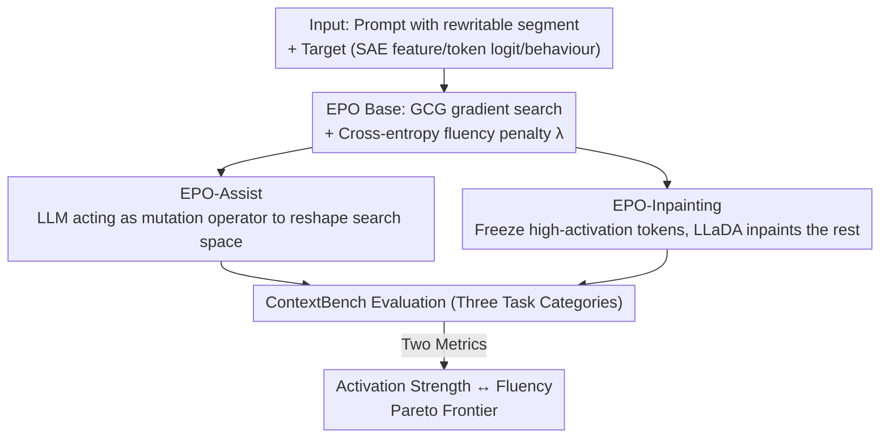

# ContextBench: Modifying Contexts for Targeted Latent Activation and Behaviour Elicitation

**Conference**: ICLR 2026  
**OpenReview**: [https://openreview.net/forum?id=xYNZ5swfJG](https://openreview.net/forum?id=xYNZ5swfJG)  
**Code**: https://github.com/lasr-eliciting-contexts/ContextBench  
**Area**: Interpretability / AI Safety / Red Teaming  
**Keywords**: Context Modification, SAE Latents, Behaviour Elicitation, Prompt Optimisation, Fluency-Activation Trade-off

## TL;DR
This paper formalises the task of "automatically generating fluent, natural inputs that precisely trigger specific internal features or behaviours of a model" as **context modification**. It proposes **ContextBench**, a benchmark containing 715 tasks across three categories (SAE activation, story inpainting, and backdoor trigger recovery). Based on the white-box method EPO, it introduces two improvements—LLM-assisted mutation and LLaDA diffusion inpainting—achieving Pareto improvements across the conflicting objectives of "activation strength" and "linguistic fluency."

## Background & Motivation
**Background**: A fundamental challenge in AI safety is identifying which contexts trigger problematic model behaviours (such as jailbreaks, lying, or backdoors) before deployment. However, it is often unknown beforehand which specific phrasing will trigger these issues. Parallel to this, mechanistic interpretability in vision models has long used "feature visualisation," employing gradient optimisation to synthesise images that strongly activate specific neurons to understand what the network has learned. Translating this approach to language has been difficult due to the discrete nature of the token space.

**Limitations of Prior Work**: Existing methods often force a choice between "activation strength" and "fluency," failing to achieve both. Black-box methods (which lack internal model access, e.g., prompting with GPT-4o) produce fluent text but fail to achieve maximum activation or reach specific internal features. White-box methods (e.g., GCG using gradient backpropagation to tokens) can find high-activation token combinations, but they often result in unintelligible gibberish. While EPO (Evolutionary Prompt Optimisation) introduced a fluency penalty to make "fluent latent activation" possible, its single-token greedy search is prone to local optima, and its fluency remains insufficient for practical applications.

**Key Challenge**: The desired input must be both "strong enough" (to actually trigger the target feature/behaviour) and "natural enough" (resembling human language to be likely in real deployments, harder to detect, more revealing of underlying mechanisms, and more generalisable). These two goals are inherently in conflict—as one approaches maximum activation, the text typically becomes less natural.

**Goal**: To deconstruct this capability into a systematically evaluable problem—can one find language model inputs that activate specified SAE latents while maintaining linguistic fluency? Furthermore, can this be scaled to real-world safety scenarios like backdoor trigger recovery?

**Key Insight**: The authors argue that fluency is not just an aesthetic addition but a critical functional requirement: fluent inputs are more likely to appear naturally in deployment, are harder for audits to detect, and better represent a "class" of patterns that trigger similar behaviours, leading to broader interpretability insights. Thus, the task is abstracted as "context modification," allowing different methods to be compared on a standard benchmark.

**Core Idea**: Use a 715-task benchmark (ContextBench) to simultaneously quantify "activation strength" and "fluency." Periodically inject multi-token proposals from LLMs or diffusion models into the EPO gradient search, allowing the search to take "large jumps" that preserve fluency while escaping local optima.

## Method

### Overall Architecture
The paper intertwines two main threads: the **ContextBench benchmark** (definition of tasks and evaluation criteria) and **methodological improvements** (two new EPO variants).

**Benchmark**: Defines "context modification" as rewriting a segment (10–100 tokens) within a language model prompt to either maximise the activation of a specified internal latent feature (SAE latent / token logit) or elicit a specific behaviour. ContextBench includes three task categories: (1) **SAE Activation** (205 SAE features to test the core ability to fluently maximise a sparse autoencoder feature); (2) **Story Inpainting** (500 stories to test fluency by rewriting a sentence to shift model prediction from a "source" to a "target" word); (3) **Backdoors** (10 backdoored models to test safety applications by reverse-engineering triggers from anomalous behaviour). All methods are measured by **elicitation strength** and **fluency** (measured via cross-entropy).

**Method**: Building on the white-box gradient method EPO, the authors propose **EPO-Assist** (using an LLM as a mutation operator) and **EPO-Inpainting** (using the LLaDA diffusion model for inpainting). Both aim to escape local optima of single-token search by periodically reshaping the search space with language model proposals.

### Key Designs

**1. Formalising "Context Modification" + Three Task Types for Capability and Safety**

The work addresses a major limitation: previous efforts to find triggering inputs (feature visualisation, AutoPrompt, GCG, jailbreak red teaming) were fragmented without a unified definition or metric. This paper provides a unified definition: context modification is the rewriting of text within a prompt to elicit specific latent activations or behaviours. **SAE Activation** systematically varies 205 SAE features from Gemma-2-2B and Llama Scope across three axes: **activation density** (proportion of tokens activating it), **vocabulary diversity** (range of tokens activating it), and **locality** (sharp activation on single tokens vs. diffuse activation across text, like "detecting French"). **Story Inpainting** task involves rewriting a middle sentence in a three-sentence story to make a "target word" more likely than a "source word," measured by the **logit difference**. **Backdoors** include models with password triggers, auditing-induced sandbagging, temporal triggers, and bypass triggers.

**2. Two Metrics: Elicitation Strength + Cross-Entropy Fluency, Handling "Specification Gaming"**

**Activation strength** is measured by SAE latent values or output token logits. **Fluency** is measured via cross-entropy; for each method, the maximum activation strength is reported only for outputs within the "human-like" cross-entropy range of **3–9**. The authors validated cross-entropy as a proxy for fluency with human evaluations, achieving a correlation of $\rho = 0.94$. The paper explicitly discusses **specification gaming**: gradient methods may exploit loopholes—such as directly inserting the target token or using polysemy (e.g., using 'shingles' in a medical sense to trigger 'rash' rather than 'reckless'). The authors distinguish between "informative shortcuts" and "uninformative artifacts," using the cross-entropy filter to suppress the latter.

**3. EPO-Assist: LLM as a Mutation Operator in Evolutionary Search**

EPO-Assist addresses the local optima of single-token greedy replacements. The base EPO objective adds a cross-entropy penalty to GCG:

$$L_\lambda = L_{\text{GCG}} + \frac{\lambda}{n}\sum_{i=1}^{n}\log(p_i)$$

where $L_{\text{GCG}} = -f(t)$ is the negative differentiable task score, and $p_i$ is the probability of the $i$-th token under a base model. EPO-Assist periodically (every 50 iterations) feeds the current EPO population to GPT-4o, which infers patterns and proposes new candidates to be refined by EPO gradients. This allows the search to jump to regions of the search space that are otherwise unreachable via single-token edits. Crucially, **the target word is not revealed to EPO-Assist** in story tasks, meaning its gains over GPT-4o baselines reflect the value of white-box gradient signals.

**4. EPO-Inpainting: Freezing High-Activation Tokens and Using LLaDA for Inpainting**

This variant treats fluency as a "projection." Since goals like "average SAE activation" can be decomposed by token, the authors perform **per-token attribution** to identify high-contribution tokens. Every 15 iterations, the top 25% of contributing tokens are frozen, and the remaining positions are "inpainted" using the bidirectional diffusion model **LLaDA-8B-Instruct**. This allows the gradient steps to explore freely (even if coherence is temporarily broken), while periodic inpainting projects the result back onto the **fluent text manifold** while retaining high-value tokens.

## Key Experimental Results

### Main Results
Baselines include white-box GCG (strength only), standard EPO (state-of-the-art for fluent modification), black-box GPT-4o, and human-written/training data samples. Overall, the EPO variants improve the trade-off, with EPO-Inpainting achieving the best Pareto coverage.

"Row-beats-column" win rates for SAE Activation (percentage of features where the row method has higher activation within the 3–9 cross-entropy range):

| Row Method \ Col Method | EPO | EPO-Assist | EPO-Inpaint | GCG | GPT-4o | Max Act Sample |
|------|------|------|------|------|------|------|
| EPO | - | 38.0% | 37.0% | 92.4% | 97.3% | 95.1% |
| EPO-Assist | 57.0% | - | 42.0% | 93.7% | 98.7% | 94.9% |
| EPO-Inpaint | 60.0% | 56.0% | - | 92.4% | 98.6% | 96.9% |
| GCG | 6.3% | 5.1% | 7.6% | - | 82.1% | 68.8% |
| GPT-4o | 2.7% | 1.3% | 1.4% | 17.9% | - | 17.3% |

**Key Finding**: EPO variants outperform black-box methods and max-activation training samples on almost all features; EPO-Inpainting outperforms standard EPO on 60.0% of features.

### Key Findings
- **Vocabulary diversity has the largest impact on activation strength**: As features become more diverse, the improvements from EPO-Inpainting and EPO-Assist become more pronounced.
- **EPO methods can improve auto-interpretability (auto-interp)**: In cases where GPT-4o descriptions are too broad, EPO variants find high-activation rewrites that reveal the true feature properties (e.g., a "famous figure" feature that actually responds to historical figures like Shakespeare, or a "numerical" feature that specifically targets the digit "1").
- **Logit difference is an indirect optimisation target**: In backdoor experiments, using a supervised linear probe for auditing as the optimization target (rather than logit difference) resulted in nearly 100% success in inducing sandbagging.

## Highlights & Insights
- **Elevating fluency to a first-class requirement**: The authors argue that fluent inputs are more representative of real-world triggers and more effective for auditing, turning context modification from a pure adversarial attack into a dual-purpose tool for safety and interpretability.
- **Specification gaming as an interpretability signal**: Shortcuts are usually considered noise, but the authors suggest that if an SAE latent responds to a lexical shortcut rather than a semantic concept, the shortcut reveals the feature's true mechanism. 
- **The "Fluency Projection" abstraction**: Conceptualising diffusion inpainting as a projection back to the fluent manifold while preserving high-value tokens is an elegant template for discrete optimisation.

## Limitations & Future Work
- **Imperfection of cross-entropy as a fluency proxy**: It can reward repetitive or generic phrases and introduces dependency on the specific model used to calculate it.
- **Local optima in EPO**: Even with improvements, the search can get stuck; multi-token backdoor triggers remain a significant challenge because there is no reward signal until the full sequence appears.
- **Backdoor recovery partial success**: Recovery targets are often too indirect; better results require richer latent targets, though these require prior knowledge of the target behaviour.

## Related Work & Insights
- Compared to vision feature visualisation (Olah et al.), ContextBench provides a standardised linguistic framework and emphasises fluency constraints absent in vision.
- Compared to GCG, EPO adds fluency penalties, and the new variants leverage LLMs and diffusion models to push the frontier of both strength and fluency.
- Unlike black-box prompt optimisation (e.g., PRewrite), which produces fluent text but lacks access to internal latents, this work directly targets specific internal activations.

## Rating
- Novelty: ⭐⭐⭐⭐⭐ 
- Experimental Thoroughness: ⭐⭐⭐⭐ 
- Writing Quality: ⭐⭐⭐⭐⭐ 
- Value: ⭐⭐⭐⭐⭐ 

<!-- RELATED:START -->

<!-- RELATED:END -->

## Related Papers

- [\[ICLR 2026\] Do We Need All the Synthetic Data? Targeted Image Augmentation via Diffusion Models](do_we_need_all_the_synthetic_data_targeted_image_augmentation_via_diffusion_mode.md)
- [\[AAAI 2026\] Targeted Data Protection for Diffusion Model by Matching Training Trajectory](../../AAAI2026/image_generation/targeted_data_protection_for_diffusion_model_by_matching_training_trajectory.md)
- [\[ICLR 2026\] Latent Stochastic Interpolants](latent_stochastic_interpolants.md)
- [\[ICLR 2026\] Latent Denoising Makes Good Tokenizers](latent_denoising_makes_good_tokenizers.md)
- [\[ICCV 2025\] Penalizing Boundary Activation for Object Completeness in Diffusion Models](../../ICCV2025/image_generation/penalizing_boundary_activation_for_object_completeness_in_diffusion_models.md)

<!-- RELATED:END -->
