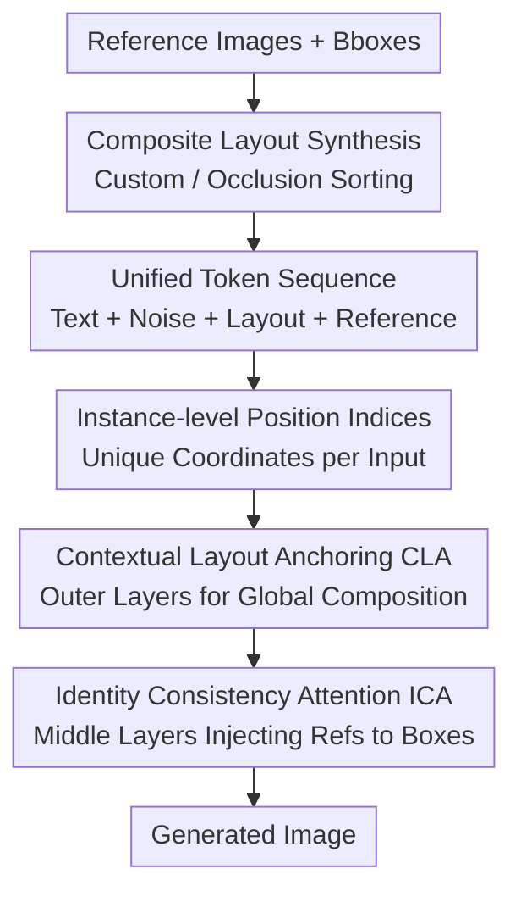

# ContextGen: Contextual Layout Anchoring for Identity-Consistent Multi-Instance Generation

**Conference**: ICLR2026  
**OpenReview**: [https://openreview.net/forum?id=wEuWyQnLY5](https://openreview.net/forum?id=wEuWyQnLY5)  
**Code**: https://github.com/nenhang/ContextGen  
**Area**: Diffusion Models / Image Generation  
**Keywords**: Multi-instance Generation, Layout Control, Identity Consistency, Diffusion Transformer, Attention Masking

## TL;DR
ContextGen builds upon the FLUX.1-Kontext Diffusion Transformer by "inserting composite layout maps and reference images together into a single context token sequence." Combined with hierarchical attention masking (Contextual Layout Anchoring (CLA) in the initial/final layers for global structure and Identity Consistency Attention (ICA) in middle layers for instance-level injection) and non-overlapping position indices, it achieves SOTA performance in both layout accuracy and identity fidelity for multi-subject controllable generation, even surpassing GPT-4o in identity preservation.

## Background & Motivation
**Background**: Current customizable image generation follows two primary trajectories. One is layout-to-image (L2I), which places objects at specified coordinates using bounding boxes and text phrases (e.g., GLIGEN, InstanceDiffusion, MIGC, EliGen). The other is subject-driven generation, which maintains subject identity based on one or more reference images (e.g., OmniGen2, DreamO, UNO). Recent architectures have transitioned from UNet to DiT, where models like FLUX concatenate image and text tokens into a unified sequence for joint multi-modal self-attention.

**Limitations of Prior Work**: The authors identify three specific shortcomings. First, **spatial control is imprecise**, as existing layout guidance often fails to align perfectly with user-specified boxes. Second, **identity degradation** occurs in subject-driven methods as the number of subjects increases, leading to interference between instances. Third, there is a **lack of suitable training data**—large-scale datasets (COCO, ImageNet) lack the visual quality and annotation granularity required for modern models, while high-quality subject-driven datasets contain too few instances per image and lack paired "reference-to-precise-layout" alignment for multi-instance scenarios.

**Key Challenge**: Layout control and identity fidelity are treated as disjoint tasks by existing methods. Relying solely on a composite layout map leads to information loss and detail degradation in overlapping areas during composition; relying solely on reference images lacks reliable spatial anchoring. Their respective strengths are each other's weaknesses, yet no framework has unified them within a single mechanism for "precise spatial structure" and "instance-level identity consistency."

**Goal**: To simultaneously solve (1) precise spatial layout for multiple instances, (2) identity preservation for multiple subjects, and (3) provide high-quality training data within a unified DiT framework.

**Key Insight**: Drawing from the "diptych" (side-by-side reference pairs) experience in I2I generation, the authors incorporate layout information as a **composite layout map** within the generation context. Supplementing this with high-fidelity original reference images allows the model to see both "where things go" and "what things look like" in the same token sequence. Furthermore, observing the functional specialization of DiT layers (outer layers for global structure, middle layers for attributes), the authors decouple these constraints across different depths.

**Core Idea**: Unify layout maps and reference images into a single context token sequence. Use **hierarchical attention masking** where outer layers perform Contextual Layout Anchoring (CLA) and middle layers perform Identity Consistency Attention (ICA). This decouples layout control and identity preservation into different depths while maintaining complementarity.

## Method

### Overall Architecture
ContextGen introduces no new parameters and is fine-tuned on FLUX.1-Kontext via LoRA. Given multiple reference images and their target positions, it aims to generate a multi-instance image with correct placement and preserved identity. The workflow starts in the **Setup phase**, where instances are assembled into a **composite layout map** based on bounding boxes (via manual placement or an occlusion-rate-based sorting algorithm). Then, text embeddings, noise image tokens, layout tokens, and $N$ reference tokens are concatenated into a **unified token sequence** $T = [t_{\text{text}}, t_{\text{image}}, t_{\text{layout}}, t_{\text{ref}_1}, \cdots, t_{\text{ref}_N}]$. This sequence passes through 57 DiT blocks in FLUX using **depth-specific attention masks**: the first 19 and last 19 layers use CLA masks for global layout anchoring, while the middle 19 layers use ICA masks to link tokens within each box to their respective reference tokens for identity injection. Simultaneously, a set of non-overlapping **instance-level position indices** is assigned to each conditional image to distinguish between them. Finally, the target image is decoded.

### Key Designs

**1. Contextual Layout Anchoring (CLA): Using Layout Maps as Context to Anchor Objects**

To address imprecise spatial control, CLA treats the layout as an in-context reference rather than an auxiliary branch. The composite layout map is concatenated into the token sequence, participating in self-attention with text and noise. Since the outer layers of DiT (FR-19 and BK-19) primarily handle global structure, CLA is applied there. A specialized attention mask $M_{\text{CLA}}$ defines visibility: for text set $T$, noise image $I$, layout set $L$, and the $n$-th reference set $R_n$, the mask is:

$$M_{\text{CLA}}(q,k)=\mathbb{1}\!\left[(q,k)\in(T\cup I\cup L)^2 \cup \bigcup_{n=1}^{N}\big(R_n\times(T\cup R_n)\big)\right].$$

Essentially, text, noise, and layout tokens are **fully interconnected** to broadcast the layout structure across the image, while each reference image only communicates with the text and itself. This ensures robust spatial anchoring in structural layers without premature feature contamination between references.

**2. Identity Consistency Attention (ICA): Mapping Reference Details to Specific Boxes in Middle Layers**

Composite layout maps suffer from detail loss in overlapping areas. ICA compensates for this in the middle 19 layers (MID-19), which are known to significantly influence instance-level attributes. For query tokens falling within a bounding box $B_n$, a specific mask is applied:

$$M_{\text{ICA}}(q,k)=\mathbb{1}\!\left[(q,k)\in\bigcup_{n=1}^{N}\big(B_n\times(T\cup B_n\cup R_n)\big)\;\cup\;\{(q,k)\in M_{\text{CLA}}\mid q\notin\textstyle\bigcup_n B_n\}\right].$$

The core logic $B_n\times(T\cup B_n\cup R_n)$ **forces tokens within box $n$ to attend to its designated reference $R_n$**, reliably transferring fine-grained identity; tokens outside boxes (background) continue using the CLA mask. This design facilitates a smooth transition from global layout control to instance identity preservation, where CLA provides structure and ICA provides fidelity.

**3. Instance-level Position Indices: Non-overlapping Coordinates for Disambiguation**

FLUX uses a 3D position encoding $p_i=(m,i,j)$, where text is fixed at $(0,0,0)$ and image tokens use their 2D latent coordinates. When multiple layout and reference maps are concatenated, their coordinates overlap with the noise image, confusing the model. The authors extend this: the **Basic Part** keeps the noise image at $(0,i,j)$ for spatial consistency, while the **Auxiliary Part** (layout and references) uses $m=1$ and encodes indices with cumulative offsets: $(1, W_n+i, H_n+j)$, where $W_n=\sum_{k=1}^{n-1}w_k$ and $H_n=\sum_{k=1}^{n-1}h_k$. This ensures every input has a unique identifier, allowing the attention mechanism to distinguish between the target noise and each conditional input.

**4. IMIG-100K: A Hierarchical Dataset for Image-Guided Multi-Instance Generation**

To address the data gap, IMIG-100K was constructed using the FLUX framework across three tiers: **Basic Instance Composition (50K)** uses FLUX.1-Dev ground truths with segmented reference images for basic composition; **Complex Instance Interaction (50K)** includes up to 8 instances with semantically edited references (occlusions, rotations, poses); **Flexible Composition with References (10K)** uses subject-driven models to synthesize scenes with significant variations from original references, filtered for identity consistency. All text prompts are LLM-generated for diversity.

### Loss & Training
The model is initialized with FLUX.1-Kontext and fine-tuned using LoRA (Rank 512). Training occurs on 4×A100 GPUs with a total batch size of 16 for 5K steps across the three hierarchical subsets using the Prodigy optimizer. Furthermore, **DPO (Direct Preference Optimization)** is utilized: target images are treated as preferred samples and layout maps as non-preferred samples. This mitigates the model's tendency to "rigidly copy" the layout map, encouraging instance adaptation (pose/lighting) and balancing fidelity with flexibility.

## Key Experimental Results

### Main Results
On LAMICBench++ (Identity Preservation benchmark), ContextGen's average score exceeds all open-source models and surpasses closed-source models in identity-related metrics:

| Benchmark / Metric | Ours | Comparison | Gain |
|--------|------|----------|------|
| LAMICBench++ AVG | 64.66 | OmniGen2 61.08 / FLUX.1-Kontext 63.33 (Best Open) | +1.3% |
| LAMICBench++ AVG | 64.66 | GPT-4o 63.71 / Nano Banana 64.11 (Closed) | Surpassed |
| More Subjects IDS (Face ID) | 30.42 | GPT-4o 17.12 | +13.3% |
| COCO-MIG I-SR (Instance Success) | 69.72 | MIGC 66.44 (Prev. SOTA) | +3.3% |
| COCO-MIG mIoU (Spatial Precision) | 65.12 | EliGen 59.23 (Prev. SOTA) | +5.9% |
| LayoutSAM-Eval Color / Texture / Shape | 87.44 / 89.26 / 88.36 | EliGen 83.84 / 87.31 / 87.01 | Leading |

The authors note a "strategic trade-off": while slightly behind GPT-4o in ITC (text alignment) and AES (aesthetics), ContextGen significantly leads in IPS (object retention) and IDS (identity preservation), resulting in the highest overall score.

### Ablation Study
Ablations focused on ICA block placement (F=First 19, M=Middle 19, B=Back 19) and DPO $\beta$:

| Configuration | AVG | IDS | Description |
|------|-----|-----|------|
| ICA MID-19 Only (Full) | 64.66 | 32.72 | Best; confirms middle layers are for identity |
| ICA Full (F/M/B) & w/o CLA | 58.03 | 22.70 | Significant drop across all metrics without CLA |
| DPO $\beta=1000$ | 62.67* | — | Optimal $\beta$ identified via scanning |
| w/o DPO | 62.55* | 32.37 | High identity but weaker composition/aesthetics |

(*DPO results refer to LoRA Rank 256 hyperparameter search and are not directly comparable to Rank 512 main tables.)

### Key Findings
- **CLA is Indispensable**: Removing CLA (applying ICA to all layers) dropped the AVG score from 64+ to 58.03, proving that global layout anchoring is the foundation.
- **ICA Layer Placement is Critical**: Placing ICA in the middle 19 layers yields the best results (AVG 64.66, IDS 32.72), confirming that middle layers handle instance attributes.
- **DPO as a Fidelity-Flexibility Regulator**: Increasing $\beta$ monotonically improves ITC/AES (composition/aesthetics) while identity metrics (IDS/IPS) slightly decrease; $\beta=1000$ provides the best balance.

## Highlights & Insights
- **Layout as In-context Input**: Instead of a separate control branch, treating the composite layout map and reference images as part of the same token sequence leverages the native in-context learning of DiTs. This "everything is a token" approach is elegant and portable.
- **Functional Layer Specialization**: Allocating constraints based on DiT layer functions—outer layers for structure and middle layers for identity—decouples conflicting goals effectively without adding parameters.
- **Cumulative Offset Trick**: The position indexing strategy $(1, W_n+i, H_n+j)$ for multiple conditional images is a versatile trick applicable to any DiT method concatenating multiple references.
- **Data Methodology**: The "Basic → Complex → Flexible" progression provides a systematic curriculum for training models from simple composition to robust real-world interaction.

## Limitations & Future Work
- **Dependency on Layout Map Quality**: Automated sorting based on occlusion is still box-based; complex non-rectangular overlaps may still lose information during the composition stage.
- **Gap with Closed-source Models in Aesthetics**: There is still a performance gap in ITC/AES compared to GPT-4o, suggesting room for improvement in global semantic alignment and visual refinement.
- **DPO Tuning**: The $\beta$ coefficient requires manual scanning, and the fidelity-versus-flexibility trade-off is task-dependent.
- **Bootstrapped Data Bias**: Since IMIG-100K was generated using FLUX models, it may inherit the base model's distribution biases, leaving generalization to the real-photo domain as a future challenge.

## Related Work & Insights
- **vs. OmniGen2 / DreamO**: While they handle multi-subject conditions in-sequence, identity degrades as subjects increase. ContextGen's ICA and hierarchical masking specifically protect identity.
- **vs. MS-Diffusion / LAMIC**: These work on combining references with layout but still face gaps in accuracy. ContextGen improves this through CLA/ICA decoupling and the IMIG-100K dataset.
- **vs. Pure Layout Control (EliGen/MIGC)**: Those methods excel at spatial precision but ignore reference identity. ContextGen provides finer attribute binding, leading in both mIoU and I-SR on COCO-MIG.

## Rating
- Novelty: ⭐⭐⭐⭐ The combination of layout-as-context and hierarchical masking for decoupling is highly practical and well-executed.
- Experimental Thoroughness: ⭐⭐⭐⭐⭐ Comprehensive evaluation across three benchmarks, comparison with ten+ models, and detailed ablations.
- Writing Quality: ⭐⭐⭐⭐ Clear motivation and well-explained layer specialization logic.
- Value: ⭐⭐⭐⭐ The release of both a SOTA method and the IMIG-100K dataset is a significant contribution to the field.

<!-- RELATED:START -->

## Related Papers

- [\[ICLR 2026\] I-DRUID: Layout to Image Generation via Instance-Disentangled Representation and Unpaired Data](i-druid_layout_to_image_generation_via_instance-disentangled_representation_and_.md)
- [\[ICLR 2026\] SIGMA-GEN: Structure and Identity Guided Multi-Subject Assembly for Image Generation](sigma-gen_structure_and_identity_guided_multi-subject_assembly_for_image_generat.md)
- [\[AAAI 2026\] EchoGen: Cycle-Consistent Learning for Unified Layout-Image Generation and Understanding](../../AAAI2026/image_generation/echogen_cycle-consistent_learning_for_unified_layout-image_generation_and_unders.md)
- [\[ICLR 2026\] CreatiDesign: A Unified Multi-Conditional Diffusion Transformer for Creative Graphic Design](creatidesign_a_unified_multi-conditional_diffusion_transformer_for_creative_grap.md)
- [\[NeurIPS 2025\] InstanceAssemble: Layout-Aware Image Generation via Instance Assembling Attention](../../NeurIPS2025/image_generation/instanceassemble_layoutaware_image_generation_via_instance_a.md)

<!-- RELATED:END -->
