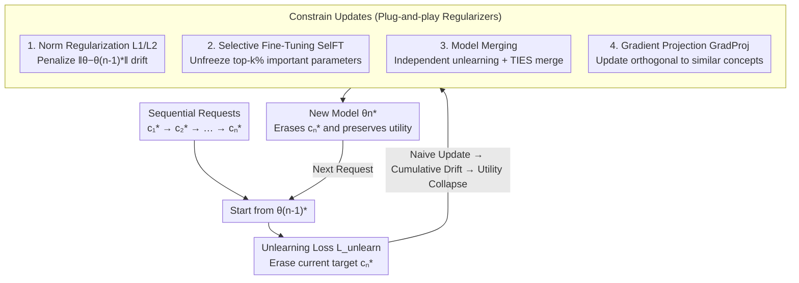

# Continual Unlearning for Text-to-Image Diffusion Models: A Regularization Perspective

**Conference**: ICLR 2026  
**arXiv**: [2511.07970](https://arxiv.org/abs/2511.07970)  
**Code**: [https://justinhylee135.github.io/CUIG_Project_Page/](https://justinhylee135.github.io/CUIG_Project_Page/)  
**Area**: Diffusion Models / Machine Unlearning  
**Keywords**: continual unlearning, diffusion models, regularization, gradient projection, concept erasure

## TL;DR
This paper presents the first systematic study of continual unlearning in T2I diffusion models. It identifies that existing unlearning methods suffer from "utility collapse" due to cumulative parameter drift under sequential requests. To mitigate this, the authors propose a suite of additional regularization strategies (L1/L2 norms, selective fine-tuning, model merging) and a semantic-aware gradient projection method.

## Background & Motivation

**Background**: Machine unlearning aims to remove specific concepts (e.g., copyrighted content, harmful styles) from pre-trained models without retraining from scratch. Existing methods (ConAbl, SculpMem, etc.) perform effectively when unlearning multiple concepts simultaneously.

**Limitations of Prior Work**: In practice, unlearning requests arrive **sequentially** (e.g., deleting violent content today and a specific artist's style tomorrow) rather than all at once. Existing methods experience "utility collapse" after only a few sequential requests—where the model not only forgets the target concept but also loses the ability to generate unrelated concepts.

**Key Challenge**: Each unlearning operation pushes parameters away from the pre-trained weights. Sequential operations lead to cumulative parameter drift significantly larger than simultaneous unlearning. Since pre-trained weights encode the model's generative capacity, excessive deviation results in the loss of that capacity.

**Goal**: (a) Define and benchmark the continual unlearning problem. (b) Diagnose the root cause of utility collapse. (c) Propose additional regularization strategies compatible with existing unlearning methods. (d) Solve the challenge of concept retention within the same semantic domain.

**Key Insight**: Regularization and gradient projection ideas from continual learning are adapted to constrain parameter updates. The key insight is the need for **semantic awareness**, as concepts semantically similar to the unlearning target are more prone to being "collateral damage."

**Core Idea**: The utility collapse in continual unlearning is essentially caused by cumulative parameter drift. This can be effectively mitigated by using regularization to constrain drift and gradient projection to protect semantically similar concepts.

## Method

### Overall Architecture

The paper addresses the problem where unlearning requests arrive one after another, causing gradual model degradation. When a new target $c_n^*$ arrives, the system starts from the model $\theta_{n-1}^*$ of the previous round and updates it using an unlearning loss $\mathcal{L}_{\text{unlearn}}$ to obtain the new model $\theta_n^*$. An ideal $\theta_n^*$ must satisfy three conditions: effectively erase the current target $c_n^*$, maintain the erasure of previous targets $c_1^*,...,c_{n-1}^*$, and preserve the generative capacity for unrelated concepts.

The authors observe that "utility collapse" stems from cumulative parameter drift—each unlearning step pushes weights further from the pre-trained state. All proposed strategies aim to **constrain parameter updates and pull the model back toward the pre-trained weights**. These four strategies are added as auxiliary terms to $\mathcal{L}_{\text{unlearn}}$, remaining orthogonal to the underlying unlearning algorithm (e.g., ConAbl / SculpMem).

### Key Designs

**1. Update Norm Regularization (L1/L2): Directly penalizing drift magnitude**

To address cumulative drift, a penalty term pulling parameters toward $\theta_{n-1}^*$ is added: $\mathcal{L}_{\text{unlearn}}(\theta, \{c_n^*\}) + \lambda \|\theta - \theta_{n-1}^*\|_p^p$. The L1 norm encourages sparse updates, while the L2 norm prevents any single weight from changing excessively. This is a basic way to constrain drift without task-specific information, improving general retention across domains.

**2. Selective Fine-Tuning (SelFT): Updating only essential parameters**

While L1 is sparse, it is isotropic and does not distinguish which parameters are critical for unlearning. SelFT uses a first-order Taylor approximation to estimate the importance of each parameter to the unlearning loss: $|\nabla_{\theta[d]} \mathcal{L}_{\text{unlearn}} \cdot \theta_{n-1}^*[d]|$. Only the top-k% most important parameters are unfrozen. Restricting updates to task-relevant subsets reduces interference with unrelated concepts.

**3. Model Merging: Independent unlearning followed by aggregation**

To avoid cumulative drift, each concept is unlearned **independently starting from the pre-trained weights**. Consequently, each independent model deviates only slightly from the pre-trained weights, remaining within the same loss basin. These models are then aggregated using TIES-Merging. Since every constituent model is close to the original pre-trained weights, the merged model aggregates all erasure effects while staying near the pre-trained state, thus preserving utility.

**4. Gradient Projection (GradProj): Semantic-aware protection of similar concepts**

While the first three methods handle cross-domain retention (e.g., unlearning a style without affecting objects), **in-domain retention** is harder (e.g., unlearning one style often destroys others). Unlearning primarily modifies the $W_K, W_V$ of cross-attention layers. Since linear projections maintain neighborhood structures, modifying them to erase $c^*$ inevitably affects semantically similar concepts $c$. GradProj identifies the top-K most similar concepts via text embedding cosine similarity and **removes components of the unlearning gradient** that lie in the direction of these concept embeddings. This ensures updates occur in a subspace orthogonal to similar concepts, significantly improving in-domain retention (RA-I).

### Loss & Training

- Utilizes unlearning losses based on ConAbl or SculpMem.
- Regularizers are appended to the unlearning loss, ensuring compatibility with various base methods.
- GradProj selects the top-K=5 semantically similar concepts.

## Key Experimental Results

### Main Results (ConAbl + 12-step Sequential Unlearning)

| Method | UA ↑ | RA-I ↑ | RA-C ↑ | Description |
|------|------|--------|--------|------|
| Sequential (No Reg) | ~95% | ~20% | ~30% | Utility Collapse |
| Simultaneous (Non-seq) | ~90% | ~70% | ~85% | Effective but high cost |
| + L2 Regularization | ~92% | ~40% | ~75% | High cross-domain gain |
| + SelFT | ~93% | ~35% | ~70% | Cross-domain gain |
| + Model Merge | ~90% | ~50% | **~85%** | Strongest overall |
| + GradProj | ~90% | **~60%** | ~70% | Best in-domain retention |
| + Merge + GradProj | ~88% | **~65%** | **~85%** | Best complementary effect |

### Ablation Study

| Analysis | Key Findings |
|------|---------|
| Parameter Drift vs. Retention | Sequential drift is much larger than simultaneous drift and strongly correlates with RA. |
| Semantic Similarity vs. RA-I | Strong negative correlation (r ≈ -0.8); similar concepts are harder to retain. |
| $W_K, W_V$ Change vs. Similarity | Strong positive correlation; key/value vectors of similar concepts are heavily perturbed. |
| GradProj K-value | K=5 is sufficient to cover the most critical semantic neighbors. |

### Key Findings
- Without regularization, Retain Accuracy (RA) collapses to <50% after only 3-4 sequential steps; after 12 steps, the model fails to generate meaningful images.
- Parameter drift for simultaneous and independent unlearning is comparable and much smaller than in the sequential setting.
- Model Merge offers the strongest overall retention because each component model is independently close to pre-trained weights.
- GradProj provides the most significant boost to in-domain retention (RA-I) by precisely protecting semantic neighbors.
- Regularization methods are complementary and can be combined for better performance.

## Highlights & Insights
- **Valuable Problem Definition**: Benchmarks continual unlearning in T2I models for the first time, addressing realistic sequential requests via a standardized evaluation (UnlearnCanvas).
- **In-depth Root Cause Analysis**: Beyond identifying utility collapse, the paper provides a theoretical explanation via parameter drift analysis and Taylor expansion, linking RA loss to $\|\theta^* - \theta^\dagger\|$.
- **Transferable Semantic-Awareness**: The GradProj approach is applicable to any scenario requiring "modifying one capability without affecting similar ones," such as multi-task learning or model editing.
- **Genericity**: The proposed regularizers do not modify the base unlearning algorithm, allowing for plug-and-play integration.

## Limitations & Future Work
- While effective, Model Merge requires independent unlearning for every concept, which is computationally expensive.
- GradProj depends on identifying semantically similar concepts; automated discovery of these concepts in practice remains underexplored.
- Evaluations were conducted on fine-tuned Stable Diffusion (SD) within UnlearnCanvas; tests on larger models like SDXL or real-world unlearning scenarios are needed.
- Regularization does not fully solve in-domain retention (RA-I remains lower than RA-C).
- Whether a theoretical limit exists for the trade-off between Unlearn Accuracy (UA) and Retain Accuracy (RA).

## Related Work & Insights
- **vs. ConAbl**: Direct upgrade—combining ConAbl with Model Merge and GradProj significantly improves retention in sequential settings.
- **vs. SculpMem**: Also benefits from these regularization strategies, demonstrating the approach's universality.
- **vs. Continual Learning**: Draws inspiration from EWC and gradient projection but highlights that interference risk is higher in unlearning because the concepts to be retained have already been learned.

## Rating
- Novelty: ⭐⭐⭐⭐ New problem setting (Continual Unlearning for T2I); mostly adaptation of existing techniques, but the semantic-aware GradProj is creative.
- Experimental Thoroughness: ⭐⭐⭐⭐ Comprehensive 12-step sequences, style/object settings, multiple baselines, and detailed ablation.
- Writing Quality: ⭐⭐⭐⭐⭐ Extremely clear logical chain (Problem-Diagnosis-Solution); theoretical analysis is well-validated by experiments.
- Value: ⭐⭐⭐⭐⭐ Defines an important new research direction with direct social and legal implications.

<!-- RELATED:START -->

## Related Papers

- [\[ICLR 2026\] ACCORD: Alleviating Concept Coupling through Dependence Regularization for Text-to-Image Diffusion Personalization](accord_alleviating_concept_coupling_through_dependence_regularization_for_text-t.md)
- [\[ICLR 2026\] AEGIS: Adversarial Target-Guided Retention-Data-Free Robust Concept Erasure from Diffusion Models](aegis_adversarial_target-guided_retention-data-free_robust_concept_erasure_from_.md)
- [\[ICLR 2026\] Co-occurring Associated REtained concepts in Diffusion Unlearning](co-occurring_associated_retained_concepts_in_diffusion_unlearning.md)
- [\[ICCV 2025\] Holistic Unlearning Benchmark: A Multi-Faceted Evaluation for Text-to-Image Diffusion Model Unlearning](../../ICCV2025/image_generation/holistic_unlearning_benchmark_a_multi-faceted_evaluation_for_text-to-image_diffu.md)
- [\[ICML 2026\] A Unified Framework for Diffusion Model Unlearning with f-Divergence](../../ICML2026/image_generation/a_unified_framework_for_diffusion_model_unlearning_with_f-divergence.md)

<!-- RELATED:END -->
