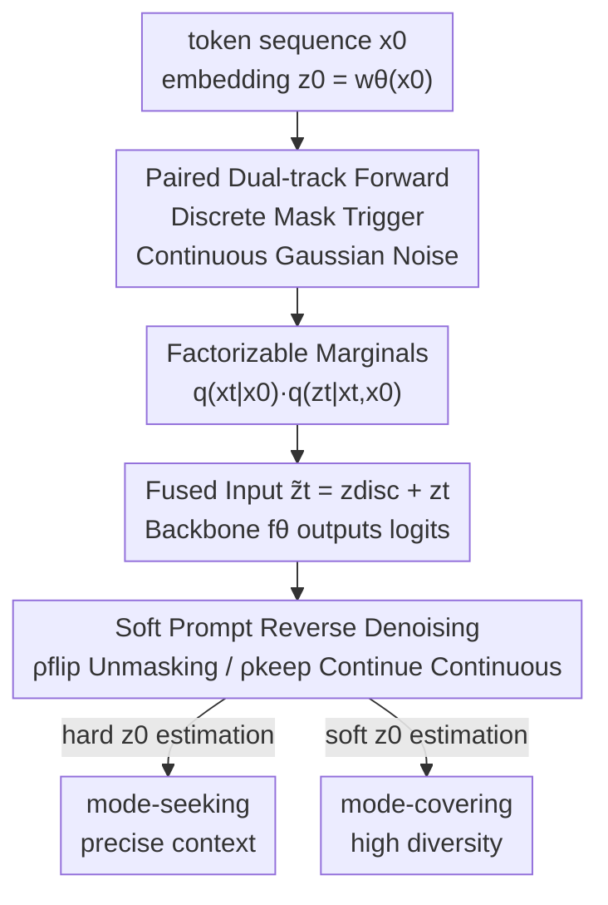

# Continuously Augmented Discrete Diffusion model for Categorical Generative Modeling

**Conference**: ICLR2026  
**OpenReview**: [https://openreview.net/forum?id=JNAZ3e7Bwt](https://openreview.net/forum?id=JNAZ3e7Bwt)  
**Code**: https://github.com/apple/ml-CADD  
**Area**: Diffusion Models / Discrete Generation  
**Keywords**: Discrete Diffusion, Masked Diffusion, Continuous Latent Variables, Categorical Generation, Mode Covering-Mode Seeking  

## TL;DR
CADD assigns an additional "continuous latent variable" track to each `[MASK]` position in discrete masked diffusion—masked tokens no longer collapse into an uninformative absorbing state but instead carry a continuous vector that is gradually noisy yet retains semantic information. During denoising, this vector acts as a "soft prompt" to guide discrete prediction, achieving consistent improvements over pure masked diffusion baselines across text, image, and code generation tasks.

## Background & Motivation

**Background**: There are two mainstream diffusion routes for generating discrete data (text, code, pixel indices). One is the **Masked Diffusion Model (MDM)**: tokens are progressively replaced by an absorbing state `[MASK]` over time, and the reverse process learns to restore the mask. The training signal is a clear token-level cross-entropy, recently scaled to 7B parameters to rival autoregressive models. The other is the **Continuous Diffusion Model (CDM)**: tokens are first embedded into a continuous space, Gaussian diffusion is applied to these embeddings, and they are finally rounded back to discrete symbols. This approach preserves smooth semantic signals and leverages mature score-based methods.

**Limitations of Prior Work**: Both routes have inherent flaws. MDM suffers from an **information void**—all "unobserved" possibilities are collapsed into the same `[MASK]` symbol, erasing all information regarding "how close this corrupted position is to the original token." The paper provides a straightforward example: if a masked position could originally have been "Language" or "Diffusion," the `[MASK]` itself provides no directional cues, forced the model to make binary choices without progressive guidance. Conversely, CDM suffers from **over-smoothing**: denoising occurs entirely in the continuous embedding space and is only discretized at the final step. Continuous targets can blur token identities, making precise prediction difficult without local context.

**Key Challenge**: MDM provides clean training signals and high fidelity (mode-seeking) but uses "hard" state representations that lose semantic gradients. CDM uses continuous representations expressing semantic proximity (mode-covering) but lags in fidelity within discrete spaces. Their strengths are complementary, yet they have been treated as independent technical routes.

**Goal**: To transplant the "progressive semantic signals" of CDM into MDM while retaining the clean masking trajectories and cross-entropy training of MDM, without sacrificing discrete prediction precision, while enabling controllable diversity during sampling.

**Key Insight**: The authors observe that the act of masking itself is a "trigger." Once a token is masked, rather than letting its semantics collapse instantly, its embedding should follow a smooth Gaussian noise trajectory, degrading slowly like a CDM rather than jumping to zero.

**Core Idea**: Pair the discrete masking trajectory with a continuous Gaussian diffusion trajectory—a continuous latent variable $z_t$ always accompanies the discrete state $x_t$. Masked positions are represented by "noisy but informative latent vectors," which serve as soft prompts to guide discrete denoising at each reverse step.

## Method

### Overall Architecture

CADD (Continuously Augmented Discrete Diffusion) expands the single discrete diffusion chain into a joint "discrete + continuous" dual-track diffusion. The input is a discrete token sequence $x_0=(x_0^1,\dots,x_0^n)$; each token is mapped to a continuous vector $z_0=w_\theta(x_0)$ via a learned embedding table $w_\theta$. The forward process evolves the discrete sequence and its latent variables **jointly**: the discrete side follows a standard masking schedule $\alpha_t$ to convert tokens to `[MASK]`; the continuous side is "triggered" by the discrete side—as long as a token is not masked, its latent vector is **frozen** at its original value; once masked, Gaussian diffusion is triggered, and the embedding becomes increasingly noisy along a smooth path. Thus, at any time $t$, masked positions are not empty `[MASK]` symbols but noisy latent vectors that retain semantic proximity to the original token.

In the reverse process, the network $f_\theta$ consumes both the discrete state $x_t$ and the continuous latent $z_t$ to predict the token distribution at masked positions. Crucially, the continuous latent serves as a **soft semantic prompt**: it provides a progressive path between candidate tokens (e.g., "Language" vs. "Diffusion"), while the discrete neighborhood restricts the search space to a reasonable region. Consequently, the model achieves smooth transitions without drifting off the manifold into gibberish as pure CDMs might. A significant benefit of this pipeline is **zero architecture changes**: any MDM backbone can be reused by simply adding $z_t$ as an extra input, allowing existing MDMs to be efficiently fine-tuned into CADD.

### Key Designs

**1. Paired Dual-track Forward: Mask-Triggered Gaussian Trajectories**

Addressing the "information void" of MDM, CADD defines a **joint transition** $q(x_t,z_t\mid x_{t-1},z_{t-1},x_0)=q(x_t\mid x_{t-1})\cdot q(z_t\mid z_{t-1},x_{t-1},x_t,x_0)$. The discrete portion uses a standard absorbing state transition matrix $Q_t=(1-\beta_t)I+\beta_t\,\mathbf{1}m^\top$. The continuous part is defined in three stages: if a token is **unmasked**, its latent vector is frozen via a Dirac function $\delta(z_t^i-z_{t-1}^i)$ (preserve information if unchanged); at the **moment of masking**, Gaussian diffusion is triggered $\mathcal{N}(z_t^i;\sqrt{\bar\gamma_t}z_{t-1}^i,(1-\bar\gamma_t)I)$; if it **remains masked**, it continues to become noisier along the Gaussian path $\mathcal{N}(z_t^i;\sqrt{\gamma_t}z_{t-1}^i,(1-\gamma_t)I)$.

This design yields **factorizable marginals** as given in Proposition 1: $q(x_t,z_t\mid x_0)=q(x_t\mid x_0)\cdot q(z_t\mid x_t,x_0)$, where both terms have closed forms. The discrete term is Categorical, while the continuous term is $\delta(z_t^i-z_0^i)$ when $x_t^i=x_0^i$ and $\mathcal{N}(z_t^i;\sqrt{\bar\gamma_t}z_0^i,(1-\bar\gamma_t)I)$ when $x_t^i=m$. Closed-form sampling means the entire chain does not need to be simulated during training; states at any $t$ can be calculated directly, which is the foundation for its "simple training."

**2. Soft-Prompt Reverse Denoising: Using Continuous Latents for Semantic Guidance**

This step puts the "semantic mask" into practice. The reverse posterior is also factorizable into a discrete posterior $q(x_{t-1}\mid x_t,x_0)$ and a continuous posterior $q(z_{t-1}\mid x_t,z_t,x_{t-1},x_0)$ (Proposition 2). The network only predicts token logits $f_\theta(x_t,z_t)$ at masked positions. The continuous posterior for the "remains masked" branch is a Gaussian $\mathcal{N}(z_{t-1};\tilde\mu_t,\tilde\beta_t I)$, with mean:
$$\tilde\mu_t=\frac{\sqrt{\bar\gamma_{t-1}}(1-\gamma_t)}{1-\bar\gamma_t}z_0+\frac{\sqrt{\gamma_t}(1-\bar\gamma_{t-1})}{1-\bar\gamma_t}z_t$$
This linearly mixes the "estimate of clean embedding $z_0$" and the "current noisy latent $z_t$," essentially the standard posterior mean in continuous diffusion. Furthermore, CADD uses Monte Carlo averaging with a set of latent vectors $\{z_t^{(k)}\}_{k=1}^K$ to approximate the true token distribution $p_\theta(x_{t-1}\mid x_t)\approx\frac{1}{K}\sum_k p_\theta(x_{t-1}\mid x_t,z_t^{(k)})$. Taking the expectation over multiple rational continuous states makes the predicted distribution closer to the true possible tokens than a single `[MASK]`.

**3. KL Decomposition and Simplified training: Reducing targets to a single loss**

To keep training simple enough to reuse MDM code, the paper proves that the KL of the variational objective **splits exactly** into discrete and continuous terms at masked positions (Lemma 1):
$$D_{KL}=\rho_t^{\text{flip}}\big(-\log p_\theta(x_0\mid x_t,z_t)\big)+\rho_t^{\text{keep}}D_{KL}^{\text{cont}}$$
where $\rho_t^{\text{keep}}$ and $\rho_t^{\text{flip}}$ are weights for "remaining in continuous space" or "unmasking," respectively. The continuous KL is an SNR-reweighted MSE. The key observation is: by using an estimate $\hat z_{0,\theta}:=\sum_v p_\theta(\hat x_0=v\mid x_t,z_t)w_{\theta,v}$, predicting the token correctly is equivalent to predicting the embedding correctly. Thus, CADD can be trained using only a cross-entropy loss:
$$\mathcal{L}_{\text{CADD}}=\mathbb{E}_t\,\mathbb{E}_{q(x_t,z_t\mid x_0)}\Big[-\sum_{i:x_t^i=m}\log p_\theta(x_0^i\mid x_t^i,z_t^i)\Big]$$
The only architectural change is **element-wise addition** of the discrete embedding $z_{\text{disc}}$ and the noisy continuous embedding $z_t$ into $\tilde z_t = z_{\text{disc}} + z_t$, which introduces no new parameters.

**4. Hard/Soft $\hat z_0$ Estimation: A Dial for Diversity and Precision**

This is the most practical design for sampling. When recovering embeddings for the next iteration, $\hat z_{0,\theta}$ can be computed in two ways: **hard** (index the embedding of the argmax token) or **soft** (the expected embedding across the whole distribution). These correspond to two generation behaviors: hard quickly locks the context (**mode-seeking**), while soft maintains probability mass over multiple candidates (**mode-covering**). This exposes the "diversity vs. precision" trade-off as a tunable dial during sampling without retraining.

## Key Experimental Results

### Main Results

Text generation (OpenWebText, 168M Discrete DiT) consistently outperforms pure masked baselines across sampling steps $T$. At $T=4096$, CADD continues to improve while MDLM stagnates:

| Task / Dataset | Metric | CADD | Strongest Discrete Baseline | Note |
|--------------|------|------|------------|------|
| Text OWT (T=4096) | MAUVE ↑ | 0.270 | 0.240 (Duo w cd) | Edge grows with step count |
| Text OWT (T=4096) | Gen PPL ↓ | 102.5 | 104.7 (MDLM) | MDLM degrades at high T |
| Image CIFAR-10 (NFE=512) | FID ↓ | **2.88** | 3.26 (MDM-Prime) | Outperforms all baselines |
| Image CIFAR-10 | IS ↑ | 10.04 | 9.67 (MDM-Prime) | Best |
| Image ImageNet-32 (NFE=1024) | FID ↓ | **3.74** | 6.98 (MDM-Prime) | Significant lead |
| Code (7/8B) | EvalPlus Avg | **63.3** | 60.7 (DiffuCoder) | HumanEval 67.1→72.0 |
| Code BigCodeBench-Hard | pass@1 | 17.6 | 12.8 (DiffuCoder) | Superior to Qwen2.5-Coder |

In code generation, CADD is the strongest diffusion LLM and even outperforms the autoregressive OpenCoder in total average score (55.7 vs 55.0). It also serves as an effective **fine-tuning objective**.

### Ablation Study

| Configuration | Key Metric | Note |
|------|---------|------|
| Add Fusion | MAUVE 0.24 / Entropy 5.31 | Default, additive |
| Concat Fusion | MAUVE 0.21 / Entropy 5.37 | Requires projection, no gain |
| Reweight Fusion | MAUVE 0.24 / Entropy 5.30 | Comparable to additive |
| hard $\hat z_0$ | MAUVE 0.24 | Mode-seeking, fast context locking |
| soft $\hat z_0$ | MAUVE 0.18 / Higher Entropy | Mode-covering, high diversity |
| CE Only | MAUVE 0.24 / 47,152 TPS·GPU | Simplified loss, efficient |
| CE + MSE | MAUVE 0.24 / 32,117 TPS·GPU | Closer to ELBO, but slower |

### Key Findings
- **Fusion methods have negligible impact**, so the simplest element-wise addition is preferred.
- **Hard/Soft $\hat z_0$ confirms the trade-off dial**: Hard brings higher MAUVE and lower entropy (mode-seeking), while soft increases entropy (mode-covering).
- **Simplified CE loss is as good as CE+MSE** but significantly faster in terms of throughput.
- **Scaling with steps** is a core advantage: unlike MDM which stagnates or degrades with large $T$, CADD continues to improve, suggesting the continuous space provides useful additional information.

## Highlights & Insights
- **"Masking as a trigger"** is a clever perspective: treating the mask not as a destination but as the start of a continuous trajectory allows information to degrade smoothly rather than collapse instantly.
- **Factorizable marginals + closed-form sampling** provide critical engineering benefits, keeping training simple without full chain simulation.
- **Zero architecture change** with additive fusion allows existing MDMs to be upgraded with almost no migration cost.
- The **Hard/Soft dial** provides a mechanism to control diversity and precision at inference time, which can be directly transferred to any discrete diffusion task requiring diversity control.

## Limitations & Future Work
- The transition between hard and soft $\hat{z}_0$ is currently manual; automatic selection remains an open question.
- Most experiments use $K=1$ for fairness; the full potential of multi-latent Monte Carlo averaging ($K>1$) is only explored in the appendix.
- While the architecture is unchanged, the continuous track introduces additional noise schedules $\{\gamma_t\}$ and latent dimensions whose optimal settings require further investigation.

## Related Work & Insights
- **vs. Pure Masked Diffusion (MDLM / SEDD)**: These collapse unobserved positions into a single `[MASK]`, losing semantic gradients. CADD maintains semantic proximity via the continuous track.
- **vs. Continuous Diffusion (CDCD / Plaid)**: These suffer from over-smoothing and potential manifold drift; CADD uses the discrete neighborhood to anchor the search space.
- **Thought Origin**: This work brings the perspective of "mode balancing" (seeking vs. covering) into discrete diffusion, analogous to diversity regulation in guidance/score-distillation.

## Rating
- Novelty: ⭐⭐⭐⭐⭐ The "Masked = Continuous Trigger" dual-track approach is an elegant unification of MDM/CDM.
- Experimental Thoroughness: ⭐⭐⭐⭐ Strong coverage of text/image/code, though $K$ and scale tests are partially in the appendix.
- Writing Quality: ⭐⭐⭐⭐ Clear derivations and intuitive diagrams.
- Value: ⭐⭐⭐⭐⭐ Extremely low implementation cost to improve existing MDMs with consistent gains.

<!-- RELATED:START -->

## Related Papers

- [\[ICLR 2026\] Beyond Text-to-Image: Liberating Generation with a Unified Discrete Diffusion Model](beyond_text-to-image_liberating_generation_with_a_unified_discrete_diffusion_mod.md)
- [\[ICLR 2026\] Variational Autoencoding Discrete Diffusion with Enhanced Dimensional Correlations Modeling](variational_autoencoding_discrete_diffusion_with_enhanced_dimensional_correlatio.md)
- [\[ICLR 2026\] Partition Generative Modeling: Masked Modeling Without Masks](partition_generative_modeling_masked_modeling_without_masks.md)
- [\[CVPR 2026\] Advancing Image Classification with Discrete Diffusion Classification Modeling](../../CVPR2026/image_generation/advancing_image_classification_with_discrete_diffusion_classification_modeling.md)
- [\[ICLR 2026\] Consolidating Reinforcement Learning for Multimodal Discrete Diffusion Models](consolidating_reinforcement_learning_for_multimodal_discrete_diffusion_models.md)

<!-- RELATED:END -->
