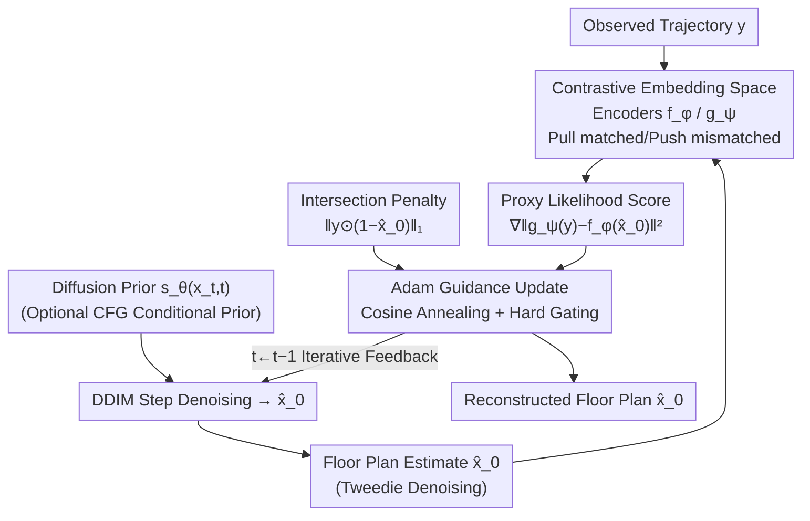

# Contrastive Diffusion Guidance for Spatial Inverse Problems

**Conference**: ICLR2026  
**OpenReview**: [https://openreview.net/forum?id=B4BSxOdKYU](https://openreview.net/forum?id=B4BSxOdKYU)  
**Code**: TBD  
**Area**: Diffusion Models / Inverse Problem Solving  
**Keywords**: Inverse Problems, Diffusion Posterior Sampling, Contrastive Learning, Likelihood Proxy, Indoor Layout Reconstruction

## TL;DR
Addressing "spatial inverse problems" where the forward operator is non-differentiable, non-smooth, and only partially known (a typical scenario being the reconstruction of floor plans from human walking trajectories), CoGuide shifts likelihood-based diffusion guidance from the original pixel space to a smooth embedding space trained via contrastive learning. By using the inner product of embedding vectors as a likelihood proxy to steer denoising, the method stably directs noise towards floor plans consistent with observed trajectories, outperforming six baselines in sparse and medium trajectory scenarios.

## Background & Motivation
**Background**: Inverse problems aim to reconstruct an unknown signal $x$ from indirect, partial, and noisy measurements $y$, linked by a forward process $y = A(x, n)$. Recently, diffusion models have emerged as powerful tools by learning a prior $\nabla_x \log p(x)$ from large-scale data and performing posterior sampling (such as DPS) by decomposing the posterior score into "prior score + likelihood score": $\nabla_{x_t}\log p_t(x_t\mid y)=\nabla_{x_t}\log p_t(x_t)+\nabla_{x_t}\log p_t(y\mid x_t)$. The community has pushed the handleable forward operators from linear and non-linear to non-differentiable, partially observable, and even blind operators.

**Limitations of Prior Work**: The authors propose a particularly "hard" forward operator: a path planner. Imagine a user walking at home for several minutes, with a phone recording a sequence of positions $y$; this trajectory is a function of the floor plan $x$ (path planning strategies $A(\cdot)$ in the brain plan routes A→B→C based on the layout). This $A(\cdot)$ is simultaneously **non-linear, non-differentiable, and only partially known**. Every step in path planning involves an $\arg\min$ to select the next pixel, which is inherently non-differentiable. Even with differentiable approximations (Neural A*, TransPath, DiPPeR), the Jacobian $J_A$ norm is extreme and highly sensitive to inputs—adding a small door to a wall can completely change the planned path.

**Key Challenge**: Likelihood guidance in DPS depends on $\nabla_x\|y-A(\hat x_0)\|_2^2=-2 J_A(x)^\top(y-A(\hat x_0))$. When $\|J_A\|$ is enormous and discontinuous, the score becomes noisy and unstable. Using it to steer the diffusion prior $s_\theta(x_t, t)$ leads to highly unstable optimization that fails to converge to reasonable floor plans. In other words, **the non-smoothness of the forward operator directly pollutes the likelihood score**, which is the root cause of failure for likelihood-based guidance in such problems.

**Goal**: Without explicitly solving the "bad" forward operator, find a likelihood proxy that is both "effective" (a valid approximation of the true likelihood score) and smooth, allowing diffusion posterior sampling to remain stable.

**Key Insight**: Since $A(\cdot)$ is non-smooth in pixel space, avoid calculating the likelihood there. Instead, project both the floor plan $x$ and trajectory $y$ into a shared embedding space $E$, where "matching floor plan-trajectory pairs" are pulled together and "mismatched pairs" are pushed apart. This space implicitly learns $A(\cdot)$ and can be trained to be smooth (Lipschitz, without jumps).

**Core Idea**: Replace the original likelihood score—polluted by the bad operator—with a "proxy likelihood" $\nabla_x\|[ \hat x_0 ]_E - [ y ]_E\|_2^2$ in an embedding space trained via contrastive learning. Using the theoretical link between InfoNCE and the "likelihood-evidence ratio," prove that this proxy is indeed a valid approximation of the true likelihood score.

## Method

### Overall Architecture
The input to CoGuide is a human trajectory $y \in \mathbb{R}^{m \times n}$ (sparse, medium, or dense), and the output is the reconstructed floor plan $\hat x_0$. The skeleton remains a DPS-style diffusion posterior sampling: a diffusion prior $s_\theta(x_t, t)$ pre-trained on public floor plan datasets ensures the output "looks like a reasonable layout," while a likelihood guidance term added at each denoising step pulls the sample toward consistency with the observed trajectory. The core innovation of CoGuide lies in how the "likelihood guidance term" is calculated: instead of passing $\hat x_0$ through a path planner to calculate $\|y-A(\hat x_0)\|^2$, it first trains a pair of encoders $f_\phi$ (for floor plans) and $g_\psi$ (for trajectories) offline via contrastive learning. These map both inputs to an embedding space $E$ on a shared unit hypersphere. During inference, each DDIM step uses the Tweedie formula to obtain a clean estimate $\hat x_0$, then calculates the proxy likelihood gradient $-\frac{1}{2\tau}\nabla_{x_t}\|g_\psi(y)-f_\phi(\hat x_0)\|_2^2$ in the embedding space. This is combined with an intersection term penalizing "trajectories passing through walls" and updated using Adam (rather than naive SGD).

The process consists of two stages: "offline training of the contrastive space" and "online diffusion guidance." The online part involves multi-module coordination on a single reverse diffusion chain:

### Key Designs

**1. Embedding Space Likelihood Proxy: Calculating non-smooth likelihood in a smooth space**

This design directly addresses the "exploding likelihood score caused by non-differentiable forward operators." The authors use two encoders $f_\phi: \mathcal{X} \to E$ and $g_\psi: \mathcal{Y} \to E$ to map layouts and trajectories to a unit hypersphere ($\|f_\phi(x)\|_2 = \|g_\psi(y)\|_2 = 1$). The matching degree of a pair $(x, y)$ is modeled as an unnormalized distribution $\pi(y, x) \propto \exp(\langle f_\phi(x), g_\psi(y) \rangle / \tau)$, where the temperature $\tau$ controls the concentration on the sphere—higher inner products indicate better compatibility and higher likelihood. The encoders are trained using an InfoNCE-style contrastive objective to implicitly learn $A(\cdot)$ from "matched floor plan-trajectory pairs" (trajectories are synthesized from layouts using an approximate $A^\star$).

The theoretical justification lies in the link between InfoNCE and density estimation: when the contrastive loss is optimized, the optimal classifier recovers the "likelihood-evidence ratio," i.e., $\frac{1}{\tau}\langle f_\phi(x), g_\psi(y) \rangle = \log p(y \mid x) - \log p(y) + C$, where $C$ is independent of $x$. Taking the gradient with respect to $x$ eliminates the $-\log p(y) + C$ terms, resulting in $\frac{1}{\tau}\nabla_x\langle f_\phi(x), g_\psi(y) \rangle = \nabla_x\log p(y \mid x)$. Thus, the inner product gradient is **exactly equal** to the true likelihood score. Using the identity for unit-norm embeddings $\langle u, v \rangle = 1 - \frac{1}{2}\|u-v\|_2^2$, the proxy likelihood can be written as an equivalent squared distance, leading to the final guidance term:

$$\nabla_{x_t}\log p_t(x_t\mid y)\approx s_\theta(x_t,t)-\frac{1}{2\tau}\nabla_{x_t}\big\|f_\phi(\hat x_0(x_t))-g_\psi(y)\big\|_2^2.$$

Since $f_\phi$ and $g_\psi$ are smooth (Lipschitz) functions, this gradient is stable and continuous, steering the inverse diffusion smoothly toward layouts compatible with the embeddings, effectively bypassing the $J_A$ explosion problem.

**2. Symmetric Multi-Positive Contrastive Loss + Alignment Loss: Training the embedding space to be discriminative yet tight**

The authors use a **symmetric** supervised contrastive objective: one branch uses layout $x$ as an anchor to pull matched trajectories closer and push mismatched ones away ($\mathcal{L}_{f \to t}$), and the other uses trajectory $y$ as an anchor ($\mathcal{L}_{t \to f}$), ensuring spatial consistency. Because one layout can generate multiple compatible trajectories, the authors extend InfoNCE to the **multi-positive** supervised contrastive objective of Khosla et al., which preserves the legitimacy of the likelihood proxy during inference.

As contrastive loss alone only separates positives from intra-batch negatives without guaranteeing that true matching pairs are "tight enough," an alignment loss $\mathcal{L}_{\text{align}} = \mathbb{E}_{(x, y) \sim p_+} \|g_\psi(y) - f_\phi(x)\|_2^2$ is added. The final loss is $\mathcal{L}_{\text{contra}} = \lambda\mathcal{L}_{f \to t} + (1-\lambda)\mathcal{L}_{t \to f} + \lambda_{\text{align}}\mathcal{L}_{\text{align}}$. Critically, the alignment weight is **delayed**: only the two contrastive losses are used in the first few epochs, with $\lambda_{\text{align}}$ gradually increased later to avoid disrupting early learning. t-SNE visualizations show that the resulting space is highly structured—variants $x + \delta_1, x + \delta_2$ of a layout are close to each other and far from other layouts, while trajectories embed near their matching layouts.

**3. Intersection Penalty: Reinforcing the posterior with the "no walking through walls" prior**

The authors found that the proxy likelihood alone was insufficient to prevent artifacts such as "walls placed on top of walking paths." Therefore, an intersection penalty $\mathcal{L}_{\text{intersect}} = \|y \odot (1 - \hat x_0)\|_1$ is added during inference for all methods. This term counts the total number of trajectory pixels falling on wall pixels. Minimizing this during inverse diffusion pushes the update toward "wall-trajectory compatible" layouts. This is a physical constraint specific to the problem: people cannot walk through walls, so areas covered by the observed trajectory must be free space. However, the penalty weight $\lambda_{\text{int}}$ cannot be too high—ablations show a "sweet spot" near $\lambda_{\text{int}} = 1.5 \times 10^{-4}$.

**4. Adam in DDIM + Annealed Hard Gating (and CFG+CoGuide): Integrating guidance on short sampling chains**

The use of **Adam** within each DDIM step is crucial for stability. Because DDIM has far fewer steps than DDPM, naive GD/SGD provides **insufficient integration**, leading to poor convergence. Adam uses coordinate-wise second-order information to compensate for this, significantly outperforming SGD (Table 3: IoU improves from 0.76 to 0.85 in DDIM). To control guidance intensity on short chains, a **cosine annealing** learning rate is applied. Finally, a **hard gating** mechanism sets $\eta_t$ to zero when $t \geq t_{\text{stop}}$, allowing the diffusion prior to refine the sample without interference in the late stages. Additionally, replacing the unconditional prior with a CFG-trained conditional prior $s_\theta(x_t, t, c)$ (using trajectory as condition $c$) yields the **CFG+CoGuide** variant, where the conditional prior and contrastive guidance complement each other.

### Loss & Training
- **Contrastive Model**: Symmetric multi-positive supervised contrastive loss $\lambda\mathcal{L}_{f \to t} + (1-\lambda)\mathcal{L}_{t \to f} + \lambda_{\text{align}}\mathcal{L}_{\text{align}}$, adapted from SupCon.
- **Diffusion Prior**: Unconditional diffusion trained on HouseExpo floor plans; CFG variant supports both conditional/unconditional modes.
- **Training Strategy**: DDIM/DDPM sampling with Adam guidance, cosine annealing, and hard gating (Algorithm 1). Guidance = proxy likelihood score + $\lambda_{\text{int}} \times$ intersection penalty.

## Key Experimental Results

### Main Results
Dataset: HouseExpo (~35,126 2D floor plans, downsampled to $64 \times 64$). Trajectories were synthesized via A* and categorized as Sparse, Medium, or Dense (covering ~10%, 25%, 40% of free space). Metrics: IoU and F1 for free space.

| Method | Sparse F1 | Sparse IoU | Medium F1 | Medium IoU | Dense F1 | Dense IoU |
| :--- | :--- | :--- | :--- | :--- | :--- | :--- |
| DPS+Neural A* | 0.79 | 0.67 | 0.79 | 0.66 | 0.79 | 0.66 |
| DPS+TransPath | 0.76 | 0.64 | 0.74 | 0.60 | 0.72 | 0.59 |
| DPS+DiPPeR | 0.77 | 0.64 | 0.77 | 0.64 | 0.76 | 0.63 |
| DMPlug | 0.31 | 0.19 | 0.28 | 0.17 | 0.28 | 0.16 |
| DiffPIR | 0.63 | 0.47 | 0.64 | 0.48 | 0.65 | 0.49 |
| CFG | 0.86 | 0.76 | 0.93 | 0.88 | **0.97** | **0.95** |
| CoGuide | 0.91 | 0.84 | 0.94 | 0.89 | 0.95 | 0.90 |
| **CFG+CoGuide** | **0.93** | **0.87** | **0.97** | **0.93** | **0.99** | **0.97** |

CoGuide alone outperforms all baselines (including CFG) in Sparse and Medium settings. CFG+CoGuide is consistently the best across all densities. While CFG performs well in the Dense setting, its qualitative results often contain artifacts, whereas CoGuide provides cleaner reconstructions.

### Ablation Study

| Configuration | Key Metrics | Description |
| :--- | :--- | :--- |
| $\lambda_{\text{int}}=0$ | Sparse IoU 0.78 | No intersection penalty |
| $\lambda_{\text{int}}=3\times10^{-4}$ | Sparse IoU 0.83 | Penalty significantly improves results |
| $\lambda_{\text{int}}=1.5\times10^{-3}$ | Sparse IoU 0.84 | Excessive penalty hurts medium/dense cases |
| DDIM + GD | F1 0.86 / IoU 0.76 | Naive gradient, insufficient integration |
| DDIM + Adam | F1 0.92 / IoU 0.85 | Adam compensates for short chains |

### Key Findings
- **Proxy Likelihood as a Cornerstone**: Embedding space guidance allows CoGuide to significantly lead DPS+planner series under sparse trajectories (IoU 0.84 vs ~0.64).
- **Adam-in-DDIM Contribution**: Adam improves IoU from 0.76 to 0.85 in few-step DDIM regions, highlighting the importance of coordinate-wise second-order integration.
- **Real-world Generalization**: On real apartment trajectories (UWB sensors), CoGuide recovers better wall segments and structures than CFG, as CFG tends to overfit the synthetic A* trajectory distribution.

## Highlights & Insights
- **"Shifting space for likelihood" as an extensible paradigm**: When a forward operator is non-differentiable/non-smooth in the original space, it is more effective to learn a smooth embedding space for a proxy likelihood. This logic applies to a wide class of non-differentiable or blind inverse problems (validated on blind audio restoration in App. D).
- **Theoretical Grounding**: Using the InfoNCE equivalence proves that the inner product gradient equals the true likelihood score, moving "similarity as likelihood" from a heuristic to a theoretically sound proxy.
- **Privacy Value**: Reconstructing floor plans from trajectories (which can be collected via IMU) is more privacy-preserving than RGB-based solutions and does not rely on lighting or line-of-sight.

## Limitations & Future Work
- **Reliance on Synthetic Training**: Both the contrastive space and diffusion prior rely on A* synthetic trajectories, which differ from real human navigation.
- **Resolution Constraints**: Layouts were downsampled to $64 \times 64$ due to path planner speeds at high resolutions, losing fine details.
- **Hyperparameter Sensitivity**: The weights for the intersection penalty and alignment, as well as gating schedules, require careful tuning.

## Related Work & Insights
- **vs DPS + Differentiable Planners**: These use differentiable planners as the forward operator in DPS, but non-smooth likelihood scores lead to unstable optimization. CoGuide avoids the planner during inference.
- **vs CFG**: CFG directly fits the conditional posterior. It is strong in dense data but overfits synthetic distributions and produces artifacts. CoGuide is a guidance-based approach and more robust; the two are complementary.
- **vs Walk2map**: Most existing floor plan estimation methods rely on RGB or specialized hardware; CoGuide uses diffusion priors + trajectories for privacy-friendly generative reconstruction.

## Rating
- Novelty: ⭐⭐⭐⭐⭐ Introducing "contrastive embedding space proxy likelihood" to diffusion inverse problems with InfoNCE theoretical support provides a new path for non-differentiable inverse problems.
- Experimental Thoroughness: ⭐⭐⭐⭐ 6 baselines × 3 densities + extensive ablations + real-world UWB and audio generalization.
- Writing Quality: ⭐⭐⭐⭐ Progressive flow from motivation to theory and algorithm.
- Value: ⭐⭐⭐⭐ Provides a general paradigm for "bad" forward operators in diffusion models.

<!-- RELATED:START -->

## Related Papers

- [\[ICML 2026\] Saving Foundation Flow-Matching Priors for Inverse Problems](../../ICML2026/image_generation/saving_foundation_flow-matching_priors_for_inverse_problems.md)
- [\[ICCV 2025\] Unsupervised Imaging Inverse Problems with Diffusion Distribution Matching](../../ICCV2025/image_generation/unsupervised_imaging_inverse_problems_with_diffusion_distribution_matching.md)
- [\[ICCV 2025\] FlowDPS: Flow-Driven Posterior Sampling for Inverse Problems](../../ICCV2025/image_generation/flowdps_flow-driven_posterior_sampling_for_inverse_problems.md)
- [\[ICML 2026\] Zeroth-Order Non-Log-Concave Sampling with Variance Reduction and Applications to Inverse Problems](../../ICML2026/image_generation/zeroth-order_non-log-concave_sampling_with_variance_reduction_and_applications_t.md)
- [\[AAAI 2026\] Constrained Particle Seeking: Solving Diffusion Inverse Problems with Just Forward Passes](../../AAAI2026/image_generation/constrained_particle_seeking_solving_diffusion_inverse_problems_with_just_forwar.md)

<!-- RELATED:END -->
