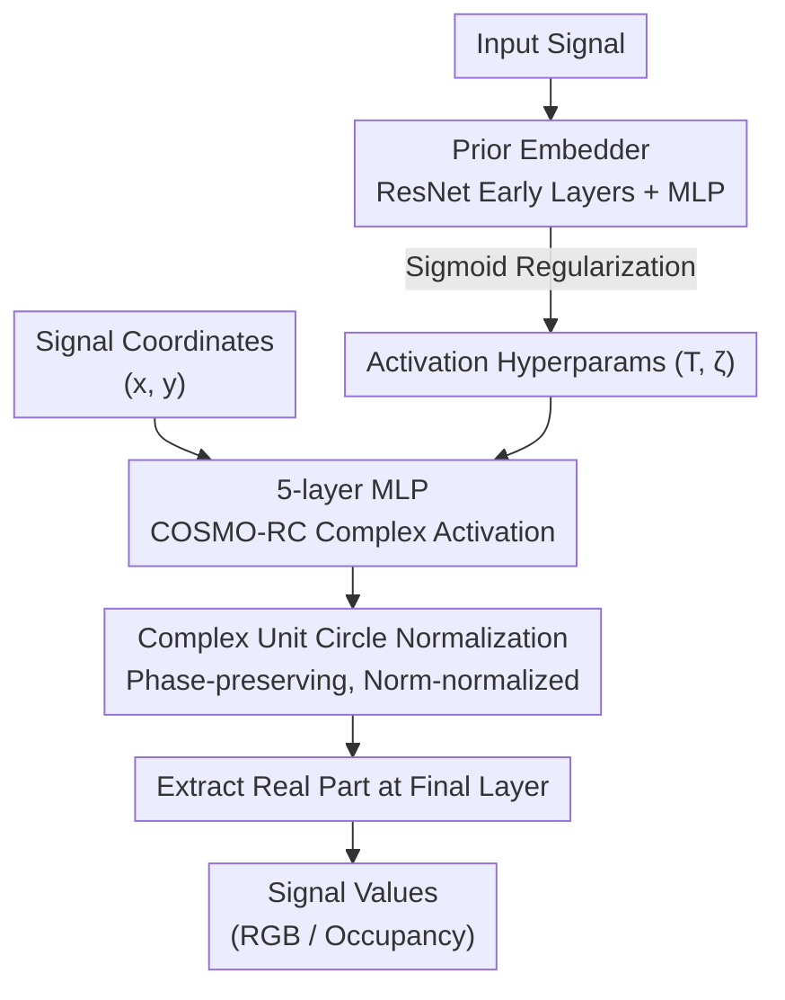

# COSMO-INR: Complex Sinusoidal Modulation for Implicit Neural Representations

**Conference**: ICLR2026  
**arXiv**: [2505.11640](https://arxiv.org/abs/2505.11640)  
**Code**: To be confirmed  
**Area**: Image Generation  
**Keywords**: Implicit Neural Representations, Activation Function Design, Spectral Bias, Chebyshev Polynomials, Complex Sinusoidal Modulation  

## TL;DR

Through harmonic distortion analysis and Chebyshev polynomial approximation, this paper rigorously proves that odd/even symmetric activation functions suffer from systematic attenuation in the post-activation spectrum. It proposes modulating activation functions with a complex sinusoidal term $e^{j\zeta x}$ to retain full spectral support. The authors design the COSMO-RC activation function and a regularized prior embedder architecture, achieving an average PSNR lead of +5.67 dB over the strongest baseline on Kodak image reconstruction and +3.45 dB on NeRF.

## Background & Motivation

**Background**: Implicit Neural Representations (INR) use MLPs to map continuous coordinates to signal values (e.g., image pixels, 3D occupancy). The core design flexibility lies in the choice of activation functions. SIREN uses sine, WIRE uses wavelets, Gaussian uses Gaussian functions, and other schemes include FINER (variable-frequency sine) and INCODE (prior embedder). While these methods have various pros and cons across tasks, a unified theoretical explanation for why certain activations perform better and where their effectiveness boundaries lie is lacking.

**Limitations of Prior Work**: INR faces three core challenges: (1) spectral bias, where networks are naturally insensitive to high-frequency signals, resulting in blurry reconstructions; (2) poor noise robustness, leading to overfitting during denoising; and (3) difficulty in simultaneously capturing local details and global structures. Most existing activation designs are based on empirical observation rather than a systematic analytical framework starting from the spectral domain.

**Key Challenge**: Activation functions broaden the input spectrum through nonlinear transformation (the blueshift effect), enabling the network to represent high-frequency components. However, if the activation function is odd-symmetric or even-symmetric (as nearly all common activations are), half of its Chebyshev expansion coefficients are zero. This leads to systematic attenuation of the post-activation spectrum—effectively discarding half of the network's representational power.

**Goal**: (1) Reveal the theoretical root of spectral attenuation in existing INR activations; (2) Propose a general solution—complex sinusoidal modulation; (3) Design the optimal activation function COSMO-RC and verify its superiority.

**Key Insight**: Starting from harmonic distortion analysis, the authors expand activation functions using Chebyshev polynomials. They find that the alternating zero coefficients caused by symmetry are the mathematical root of spectral attenuation. This perspective has not been previously explored.

**Core Idea**: Modulate the activation function with a complex exponential $e^{j\zeta x}$ to break odd/even symmetry. This ensures that the real and imaginary parts of the Chebyshev coefficients are not zero simultaneously, thereby preserving full frequency support in the post-activation spectrum.

## Method

### Overall Architecture

The input consists of signal coordinates (e.g., 2D pixel coordinates $(x,y)$), which pass through a 5-layer MLP with 256 neurons per layer, using the COSMO-RC complex-valued activation function. Outputs of each layer are normalized onto the unit circle in the complex plane to maintain training stability. The final layer extracts the real part to obtain signal values (e.g., RGB pixel values). An additional prior embedder based on the first five layers of ResNet-34 extracts features from the input signal and maps them to the activation hyperparameters $(T, \zeta)$, constrained by sigmoid regularization. The entire system is trained end-to-end using a standard MSE loss. The theoretical analysis (Chebyshev spectral attenuation) serves as the justification for the design rather than a procedural step.

### Key Designs

**1. Theoretical Discovery and Chebyshev Analysis: Revealing why half of the representational power is lost**

INR performance depends on whether the activation function can broaden the input spectrum to sufficiently high frequencies. To judge the broadening capability of an activation $\phi(x)$, the authors expand it using Chebyshev polynomials: $\phi(x) = \sum_{n=0}^{\infty} a_n T_n(x)$ (where $T_n$ is the Chebyshev polynomial of the first kind). Combined with the effect of nonlinear layers on the spectrum $z' = \sum_{i=0}^{K} \alpha_i \bigotimes_{l=0}^{i} z$, the magnitude of each coefficient $\alpha_i$ directly determines the spectral broadening at that order.

The key discovery comes from symmetry: it is rigorously proven that for even-symmetric functions $f(x) = f(-x)$, all odd coefficients $a_n = 0$; for odd-symmetric functions $f(x) = -f(-x)$, all even coefficients $a_n = 0$. Consequently, common activations like raised cosine (even) or sine (odd) have exactly half of their coefficients forced to zero by symmetry, causing systematic spectral attenuation. Previous analyses of the blueshift effect focused only on the decay rate of coefficients, missing the fact that symmetry zero-blocks half of them.

**2. COSMO Modulation: Breaking symmetry with a phase rotation to recover the lost spectrum**

Since the problem stems from symmetry, the solution is to break it. The authors modulate the activation as $g(x) = \phi(x) \cdot e^{j\zeta x}$. Expanding the complex exponential yields $g(x) = \phi(x)(\cos\zeta x + j\sin\zeta x)$. The Chebyshev coefficients of the real part $g_r(x) = \phi(x)\cos\zeta x$ and the imaginary part $g_i(x) = \phi(x)\sin\zeta x$ are non-zero at different odd/even orders. This leads to a key theorem: when a real coefficient $a_n = 0$, the imaginary coefficient $b_n \neq 0$, and vice versa. Thus, the complex coefficient $a_n + jb_n$ never becomes zero—every frequency order contributes to the post-activation spectrum. The complex exponential itself is neither odd nor even, immediately neutralizing the original activation's symmetry. This is a minimally invasive fix: it preserves the basic shape of the activation while adding a phase rotation to complete spectral support.

**3. COSMO-RC Activation: Combining the strongest blueshift base with complex modulation**

To find the best base $\phi$, the authors identify that the raised cosine function has the slowest Chebyshev coefficient decay among candidates, meaning it generates the strongest blueshift effect. Originating from pulse-shaping filters in communications, it possesses compact support and slow sidelobe decay. Combining raised cosine with complex sinusoidal modulation results in COSMO-RC:

$$\phi(x) = \frac{1}{T}\text{sinc}\left(\frac{x}{T}\right) \frac{\cos(\pi\beta x/T)}{1-(2\beta x/T)^2} \cdot e^{2\pi\zeta x j}$$

The roll-off factor is fixed at $\beta=0.05$, while the bandwidth $T$ and frequency shift $\zeta$ are learnable. Layer outputs are complex, normalized to the unit circle (preserving phase and normalizing magnitude) for stability, with the final layer outputting the real part.

### Loss & Training

Training uses a standard MSE loss $L = \mathbb{E}_{x \in X} \|f_\theta(x) - \hat{S}_x\|^2$ with the Adam optimizer and a learning rate of 0.01. For 2D tasks, the prior embedder uses the first five layers of ResNet-34; for 3D tasks, it uses ResNet3D-18. The output is mapped through an MLP to a latent variable $(2,4)$ and projected via sigmoid regularization $\theta = a + (b-a) \cdot \sigma(\hat{\theta})$ to preset ranges: $T \in [0,10]$ and $\zeta \in [0,3]$. This mechanism adaptively adjusts parameters per iteration, eliminating the need for manual grid searches.

## Key Experimental Results

### Main Results

| Task | Dataset | COSMO-RC | Prev. SOTA | Gain |
|------|--------|----------|---------|------|
| Image Reconstruction | Kodak (24 images) | **41.24 dB** | INCODE 35.57 dB | **+5.67 dB** |
| Image Denoising | DIV2K (Poisson) | Best | INCODE | **+0.46 dB** |
| Super-Res 2× | DIV2K | **34.03 dB** / 0.96 SSIM | FINER 32.94 / 0.91 | +1.09 dB |
| Super-Res 4× | DIV2K | **30.42 dB** / 0.95 SSIM | INCODE 29.96 / 0.85 | +0.46 dB |
| Super-Res 6× | DIV2K | **27.66 dB** / 0.93 SSIM | FINER 27.02 / 0.80 | +0.64 dB |
| NeRF Synthesis | Lego (200 test) | **29.50 dB** | INCODE 26.05 dB | **+3.45 dB** |
| Image Inpainting | Celtic spiral (20%) | Slightly better | — | Marginal |
| 3D Occupancy | Lucy (Stanford) | Highest IOU | — | Marginal |

### Ablation Study

| Configuration (Kodak 22, 1000 epochs) | PSNR (dB) | Description |
|------|---------|------|
| 256 wide × 3 layers (Full) | 39.57 | Default configuration |
| 512 wide × 4 layers | **52.00** | Strongest config, verifies scalability |
| 64 wide × 2 layers | 28.52 | Smallest config, significant drop |
| Raised Cosine w/o Complex Modulation | ~35 dB | Performance degrades significantly without modulation |
| COSMO-RC w/o Prior Embedder | Equal | Requires strict grid search to match performance |

### Key Findings

- **Complex modulation is the core contribution**: Removing complex modulation from the raised cosine activation drops PSNR significantly (~6 dB), proving the theoretical analysis of spectral integrity is functionally crucial.
- **Raised cosine is the optimal base**: It exhibits the slowest Chebyshev coefficient decay, providing the strongest blueshift, verified both theoretically and experimentally.
- **Strong network scalability**: The 512×4 configuration reaches 52 dB, suggesting the representational ceiling of COSMO-RC is very high.
- **Computational cost is the main trade-off**: COSMO-RC training is ~8x slower than INCODE due to complex arithmetic and the prior embedder. However, for a +8.9 dB gain, this is acceptable in offline scenarios.
- **Smaller gains on simpler structural tasks**: On inpainting and 3D occupancy, gains are marginal, suggesting spectral attenuation is less critical for low-frequency dominated signals.

## Highlights & Insights

- **Theory-driven activation design**: The sequence from Chebyshev analysis to discovering symmetry-induced attenuation and fixing it via complex modulation forms a complete logical chain. This paradigm can extend to other spectral modeling tasks like PDE solvers or audio synthesis.
- **Minimally invasive fix**: Complex exponential modulation does not change the basic shape of the activation but breaks symmetry via phase rotation. This can be applied as a plug-and-play enhancement to any INR activation.
- **Regularized Prior Embedder**: Using sigmoid to project parameters into bounded intervals is more stable than the unconstrained optimization in INCODE while remaining end-to-end trainable.

## Limitations & Future Work

- **Computational Efficiency**: COSMO-RC training throughput is much lower than SIREN. Distillation into real-valued networks or designing approximate real-valued modulation could be explored.
- **Information Loss in Real Part Extraction**: The network operates in the complex domain, but only the real part is kept for the final output. The imaginary part contains meaningful phase information (e.g., edges) that is currently discarded.
- **Fixed $\beta = 0.05$**: The roll-off rate is fixed, but signals with different frequency complexities might benefit from different roll-off characteristics.
- **Prior Embedder is Task-Specific**: Different modalities (2D vs 3D) require different backbone choices for the embedder, limiting generalizability.

## Related Work & Insights

- **vs SIREN**: Sine is odd-symmetric, meaning even Chebyshev coefficients are zero. COSMO-RC solves this, leading by +8.3 dB on Kodak.
- **vs WIRE**: Wavelet activations solve SIREN's global artifacts but have fast Chebyshev decay due to compact support, limiting blueshift. COSMO-RC's base is superior in coefficient retention.
- **vs INCODE**: COSMO-RC improves upon the prior embedder concept by adding sigmoid regularization and a superior activation function, gaining +5.6 dB under similar architectures.
- **vs FINER**: FINER uses learnable frequencies but does not address spectral attenuation from symmetry. COSMO-RC outperforms it across super-resolution scales.

## Rating

- Novelty: ⭐⭐⭐⭐ (Discovery of symmetry-based spectral roots is original)
- Experimental Thoroughness: ⭐⭐⭐⭐ (Covers six task types with efficiency and scale ablations)
- Writing Quality: ⭐⭐⭐⭐ (Rigorous derivation and clear logical flow)
- Value: ⭐⭐⭐⭐ (Provides a generalizable framework for spectral analysis of activations)

<!-- RELATED:START -->

## Related Papers

- [\[CVPR 2025\] Bias for Action: Video Implicit Neural Representations with Bias Modulation](../../CVPR2025/image_generation/bias_for_action_video_implicit_neural_representations_with_bias_modulation.md)
- [\[ICLR 2026\] Adapting Self-Supervised Representations as a Latent Space for Efficient Generation](adapting_self-supervised_representations_as_a_latent_space_for_efficient_generat.md)
- [\[ICLR 2026\] Arbitrary-Shaped Image Generation via Spherical Neural Field Diffusion](arbitrary-shaped_image_generation_via_spherical_neural_field_diffusion.md)
- [\[ICLR 2026\] PixNerd: Pixel Neural Field Diffusion](pixnerd_pixel_neural_field_diffusion.md)
- [\[ICLR 2026\] Implicit Inversion turns CLIP into a Decoder](implicit_inversion_turns_clip_into_a_decoder.md)

<!-- RELATED:END -->
