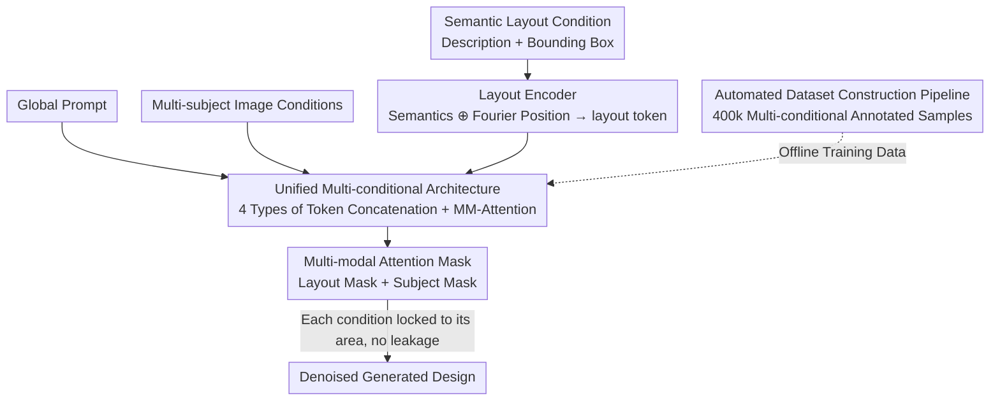

# CreatiDesign: A Unified Multi-Conditional Diffusion Transformer for Creative Graphic Design

**Conference**: ICLR2026  
**OpenReview**: [https://openreview.net/forum?id=Wtda8HpVp2](https://openreview.net/forum?id=Wtda8HpVp2)  
**Code**: To be confirmed  
**Area**: Diffusion Models / Image Generation  
**Keywords**: Multi-conditional Controllable Generation, Diffusion Transformer, Graphic Design, Attention Mask, Dataset Construction  

## TL;DR
By adding only 4.1% parameters to FLUX.1-dev, CreatiDesign unifies three types of heterogeneous conditions ("subject images + semantic layouts (descriptions + boxes) + global prompts") into a single token sequence. These are interacted with via multi-modal attention, while a set of attention masks ensures each condition precisely controls its specific canvas area without semantic leakage. Complemented by an automated pipeline that generates a 400,000-sample dataset, the model surpasses both single-condition expert models and existing multi-condition models in subject fidelity, layout alignment, and overall harmony.

## Background & Motivation
**Background**: Utilizing diffusion models for automated graphic design (posters, advertisements, social media images) is gaining increasing attention. A typical design draft is composed of three heterogeneous elements: ① Main elements (product subjects, provided as images, serving as the visual focus); ② Secondary elements (decorative objects, provided as layouts with "semantic descriptions + bounding boxes"); ③ Text elements (slogans, brand names, also provided as layouts defining position and content). This requires the model to satisfy both semantic and spatial fidelity simultaneously.

**Limitations of Prior Work**: Mainstream methods fall into two categories, both of which struggle to balance requirements. Among single-condition expert models, image-driven models (e.g., FLUX-Fill, UNO) excel at subject alignment but fail to follow layouts, while layout-driven models (e.g., BizGen, CreatiLayout) can arrange secondary elements/text according to descriptions and boxes but cannot preserve subject identity. Existing multi-condition models (e.g., OmniGen, Gemini 2.0), though capable of accepting various conditions, lack fine-grained control for each sub-condition, often leading to subject misalignment, text rendering errors, element interference, and overall disharmony.

**Key Challenge**: The root cause is that "sub-conditions are not precisely bound to their corresponding image regions," combined with "semantic leakage between sub-conditions"—a layout token might affect a canvas region it does not belong to, and subject features might be contaminated by irrelevant prompt/layout tokens, thus diluting control. Furthermore, graphic design datasets with fine-grained multi-conditional annotations are scarce, leaving models with insufficient learning opportunities.

**Goal**: The problem is decomposed into three sub-problems: (1) How to integrate multiple heterogeneous conditions in a unified manner; (2) How to maintain overall harmony while ensuring fine-grained controllability for each condition; (3) How to automatically construct large-scale multi-element graphic design datasets.

**Key Insight**: Rather than building from scratch, the authors preserve the strong generative power of the MM-DiT text-to-image model and introduce "minimal architectural changes" to integrate multi-conditional capabilities. Controllability issues are addressed not by adding new networks, but by applying masks to existing multi-modal attention to constrain the interaction range.

**Core Idea**: All conditions are encoded into the same token space to achieve unified control via native multi-modal attention. "Layout masks + Subject masks" are then used to lock the attention interactions of each condition to its respective designated area, ensuring the results are unified, precise, and harmonious.

## Method

### Overall Architecture
The task of CreatiDesign is formalized as $I_g = f(P, I_s, L)$: given a global prompt $P$, multi-subject image conditions $I_s$, and semantic layout conditions $L=\{l_i=(d_i,b_i)\}_{i=0}^{n}$ (where each layout element consists of a semantic description $d_i$ and a bounding box $b_i$, categorized as secondary visual or text elements), the model outputs the design image $I_g$. The pipeline consists of two sides: the **Model Side** encodes four types of information (prompt, noise map, subject images, semantic layout) into tokens, concatenates them, and feeds them into $N$ CreatiDesign MM-DiT Blocks for joint denoising, using multi-modal attention with interaction ranges constrained by masks; the **Data Side** uses an automated pipeline to generate training data.

### Key Designs

**1. Unified Multi-conditional Architecture: Integrating Heterogeneous Conditions into One Token Space**

To address the challenge of unifying heterogeneous conditions, the authors follow the MM-DiT paradigm (based on FLUX.1) where "text tokens $h_p$ + image tokens $h_z$ undergo MM-Attention," adding condition tokens with minimal structural changes. Multi-subject image conditions are first padded with a background color (e.g., gray), then encoded by the native VAE and patched to obtain subject tokens $h_s$. The noise map yields $h_z$, and the prompt yields $h_p$ via T5. Tokens $h_p, h_z, h_s, h_l$ are concatenated along the token dimension and fed into $N$ MM-DiT Blocks. In each block, linear projections yield $Q_*, K_*, V_* = \text{Linear}(h_*)$, followed by joint attention:

$$h_l', h_p', h_z', h_z' = \text{Attention}([Q_l,Q_p,Q_z,Q_s],[K_l,K_p,K_z,K_s],[V_l,V_p,V_z,V_s]).$$

Key engineering points include: applying LoRA to the linear layers and AdaLN for layout tokens $h_l$ and subject tokens $h_s$ to efficiently align new modalities, and applying positional encoding shifts to image conditions and layout tokens to prevent conflicts with the noise map and prompt in the token space. This retains the full generative power of the base model while "plugging in" multi-conditional capabilities—introducing only 491.5M parameters (4.1% of FLUX 12B).

**2. Layout Encoder: Fusing "Description + Box" into Semantically and Spatially Aware Tokens**

Secondary visual elements and text elements are provided as $(d_i, b_i)$. Since descriptions are semantic and boxes are coordinates, they cannot be fed directly. The authors use T5 to extract semantic features $h_i^d$ from descriptions $d_i$, and Fourier positional encoding for spatial features $h_i^b$ from bounding boxes $b_i$. These are concatenated and processed by an MLP (the Layout Encoder):

$$h_i^l = \text{MLP}(\text{Concat}(h_i^d, h_i^b)).$$

This ensures each layout token carries both "what to draw" and "where to draw." Ablations show that removing the LE (w/o LE) causes the Sentence Accuracy (Sen. Acc) to plummet from 78.30 to 12.13, indicating that explicit spatial injection is essential for accurate rendering.

**3. Multi-modal Attention Mask: Locking Each Condition to Its Region**

This is the core solution for "fine-grained control + overall harmony." Attributing controllability degradation to specific regions not being bound to conditions and semantic leakage between conditions, the authors introduce two masks in MM-Attention. **Layout Attention Mask (LAM)**: Each layout token $h_i^l$ is only allowed to attend to image tokens $h_i^z$ within its bounding box $b_i$, locking spatial control to the target area while blocking interactions between layout tokens, subjects, and prompts. **Subject Attention Mask (SAM)**: Masks are formed from the spatial positions of subjects in user-provided images; subject tokens $h_i^s$ only engage in bidirectional interaction with image tokens $h_i^z$ within their masked areas, preventing leakage to other layout elements or prompt tokens and preserving subject identity.

**4. Automated Dataset Construction Pipeline: Producing 400,000 Design Images**

The pipeline follows four steps: ① **Design Theme Generation**: An LLM (e.g., GPT-4) generates design themes covering common categories (furniture, food, clothing), including descriptions for main/secondary/text elements; ② **Text Layer Rendering**: Layout protocols for text elements are generated via Hierarchical Layout Generation (HLG) and rendered into RGBA images with precise foreground text; ③ **Foreground-based Image Generation**: Borrowing from LayerDiffuse, foreground-LoRA and background-LoRA are added to FLUX.1-dev with attention sharing to generate backgrounds for the RGBA text layers; ④ **Entity Annotation and Filtering**: GroundingSAM2 extracts boxes and segmentation masks for all entities, and a VLM generates descriptions. Entities are classified as main or secondary: main elements form subject image conditions, while secondary and text elements form the semantic layout.

### Loss & Training
Fine-tuning is performed on FLUX.1-dev using LoRA (rank 256), adding 491.5M parameters. The AdamW optimizer is used with a fixed learning rate of 1e-4 and a batch size of 8, training for 100k steps on 8 H20-96G GPUs (approx. 4 days). Resolution bucketing supports variable sizes; image conditions are set to half the target resolution, layout descriptions are capped at 30 tokens, and a maximum of 10 layouts per image is allowed.

## Key Experimental Results

### Main Results
The benchmark includes 1,000 samples evaluated across three dimensions: **Multi-subject Fidelity** (CLIP-I, DINO-I, and M-DINO—the product of individual subject DINO scores, more sensitive to failure than the average), **Semantic Layout Alignment** (VQA-based scoring for secondary elements; PaddleOCR for Sen. Acc, NED, and IoU for text), and **Image Quality** (IR Score, PickScore).

| Method (Type) | M-DINO (Subject) ↑ | Sen. Acc (Text) ↑ | Layout Space ↑ | Avg. ↑ |
|:---|:---:|:---:|:---:|:---:|
| MS-Diffusion (Image-driven) | 44.34 | 0.00 | 49.54 | 36.23 |
| FLUX.1-Fill (Image-driven) | 69.05 | 12.07 | 67.55 | 52.24 |
| BizGen (Layout-driven) | 22.93 | 75.89 | 79.84 | 58.53 |
| Gemini 2.0 (Multi-conditional) | 29.68 | 71.38 | 59.41 | 50.78 |
| FLUX.1-dev (Base) | 17.76 | 57.95 | 60.02 | 47.50 |
| **CreatiDesign (Ours)** | **65.75** | **78.30** | **78.94** | **69.28** |

Expert models excel only in their specific dimensions (e.g., FLUX.1-Fill has good subject fidelity but poor text performance), whereas CreatiDesign ranks in the top tier across subject, text, and spatial dimensions simultaneously. Compared to the base FLUX.1-dev, it gains +47.99 in M-DINO and +20.35 in Sen. Acc with only 4.1% additional parameters.

### Ablation Study

| Configuration | M-DINO | Layout Space | Sen. Acc | Note |
|:---|:---:|:---:|:---:|:---|
| CreatiDesign (Full) | 65.75 | 78.94 | 78.30 | Full model |
| w/o LE | 62.96 | 80.99 | 12.13 | Text rendering fails without Layout Encoder |
| w/o LAM | 64.28 | 66.94 | 20.16 | Element misalignment and region confusion |
| w/o SAM | 64.14 | 75.99 | 76.84 | Subject consistency degradation |

### Key Findings
- **Layout Encoder is critical for text**: Removing it causes Sen. Acc to drop from 78.30 to 12.13, showing that Fourier position features are vital for placing text correctly.
- **Layout Mask (LAM) ensures spatial alignment**: Removing LAM drops the layout space score from 78.94 to 66.94 and Sen. Acc from 78.30 to 20.16.
- **Subject Mask (SAM) preserves identity**: Removing SAM leads to drift in subject details (e.g., clock numbers, popcorn colors), representing a visually sensitive degradation.
- **Bonus Feature**: CreatiDesign supports cyclic editing without retraining. By using a generated image as a new image condition with masks, users can iteratively add subjects or change text without affecting non-edited areas.

## Highlights & Insights
- **"Masks instead of new networks" for fine-grained control**: The authors frame controllability as an "attention interaction range" issue rather than needing additional control networks. This parameter-efficient approach is applicable to any MM-DiT architecture.
- **Unified Token Space + Positional Shift**: Concatenating heterogeneous conditions into a single sequence for native MM-Attention while using shifts to avoid conflicts allows the base model's capacity to be preserved.
- **M-DINO Metric**: Using the product rather than the average for multi-subject similarity is a more rigorous measure, as one failed subject renders a composite design unusable.
- **Reusable Data Loop**: The "render then back-annotate" pipeline (LLM theme → HLG layout → Synthesis → SAM2/VLM annotation) provides a general paradigm for creating data for controllable generation tasks.

## Limitations & Future Work
- **Acknowledged Limitations**: Facial detail fidelity and dense text generation remain challenging as the current dataset is not specifically customized for these scenarios.
- **Observed Limitations**: ① Potential distributional homology risk as both the benchmark and training data stem from the same synthetic pipeline; ② The upper limit of 10 layouts and 30 description tokens might be restrictive for extremely complex layouts; ③ Masking relies on accurate subject position/bounding box priors.
- **Future Directions**: Supplementing the dataset with real-world designs and human face/dense text samples, exploring weak positioning masks, and developing interactive editing interfaces.

## Related Work & Insights
- **vs. Single-condition Experts**: Expert models like FLUX.1-Fill (image-driven) or BizGen (layout-driven) collapse when faced with conditions outside their expertise; CreatiDesign achieves balanced leadership across all conditions.
- **vs. Existing Multi-condition models**: Models like Gemini 2.0 support multiple conditions but lack fine-grained control; CreatiDesign distinguishes itself by using attention masks to lock the scope of each condition.
- **vs. Base Model**: With only 4.1% LoRA parameters, the average score increases from 47.50 to 69.28, proving that "base model + external conditions + mask constraints" is a cost-effective path for controllable generation.

## Rating
- Novelty: ⭐⭐⭐⭐ Small architectural changes but the mask-based attention constraint is effective; the data pipeline is systematic.
- Experimental Thoroughness: ⭐⭐⭐⭐ Comprehensive evaluation against 10+ baselines, 3D metrics, ablations, and user studies; synthetic benchmark is a minor flaw.
- Writing Quality: ⭐⭐⭐⭐ Motivations are clear with comparative figures; logical structure between method and ablation.
- Value: ⭐⭐⭐⭐ Directly addresses graphic design needs; 400k dataset and 4.1% parameter solution offer high utility for the community.

<!-- RELATED:START -->

## Related Papers

- [\[ICCV 2025\] UniCombine: Unified Multi-Conditional Combination with Diffusion Transformer](../../ICCV2025/image_generation/unicombine_unified_multi-conditional_combination_with_diffusion_transformer.md)
- [\[CVPR 2026\] PSDesigner: Automated Graphic Design with a Human-Like Creative Workflow](../../CVPR2026/image_generation/psdesigner_automated_graphic_design_with_a_human-like_creative_workflow.md)
- [\[ICLR 2026\] ContextGen: Contextual Layout Anchoring for Identity-Consistent Multi-Instance Generation](contextgen_contextual_layout_anchoring_for_identity-consistent_multi-instance_ge.md)
- [\[CVPR 2025\] From Elements to Design: A Layered Approach for Automatic Graphic Design Composition](../../CVPR2025/image_generation/from_elements_to_design_a_layered_approach_for_automatic_graphic_design_composit.md)
- [\[ICLR 2026\] CineTrans: Learning to Generate Videos with Cinematic Transitions via Masked Diffusion Models](cinetrans_learning_to_generate_videos_with_cinematic_transitions_via_masked_diff.md)

<!-- RELATED:END -->
