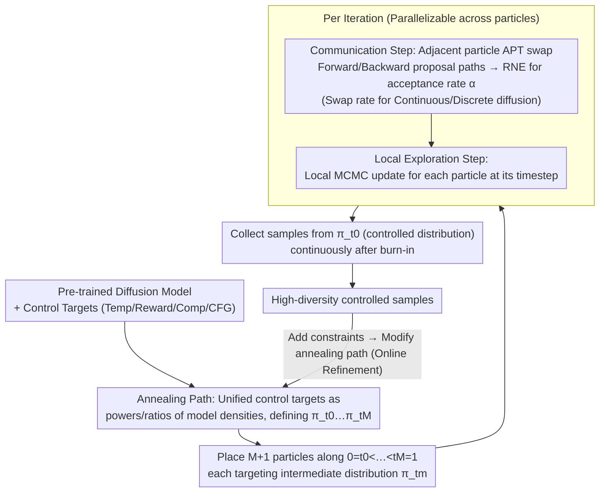

# CREPE: Controlling Diffusion with Replica Exchange

**Conference**: ICLR 2026  
**arXiv**: [2509.23265](https://arxiv.org/abs/2509.23265)  
**Code**: Available (GitHub)  
**Area**: Diffusion Models / Inference-time Control  
**Keywords**: replica exchange, parallel tempering, inference-time control, SMC alternative, reward tilting, CFG debiasing  

## TL;DR
The paper proposes CREPE, an inference-time control method for diffusion models based on Replica Exchange (Parallel Tempering). As a computational dual to SMC, it operates in parallel across the denoising step dimension and serially across the sample dimension. It offers high sample diversity, supports online refinement, and handles various tasks including temperature annealing, reward tilting, model composition, and CFG debiasing.

## Background & Motivation

**Background**: Inference-time control for diffusion models (satisfying new constraints without retraining) is a significant research direction. The current mainstream approach is Sequential Monte Carlo (SMC), which corrects the bias of heuristic guidance by maintaining a batch of weighted particles along the denoising trajectory.

**Limitations of Prior Work**: SMC has three major limitations: (a) it requires maintaining a large number of particles simultaneously throughout the denoising trajectory, leading to high memory overhead; (b) it suffers from poor sample diversity, especially when the number of particles is small (resampling leads to particle collapse); (c) it cannot be refined after sampling—if results are unsatisfactory or new constraints are added, generation must start from scratch.

**Key Challenge**: The "parallel particles + serial timesteps" paradigm of SMC inherently creates bottlenecks in diversity and flexibility. A computationally dual scheme is needed.

**Goal**: To propose an alternative to SMC that achieves: (a) serial rather than batch particle generation; (b) high diversity maintained after burn-in; (c) support for online refinement and early stopping; (d) coverage of diverse tasks such as tempering, reward-tilting, model composition, and CFG debiasing.

**Key Insight**: Replica Exchange (Parallel Tempering) is the computational dual of SMC—running chains in parallel across different denoising steps while generating samples serially. This MCMC sampling framework is adapted to the diffusion model setting.

**Core Idea**: The swap move of Parallel Tempering is adapted to the diffusion model path space. The acceptance probability is calculated using the Radon-Nikodym Estimator, enabling inference-time control without needing explicit target densities.

## Method

### Overall Architecture

CREPE addresses the problem of "correcting bias at inference time without retraining diffusion models" by inverting the operational mode of SMC. While SMC involves "a batch of particles advancing in parallel along a serial time trajectory," CREPE stations each particle at a fixed diffusion timestep, and samples are generated serially one after another. Specifically, $M+1$ particles are placed along a sequence of timesteps $0=t_0 < t_1 < ... < t_M=1$ from the data distribution to pure noise, where each particle targets a corresponding intermediate distribution $\pi_{t_m}$. This sequence of intermediate distributions is defined by an **annealing path**, which unifies control objectives—such as temperature annealing, reward tilting, model composition, and CFG debiasing—as powers or ratios of the pre-trained model density.

Each iteration of the chain consists of two steps: the **communication step**, where two particles at adjacent timesteps attempt to "swap positions" as in parallel tempering. They each simulate a forward and a backward proposal path, and a swap is decided based on the acceptance rate calculated by the RNE, thereby propagating the exploration power of high-temperature (near noise, easy to mix) chains to low-temperature (near data, constrained) chains; and the **local exploration step**, where each particle performs a local MCMC update at its own timestep. Both steps can be parallelized across particles. After the chain passes a burn-in period, the states continuously emitted from the lowest temperature chain $\pi_{t_0}$ (the desired controlled data distribution) constitute the final samples. When adding new constraints, only the annealing path needs modification, allowing the chain to continue running without restarting.

### Key Designs

**1. Annealing Paths: Unifying control tasks as powers/ratios of model densities**

The communication step requires explicit target distributions $\pi_{t_0},...,\pi_{t_M}$. However, in inference-time control, only a pre-trained model is available without task-specific densities. CREPE rewrites all control objectives into forms involving only combinations of pre-trained model densities: temperature annealing $\pi_t(x) \propto p_t^j(x)^\beta$, reward tilting $\pi_t(x) \propto p_t^j(x)\exp(r_t(x))$, model composition $\pi_t(x) \propto \prod_j p_t^j(x)$, and CFG debiasing $\pi_t(x) \propto p_t(x)^{1-w}p_t(x|c)^w$. This unification ensures that each target distribution involves only powers or ratios of model densities, allowing the acceptance rate to remain within a range that can be directly estimated by the RNE without deriving densities for each task.

**2. APT swap move on Diffusion Path Space: Swapping particles without explicit target densities**

Parallel tempering relies on swapping particles between adjacent temperatures, but standard PT requires the unnormalized density of the target distribution to calculate the acceptance rate. CREPE performs the swap on the diffusion path space: for two particles $(x, x')$ at timesteps $t$ and $t'$, $x$ moves forward to $t'$ and $x'$ moves backward to $t$, forming forward/backward proposal paths. The Metropolis-Hastings acceptance rate $\alpha_{t,t'}$ is then determined by the Radon-Nikodym Estimator (RNE), which utilizes the ratio of the pre-trained model's own forward/backward transition probabilities. By substituting density ratios with path probability ratios using $p_{t'}(x_{t'})/p_t(x_t)=R_{t,t'}^{-1}$, it avoids explicit evaluation of target densities. To cover different modalities, CREPE derives swap rates for both Gaussian diffusion (continuous SDE for images) and discrete masked diffusion (CTMC like MDLM for text).

**3. Online Refinement: Persistent MCMC chains for dynamic constraints**

Unlike SMC, which is a one-off process, CREPE is an infinitely runnable MCMC chain. If a user wishes to add a new reward term or adjust constraints, they simply update the annealing path. Parallel tempering naturally converges to the new target distribution without discarding previous progress. This enables interactive generation and iterative design scenarios where constraints are adjusted on the fly, while also supporting early stopping.

### Loss & Training
- No training required; entirely run at inference time.
- Requires forward and backward processes of a pre-trained diffusion model.
- Computational overhead is comparable to SMC but distributed differently—PT requires a burn-in period, but the cost per sample remains constant thereafter.

## Key Experimental Results

### Main Results

**Molecular Temperature Annealing (Alanine Dipeptide/Tetrapeptide/Hexapeptide)**

| Method | Energy TVD ↓ | TICA MMD ↓ | Note |
|------|-------------|-----------|------|
| FKC (SMC) | 0.345 | 0.116 | SMC baseline |
| CREPE (Ours) | **0.224** | **0.096** | Dipeptide |
| CREPE | **0.122** | **0.035** | Tetrapeptide |

**CFG Debiasing (ImageNet-64)**

| Method | #Samples | IR ↑ | CLIP ↑ | FID ↓ |
|------|----------|------|--------|-------|
| FKC (SMC) | 8 | **-0.29** | **24.17** | **1.85** |
| CREPE | 8 | -0.30 | 24.10 | 1.92 |
| FKC | 512 | -0.08 | 24.31 | 1.96 |
| CREPE | 512 | **0.09** | 24.28 | **1.79** |

### Key Findings
- SMC is superior for small sample sizes (CREPE requires burn-in), but CREPE outperforms SMC as the number of samples increases, with FID showing continuous improvement.
- The core advantage of CREPE is **diversity**—resampling in SMC leads to particle collapse (visual similarity within a batch), whereas MCMC chains in CREPE naturally explore a wider range.
- In online refinement experiments, CREPE satisfies new constraints within only 1k iterations, demonstrating high flexibility.
- Effectiveness on discrete diffusion (MNIST MDLM) indicates the generalizability of the method.

## Highlights & Insights
- The **computational duality perspective** is elegant—flipping "parallel particles × serial time" to "serial particles × parallel time" clearly explains the core innovation. This duality (Syed et al., 2024) stems from deep connections in sampling theory.
- **Online refinement** is a capability SMC lacks entirely, proving highly useful for practical applications like interactive generation and iterative design.
- The **unified framework** covers tempering, reward-tilting, model composition, and CFG debiasing, allowing them to be freely combined. The methodology is highly general.

## Limitations & Future Work
- Sample quality is poor during the burn-in period, making it less effective than SMC for small sample scenarios.
- Each swap move requires simulating both forward and backward diffusion paths, which is non-trivial computationally.
- Quantitative comparisons for high-resolution images (ImageNet-512) are limited beyond qualitative reward-tilting results.
- Acceptance rates may decrease as dimensionality increases, necessitating finer annealing schedules.
- Combinations with guidance methods (e.g., DPS, FreeDoM) have not been explored.

## Related Work & Insights
- **vs. FKC (SMC)**: Computational duality relationship. SMC wins on small sample counts; CREPE wins on large counts and offers better diversity.
- **vs. Twisted SMC/DDRM**: All are bias-correction methods for inference-time control, but CREPE is based on MCMC rather than importance sampling.
- **vs. APT (Zhang et al., 2025)**: CREPE extends APT from settings with known unnormalized densities to settings using only pre-trained diffusion models.

## Rating
- Novelty: ⭐⭐⭐⭐⭐ Adapts Parallel Tempering to diffusion inference-time control for the first time; the SMC duality perspective is very elegant.
- Experimental Thoroughness: ⭐⭐⭐⭐ Covers various modalities (molecules/images/trajectories/discrete), though quantitative high-resolution image experiments are limited.
- Writing Quality: ⭐⭐⭐⭐ Rigorous theory but high notation density; requires a strong background in stochastic processes.
- Value: ⭐⭐⭐⭐ Provides a new paradigm for diffusion model inference-time control, with unique advantages in diversity and online refinement.

<!-- RELATED:START -->

## Related Papers

- [\[ICLR 2026\] AttriCtrl: A Generalizable Framework for Controlling Semantic Attribute Intensity in Diffusion Models](attrictrl_a_generalizable_framework_for_controlling_semantic_attribute_intensity.md)
- [\[ECCV 2024\] Controlling the World by Sleight of Hand](../../ECCV2024/image_generation/controlling_the_world_by_sleight_of_hand.md)
- [\[ECCV 2024\] StyleTokenizer: Defining Image Style by a Single Instance for Controlling Diffusion Models](../../ECCV2024/image_generation/styletokenizer_defining_image_style_by_a_single_instance_for_controlling_diffusi.md)
- [\[ICLR 2026\] Generalization of Diffusion Models Arises with a Balanced Representation Space](generalization_of_diffusion_models_arises_with_a_balanced_representation_space.md)
- [\[ICLR 2026\] RNE: plug-and-play diffusion inference-time control and energy-based training](rne_plug-and-play_diffusion_inference-time_control_and_energy-based_training.md)

<!-- RELATED:END -->
