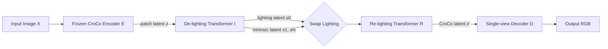

# CroCoDiLight: Repurposing Cross-View Completion Encoders for Relighting

**Conference**: ICLR 2026  
**OpenReview**: [https://openreview.net/forum?id=GKvb3HCyNk](https://openreview.net/forum?id=GKvb3HCyNk)  
**Code**: [https://github.com/alistairfoggin/CroCoDiLight](https://github.com/alistairfoggin/CroCoDiLight)  
**Area**: Image Generation / Relighting / Intrinsic Image Decomposition  
**Keywords**: Relighting, Cross-view Completion (CroCo), Illumination Decoupling, Shadow Removal, Albedo Estimation, Self-supervised  

## TL;DR
This paper reveals that the latent space of the geometric vision pre-trained model CroCo implicitly encodes illumination information. By using minimal data (two orders of magnitude less than used for CroCo), the authors decouple its patch latent representations into "a global illumination vector + per-patch intrinsic vectors," leveraging a series of photometric tasks such as relighting, shadow removal, and albedo estimation without intensive retraining.

## Background & Motivation
**Background**: Cross-view Completion (CroCo) is a popular 3D geometric vision pre-training paradigm. Given two images of the same scene from different views, the model completes masked patches in one image using information from the other. It has proven highly effective for purely geometric downstream tasks like stereo depth, optical flow, and point cloud prediction (e.g., DUSt3R / MASt3R).

**Limitations of Prior Work**: Photometric tasks (relighting, shadow removal, intrinsic decomposition) have long been hindered by the scarcity of training data. Pixel-aligned, illumination-only-varying paired images are extremely difficult to collect, while synthetic data suffers from a sim-to-real gap. Consequently, these tasks often require separate training for each benchmark and exhibit poor generalization.

**Key Challenge**: In the training pairs of CroCo, the two images often have different illumination. To complete masked patches, the model **must** implicitly "estimate the target illumination → de-light the content → perform geometric projection → re-light according to the target illumination." In other words, CroCo is one of the few vision models forced to learn relighting within its pre-training objective, yet this photometric knowledge remains buried in patch embeddings.

**Goal**: To verify the hypothesis that "the CroCo latent space already contains illumination understanding" and explicitly extract it into an actionable illumination latent space.

**Core Idea**: **[Extraction rather than learning from scratch]** Since photometric knowledge already exists within the frozen CroCo encoder, the authors only need to train two lightweight transformers on a small dataset to **decouple** the latent representation into illumination and intrinsic components, and then **recompose** them back into the CroCo latent space. This enables interpolation, transfer, shadow removal, and albedo estimation within the illumination latent space.

## Method

### Overall Architecture
The method consists of four components forming an "Encoding → De-lighting → Illumination Swapping → Re-lighting → Decoding" pipeline: A frozen CroCo v2 encoder $E$ encodes the image into patch latents $z$; a de-lighting transformer $I$ splits $z$ into a global illumination latent $s_0$ and per-patch intrinsic latents $\{s_1..s_N\}$; a re-lighting transformer $R$ recombines the (replaceable) illumination latent and intrinsic latents back into the CroCo latent space $z'$; and finally, a single-view decoder $D$ restores $z'$ to high-fidelity RGB. This decoupling is constrained using "same-view, different-illumination" aligned image pairs during training.

### Key Designs

**1. Single-view Decoder $D$: Converting CroCo latent space into viewable images.** The original CroCo decoder is binocular and only supervises the reconstruction of masked patches, resulting in poor single-view image quality. The authors train a separate decoder with 12 layers, 16-head self-attention, and a DPT head using an auto-encoding objective—where the frozen CroCo encoder provides latent $z$ and the decoder restores the original image $X' = D(z)$. The loss is a weighted combination of perceptual loss and MSE: $L_{img}=\lambda L_{LPIPS}+(1-\lambda)L_{MSE}$, with $\lambda=0.5$. This step does not require paired data and can be trained on any image set (ImageNet was used), effectively opening a high-fidelity "latent space ↔ RGB" channel.

**2. De-lighting / Re-lighting Dual Transformers: Bottlenecking illumination into a single vector.** For de-lighting, a learnable query $z_0$ (assigned a RoPE encoding with index $-1$ to avoid conflict with real patches) is appended to the patch latents and fed into an 8-layer self-attention transformer $I$. The output $\hat{s}=I(\hat{z})$ consists of $s_0$ carrying the global illumination and $s_i$ as intrinsic patches stripped of lighting effects. The re-lighting transformer $R$ shares the same architecture as $I$ and re-entangles the illumination and intrinsic latents into CroCo latents $\hat{z}'=R(\hat{s})$, keeping only the patch parts $z'$ for decoding. Crucially, the illumination latent $s_0$ input to $R$ **does not have to come from the original image**—replacing it with the illumination latent from another image achieves relighting.

**3. Dual Self-supervision on Paired Images: Intrinsic consistency + Cross-lighting.** Training utilizes ONLY "same-view, pixel-aligned, different-illumination" image pairs $X_A, X_B$. On one hand, intrinsic patches of both images should be identical (invariant geometry and material), constrained by MSE: $L_{intrinsic}=\frac{1}{N}\sum_i \|s_i^A - s_i^B\|^2$. On the other hand, the intrinsic latent of A combined with the illumination latent of B should reconstruct B after decoding: $X'_{A,B}=D(R(\{s_0^B, s_1^A,...,s_N^A\}))$. Symmetric calculation yields $X'_{B,A}$, forming the cross-lighting loss: $L_{cross\text{-}light}=L_{img}(X_A, X'_{B,A})+L_{img}(X_B, X'_{A,B})$. These losses force illumination information into the $s_0$ bottleneck while keeping intrinsic latents illumination-invariant.

**4. Downstream Transformations $S$ / $A$ in Illumination Latent Space: Mapping tasks to "replacing the illumination latent."** Since illumination and shadows are encoded in $s_0$, downstream tasks reduce to learning a mapping $s_0 \to s_0'$. The shadow removal model $S$ (same architecture as $R$, initialized with $R$'s weights) maps a shadowed illumination latent to a shadow-free one, supervised by the MSE of the latent encoded from a shadow-free image. The albedo estimation model $A$ similarly maps $s_0$ to an "albedo illumination latent." During training, all components except $S$/$A$ are frozen. Since the illumination latent operates in image space, tasks like illumination interpolation, stabilization, and temporal upsampling can be performed directly on fixed-camera timelapses; high-resolution inference is handled by tiling $448 \times 448$ windows, each with its own illumination latent.

## Key Experimental Results

### Main Results: Shadow Removal (ISTD+ / SRD, without masks)

| Method | Mask | ISTD+ SSIM↑ | ISTD+ PSNR↑ | SRD SSIM↑ | SRD PSNR↑ |
|------|------|------|------|------|------|
| HomoFormer (w/ mask) | Yes | 0.968 | 35.26 | 0.955 | 35.33 |
| OmniSR | No | 0.966 | 33.30 | 0.941 | 31.96 |
| StableShadowRemoval | No | 0.968 | 35.10 | 0.944 | 33.24 |
| **Ours (S)** | No | 0.929 | 30.17 | 0.931 | 30.01 |
| **Ours (oracle)** | No | 0.936 | 33.41 | 0.937 | 32.47 |

While the metrics do not reach SOTA (the authors attribute this primarily to subtle global color shifts), the model is competitive as a **generalist model without per-benchmark fine-tuning**. The oracle experiment (using the illumination latent from the shadow-free image directly) proves that a superior latent mapping exists.

### Albedo Estimation (IIW WHDR, not trained on IIW)

| Method | WHDR(%)↓ |
|------|------|
| Ordinal Shading (2023) | 24.9 |
| IntrinsicDiffusion (2024) | 17.9 |
| **Ours** | **15.4** |
| **Ours + 0.5** | **14.3** |

Ours achieves SOTA in a fair "zero-shot" setting (not trained on IIW), despite albedo estimation being a side product.

### Temporal Upsampling (FloLPIPS↓)

| Method | Clock Shadows | Day-night | Indoor Shadows |
|------|------|------|------|
| Image Space | 0.309 | 0.041 | 0.950 |
| Latent Space (Ours) | **0.286** | 0.043 | **0.923** |

### Ablation Study: Is CroCo Pre-training Necessary?

| CroCo | Pre-trained | IIW WHDR↓ | ISTD+ PSNR↑ | SRD PSNR↑ |
|------|------|------|------|------|
| ✗ (Simple Encoder) | — | 19.1% | 29.71 | 29.87 |
| ✓ | ✗ (Random Weights) | 27.7% | 25.34 | 22.98 |
| ✓ | ✓ | **15.4%** | **30.17** | **30.01** |

### Key Findings
- Using a **pre-trained** CroCo encoder is significantly better than a simple architecture trained from scratch, while random initialization of the CroCo architecture performs the worst. This indicates that gains come from the **photometric knowledge** learned by CroCo rather than the architecture itself, confirming the core hypothesis.
- Decoupling is achieved using only 57k image pairs (36k real + 21k synthetic), two orders of magnitude fewer than the 7M pairs used for CroCo v2.

## Highlights & Insights
- **Novel Perspective**: For the first time, it is pointed out that the geometric pre-training objective of CroCo forces it to implicitly learn "de-lighting and re-lighting." Repositioning a purely geometric model as a photometric model is a compelling "latent capability extraction" narrative.
- **Strong Unity**: Relighting, shadow removal, albedo estimation, and temporal interpolation are all reduced to "replacing/interpolating a vector in the same illumination latent space." A general model supports multi-tasking without benchmark-specific fine-tuning.
- **Data Efficiency**: By leveraging photometric knowledge from geometric pre-training, the model achieves high efficiency, providing a low-cost path for intrinsic and illumination research where data is scarce.

## Limitations & Future Work
- **Bottleneck vs. Fidelity**: Using a single illumination latent per tile can lead to a loss of sharpness, especially for hard shadows, reflecting a trade-off between fidelity and decoupling.
- **Lack of Global Context**: Processing tiles via a sliding window for high-resolution images can cause color shifts in shadow removal, which is the main reason metrics lag behind SOTA.
- **Image Space vs. World Space**: Illumination is extracted in image space due to pixel-aligned training, making it sensitive to misalignment and lacking fine-grained control (e.g., specifying illumination via text or arbitrary images).
- **Future Work**: Spatial varying illumination maps, comparisons with other pre-trained encoders, training latent mappers for video interpolation, and controllable relighting.

## Related Work & Insights
- Inherits the trend of **repurposing foundation models**: Just as ViT implicitly learns segmentation and Diffusion generators implicitly learn depth (Marigold) or intrinsic decomposition, this work applies the "mining latent capabilities" paradigm to CroCo and photometric tasks.
- Differs from **generative relighting** (e.g., UniRelight, IC-Light): Ours does not aim to generate new lighting from scratch but decouples real image illumination for interpolation and transfer, which is more "understanding-oriented."
- Insight: Any model "forced" to solve a sub-problem within its pre-training objective likely hides low-cost extractable capabilities in its latent space; the lightweight decouple-and-recompose adaptation paradigm is worth extending to other scenarios.

## Rating
- Novelty: ⭐⭐⭐⭐⭐ — The discovery that "CroCo implicitly learns relighting" is highly insightful and rigorously verified.
- Experimental Thoroughness: ⭐⭐⭐⭐ — Covers shadow removal, albedo, and temporal interpolation with key ablations. SOTA in albedo, though shadow removal metrics are not leading and high-res color shift analysis is mostly qualitative.
- Writing Quality: ⭐⭐⭐⭐ — Clear hypothesis-verification logic. Figure 1 intuitively conveys the core concept.
- Value: ⭐⭐⭐⭐ — Establishes a low-cost route for photometric tasks using geometric pre-training; open-source and intellectually stimulating for the relighting and intrinsic decomposition communities.

<!-- RELATED:START -->

## Related Papers

- [\[ICLR 2026\] MVCustom: Multi-View Customized Diffusion via Geometric Latent Rendering and Completion](mvcustom_multi-view_customized_diffusion_via_geometric_latent_rendering_and_comp.md)
- [\[ECCV 2024\] PanoFree: Tuning-Free Holistic Multi-view Image Generation with Cross-view Self-Guidance](../../ECCV2024/image_generation/panofree_tuning-free_holistic_multi-view_image_generation_with_cross-view_self-g.md)
- [\[ICLR 2026\] PI-Light: Physics-Inspired Diffusion for Full-Image Relighting](pi-light_physics-inspired_diffusion_for_full-image_relighting.md)
- [\[ICLR 2026\] Aligning Visual Foundation Encoders to Tokenizers for Diffusion Models](aligning_visual_foundation_encoders_to_tokenizers_for_diffusion_models.md)
- [\[ICLR 2026\] SSCP: Flow-Based Single-Step Completion for Efficient and Expressive Policy Learning](flow-based_single-step_completion_for_efficient_and_expressive_policy_learning.md)

<!-- RELATED:END -->
