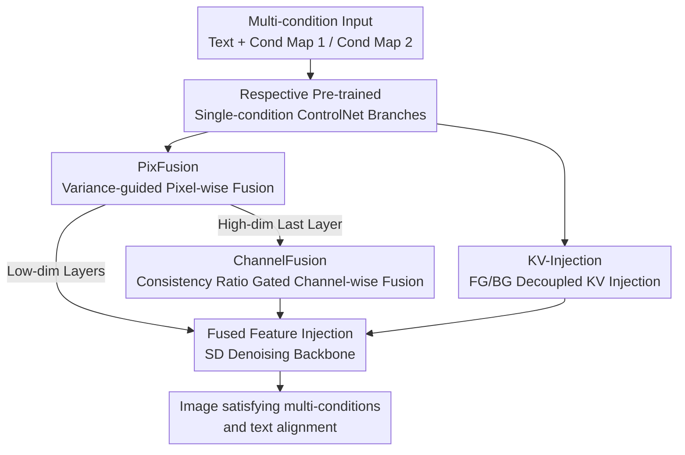

# Cross-ControlNet: Training-Free Fusion of Multiple Conditions for Text-to-Image Generation

**Conference**: ICLR 2026  
**OpenReview**: [https://openreview.net/forum?id=89j1hUxOiF](https://openreview.net/forum?id=89j1hUxOiF)  
**Code**: None  
**Area**: Diffusion Models / Controllable Image Generation  
**Keywords**: Multi-condition controllable generation, ControlNet, Training-free fusion, Feature variance, KV injection

## TL;DR
This paper proposes Cross-ControlNet, a **completely training-free** multi-condition T2I framework. Grounded in two observations—natural spatial alignment of intermediate features across ControlNet branches and quantifiable condition strength via variance—the framework utilizes PixFusion (pixel-level variance-guided fusion), ChannelFusion (channel-level consistency ratio gated fusion), and KV-Injection (FG/BG decoupled KV injection) to fuse multi-path control signals during inference. It achieves approximately a 5.4% mIoU improvement over the strongest training-free baseline under conflicting conditions and generalizes to FLUX (DiT architecture) at zero cost.

## Background & Motivation
**Background**: T2I diffusion models (SD, SDXL, etc.) generate high-quality images from text, but text lacks precise spatial control. ControlNet and T2I-Adapter address controllable generation in **single modalities** by replicating UNet encoders and injecting spatial conditions (edges, segmentation, poses) into pre-trained T2I models.

**Limitations of Prior Work**: When satisfying **multiple** spatial conditions simultaneously, natural imbalances between modalities arise. Conventional approaches either retrain a unified multi-modal model on large-scale paired data (high cost, retraining required for new modalities, tendency to ignore weak signals) or employ training-free fusion of existing ControlNet branches, such as MaxFusion. However, MaxFusion's strategy is easily disrupted by inherent noise in the denoising process (especially in early steps) and often generates inharmonious images under complex or conflicting conditions due to the lack of explicit modeling of relationships between spatial conditions.

**Key Challenge**: A contradiction exists between "reusing existing ControlNets without training" and "faithfully following every control signal under multi-path, potentially conflicting conditions." Simple averaging dilutes key information, pixel-wise fusion with fixed thresholds fails in high-dimensional feature spaces, and conflicting conditions lead to role contamination between foreground and background.

**Goal**: Adaptively fuse intermediate features from multiple pre-trained single-condition ControlNets without any training or weight tuning, handling both **complementary conditions** (strengthening the same structure) and **conflicting conditions** (providing contradictory spatial cues).

**Key Insight**: The authors provide two critical observations: (1) Features generated by different ControlNet branches at the same SD spatial positions are **naturally spatially aligned** (as they are injected into the same reference frame via element-wise addition); (2) The **relative strength of each condition can be quantified by variance**: spatial-level variance maps identify regions with stronger condition influence, while channel-level variance vectors identify channels with higher response.

**Core Idea**: Use "variance to measure strength + Gaussian smoothing for noise robustness" to adaptively select/fuse features at both **spatial** and **channel** levels. Subsequently, employ "FG/BG masks derived from text attention + cross-branch KV injection" to decouple conflicting cues, ensuring multi-path controls are faithfully reflected in the image—entirely without training.

## Method

### Overall Architecture
The input to Cross-ControlNet consists of a text prompt and multiple spatial condition maps (e.g., Seg + Pose, HED + Depth). Each condition map is fed into its corresponding pre-trained single-condition ControlNet branch. The output is an image satisfying all conditions and aligned with the text. The method operates solely during the **inference stage** by modifying the intermediate features of ControlNet branches without introducing any trainable parameters.

In each denoising step, multiple ControlNet branches produce features $f_1, f_2$ at each intermediate layer. These are first processed by a **robust feature fusion** module to obtain the fused feature $\hat f$ before injection into the SD backbone. PixFusion (pixel-wise, variance-guided) is used in most layers, while ChannelFusion (channel-wise, consistency ratio gated) is used only in the final layer to maintain spatial discriminative power in low-dimensional layers and avoid threshold degradation in high-dimensional layers. Parallel to this, from denoising step 5 onwards, KV-Injection operates within the ControlNet self-attention layers. Using a foreground mask $M^f$ derived from text cross-attention, it injects the keys/values of the foreground branch into the background branch to decouple foreground and background roles.

### Key Designs

**1. PixFusion: Identifying Trusted Conditions via Gaussian-Smoothed Spatial Variance Maps**

Simple averaging of features dilutes critical information when "left is dominated by condition A and right by condition B." PixFusion assigns spatial priorities based on local condition strength. The authors use spatial-level variance maps $\sigma_i^2 \in \mathbb{R}^{H\times W}$ to measure strength, normalized into relative standard deviations $\hat\sigma_i^{(j,k)} = \sigma_i^{(j,k)} / \sum_{(p,q)\in\Omega}\sigma_i^{(p,q)}$. Since latent space in early steps contains strong high-frequency noise, variance maps are smoothed with a fixed Gaussian kernel $G_{\kappa_1}$ before selection: $\hat f^{(j,k)} = f_{i^\star}^{(j,k)},\ i^\star = \arg\max_i [G_{\kappa_1} * \hat\sigma_i]^{(j,k)}$. For strongly correlated modalities, hard selection is replaced by weighted averaging if correlation $\rho^{(j,k)} > \delta_1$. This allows PixFusion to choose the stronger signal during conflicts and reach consensus during overlaps.

**2. ChannelFusion: Avoiding High-Dim Threshold Degradation via Consistency Ratio Gating**

While PixFusion is robust, it relies on fixed thresholds. In high-dimensional spaces, cosine similarity of i.i.d. Gaussian random vectors $X,Y\in\mathbb{R}^d$ concentrates near 0 ($\mathbb{E}[\rho]=0,\ \mathrm{Var}(\rho)=1/d$), causing fixed thresholds to lose discriminative power (threshold degradation). ChannelFusion operates in the **channel dimension**: for channel $c$, a consistency ratio is defined as $R_c = 1 - \frac{|\hat\sigma_{1,c} - \hat\sigma_{2,c}|}{\max\{\hat\sigma_{1,c},\hat\sigma_{2,c}\}} \in [0,1]$. If $R_c < \delta_2$ (high strength difference), it performs **hard selection** $\hat f_c = f_{i^\star,c}$; otherwise, it performs **soft fusion** weighted by precision (approximated by strength ratios). ChannelFusion maximizes information retention in high-dimensional layers where pixel-wise similarity collapses.

**3. KV-Injection: Decoupling Conflicting Conditions via Text-Attention Masks**

To prevent conflicting signals from blurring FG/BG roles, the authors treat foreground objects and background scenes as independent targets. Text cross-attention maps are used to derive a foreground mask $M^f$ and background mask $M^b$. In ControlNet self-attention layers, regional isolation is performed: keys and values from branches are concatenated $K^+=[K_2\oplus K_1], V^+=[V_2\oplus V_1]$. Specific attention is computed for the foreground region using the foreground branch and for the background region using the combined features: $\widehat{\mathrm{Attn}} = M^f\cdot\mathrm{Attn}^f + (1-M^f)\cdot\mathrm{Attn}^b$. This ensures each region draws information only from its designated feature domain.

### Loss & Training
The method is **entirely training-free**. Key hyperparameters: correlation threshold $\delta_1$ and consistency ratio threshold $\delta_2$ are both set to $\delta=0.7$; $G_{\kappa_1}, G_{\kappa_2}$ are normalized $3\times3$ Gaussian kernels. Backbone used is Stable Diffusion v1.5 with UniPC sampler (50 steps).

## Key Experimental Results

### Main Results
Performance under conflicting conditions (CLIP score↑ for text alignment, MSE↓ and mIoU↑ for condition fidelity):

| Method | Training-Free | CLIP↑(Pose,Seg) | MSE-S↓ | mIoU-P↑ | CLIP↑(Pose,Depth) | MSE-D↓ | mIoU-P↑ |
|------|:--:|------|------|------|------|------|------|
| Multi-ControlNet | ✓ | 0.2999 | 0.2282 | 0.3145 | 0.2978 | 0.0625 | 0.3150 |
| AnyControl | ✗ | 0.2853 | 0.2522 | 0.2042 | 0.2638 | 0.0338 | 0.1519 |
| MaxFusion | ✓ | 0.2945 | 0.2016 | 0.3528 | 0.2870 | 0.0498 | 0.3555 |
| **Cross-ControlNet** | ✓ | 0.2978 | **0.1983** | **0.3719** | 0.2893 | **0.0456** | **0.3671** |

Cross-ControlNet leads in condition fidelity (MSE/mIoU) while maintaining competitive text alignment. Compared to MaxFusion, mIoU increases from 0.3528 to 0.3719 (~5.4% improvement).

### Ablation Study
Incremental contribution of modules under conflicting conditions:

| Configuration | MSE-S↓ | mIoU-P↑(Seg) | MSE-D↓ | mIoU-P↑(Depth) |
|------|------|------|------|------|
| MaxFusion (Baseline) | 0.2016 | 0.3528 | 0.0498 | 0.3555 |
| PixFusion | 0.2004 | 0.3610 | 0.0495 | 0.3583 |
| +ChannelFusion | 0.2009 | 0.3648 | 0.0476 | 0.3618 |
| +KV-Injection (Full) | 0.1983 | 0.3719 | 0.0456 | 0.3671 |

### Key Findings
- **Positive Contribution of All Modules**: PixFusion alone outperforms MaxFusion; ChannelFusion enhances mIoU by preserving high-dimensional info; KV-Injection improves final fidelity.
- **Threshold Sensitivity**: $\delta=0.7/0.8$ provides the best balance between fidelity and image quality.
- **Generalization**: Migrates successfully to FLUX without any retraining, proving the method is not architecture-dependent.

## Highlights & Insights
- **Variance as Strength**: Using variance to measure condition importance provides a simple, interpretable, and training-free metric.
- **Divide and Conquer**: Addressing "threshold degradation" by switching from pixel-wise to channel-wise fusion in high dimensions is theoretically grounded.
- **Decoupled Injection**: Utilizing cross-attention masks for regional KV injection effectively resolves conflicts between foreground and background spatial cues.

## Limitations & Future Work
- **Dependency on Pre-trained Branches**: New modalities without existing ControlNets cannot be supported.
- **Inference Overhead**: Multiple ControlNet branches increase VRAM usage and latency.
- **Extreme Conflicts**: Residual artifacts may still appear in cases of complete geometric incompatibility.

## Related Work & Insights
- **vs MaxFusion**: While both are training-free, this work adds noise robustness (smoothing), variance-based weighting, and explicit FG/BG decoupling.
- **vs AnyControl / Uni-ControlNet**: These models require expensive multi-modal retraining; Cross-ControlNet achieves higher fidelity indices by reusing single-condition experts.
- **vs MasaCtrl**: While MasaCtrl uses KV manipulation for editing consistency, Cross-ControlNet adapts it for conflict resolution between different spatial branches.

## Rating
- Novelty: ⭐⭐⭐⭐ 
- Experimental Thoroughness: ⭐⭐⭐⭐ 
- Writing Quality: ⭐⭐⭐⭐ 
- Value: ⭐⭐⭐⭐ 

<!-- RELATED:START -->

## Related Papers

- [\[ICLR 2026\] OmniText: A Training-Free Generalist for Controllable Text-Image Manipulation](omnitext_a_training-free_generalist_for_controllable_text-image_manipulation.md)
- [\[AAAI 2026\] Infinite-Story: A Training-Free Consistent Text-to-Image Generation](../../AAAI2026/image_generation/infinite-story_a_training-free_consistent_text-to-image_gene.md)
- [\[CVPR 2026\] DynFusion: Rethinking Condition Fusion for Adaptive Multi-Conditional Text-to-Image Generation](../../CVPR2026/image_generation/dynfusion_rethinking_condition_fusion_for_adaptive_multi-conditional_text-to-ima.md)
- [\[ICLR 2026\] Training-Free Reward-Guided Image Editing via Trajectory Optimal Control](training-free_reward-guided_image_editing_via_trajectory_optimal_control.md)
- [\[CVPR 2026\] CRAFT-LoRA: Content-Style Personalization via Rank-Constrained Adaptation and Training-Free Fusion](../../CVPR2026/image_generation/craft-lora_content-style_personalization_via_rank-constrained_adaptation_and_tra.md)

<!-- RELATED:END -->
