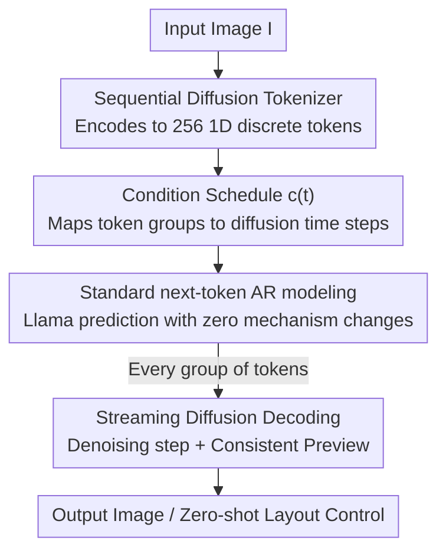

# D-AR: Diffusion via Autoregressive Models

**Conference**: ICLR 2026  
**OpenReview**: [https://openreview.net/forum?id=IhuvSLIsUN](https://openreview.net/forum?id=IhuvSLIsUN)  
**Code**: https://github.com/showlab/D-AR  
**Area**: Image Generation / Diffusion Models / Autoregressive Generation  
**Keywords**: Autoregressive visual generation, diffusion model, sequential diffusion tokenizer, next-token prediction, ImageNet class-conditional generation

## TL;DR
D-AR designs a "sequential diffusion tokenizer" to re-encode the image diffusion process into a sequence of coarse-to-fine discrete tokens. This allows an unmodified Llama decoder to generate images using standard next-token prediction while decoding corresponding diffusion denoising steps in real-time. It achieves FIDs of 2.09 and 2.00 on ImageNet 256×256 with 775M and 1.4B parameters, respectively.

## Background & Motivation

**Background**: Visual generation currently has two mainstream paradigms. First, diffusion models (DiT, SiT, Stable Diffusion) generate high-quality images by iteratively denoising continuous signals. Second, autoregressive (AR) models utilize the next-token prediction framework of LLMs, offering strong scalability and mature training/inference infrastructure (KV cache, vLLM, etc.).

**Limitations of Prior Work**: Both approaches have inherent drawbacks. Diffusion sampling requires intensive serial denoising steps, and its architecture is difficult to merge seamlessly with LLMs, limiting the potential for unified multimodal systems. AR models struggle because images are not naturally 1D linear sequences. To define a token order (e.g., scale-order in VAR, random-order in RandAR, or RAR), existing works almost always **modify the core AR mechanisms** (e.g., causal masks, training/inference logic), deviating from pure next-token prediction and losing the benefits of alignment with the LLM ecosystem.

**Key Challenge**: The goal is to combine "Diffusion-level image quality" with "AR simplicity and scalability." However, their data formats are naturally conflicting: diffusion iterates on continuous pixels, while AR requires discrete, linear, and ordered tokens. Previous "AR+Diffusion" attempts (MAR, CausalFusion, DART) mostly insert continuous inputs/outputs into the AR framework, still altering the underlying mechanism.

**Goal**: To make the AR sequence generation process "equivalent" to running a diffusion denoising process on pixels, without **any modifications** to standard AR mechanisms (keeping discrete I/O, causal masks, and training/inference logic identical to Llama).

**Key Insight**: The authors observe that the diffusion process itself possesses a **coarse-to-fine temporal order**. Early time steps starting from pure noise only require low-frequency spatial layout information, while later steps on cleaner images add local details. If the "conditions required for different diffusion steps" can be encoded into tokens at **different positions** in a sequence, the sequence is naturally linearized by the diffusion process, making it suitable for AR.

**Core Idea**: A tokenizer encodes the diffusion process into a sequence of coarse-to-fine discrete tokens (early tokens handle coarse layout, late tokens handle details). A vanilla Llama model performs next-token prediction. Every time a batch of tokens is produced, it is immediately decoded into a corresponding diffusion denoising step in pixel space.

## Method

### Overall Architecture

The D-AR (Diffusion via Autoregressive) pipeline consists of only two components: a **sequential diffusion tokenizer** and a **vanilla Llama decoder-only AR model**. Training involves two steps: first, training the tokenizer to encode images into 256 discrete tokens and learning to reconstruct the original image via an 8-step diffusion process using these tokens as conditions; second, freezing the tokenizer and training the AR model for next-token prediction on the generated token sequences. During inference, Llama generates tokens sequentially based on class labels; once a group (32 tokens) is collected, the tokenizer's diffusion decoder advances one denoising step in pixel space.

The elegance of this design lies in treating the "token sequence as a proxy for the diffusion process." The **positional order** of tokens directly corresponds to the **temporal order** of diffusion time steps. Consequently, left-to-right AR generation naturally follows a "coarse-to-fine" denoising path without needing vision-specific inductive biases.

### Key Designs

**1. Sequential Diffusion Tokenizer: "Translating" Diffusion into Coarse-to-Fine Sequences**

This is the foundation of the work, addressing the lack of natural linear order in images. Like a standard visual tokenizer, it uses a transformer encoder to process the image and learnable query tokens into quantized states $z = [z_1, \dots, z_N]$ (default $N=256$, codebook size 16384). Crucially, **no order is imposed during encoding**. The order is "assigned" during decoding via diffusion. The decoder is a DiT-style transformer acting directly on raw pixel patches without an additional VAE, trained with flow matching velocity prediction loss:

$$\ell_{fm} = \mathbb{E}_{t,x_0,x_1}\big[\|v_t - D_{FM}(x_t, t, c(t))\|_2^2\big], \quad x_t = t x_1 + (1-t)x_0,\; v_t = x_1 - x_0$$

where $x_0$ is noise and $x_1=I$ is the real image. The key is $c(t)$: at time step $t$, the decoder only sees a **specific group of tokens** at a certain position in the sequence as a condition. Since early diffusion ($t\to 0$) requires coarse layout and late diffusion ($t\to 1$) adds details, tokens linked to early steps naturally carry coarse information, while late tokens carry fine details. This **linearizes the sequence into a coarse-to-fine order**, which is ideal for AR.

**2. Condition Schedule $c(t)$ and Grouping: Precisely Aligning Token Positions with Diffusion Steps**

To link the token sequence with the continuous time axis $t\in[0,1]$, the authors split $N$ tokens into $K$ groups ($N/K$ tokens per group). The groups are introduced as time progresses:

$$c(t) = g_{\lceil t' \cdot K\rceil}, \quad t' = \frac{t}{t + (1/\beta)(1-t)}$$

$t'$ is a shifted time step. When $\beta=1$, groups are distributed uniformly. When $\beta>1$, early steps receive denser token information, which improves reconstruction quality (default $K=8, \beta=2$, meaning 32 tokens per group for 8 steps). This schedule serves as the bridge between the token sequence and the diffusion process.

**3. Vanilla Llama for Next-Token Prediction: Zero Changes to AR Mechanism**

Once linearized, the AR modeling follows the standard decomposition $p_\theta(z) = \prod_{i=1}^N p_\theta(z_i \mid z_{<i})$ optimized with cross-entropy. The model is an unmodified Llama decoder-only architecture (RMSNorm + SwiGLU). The only "visual adaptation" is replacing 2D RoPE with 1D RoPE, as the tokenizer produces 1D sequences. This allows D-AR to directly inherit the mature LLM ecosystem.

**4. Streaming Diffusion Decoding: Free Consistent Previews and Zero-Shot Layout Control**

Because token positions align with diffusion steps and the decoder acts on pixels, D-AR gains several capabilities. First, **streaming pixel decoding** allows a denoising step to run as soon as a token group is generated. Second, **consistent previews** use the diffusion jump-estimate property $\hat{x}_1 = (1-t)v_t + x_t$ to visualize the image's coarse structure when only a fraction (e.g., 12.5% or 25%) of tokens are generated. Third, **zero-shot layout control** is possible by freezing prefix tokens (which handle layout) while changing class labels, resulting in consistent layouts across different contents without fine-tuning.

### Loss & Training

The tokenizer is trained on raw pixels with limited steps. To accelerate convergence, perceptual and representation alignment losses are added:

$$\ell_{tokenizer} = \ell_{fm} + \ell_{VQ} + \lambda_1 \ell_{LPIPS} + \lambda_2 \ell_{repa}, \quad \lambda_1=\lambda_2=0.5$$

The authors intentionally **avoid adversarial loss**. The tokenizer is trained on 16×A100 for 5 days. The AR model follows the RandAR recipe for 300 epochs. D-AR-{L, XL, XXL} have 343M, 775M, and 1.4B parameters respectively.

## Key Experimental Results

### Main Results

ImageNet 256×256 class-conditional generation (params for AR only; tokenizer adds 300M):

| Type | Method | #params | FID↓ | IS↑ |
|------|------|---------|------|-----|
| diffusion | DiT-XL | 675M | 2.27 | 278.2 |
| diffusion | SiT-XL | 675M | 2.06 | 270.3 |
| tailored AR | VAR-d30 | 2.0B | 1.92 | 323.1 |
| vanilla AR | LlamaGen-XXL | 1.4B | 2.34 | 253.9 |
| vanilla AR | IBQ-XXL | 2.1B | 2.05 | 286.7 |
| vanilla AR | **D-AR-XL (ours)** | 775M | **2.09** | 298.4 |
| vanilla AR | **D-AR-XXL (ours)** | 1.4B | **2.00** | 300.6 |

In the **vanilla AR** track (strict next-token prediction), D-AR-XL (775M) outperforms LlamaGen-XXL (1.4B) and matches IBQ-XXL (2.1B). D-AR-XXL sets a new SOTA for this track with 2.00 FID.

### Ablation Study

| Configuration | Key Metric | Description |
|------|---------|------|
| tokenizer: ours (16384 codebook) | rFID 1.58 | Superior to LlamaGen's 2.19 at same budget |
| tokenizer: ours (4096 codebook) | rFID 1.84 | Still outperforms LlamaGen's 3.02 |
| Sampling 8 steps + Adams 2nd | rFID 1.52 | Default config, optimal |
| coarse-to-fine order (D-AR-L) | gFID 2.44 | Default order |
| fine-to-coarse (reversed) | gFID 4.17 | Performance significantly degrades when reversed |

### Key Findings
- **Diffusion-induced coarse-to-fine order is vital for AR image modeling**: Reversing the token sequence leads to much worse FID (4.17 vs. 2.44), proving that "correct order" is more critical than architecture for visual AR.
- **The tokenizer sets the quality ceiling**: The sequential diffusion tokenizer reduces rFID from 2.19 to 1.58 and is more robust to smaller codebooks.
- **Sampling has a sweet spot**: 8 steps with an Adams-Bashforth 2nd-order solver provides the best balance of quality and efficiency.

## Highlights & Insights
- **Outsourcing the "Sequence Problem" to Diffusion**: D-AR addresses the visual AR ordering challenge by letting the diffusion process handle linearization, requiring no spatial inductive biases.
- **Complexity Redirection**: All vision-specific design is contained within the tokenizer. The AR side remains identical to a text LLM, enabling direct use of LLM optimizations like KV caching and speculative decoding.
- **Free Intermediate Visualization**: Jump-estimation allows for zero-cost previews during generation, which is highly useful for interactive generation and layout control.

## Limitations & Future Work
- **Heavy Tokenizer**: The 300M tokenizer (including the pixel diffusion decoder) is heavier than prior ones (e.g., LlamaGen's 72M), shifting the computational cost from AR to the tokenizer.
- **Conservative Quantization**: The study uses standard VQ; exploring more advanced methods like FSQ or LFQ is left for future work.
- **Limited Scope**: The current verification is restricted to ImageNet class-conditional generation. Scaling to text-to-image or full multimodal LLM integration is not yet demonstrated.

## Related Work & Insights
- **Comparison with tailored AR (VAR, RandAR, RAR)**: These methods define token sequences through scales or random orders but modify the AR mask or training logic. D-AR uses diffusion for ordering, keeping AR mechanisms pure at the cost of a heavier tokenizer.
- **Comparison with MAR/CausalFusion/DART**: These methods process continuous values within AR, deviating from discrete prediction. D-AR maintains discrete tokens for better LLM ecosystem alignment.
- **Comparison with DDT-Llama/Selftok**: These also use diffusion decoders but with recursive or reverse orders, preventing "streaming decoding" and "consistent previews."

## Rating
- Novelty: ⭐⭐⭐⭐⭐ "Using diffusion to order AR tokens" is a novel and self-consistent perspective.
- Experimental Thoroughness: ⭐⭐⭐⭐ Solid results on ImageNet, though lacks large-scale text-to-image validation.
- Writing Quality: ⭐⭐⭐⭐⭐ Clear progression from motivation to method and properties.
- Value: ⭐⭐⭐⭐⭐ Provides a realistic path for natively integrating visual generation into LLMs while maintaining pure AR mechanisms.

<!-- RELATED:START -->

## Related Papers

- [\[ICLR 2026\] Condition Errors Refinement in Autoregressive Image Generation with Diffusion Loss](condition_errors_refinement_in_autoregressive_image_generation_with_diffusion_lo.md)
- [\[ACL 2026\] From AR to Diffusion: Efficiently Adapting Large Language Models with Strictly Causal and Elastic Horizons](../../ACL2026/image_generation/from_ar_to_diffusion_efficiently_adapting_large_language_models_with_strictly_ca.md)
- [\[ICCV 2025\] DC-AR: Efficient Masked Autoregressive Image Generation with Deep Compression Hybrid Tokenizer](../../ICCV2025/image_generation/dc-ar_efficient_masked_autoregressive_image_generation_with_deep_compression_hyb.md)
- [\[ICLR 2026\] MADFormer: Mixed Autoregressive and Diffusion Transformers for Continuous Image Generation](textitmadformer_mixed_autoregressive_and_diffusion_transformers_for_continuous_i.md)
- [\[ICLR 2026\] Generation then Reconstruction: Accelerating Masked Autoregressive Models via Two-Stage Sampling](generation_then_reconstruction_accelerating_masked_autoregressive_models_via_two.md)

<!-- RELATED:END -->
