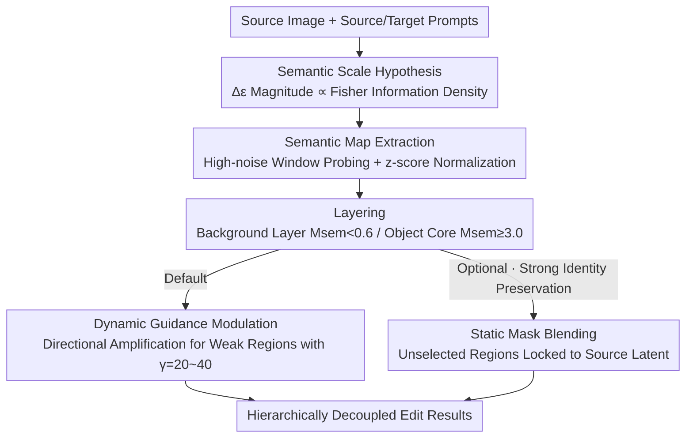

# Deconstructing Guidance: A Semantic Hierarchy for Precise Diffusion Model Editing

**Conference**: ICLR2026  
**OpenReview**: [https://openreview.net/forum?id=nLikuHmC98](https://openreview.net/forum?id=nLikuHmC98)  
**Code**: To be open-sourced (source code included in supplementary materials, public after paper publication)  
**Area**: Diffusion Models / Image Editing  
**Keywords**: Text-guided image editing, Classifier-Free Guidance, Semantic Scale, Fisher Information, Training-free

## TL;DR
This paper discovers that the **magnitude** of the "guidance difference vector" $\Delta\epsilon$ in CFG encodes the semantic scale of editing (objects = large magnitude, background = small magnitude). Using the Tweedie formula, this is proven to be an inevitable consequence of Fisher information density. Based on this, the training-free, plug-and-play Prism-Edit is proposed. By hierarchically deconstructing guidance signals and **directionally amplifying** suppressed background signals, it makes the long-standing challenge of "background modification" stable and controllable for the first time.

## Background & Motivation

**Background**: Text-guided diffusion image editing (SDEdit, Prompt-to-Prompt, DiffEdit, LEDITS++, etc.) is almost entirely built upon Classifier-Free Guidance (CFG). The mainstream approach addresses "**WHERE** to edit"—manipulating cross-attention maps or using guidance difference vectors to generate spatial masks to partition the image into "edit regions" and "preserved regions."

**Limitations of Prior Work**: These methods suffer from a persistent failure mode—**object editing is reliable, while background editing frequently fails**. For example, changing "an owl in the wild" to "at school" often leaves the scene unchanged or destroys the subject. Previously, this was attributed to engineering flaws and addressed with finer masks.

**Key Challenge**: The authors argue that the true bottleneck is not "where to edit," but the **structure of the guidance signal itself**. The guidance difference vector $\Delta\epsilon=\epsilon_\theta(x_t,c_\text{target})-\epsilon_\theta(x_t,c_\text{source})$ in CFG is non-uniform—it is naturally strong on information-dense objects and naturally weak on information-sparse backgrounds. Background editing failure is therefore not an accidental bug but an "information-theoretic necessity."

**Goal**: (1) Provide a first-principles explanation for why backgrounds are difficult to edit. (2) "Correct" the suppressed background guidance signals without retraining the model, allowing objects and backgrounds to be edited independently and controllably.

**Key Insight**: Reinterpret $\Delta\epsilon$ from a "spatial indicator" to a "semantic signal"—its **magnitude**, rather than its position, encodes a semantic hierarchy (object structure vs. style/background).

**Core Idea**: Link guidance magnitude $\|\Delta\epsilon\|$ to local Fisher information density via a "Semantic Scale Hypothesis," and transform editing into a signal processing problem involving hierarchical deconstruction, normalization, and directional amplification of the guidance signal.

## Method

### Overall Architecture

Prism-Edit is a training-free module that can be attached to any diffusion editor, consisting of **two stages**: first, **extracting a multi-layer semantic map** $M_\text{sem}$ from the model's own denoising dynamics; second, **applying the edit hierarchically** using this map (defaulting to dynamic guidance modulation, with optional static mask blending).

The core problem it addresses is that the magnitude of $\|\Delta\epsilon\|$ varies significantly across time steps, samples, and tasks (backgrounds are inherently weak, objects are inherently strong), making **absolute magnitudes incomparable**. Prism-Edit effectively levels this "information imbalance" using z-score normalization to obtain a scale-invariant semantic map. It then uses fixed relative thresholds (in units of $\sigma$) to partition the "background/style layer" and "object core layer," finally applying heavy amplification to the weak background layer while keeping the strong object layer unchanged.

### Key Designs

**1. Semantic Scale Hypothesis: Interpreting Guidance Magnitude as Fisher Information Density**

This is the theoretical foundation of the paper. Starting from the score function, under $\epsilon$-parameterization, the predicted noise is proportional to $\nabla_{x_t}\log p(x_t\mid c)$. The difference between two conditional predictions is thus proportional to the difference between two scores, merging into the gradient of a scalar field—the **log-likelihood ratio** of the target and source conditions:

$$\Delta\epsilon(x_t;c_1,c_2)\ \propto\ \nabla_{x_t}\log\frac{p(x_t\mid c_2)}{p(x_t\mid c_1)}.$$

That is, $\Delta\epsilon$ is a vector field pointing toward a more probable direction for the target condition, and $\|\Delta\epsilon\|$ reflects the steepness of this likelihood ratio terrain. The steepness is determined by the model's "certainty" about the clean image $x_0$, which is linked to posterior variance by the Tweedie formula. **High information density** regions like objects have sharp posteriors and low variance (the model is certain); a change in condition causes a drastic shift in the posterior mean. **Low information density** regions like backgrounds have flat posteriors and high variance (the model is hesitant); the same change in condition causes only a small displacement. Thus:

$$\|\Delta\epsilon(x_t;c_1,c_2)\|\ \propto\ \frac{\|\Delta\mu_t\|}{\sigma_t},\qquad \Delta\mu_t:=\mathbb{E}[x_0\mid x_t,c_2]-\mathbb{E}[x_0\mid x_t,c_1].$$

The authors further provide upper and lower bounds for $\|\Delta\epsilon\|^2$ expressed in terms of Gaussian KL divergence under local Gaussian posterior approximation (Theorem 1), neatly separating "mean shift" and "covariance mismatch" terms. They link the expected magnitude to Fisher divergence, concluding that $\|\Delta\epsilon\|^2 \propto$ local Fisher information density.

**2. Semantic Map Extraction: Leveling Information Imbalance with z-score Normalization**

Since background magnitudes are inherently small, using absolute thresholds inevitably classifies backgrounds as "needing no edit." This step makes magnitudes "comparable." Probing is performed within a **narrow high-noise window** (e.g., $t\in[900,800]$ for a 1000-step schedule), which maximizes semantic coverage while preserving structural plasticity. Within this window, $\Delta\epsilon$ is averaged over several steps and then subjected to element-wise z-score normalization:

$$\overline{\Delta\epsilon}=\frac{1}{N_\text{probe}}\sum_{i=1}^{N_\text{probe}}\Delta\epsilon_{t_i},\qquad M_\text{sem}=\frac{|\overline{\Delta\epsilon}|-\mu_{|\overline{\Delta\epsilon}|}}{\sigma_{|\overline{\Delta\epsilon}|}}.$$

After normalization, weak background signals are "pulled up" to a scale comparable to objects, and strong object signals do not overwhelm the image. This allows **fixed relative thresholds** to generalize across prompts and seeds. The authors observe that the **two extreme tails** of this semantic map correspond to the cleanest semantic signals. Two layers are defined: **background/style layer** $M_\text{sem}<0.6$ and **object core layer** $M_\text{sem}\ge 3.0$.

**3. Dynamic Guidance Modulation (Default): Directional Amplification for Low-Information Regions**

The default path is flexible: at each denoising step, the weight $W_{\text{sem},t}$ is **binarized** based on the instantaneous z-score of $\|\Delta\epsilon_t\|$ (using $<0.6\sigma$ for background editing and $\ge3.0\sigma$ for object editing). The guidance is then modulated element-wise:

$$\tilde{\epsilon}_\theta(x_t,c)=\epsilon_\theta(x_t,c_\text{src})+\gamma\cdot\big(\Delta\epsilon_t\odot W_{\text{sem},t}\big).$$

This enables **region-adaptive guidance scaling**: low-information, high-variance regions like backgrounds can be pushed aggressively with a large $\gamma$ (e.g., 20–40), while object regions are isolated by the mask. This compensates for the inherent Fisher information imbalance in diffusion guidance.

**4. Static Mask Blending (Optional): Hard Constraints for Strong Identity Preservation**

This is an optional, more conservative approach where the semantic map is thresholded into a coarse mask for "relaxed spatial constraints." It is intentionally loose to prevent edits from drifting into completely irrelevant areas without stifling semantic boundaries. Only when **strict identity preservation** is required is the high-magnitude object core $M_\text{sem}\ge3.0$ explicitly excluded. The predicted latent is mixed with the source latent:

$$x_{t-1}\leftarrow x^\text{pred}_{t-1}\odot M_\text{final}+x^\text{src}_{t-1}\odot(1-M_\text{final}),$$.

### Loss & Training
Prism-Edit is **completely training-free and model-agnostic**. It introduces no learnable parameters; all control signals are derived directly from the model's denoising dynamics. Hyperparameters vary by base model, but once set, they remain **invariant across datasets and prompts**.

## Key Experimental Results

The authors validate Prism-Edit on Stable Diffusion v1.5 / v3 and FLUX.1. Benchmarks include Wild-TI2I and ImageNet-R-TI2I. Metrics used are DINOv2 (semantic alignment), SSIM (structural preservation), and CLIP (text alignment).

### Main Results

For background editing, the authors introduce a composite metric to measure decoupling success:

$$\text{DINO/SSIM}=\frac{\text{DINOv2 (Object Similarity)}}{\text{SSIM (Background Preservation)}}.$$

Representative values for the "Sheep in wild → jungle" case from Figure 5(a) as guidance scale varies:

| Configuration | DINOv2 | SSIM | DINOv2/SSIM |
|------|--------|------|-------------|
| DDIM Inv. (scale 2) | 0.866 | 0.868 | 0.997 |
| DDIM Inv. (scale 10) | 0.762 | 0.619 | 1.232 |
| **Ours (scale 20)** | 0.863 | 0.691 | **1.249** |

Prism-Edit maintains high DINOv2 (preserving the object) while achieving the highest DINOv2/SSIM ratio (effective background change).

### Ablation Study / Key Findings

| Configuration | Phenomenon | Explanation |
|------|------|------|
| Full Prism-Edit | Clean object/background decoupling | Default dynamic modulation |
| High-magnitude (Object) only | Change object identity, background stays | Causal verification (Fig 8 Local level) |
| Low-magnitude (Background) only | Change background/style, object stays | Causal verification (Fig 8 Global level) |
| Large $\gamma$ background amplification | No artifacts, no object destruction | Binary mask isolation effective |

### Key Findings
- **Causal Separability**: Separately editing high-magnitude vs. low-magnitude signals specifically changes objects vs. backgrounds, proving that guidance magnitude causally corresponds to semantic scale.
- **CLIP Limitations**: CLIP prefers global changes. Baselines that change the whole image may have higher CLIP scores, but Prism-Edit achieves significantly higher DINO/SSIM by preserving unedited regions.
- **Plug-and-play**: As an external module, it corrects "semantic leakage" and "incomplete editing" in DDIM/DDPM Inversion, PnP, LEDITS++, and others.

## Highlights & Insights
- **Theorizing the Problem**: Transforming "background editing difficulty" from a tuning issue into a statistical necessity via the Tweedie formula and Fisher information.
- **Perspective Shift**: Moving from "WHERE" (masking) to "HOW" (signal modulation by magnitude).
- **z-score Normalization**: A simple but effective statistical solution to the problem of incomparable absolute magnitudes, enabling cross-prompt generalization.
- **Transferable Trick**: The probing-normalization-layering-modulation workflow can theoretically be applied to any CFG-dependent controllable generation task.

## Limitations & Future Work
- **Gaussian Posterior Assumption**: The theoretical derivation assumes Gaussian posteriors, which simplifies the proof but does not perfectly match the true diffusion process.
- **Manual Intent Specification**: Users must specify whether they are editing an object or background, and the method relies on fixed z-score thresholds.
- **Base Model Sensitivity**: Incremental gains depend on the underlying architecture; threshold adjustments may be needed for different base models.

## Related Work & Insights
- **vs. DiffEdit**: DiffEdit uses $\Delta\epsilon$ as a spatial signal for binary masks; Ours treats it as a **semantic signal** for gradient modulation.
- **vs. Attention Manipulation (Prompt-to-Prompt)**: These methods focus on WHERE via attention; Ours focuses on HOW via denoising dynamics, making them complementary.
- **vs. Inversion Editors**: Prism-Edit serves as a plug-and-play enhancement layer rather than a replacement.

## Rating
- Novelty: ⭐⭐⭐⭐⭐ Linking CFG magnitude to Fisher information density provides deep theoretical insight into background editing failure.
- Experimental Thoroughness: ⭐⭐⭐⭐ Solid validation across three base models and multiple baseline integrations.
- Writing Quality: ⭐⭐⭐⭐⭐ Clear progression from hypothesis to theory to method.
- Value: ⭐⭐⭐⭐ Training-free and model-agnostic solution for a practical pain point in image editing.

<!-- RELATED:START -->

## Related Papers

- [\[ICLR 2026\] SoftCFG: Uncertainty-guided Stable Guidance for Visual Autoregressive Model](softcfg_uncertainty-guided_stable_guidance_for_visual_autoregressive_model.md)
- [\[ICLR 2026\] A Noise is Worth Diffusion Guidance](a_noise_is_worth_diffusion_guidance.md)
- [\[CVPR 2026\] MapRoute: Semantic Routing for Precise Concept Erasure with Mapper](../../CVPR2026/image_generation/maproute_semantic_routing_concept_erasure.md)
- [\[CVPR 2026\] SketchAssist: A Practical Assistant for Semantic Edits and Precise Local Redrawing](../../CVPR2026/image_generation/sketchassist_a_practical_assistant_for_semantic_edits_and_precise_local_redrawin.md)
- [\[ICLR 2026\] Learn to Guide Your Diffusion Model](learn_to_guide_your_diffusion_model.md)

<!-- RELATED:END -->
