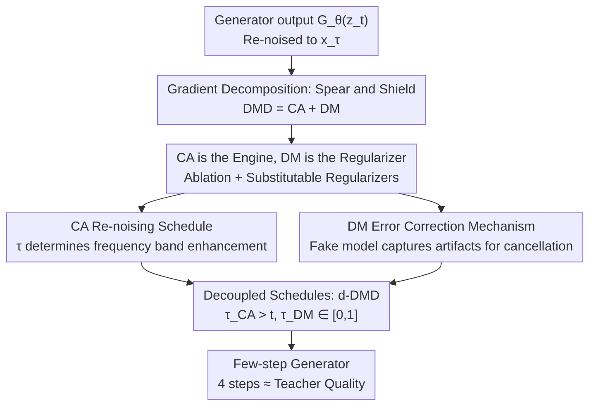

# Decoupled DMD: CFG Augmentation as the Spear, Distribution Matching as the Shield

**Conference**: ICLR2026  
**OpenReview**: [https://openreview.net/forum?id=jBztvOiCKE](https://openreview.net/forum?id=jBztvOiCKE)  
**Code**: https://github.com/Tongyi-MAI/Z-Image  
**Area**: Diffusion Models / Image Generation  
**Keywords**: Diffusion Distillation, DMD, CFG, Few-step Generation, Distribution Matching

## TL;DR
The authors perform a rigorous gradient decomposition of the widely used DMD distillation objective and discover that the actual "engine" compressing multi-step diffusion models into few-step generators is not distribution matching, but a long-overlooked CFG Augmentation term. Distribution matching acts merely as a "regularizer" for stable training. Based on this "Spear/Shield" division of labor, they propose decoupled re-noising schedules (d-DMD), achieving consistent performance gains across SDXL, Lumina, and 6B large models.

## Background & Motivation
**Background**: While diffusion models offer high quality, their sampling is slow, requiring dozens to hundreds of network evaluations. Distilling them into few-step or even one-step generators is a mainstream acceleration path. Score-based distillation methods (Diff-Instruct, DMD, and their variants) are particularly favored for their SOTA performance and elegant theoretical framework, interpreted as minimizing the Integral KL divergence between the student distribution $p_\text{fake}$ and the teacher distribution $p_\text{real}$: $L_\text{IKL}=\int_0^1 \mathrm{KL}(p_{\text{real},\tau}\,\|\,p_{\text{fake},\tau})\,d\tau$.

**Limitations of Prior Work**: A theoretical "dark cloud" hangs over this framework: Classifier-Free Guidance (CFG). Theoretically, the ideal way to estimate the real score should be the teacher model's own prediction, without CFG. However, empirical evidence overwhelmingly shows that DMD-like methods only yield good results on complex text-to-image tasks with a **very large CFG scale**. Furthermore, CFG is applied only to the real model and not the fake model; this "asymmetric" usage creates a glaring gap between theory and practice, undermining the integrity of the "matching two distributions" derivation.

**Key Challenge**: Since CFG is a necessary condition for success but remains outside the theoretical framework, current understanding of "why DMD succeeds" is likely incomplete or incorrect—success may not stem from distribution matching itself.

**Goal**: To redefine the working principle of DMD algorithms by identifying which specific term drives the "multi-step to few-step" conversion and the role CFG plays in the process.

**Key Insight**: Instead of starting from scratch, the authors perform a rigorous algebraic decomposition of the DMD gradient **actually used in practice** (with real score CFG) to identify its constituent mechanisms.

**Core Idea**: The DMD gradient is decomposed into two terms: the overlooked **CFG Augmentation (CA, the Spear)**, which is the core engine for few-step conversion, and the theoretically rigorous **Distribution Matching (DM, the Shield)**, which acts as a regularizer to stabilize training in complex tasks. Recognizing this division allows for principled improvements to both terms.

## Method

### Overall Architecture
The paper does not propose a new network but "dissects" and "reassembles" DMD. The logic flow is: ① Substitute the CFG definition into the practical DMD gradient and perform algebraic rearrangement to obtain CA and DM terms; ② Identify CA as the "engine" and DM as the "regularizer" through ablation, verifying that DM can be replaced by simpler statistical regularizers or GANs; ③ Analyze the re-noising time $\tau$ and frequency components handled by each term; ④ Decouple the single shared $\tau$ into two independent schedules to create the d-DMD (Decoupled-Hybrid) algorithm.

Using flow matching notation where $t=0$ is pure noise and $t=1$ is clean data: the generator $G_\theta$ takes input $z_t$ to produce a prediction $G_\theta(z_t)$, which is re-noised to $x_\tau$ at level $\tau$ and fed to two score models: the real score $s^\text{real}$ and the synchronously trained fake model $s^\text{fake}_\text{cond}$.

### Key Designs

**1. Gradient Decomposition: Splitting DMD into "Spear" (CA) and "Shield" (DM)**

The practical DMD gradient is typically credited to distribution matching. The authors substitute the CFG definition $s^\text{real}_\text{cfg}(x_\tau)=s^\text{real}_\text{uncond}+\alpha\,(s^\text{real}_\text{cond}-s^\text{real}_\text{uncond})$ (where $\alpha>1$) into the practical gradient. Rearrangement yields two distinct terms:

$$\nabla_\theta L_\text{DMD}=\mathbb{E}\Big[-\big(\underbrace{s^\text{real}_\text{cond}-s^\text{fake}_\text{cond}}_{\Delta_\text{real-fake}\ (\text{DM})}+\underbrace{(\alpha-1)(s^\text{real}_\text{cond}-s^\text{real}_\text{uncond})}_{\Delta^\text{real}_\text{cfg}\ (\text{CA})}\big)\tfrac{\partial G_\theta(z_t)}{\partial\theta}\Big]$$

The first term, $\Delta_\text{real-fake}$, corresponds to theoretical distribution matching. The second term, $\Delta^\text{real}_\text{cfg}$, applies an amplified CFG signal directly as a gradient to the student's output—independent of the fake model. This reframes CFG from a "heuristic trick" to an independent mechanism parallel to distribution matching.

**2. The Spear is the Engine, Shield is the Stabilizer**

Ablations reveal: CA alone can efficiently convert multi-step models into few-step generators with results highly similar to full DMD. DM alone lags significantly in complex tasks. However, training with CA alone is unsustainable, leading to over-saturation and high-frequency noise. Adding DM eliminates these issues, ensuring stable training and higher final quality. Thus, **few-step conversion is driven by CA (the "engine")**, while **DM acts as the "regularizer"** to prevent divergence and suppress artifacts.

**3. Dissecting the Engine: $\tau$ in CA Determines Frequency Enhancement**

Using a one-step generator as a probe, the authors varied the range of $\tau$. Constraining $\tau$ to the **noisy end** (e.g., $[0, 0.05]$) causes CA to enhance low-frequency information (composition); extending $\tau$ to **cleaner levels** introduces high-frequency details (textures). Thus, **applying CA at a specific noise level $\tau$ primarily enhances the corresponding image content**. In multi-step generation, if $z_t$ has already resolved information below $t$, using CA with $\tau < t$ is redundant or harmful. Hence, the optimal CA schedule should be focused: $\tau > t$.

**4. DM Error Correction and Decoupled Schedules (d-DMD)**

DM corrects errors by learning the student's characteristic failure modes. When images with artifacts are re-noised, the real model ignores the artifacts while the fake model (tracking the student distribution) retains them. In the gradient $s^\text{real}_\text{cond}-s^\text{fake}_\text{cond}$, the fake term acts as a negative component that cancels out artifacts. Since DM requires a "global perspective" to fix low-frequency artifacts (like over-saturation), its optimal schedule should **always cover the full noise range** $\tau_\text{DM} \in [0, 1]$, independent of current step $t$. This leads to the **Decoupled-Hybrid (Config ④): $\tau_\text{CA} > t, \tau_\text{DM} \in [0, 1]$**.

$$\nabla_\theta L_\text{d-DMD}=\mathbb{E}\Big[-\big((s^\text{real}_\text{cond}(x_{\tau_\text{DM}})-s^\text{fake}_\text{cond}(x_{\tau_\text{DM}}))+(\alpha-1)(s^\text{real}_\text{cond}(x_{\tau_\text{CA}})-s^\text{real}_\text{uncond}(x_{\tau_\text{CA}}))\big)\tfrac{\partial G_\theta(z_t)}{\partial\theta}\Big]$$

## Key Experimental Results

### Main Results
4-step SDXL distillation evaluated on 10k COCO2014-val prompts:

| Method | FID↓ | CLIP-S↑ | ImageReward↑ | HPS V2.1↑ | HPS V3↑ |
|------|------|---------|--------------|-----------|---------|
| LCM | 22.27 | 31.71 | 39.56 | 28.00 | 6.45 |
| SDXL-Turbo | 27.27 | 32.16 | 46.09 | 29.83 | 9.09 |
| Lightning | 24.49 | 32.31 | 57.48 | 30.30 | 9.48 |
| PCM | 24.13 | 32.52 | 64.73 | 30.76 | 9.46 |
| DMD2 | 18.95 | 33.14 | 71.01 | 30.64 | 9.64 |
| **Ours (Decoupled)** | **17.80** | **33.62** | **78.61** | 30.34 | **9.79** |

Lumina-Image-2.0 schedule ablation:

| Configuration | DPG Global | DPG Overall | HPS v2.1 | HPS V3 |
|------|-----------|-------------|----------|--------|
| Original (50-step teacher) | 84.50 | 87.20 | 30.20 | 9.62 |
| ① $\tau_{CA}=\tau_{DM} \in [0,1]$ (DMD) | 80.22 | 83.90 | 30.61 | 10.34 |
| ④ **$\tau_{CA}>t, \tau_{DM} \in [0,1]$ (Ours)** | 91.40 | **85.85** | **32.29** | **11.59** |

### Ablation Study

| Configuration | Key Phenomenon | Explanation |
|------|---------|------|
| CA Only | Efficient conversion, but over-saturation/noise occurs. | CA is the engine but unsustainable. |
| DM Only | Significantly lags in complex tasks. | DM alone cannot drive conversion. |
| CA + Mean-Var KL | Stable training but lower quality than DM. | Proves DM is a regularizer and is replaceable. |
| CA + GAN | Controls variance but collapses after 4k steps. | GAN regularizers are more complex/unstable. |

### Key Findings
- Improvements stem from the **range** of the schedule ($\tau > t$) rather than the act of decoupling itself.
- Decoupled-Hybrid (④) achieved a 100% model-level preference rate in user studies.
- On a 6B internal large model, a 4-step generator matched the 80-NFE teacher quality, reducing NFE by 95%.

## Highlights & Insights
- The realization that DMD's success comes from CFG Augmentation rather than distribution matching is a pivotal narrative shift.
- The "engine vs. regularizer" role is rigorously verified using three sets of ablations and three alternative regularizers.
- The frequency-based insight—CA focuses on specific bands while DM needs a global view—offers high transfer value for other distillation or regularization scenarios.
- The method is virtually zero-cost: no network changes, no additional data, just splitting a shared schedule into two.

## Limitations & Future Work
- The fundamental question remains: **Why does CA have such a strong ability to convert models into few-step generators?** A rigorous theoretical explanation is still missing.
- Conclusions are based on complex tasks (text-to-image) requiring large CFG; the dominance of CA may vary in simple tasks (e.g., low-res CIFAR).

## Related Work & Insights
- **vs DMD / DMD2**: Instead of replacing DMD, this work reinterprets it. DMD2 uses a single shared schedule; this work shows the decoupled schedule Outperforms it using the same budget.
- **vs Diff-Instruct**: Matches the insight that score-matching is more stable than GANs, but specifically identifies it as the "shield."
- **vs GAN-based Distillation**: Views GANs as a potential but less stable alternative regularizer compared to DM.

## Rating
- Novelty: ⭐⭐⭐⭐⭐ Reinterpreting DMD success via gradient decomposition is highly novel.
- Experimental Thoroughness: ⭐⭐⭐⭐ Extensive ablations and multi-model verification.
- Writing Quality: ⭐⭐⭐⭐⭐ The "Spear/Shield" narrative is exceptionally clear.
- Value: ⭐⭐⭐⭐⭐ Provides both theoretical insight and a zero-cost practical performance gain.

<!-- RELATED:START -->

## Related Papers

- [\[ICCV 2025\] Learning Few-Step Diffusion Models by Trajectory Distribution Matching](../../ICCV2025/image_generation/learning_few-step_diffusion_models_by_trajectory_distribution_matching.md)
- [\[ICLR 2026\] SenseFlow: Scaling Distribution Matching for Flow-based Text-to-Image Distillation](senseflow_scaling_distribution_matching_for_flow-based_text-to-image_distillatio.md)
- [\[ICLR 2026\] Bridging the Distribution Gap to Harness Pretrained Diffusion Priors for Super-Resolution](bridging_the_distribution_gap_to_harness_pretrained_diffusion_priors_for_super-r.md)
- [\[ICCV 2025\] Unsupervised Imaging Inverse Problems with Diffusion Distribution Matching](../../ICCV2025/image_generation/unsupervised_imaging_inverse_problems_with_diffusion_distribution_matching.md)
- [\[ICLR 2026\] Decoupled MeanFlow: Turning Flow Models into Flow Maps for Accelerated Sampling](decoupled_meanflow_turning_flow_models_into_flow_maps_for_accelerated_sampling.md)

<!-- RELATED:END -->
