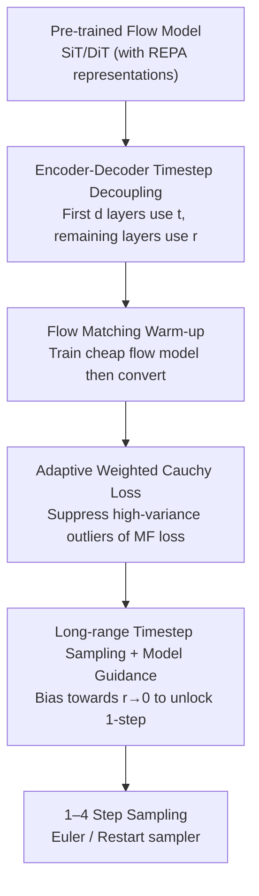

# Decoupled MeanFlow: Turning Flow Models into Flow Maps for Accelerated Sampling

**Conference**: ICLR2026  
**OpenReview**: [https://openreview.net/forum?id=P4VsQexEPe](https://openreview.net/forum?id=P4VsQexEPe)  
**Code**: https://github.com/kyungmnlee/dmf  
**Area**: Diffusion Models / Flow Model Accelerated Sampling  
**Keywords**: Flow Map, MeanFlow, Few-step Sampling, Diffusion Transformer, Encoder-Decoder Decoupling  

## TL;DR
A **pre-trained** flow model (SiT/DiT) is reinterpreted as an encoder-decoder: the encoder processes only the current timestep $t$, while the decoder processes only the next timestep $r$. Without modifying the architecture, it is converted into a "flow map" that predicts average velocity. After fine-tuning for a few dozen epochs, it generates high-quality images on ImageNet 256×256 with FID=2.16 (1-step) / 1.51 (4-steps), achieving over 100x acceleration compared to the original flow model.

## Background & Motivation
**Background**: Diffusion and flow models are the primary drivers of visual generation, but they rely on numerical ODE solvers (e.g., Euler method) for step-by-step denoising, often requiring dozens to hundreds of steps. To accelerate this, the community has explored two paths: 1) Consistency models, which enforce consistency between denoising outputs of adjacent timesteps to enable 1–2 step generation but struggle to scale beyond 2 steps; 2) **Flow maps**, which directly model the **average velocity** $u_\theta(x_t, t, r)$ between two timesteps. MeanFlow (Geng et al., 2025a) provided an elegant generalization of flow matching, proving that flow maps can approximate the quality of standard flow models.

**Limitations of Prior Work**: While flow maps are effective, their **architectural designs remain crude**. Methods like MeanFlow inject the "target timestep $r$" information **throughout the entire** Diffusion Transformer—implicitly assuming both the encoder and decoder require $r$. Consequently, using a flow map often requires adding extra timestep embeddings for $r$ and modifying conditional injection methods, which **breaks compatibility with pre-trained flow models**. Existing SiT/DiT weights cannot be used directly, necessitating training the flow map from scratch, which is computationally expensive and difficult to converge.

**Key Challenge**: Injecting $r$ into the encoder is actually **redundant**. The encoder's responsibility is to extract semantic representations $h_t$ from the noisy input $x_t$; the "future target timestep" is irrelevant at this stage. Only the decoder requires $r$ to determine how to predict the average velocity toward that target. Current methods fail to distinguish between the two, wasting strong representations already learned by flow models while forcing unnecessary architectural changes.

**Goal**: Whether any pre-trained flow model can be "reinterpreted" as a flow map **without architectural changes**, thereby enabling a more efficient paradigm: "pre-train an inexpensive flow model, then cheaply convert and fine-tune it as a flow map."

**Key Insight**: Drawing from observations that "diffusion/flow models implicitly perform representation learning" (REPA representation alignment, regularization, masked modeling), a flow model $v_\theta(x_t,t)$ is viewed as a composition of an encoder $f_\theta$ and a decoder $g_\theta$, $v_\theta = g_\theta \circ f_\theta$. Since the encoder's representation is crucial for generation quality, it should be equally vital for flow maps—provided $r$ does not contaminate the encoding stage.

**Core Idea**: **Decoupled timestep conditioning**—the encoder processes only $t$ and the decoder processes only $r$, i.e., $u_\theta(x_t,t,r)=g_\theta(f_\theta(x_t,t),r)$. This approach introduces no new parameters (reusing the same timestep embedding layer) and "seamlessly" converts pre-trained flow models into flow maps. This is termed **Decoupled MeanFlow (DMF)**.

## Method

### Overall Architecture
DMF's framework involves: **Taking a pre-trained flow model, partitioning it by layers into an encoder and a decoder, feeding the target timestep $r$ only to the decoder to obtain a flow map, and fine-tuning with stability techniques for a few dozen epochs to enable 1–4 step generation.**

Specifically, the $\ell$ blocks of a Diffusion Transformer are split at depth $d$: the first $d$ layers serve as the encoder $f_\theta$ (conditioned only on $t$), and the remaining $\ell-d$ layers serve as the decoder $g_\theta$ (conditioned only on $r$). The forward pass of the flow map is $u_\theta(x_t,t,r)=g_\theta(f_\theta(x_t,t),\,r)$. Remarkably, **even without fine-tuning**, DMF partitioned at an appropriate $d$ can outperform the original SiT flow model in FID (Figure 3a/3b). Building on this, training optimizes a combination of flow matching (FM) loss and MeanFlow (MF) loss using a two-stage strategy: "FM warm-up → convert to DMF → fine-tune with MF loss," complemented by an adaptive weighted Cauchy loss and customized timestep sampling.

### Key Designs

**1. Encoder-Decoder Timestep Decoupling: Placing $r$ Only Where Necessary**

This is the core innovation. MeanFlow's injection of $r$ into the entire transformer is redundant and breaks compatibility. By viewing the flow model as $v_\theta=g_\theta\circ f_\theta$, where $h_t=f_\theta(x_t,t)$ is the encoded representation and $v_\theta(x_t,t)=g_\theta(h_t,t)$, the authors assume the encoding stage does not need the future $r$ and the decoding stage no longer needs the original $t$. Thus, they **remove $r$ from the encoder and $t$ from the decoder**, yielding $u_\theta(x_t,t,r)=g_\theta(f_\theta(x_t,t),r)$. Implementing this following REPA’s layer split ($d=22$ for a 24-layer model) and **reusing the same timestep embedding layer** for both $t$ and $r$ allows for **zero additional parameters and no architectural changes**. Its effectiveness stems from the fact that the flow model's encoder already learned strong semantic representations; DMF transfers this to the flow map, which only needs to learn velocity prediction on the decoder side. Experiments show that DMF consistently outperforms the original SiT across various denoising steps (16 to 128), validating that "**your flow model is already a flow map in disguise.**"

**2. Flow Matching Warm-up + Two-Stage Training: Splitting Expensive Training**

Training flow maps from scratch is costly: MF loss requires Jacobian-vector products (JVP) and model guidance targets, doubling forward passes and memory usage. The authors propose **training a standard flow model with FM loss first, then converting it to DMF and fine-tuning with MF loss**. During training, two **independent** sets of noise and timesteps are sampled for each $x_0$: $(\epsilon_{\text{FM}},t_{\text{FM}})$ for FM loss and $(\epsilon_{\text{MF}},t_{\text{MF}},r_{\text{MF}})$ for MF loss. A key finding is that **pre-trained flow models adapt to flow maps extremely quickly**, and stronger representations (longer training or REPA) lead to faster adaptation. Figure 4 shows that a DMF fine-tuned from a SiT-L/2 model (800K steps) achieves a better 1-step FID with **lower total training FLOPs** than training from scratch.

**3. Adaptive Weighted Cauchy Loss: Taming MF Loss Variance**

MF loss exhibits high variance that can destabilize training. The authors replace the standard MSE with a Cauchy (Lorentzian) loss $L_{\text{Cauchy}}(\theta)=\log\!\big(L_{\text{MF}}(\theta)+c\big)$ ($c>0$), which is approximately linear near zero but strongly suppresses large outliers, similar to Huber/$\ell_1$ robust losses. Furthermore, they model the residual distribution of MSE for each $(t,r)$ as Cauchy and introduce an adaptive weighting function $\phi(t,r)$:

$$L_{\text{DMF}}(\theta)=\mathbb{E}_{x_t,r}\Big[\log\big(e^{-\phi(t,r)}\|u_\theta-v_{\text{tgt}}-(r-t)\tfrac{du_\theta}{dt}\|^2+1\big)+\tfrac{\phi(t,r)}{2}\Big].$$

This automatically normalizes the difficulty of different $(t,r)$ pairs, ensuring that high-residual timesteps do not derail training stability.

**4. Long-range Timestep Sampling + Model Guidance: Unlocking 1-Step Generation**

Flow map training requires pairs where $t>r$. While basic approaches sample two logit-normal values, the authors observed that DMF predicts accurately when $r \approx t$. The challenge for 1-step quality lies in **long-range** pairs where $t$ and $r$ are far apart (especially $r \to 0$). They **modify the proposal distribution** to sample more pairs with $r$ near 0. Additionally, **Model Guidance (MG)**—modifying target velocity to $v_{\text{tgt}}=v+\omega(v_\theta(x_t,t,y)-v_\theta(x_t,t))$ ($\omega\in(0,1)$) with stop-gradients—is highly effective for flow maps, enabling high-quality 1-NFE generation without the doubled inference cost of CFG. During sampling, both Euler and restart samplers are supported, performing comparably across various metrics.

### Loss & Training
Total loss = FM loss + MF loss (both using adaptive weighted Cauchy forms), with independent noise/timesteps for each. The process begins with FM warm-up (e.g., 160 epochs), followed by MF loss fine-tuning (40–80 epochs). The MF target uses $u_{\text{tgt}}=v+(r-t)\frac{du_\theta}{dt}$ with stop-gradients to avoid JVP second-order backpropagation. BF16 mixed precision and customized Flash-Attention kernels for JVP are used to manage memory.

## Key Experimental Results

### Main Results
Benchmarks for few-step generation on ImageNet 256×256 and 512×512:

| Dataset | Method | NFE | FID ↓ | Note |
|--------|------|-----|-------|------|
| 256×256 | MF-XL/2+ (MeanFlow) | 2 | 2.20 | Previous flow map SOTA |
| 256×256 | **DMF-XL/2+ (Ours)** | 1 | **2.16** | Exceeds most competitors in 1 step |
| 256×256 | **DMF-XL/2+ (Ours)** | 2 | **1.64** | |
| 256×256 | **DMF-XL/2+ (Ours)** | 4 | **1.51** | Approaches SiT+REPA quality with 100x fewer NFEs |
| 256×256 | SiT-XL/2+REPA† | 434 | 1.37 | Full flow model upper bound |
| 512×512 | sCD / EDM2, etc. | Multi | 1.25–1.81 | Prior few-step/full-step competitors |
| 512×512 | **DMF-XL/2+ (Ours)** | 1 | **2.12** | |
| 512×512 | **DMF-XL/2+ (Ours)** | 2 | **1.75** | Outperforms comparable few-step methods |

### Ablation Study
ImageNet 256×256, SiT-L/2 (400K) to DMF fine-tuning (24 total layers):

| Config | Depth | MG | REPA | 1-step FID ↓ | 2-step FID ↓ |
|------|-------|----|----|-------------|-------------|
| MF-L/2 (Baseline) | - | ✗ | ✗ | 20.6 | 18.1 |
| DMF-L/2 | 18 | ✗ | ✗ | 19.3 | 17.3 |
| MF-L/2 | - | ✔ | ✗ | 5.27 | 4.09 |
| DMF-L/2 | 18 | ✔ | ✗ | 4.53 | 3.58 |
| MF-L/2 | - | ✔ | ✔ | 3.65 | 2.63 |
| **DMF-L/2** | **18** | ✔ | ✔ | **3.10** | **2.51** |

### Key Findings
- **Decoupling provides intrinsic gains**: DMF outperforms MF at various depths; $d=18$ (6 decoder layers) is optimal, suggesting a large encoder and concise decoder are preferable.
- **Representation quality is critical**: Incorporating REPA improves both MF and DMF, but DMF benefits more (3.65 → 3.10), confirming the importance of encoder representations.
- **MG is essential for 1-step generation**: Without MG, 1-step FID remains between 19–21; adding MG drops it to 3–5.
- **Longer warm-up is more efficient**: Fine-tuning from an 800K-step SiT uses fewer total FLOPs and achieves better 1-step FID than training from scratch or shorter warm-ups.
- Denoising at 8 steps with a frozen encoder and fine-tuned decoder reaches FID=1.76, but 1-step generation still requires joint optimization of the encoder.

## Highlights & Insights
- **"Zero-Shot" conversion is counter-intuitive**: Simply splitting a trained flow model by layers and providing $r$ only to the decoder **without fine-tuning** can outperform the base model. This implies flow models inherently possess flow map capabilities that DMF merely extracts.
- **The essence of decoupling is avoiding "representation pollution"**: The core trick is **subtraction** rather than addition (removing $r$ from the encoder and $t$ from the decoder), achieving zero parameter overhead and architectural compatibility.
- **Transferable logic**: This paradigm of "partitioning a pre-trained large model into encoder/decoder and injecting conditions only where needed" can be extended to other scenarios requiring new conditions without architectural changes (e.g., video flow maps, controllable generation).
- **Resource allocation insight**: Spending budget on "pre-training cheap models + low-cost transfer" is more efficient than "direct training of expensive capabilities."

## Limitations & Future Work
- **Frozen encoder limits 1-step performance**: Fine-tuning only the decoder restricts 1-step results; the encoder must be jointly fine-tuned for the best extreme few-step quality.
- **Dependency on pre-training quality**: Gains are highly dependent on the encoder's representation quality (REPA, training duration).
- **Scope limited to ImageNet**: Experiments focus on class-conditional ImageNet; effectiveness in text-to-image or video domains remains to be verified.
- **Training overhead for JVP/MG**: Although cheaper than full flow map training, JVP and MG targets still require specialized kernels.
- **Future directions**: Automated selection of optimal depth $d$, extending decoupling to other modalities, and exploring lightweight joint fine-tuning for reduced compute.

## Related Work & Insights
- **vs. MeanFlow (Geng et al., 2025a)**: MeanFlow injects $r$ throughout the transformer and typically trains from scratch; DMF isolates $r$ in the decoder and reuses weights, achieving lower FID (1-step 2.83 vs 3.43) with fewer FLOPs.
- **vs. Consistency Models (CM)**: CM rely on adjacent-step consistency for 1–2 steps but struggle beyond that; DMF uses an average velocity flow map that scales smoothly from 1 to 4 steps.
- **vs. SiT-XL/2+REPA (Yu et al., 2025)**: REPA improves representation quality but still requires hundreds of steps; DMF converts these strong encoders into flow maps to achieve comparable quality in 1–4 steps (100x speedup).
- **vs. CFG**: Standard CFG doubles inference cost; DMF integrates Model Guidance into training, achieving high quality in 1 NFE without the doubling cost.

## Rating
- Novelty: ⭐⭐⭐⭐⭐ The perspective of "architecture-free, training-light conversion of flow models to flow maps" is elegant and counter-intuitive.
- Experimental Thoroughness: ⭐⭐⭐⭐⭐ Comprehensive ImageNet 256/512 benchmarks and systematic ablations.
- Writing Quality: ⭐⭐⭐⭐ Clear motivation and logical flow, though some derivations are relegated to appendices.
- Value: ⭐⭐⭐⭐⭐ Sets a new few-step SOTA while remaining compatible with existing community weights.

<!-- RELATED:START -->

## Related Papers

- [\[ICLR 2026\] Joint Distillation for Fast Likelihood Evaluation and Sampling in Flow-based Models](joint_distillation_for_fast_likelihood_evaluation_and_sampling_in_flow-based_mod.md)
- [\[ICLR 2026\] AlphaFlow: Understanding and Improving MeanFlow Models](alphaflow_understanding_and_improving_meanflow_models.md)
- [\[ICLR 2026\] Generalised Flow Maps for Few-Step Generative Modelling on Riemannian Manifolds](generalised_flow_maps_for_few-step_generative_modelling_on_riemannian_manifolds.md)
- [\[ICLR 2026\] Intention-Conditioned Flow Occupancy Models](intention-conditioned_flow_occupancy_models.md)
- [\[ICLR 2026\] UniEdit-Flow: Unleashing Inversion and Editing in the Era of Flow Models](uniedit-flow_unleashing_inversion_and_editing_in_the_era_of_flow_models.md)

<!-- RELATED:END -->
