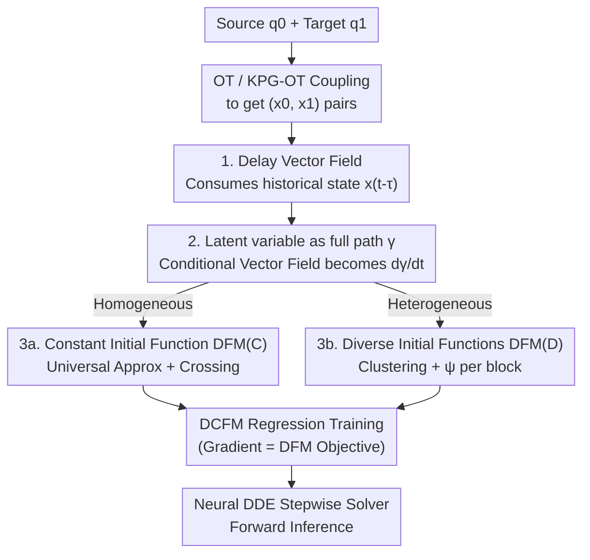

# Delay Flow Matching

**Conference**: ICLR 2026  
**OpenReview**: [https://openreview.net/forum?id=6lH1XblLpo](https://openreview.net/forum?id=6lH1XblLpo)  
**Code**: To be confirmed  
**Area**: Generative Models / Flow Matching / Distribution Transfer  
**Keywords**: Flow Matching, Delay Differential Equations (DDE), Trajectory Crossing, Heterogeneous Distributions, Single-cell Trajectory Inference

## TL;DR
The authors replace the Ordinary Differential Equation (ODE) underlying Flow Matching (FM) with a **Delay Differential Equation (DDE)**. By making the vector field dependent on historical states, the framework naturally supports trajectory crossings, precise transfer between heterogeneous distributions, and modeling of delayed dynamical systems. It outperforms the ODE-based FM on synthetic data, single-cell trajectory inference, and image generation.

## Background & Motivation

**Background**: Flow Matching (FM) is a predominant method for training Continuous Normalizing Flows (CNFs). It models the transfer from a source distribution to a target distribution as a Neural ODE flow map, trained efficiently via regression against an explicitly constructed conditional vector field (simulation-free). Variants like rectified flow and stochastic interpolants follow the same principle. Coupled with Optimal Transport (OT) or Keypoint-Guided OT (KPG-OT) for source-target coupling, FM has achieved success in image generation, molecular design, and single-cell trajectory inference.

**Limitations of Prior Work**: The backbone of FM is an ODE, whose solutions follow a fundamental rule: **trajectories cannot cross in the augmented phase space $(t,x)$** (otherwise, a single point would have two distinct velocity directions, violating the uniqueness of solutions). This leads to three specific issues: ① When the task-required coupling strategy itself produces trajectory crossings (e.g., flipping a Gaussian via $x \to -x$), ODE-FM "re-wires" the target at intersection points (learning a rectified flow), failing to maintain the specified transfer strategy; ② When the source distribution has $M$ connected components and the target has $N > M$, a continuously differentiable ODE flow cannot precisely split one mass into many, inevitably depositing mass in undesired regions; ③ When snapshot data originates from a real system with time delays, ODE-FM fails to recover the delay term, leading to inaccurate interpolation or extrapolation.

**Key Challenge**: The ODE vector field only considers the "current state $x(t)$," limiting its expressive power within the bounds of Lipschitz continuity—it has no mechanism to "distinguish two trajectories that collide at a point but arrived from different paths." Conversely, many real-world systems (neurodynamics, gene autoregulation, population dynamics) operate based on **delayed feedback**, making them inherently DDEs rather than ODEs.

**Goal**: To create a generative framework capable of solving trajectory crossing, heterogeneous distribution transfer, and delayed dynamics simultaneously, without relying on additional auxiliary latent variables or elaborately designed "crossing-avoidance" transport paths.

**Key Insight**: Since the failure of ODEs stems from "only looking at the present," the vector field should **also look at the past** $x(t-\tau)$. In delay dynamics, even if two trajectories collide at $x$, their distinct histories $x(t-\tau)$ allow for different velocity directions—resolving the "ambiguity" at intersection points via historical information.

**Core Idea**: Replace the probability flow of ODEs with the probability flow of **Delay Differential Equations (DDEs)** for distribution transfer, termed Delay Flow Matching (DFM).

## Method

### Overall Architecture

DFM upgrades the carrier of FM from a Neural ODE to a **Neural DDE**. A DDE with a single delay term takes the form:

$$\frac{dx(t)}{dt} = u[t, x(t), x(t-\tau)],\quad t\in[0,T],\qquad x(h)=\psi(h),\ h\in[-\tau,0],$$

The key differences from an ODE are twofold: the vector field $u$ consumes an additional **historical state** $x(t-\tau)$, and the initial condition is no longer a single point $x_0$ but an **initial function** $\psi(h)$ over the interval $[-\tau,0]$. These "extra degrees of freedom" correspond to the two classes of problems addressed: the historical term enables trajectory crossing and recovery of delay dynamics, while the initial function handles heterogeneous distributions.

For training, DFM follows the FM regression framework but targets a vector field with a delay term. Since directly regressing the marginal vector field $u(t,x,x_\tau)$ is intractable (it involves integration over the joint probability flow), the authors introduce a latent variable $z$—akin to Conditional FM (CFM)—modeling the target vector field as a mixture of conditional vector fields $u(t,x,x_\tau \mid z)$. This yields the trainable **Delay Conditional FM (DCFM) objective**:

$$L_{\text{DCFM}}(\theta)=\mathbb{E}_{t,q(z),q^\circ(\psi),\,p(x,t;x_\tau,t-\tau\mid z,\psi)}\big\|v(t,x,x_\tau;\theta)-u(t,x,x_\tau\mid z)\big\|^2.$$

The authors prove (Prop. 4.2) that the gradients of this computable DCFM objective are **consistent** with the true DFM objective. Thus, training DCFM is equivalent to training DFM—a core guarantee extended from CFM. After training, samples are generated by forward integration using a piecewise ODE solver for Neural DDEs, starting from $q_0$ with initial functions sampled from $q^\circ(\psi)$.

The framework revolves around three choices: **how to select the latent variable $z$** (determining the conditional vector field), **how to select the initial function $\psi$** (determining the ability to handle heterogeneity), and the resulting two versions: **DFM(C)** and **DFM(D)**.

### Key Designs

**1. Delay Vector Field: Disambiguating Trajectory Crossings via History**

This is the fundamental departure from all ODE-FM variants. The failure of ODE-FM is formalized in Prop. 3.1: as long as the vector field is Lipschitz continuous in $x$, trajectories cannot cross in phase space; therefore, any coupling inducing crossing (e.g., $x \to -x$) cannot be accurately maintained. DFM introduces $u(t,x(t),x(t-\tau))$, where the velocity is determined not just by the current position but by **where it came from**. Consequently, two trajectories colliding at a point can diverge in different directions because their histories $x(t-\tau)$ differ—crossings are permitted. A toy example in the paper illustrates this: flipping a Gaussian via $x \to -x$ has an exact DDE solution $\dot{x}=-2x(t-1)=-2x_0$. DFM(C) learns exactly this behavior of "selecting directions at crossings using history." Furthermore, when snapshot data inherently comes from a delay system (e.g., biological autoregulation motifs, spiral DDEs), only a delay-aware vector field can recover the true dynamics; ODE-FM fails catastrophically in crossing regions.

**2. Latents as "Full Paths" rather than Endpoints: Simplifying the Conditional Vector Field**

In ODE-CFM, using endpoints $z:=(x_0,x_1)$ as latents suffices because an ODE conditional path only requires endpoints. However, DFM needs to construct the **joint** conditional probability path for $x(t)$ and $x(t-\tau)$. Endpoints alone are insufficient; the entire trajectory must be known. Thus, DFM defines the latent variable as a full path $\gamma(t;x_0,x_1)$ connecting $x_0$ and $x_1$, with a distribution $q[\gamma]:=\pi(x_0,x_1)\,P(\gamma;x_0,x_1)$, where $\pi$ is the endpoint coupling (from OT/KPG-OT) and $P$ is a path measure pinned at the endpoints. In practice, $P$ is chosen as a Dirac distribution over a specific path $\gamma^*$ (e.g., linear interpolation $\gamma^*_t=(1-t)x_0+tx_1$ or geodesic interpolation on a manifold). This simplifies the conditional joint density to $p(x,t;x_\tau,t-\tau\mid\gamma)=\delta[x-\gamma(t)]\,\delta[x_\tau-\gamma(t-\tau)]$, and the conditional vector field becomes $u[t,x,x_\tau\mid\gamma]=\partial\gamma/\partial t$—a directly computable regression target. For tasks with multiple target distributions over time $\{q_{t_j}\}$ (e.g., multi-timepoint single-cell data), the latent is generalized to a trajectory passing through each $x_{t_j}$, coupled via OT/KPG-OT between neighbors and connected via cubic splines (CSpline).

**3a. Constant Initial Function DFM(C): Achieving "Universal Approximation" under Minimal Settings**

The simplest choice is to set the initial function as a constant $\psi^*(t;x_0)\equiv x_0$ for $t \in [-\tau,0]$, referred to as DFM(C). While seemingly trivial, it is powerful: Prop. 4.3 proves that for any continuous transport map $F$ (shifty $F_\#q_0=q_1$) and any precision $\epsilon$, if a neural network can approximate $F(x)-x$, one can construct a vector field with a single delay term whose flow map $G$ under a constant initial function satisfies $\|G(x;\theta)-F(x)\|<\epsilon$. In other words, **DDE flow maps can universally approximate any continuous transport strategy**, whereas ODE-FM cannot even represent a simple "flip" map. This theorem provides the theoretical foundation for DFM's superior expressive power.

**3b. Diverse Initial Function DFM(D): Handling Heterogeneous Distributions via "Different Initial Slopes"**

While constant initial functions solve crossings, the heterogeneity issue (source $M$ blocks to target $N > M$ blocks) pointed out in Prop. 3.3 requires the freedom of initial functions. DFM(D) first partitions the source dataset into $M$ disjoint subsets and the target into $N$ subsets using clustering (GMM, DBSCAN), assigning normalized masses $\rho^{(m)}_0=|X^{(m)}_0|/|X_0|$. For a trajectory mapped from "source block $m \to$ target block $n$," a **specific initial function $\psi^*_{mn}$ with a constant time derivative $C_{mn}$** is assigned: $d\psi^*_{mn}/dt=C_{mn}, \psi^*_{mn}(0;x_0)=x_0$. Intuitively, different initial slopes provide the vector field with different "starting postures," guiding mass from the same source to different target blocks, thereby preventing mass from merging at bifurcation points. A 1D example is illustrative: splitting $U(-1,1)$ into $\tfrac12U(-3,-2)+\tfrac12U(2,3)$ using $\dot{x}=x(t)-x(t-1)$ with two initial functions ($x(t)=x_0-t$ and $x(t)=x_0+t$) achieves precise splitting. Single-cell differentiation (one cell type splitting into multiple fates) is a prime example of such heterogeneous transfer; DFM(D) assigns distinct initial functions to different fates (e.g., Neu/Mo or Mesoderm/Endoderm), ensuring predicted trajectories adhere to the data manifold where ODE methods would drift into the "void" between fates.

### Loss & Training
The core training objective is the DCFM regression loss $L_{\text{DCFM}}$, regressing a parameterized delay vector field $v(t,x,x_\tau;\theta)$. The endpoint coupling $\pi$ is obtained via minibatch-OT or KPG-OT (when some keypoints are known). Path interpolation uses linear/geodesic paths for two-distribution tasks and cubic splines for multi-timepoint tasks. Generation utilizes a piecewise ODE solver for Neural DDEs.

## Key Experimental Results

DFM was validated on three tasks: recovering delay dynamical systems, single-cell scRNA-seq trajectory inference, and image generation.

### Main Results

Single-cell trajectory inference (Average of 10 runs; $W_2$ and Gaussian kernel MMD; L = Leave-one-out unsupervised validation, F = Endpoint supervised validation):

| Dataset | Metric | OT-CFM | OT-DFM(C) | OT-DFM(D) |
| :--- | :--- | :--- | :--- | :--- |
| Mouse Hematopoiesis | $W_2$(L) | 0.378 | 0.379 | **0.372** |
| Mouse Hematopoiesis | MMD(F) | 0.047 | 0.021 | **0.010** |
| qPCR iPSC | $W_2$(L) | 0.579 | 0.553 | **0.532** |
| qPCR iPSC | MMD(L) | 0.492 | 0.447 | **0.399** |

DFM(D) shows the most significant gains in metrics highly sensitive to heterogeneity (Endpoint MMD, bifurcation point L-validation)—reducing MMD(F) from 0.047 to 0.010 on Mouse Hematopoiesis. ODE baselines like TIGON and MIOFlow lagged significantly.

CIFAR-10 image generation (FID, source is a 2-component Gaussian Mixture):

| NFE | I-CFM | OT-CFM | I-DFM(D) | OT-DFM(D) |
| :--- | :--- | :--- | :--- | :--- |
| 10 | 108.29 | 78.17 | **54.06** | 54.22 |
| 20 | 94.63 | 27.51 | **18.25** | 18.60 |
| Adap. | 88.31 | 6.16 | **4.98** | 5.19 |

The advantage is particularly pronounced at low NFEs (Number of Function Evaluations): at NFE=10, the FID of I-DFM(D) is nearly half that of I-CFM. Independent coupling (I-CFM) cannot handle mode heterogeneity, whereas I-DFM(D) generates specified classes from different mixture components via diverse initial functions.

### Ablation Study

MNIST semi-paired image translation (source $\to$ negative, 10% pairs as keypoints, KPG-OT coupling; all paths cross at 0.5 gray level), examining the impact of delay $\tau$:

| $\tau$ | 0 (CFM) | 0.125 | 0.250 | 0.500 | 1.000 |
| :--- | :--- | :--- | :--- | :--- | :--- |
| FID | 45.02 | 28.50 | **11.75** | 12.65 | 12.03 |

### Key Findings
- **$\tau$ is not "the larger the better"**: On MNIST, $\tau=0$ (reducing to CFM) results in FID=45. Adding a small delay (0.125) drops it to 28.5, with $\tau=0.25$ being optimal at 11.75. Further increases lead to a plateau. This suggests the delay term is a "qualitative switch" (non-zero vs zero), but the specific value has an optimal range.
- **DFM(D) excels in heterogeneous scenarios**: In homogeneous tasks, DFM(C) is close to OT-CFM (e.g., $W_2$(L) on Hematopoiesis). However, once bifurcations or heterogeneity are present, DFM(D) significantly outperforms others due to diverse initial functions.
- **Low NFE Advantage**: In image generation, the lead of DFM over CFM increases as NDE decreases, suggesting the delay framework learns "straighter" trajectories that are easier to integrate in fewer steps.

## Highlights & Insights
- **Replacing the Carrier vs. Patching**: Existing works addressing trajectory crossing/heterogeneity (e.g., Constant Acceleration Flow, Hierarchical Rectified Flow, Switched FM) mostly "patch" the ODE framework—injecting extra latents or re-designing paths. Most only solve one of the two problems. DFM replaces the underlying ODE with a DDE, tackling crossing, heterogeneity, and delay dynamics with a single mechanism in the **original phase space**.
- **"History Resolves Ambiguity" as a Transferable Insight**: Any modeling where the "same state requires different behavior based on its origin" (partially observable control, physical systems with memory) can benefit from this perspective—using delay/history terms instead of forcing auxiliary variables into the state.
- **Solid Theoretical Foundation**: The authors provide a clean logical loop: precisely characterizing the failure modes of ODE-FM (Prop. 3.1/3.3) and then proving the universal approximation of DDE flow maps (Prop. 4.3).

## Limitations & Future Work
- **The delay $\tau$ is a hyperparameter**: MNIST ablations show $\tau$ significantly affects FID. The paper does not provide a method for adaptively choosing $\tau$.
- **Dependence on Clustering Quality**: DFM(D) relies on GMM/DBSCAN to partition source and target distributions. The number of clusters $M,N$ and the clustering quality determine the initial function assignment, which might be unstable in high-dimensional data with noisy cluster structures.
- **Computational Overhead**: Neural DDEs require stepwise solvers and need to store historical states, potentially leading to higher per-step costs than ODEs. While the "superiority at low NFE" partially addresses this, a detailed comparison of absolute compute remains sparse.
- **Limited Image Scale**: Validation is restricted to MNIST/CIFAR-10. The scalability of the DDE framework for ImageNet-level or high-resolution generation has yet to be proven.

## Related Work & Insights
- **Vs. Classical FM / CFM**: FM methods use ODE flow maps that cannot represent trajectory crossings or heterogeneous distributions due to Lipschitz constraints. DFM incorporates history to bypass these limitations and recover intrinsic delay dynamics.
- **Vs. Crossing-capable ODE Extensions (Constant Acceleration Flow, etc.)**: These methods permit crossings "indirectly" by modeling acceleration or hierarchical ODEs. DFM allows crossings directly in the original space via the delay term.
- **Vs. Heterogeneity-handling Methods (Switched FM, etc.)**: These introduce latent variables for multimodal paths but often cannot handle crossings or intrinsic delays. DFM covers crossing, heterogeneity, and delay dynamics under a unified DDE mechanism.

## Rating
- Novelty: ⭐⭐⭐⭐⭐ Replacing the ODE backbone with a DDE is a significant "architectural-level" innovation in the Flow Matching field, rather than an incremental improvement.
- Experimental Thoroughness: ⭐⭐⭐⭐ Covers synthetic delay systems, single-cell data, and image generation, though image tasks are limited to CIFAR-10 and computational cost analysis is brief.
- Writing Quality: ⭐⭐⭐⭐⭐ Clear logical flow, from characterizing ODE failures to proving DDE's universal approximation.
- Value: ⭐⭐⭐⭐ Provides a robust new framework for generative modeling and trajectory inference capable of handling crossing, heterogeneity, and delay simultaneously.

<!-- RELATED:START -->

## Related Papers

- [\[ICLR 2026\] Flow Matching with Semidiscrete Couplings](flow_matching_with_semidiscrete_couplings.md)
- [\[ICLR 2026\] Carré du champ Flow Matching: 用几何感知噪声改善生成模型的质量-泛化权衡](carré_du_champ_flow_matching_better_quality-generalisation_tradeoff_in_generativ.md)
- [\[ICLR 2026\] Edit-Based Flow Matching for Temporal Point Processes](edit-based_flow_matching_for_temporal_point_processes.md)
- [\[ICLR 2026\] LapFlow: Laplacian Multi-scale Flow Matching for Generative Modeling](lapflow_laplacian_multi-scale_flow_matching_for_generative_modeling.md)
- [\[ICLR 2026\] MeanCache: From Instantaneous to Average Velocity for Accelerating Flow Matching Inference](meancache_from_instantaneous_to_average_velocity_for_accelerating_flow_matching_.md)

<!-- RELATED:END -->
