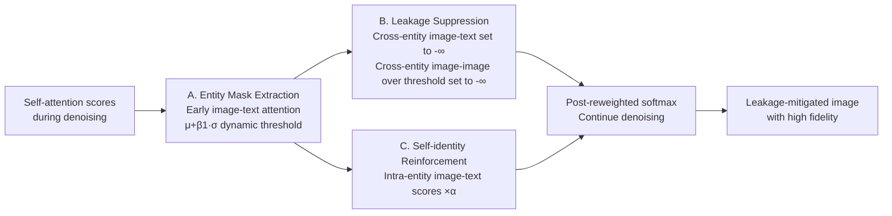

# DeLeaker: Dynamic Inference-Time Reweighting For Semantic Leakage Mitigation in Text-to-Image Models

**Conference**: ICLR 2026  
**OpenReview**: [https://openreview.net/forum?id=SXirwhrQyc](https://openreview.net/forum?id=SXirwhrQyc)  
**Code**: [https://venturamor.github.io/DeLeaker](https://venturamor.github.io/DeLeaker)  
**Area**: Image Generation / Text-to-Image / Attention Control  
**Keywords**: Semantic Leakage, Text-to-Image, Diffusion Transformer, Attention Reweighting, Training-free Inference Intervention  

## TL;DR
DeLeaker performs dynamic reweighting of attention maps during the denoising process of DiT text-to-image models—suppressing cross-entity attention while reinforcing self-identity alignment. This training-free and input-free method mitigates "semantic leakage" and introduces the first dedicated dataset SLIM along with a VLM-based evaluation framework.

## Background & Motivation
- **Background**: Diffusion Transformers (e.g., FLUX, SANA) achieve high quality but suffer from "semantic leakage," where features of independent entities are incorrectly transferred (e.g., "a cow and a horse" resulting in cow textures on horse ears).
- **Limitations of Prior Work**: Existing mitigation strategies rely on "layout control" (assigning fixed bounding boxes to entities). These methods fail during entity interactions (e.g., hugging), require external LLMs for layout generation, and often involve expensive inference-time optimization.
- **Key Challenge**: Cross-entity attention is both the source of leakage and the prerequisite for meaningful interactions (shared actions, poses). Blindly isolating entities is unnatural and discards learned semantic priors.
- **Goal**: Propose a lightweight, optimization-free, and input-free inference-time method to **suppress only the "leakage-inducing" part of cross-entity connections while preserving beneficial interactions** and model priors.
- **Core Idea**: Intervene directly in attention by treating leakage as "high-frequency noise" in cross-modal attention. Use statistical threshold-based dynamic reweighting to perform "cross-entity suppression" and "self-identity reinforcement" simultaneously.

## Method

### Overall Architecture
DeLeaker operates solely on the DiT self-attention mechanism through three sequential steps: **Extracting entity masks** from early image-text attention (to localize entity regions), **suppressing cross-entity connections** (affecting both image-text and image-image attention), and **reinforcing self-identity connections** (between matching image and text tokens). These steps are applied dynamically at each denoising step without any training.

### Key Designs
**1. Attention-based Entity Mask Extraction: Localizing entities using early attention.** To intervene, the method first identifies which image tokens $I$ are "governed" by each text entity $e_i$. DeLeaker takes the pre-softmax attention scores $\text{Attn}$, uses image tokens as queries and entity-specific text tokens as keys, averages across heads, and applies a dynamic threshold based on the mean $\mu_i$ and standard deviation $\sigma_i$: $E^{img}_i = \{q \in I \mid \text{Attn}_{qk} > \mu_i + \beta_1 \cdot \sigma_i,\ k \in (E^{txt}_i \cap I)\}$. Masks are aggregated over early steps and smoothed spatially and temporally for consistency.

**2. Cross-entity Leakage Suppression: Selectively pruning "abnormally high" connections.** Cross-entity attention is necessary for interaction but causes leakage. The authors hypothesize that **abnormally high attention values in image-image relations correspond to unintended semantic transfer (noise), while lower values carry genuine interaction signals.** A zeroing mechanism is applied: all cross-entity image-text attention is suppressed, and cross-entity image-image attention is suppressed only if it exceeds the mean by $\beta_2$ standard deviations: $H^{img\text{-}img}_{ij} = \{(q,k) \mid \text{Attn}_{qk} > \mu_{ij} + \beta_2 \cdot \sigma_{ij},\ q,k \in I\}$.

**3. Self-identity Alignment Reinforcement: Pulling entities back to themselves.** Suppression alone is insufficient. DeLeaker reinforces the connection between an entity's text tokens and its own image tokens by multiplying the attention scores by a coefficient $\alpha > 1$. The unified reweighting rule is:

$$\text{Attn}'_{qk} = \begin{cases} -\infty & q \in E^{img}_i,\, k \in E^{img}_j,\, (q,k) \in H^{img\text{-}img}_{ij} \\ -\infty & q \in E^{img}_i,\, k \in E^{txt}_j \\ \alpha \cdot \text{Attn}_{qk} & q \in E^{img}_i,\, k \in E^{txt}_i \\ \text{Attn}_{qk} & \text{else} \end{cases}$$

Ablations show that "self-identity reinforcement" is the most significant contributor, ensuring entity recognizability and maintaining a non-invasive profile when no leakage occurs.

## Key Experimental Results
Evaluations were performed on FLUX.1-DEV using the SLIM pair subset (840 samples) and 980 human evaluations on 60 samples.

### Main Results (Automatic Leakage Eval + Fidelity)

| Method | Type | Mitigation Major↑ | Degradation Major↓ | VQAScore↑ | LPIPS↓ | KID(·10⁻²)↓ |
|------|------|------|------|------|------|------|
| RAG-Diffusion | Layout | 17.55% | 64.91% | 0.72 | 0.09 | — |
| RPF | Layout | 20.74% | 38.38% | 0.64 | 0.53 | — |
| 3DIS | Layout | 29.08% | 45.05% | 0.76 | 0.96 | — |
| QwenFLUX | Image Cond. | 17.28% | 46.60% | 0.61 | 0.46 | — |
| Instruction Prompt | Prompt | 23.92% | 19.88% | 0.64 | 0.33 | 0.00 |
| Entity Description Prompt | Prompt | 35.60% | 18.45% | 0.62 | 0.41 | 0.00 |
| **DeLeaker** | **Attention (Ours)** | **46.07%** | **12.98%** | **0.68** | **0.22** | **0.00** |
| DeLeaker + Description | Attn + Prompt | 53.57% | 15.36% | 0.65 | 0.43 | 0.01 |

DeLeaker achieves the highest mitigation rate and lowest degradation rate, with 67.8% of samples judged improved by humans. 

### Ablation Study (Improvement Ratio Relative to Full DeLeaker)

| Configuration | Major Improvement↑ |
|------|------|
| DeLeaker (Full) | 1.00 |
| W/O Image-Text (+) (No Reinforcement) | 0.54 |
| W/O Image-Text (-) (No Suppression) | 0.93 |
| Only Image-Text (+) | 0.90 |
| Only Image-Text (-) | 0.54 |
| Only Image-Image (-) | 0.26 |

### Key Findings
- **Self-identity reinforcement (image-text +) is the most critical step**: Using it alone yields a 0.90 improvement ratio; removing it drops the ratio to 0.54.
- **Cross-entity image-text suppression is the second most critical**: Removing it causes a 29% loss in improvement.
- **In-modal intervention has limited effect**: Suppressing text-text connections degrades performance by 9%–20%, suggesting semantic leakage in DiT stems primarily from **cross-modal alignment failure**.
- **Generalization**: Effective on SANA; remains non-invasive for images without leakage.

## Highlights & Insights
- **Diagnosis of "Cross-Modal Alignment Failure"**: Ablations pinpoint the root cause of leakage in the alignment between image and text rather than within a single modality.
- **Suppression-Reinforcement Synergy**: Suppression alone loses identity; reinforcement alone preserves leakage. The two must cooperate to maintain recognizability and fidelity.
- **Zero External Dependencies**: Unlike layout methods requiring bounding boxes or external LLMs, DeLeaker uses internal attention statistics and outperforms existing methods.
- **Bridging the Evaluation Gap**: SLIM is the first dataset for visual semantic leakage (1,130 samples). The VLM pipeline (extraction → typicality → comparative ranking) converts fine-grained visual comparison into reliable text reasoning (Spearman ρ=0.432 with humans).

## Limitations & Future Work
- Evaluation relies heavily on external VLMs (Gemini 1.5); human-machine alignment shows discrepancies in "improvement magnitude."
- Multi-entity (triplet) scenarios introduce counting errors, confounding leakage assessment.
- The dataset focuses on fine-grained categories (animals, fruits) and may not cover more open, complex scenes.
- Hyperparameters ($\beta_1, \beta_2, \alpha$) are empirically fixed rather than adaptive.

## Related Work & Insights
- **Layout Control** (RPF, 3DIS): Inspired the "divide and conquer" approach but showed that rigid isolation breaks interactions.
- **Attention Manipulation** (Prompt-to-Prompt, Attend-and-Excite): Proved attention can be edited; DeLeaker migrates this from UNet to DiT for leakage suppression.
- **Insight**: For generative controllability, pinpointing phenomena in internal representations (cross-modal attention) and designing minimal, statistical inference-time interventions is often more effective than adding external conditions or optimization.

## Rating
- **Novelty**: ⭐⭐⭐⭐ First systematical study of semantic leakage in DiT; introduces training-free bi-directional attention reweighting.
- **Experimental Thoroughness**: ⭐⭐⭐⭐ Covers multiple baselines, two models (FLUX/SANA), and extensive human evals.
- **Writing Quality**: ⭐⭐⭐⭐ Clear logic from motivation to evaluation; insightful root-cause analysis.
- **Value**: ⭐⭐⭐⭐ Plug-and-play solution providing a direct benefit to the semantic accuracy of practical T2I systems.

<!-- RELATED:START -->

<!-- RELATED:END -->

## Related Papers

- [\[ICLR 2026\] Inference-Time Scaling of Diffusion Models Through Classical Search](inference-time_scaling_of_diffusion_models_through_classical_search.md)
- [\[ICLR 2026\] Diffusion Blend: Inference-Time Multi-Preference Alignment for Diffusion Models](diffusion_blend_inference-time_multi-preference_alignment_for_diffusion_models.md)
- [\[ICLR 2026\] RNE: plug-and-play diffusion inference-time control and energy-based training](rne_plug-and-play_diffusion_inference-time_control_and_energy-based_training.md)
- [\[ICLR 2026\] Mitigating Semantic Collapse in Generative Personalization with Test-Time Embedding Adjustment](mitigating_semantic_collapse_in_generative_personalization_with_test-time_embedd.md)
- [\[ICLR 2026\] Compositional Visual Planning via Inference-Time Diffusion Scaling](compositional_visual_planning_via_inference-time_diffusion_scaling.md)

<!-- RELATED:END -->
