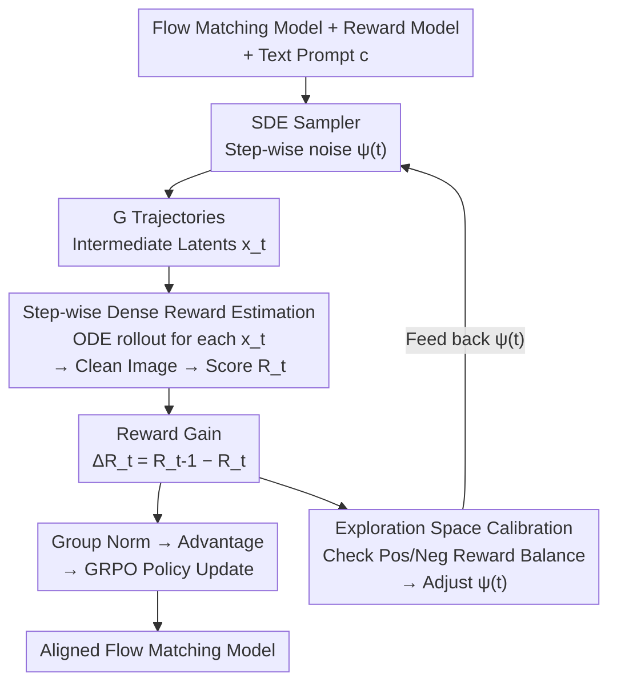

# DenseGRPO: From Sparse to Dense Reward for Flow Matching Model Alignment

**Conference**: ICLR 2026  
**arXiv**: [2601.20218](https://arxiv.org/abs/2601.20218)  
**Code**: None  
**Area**: Diffusion Models / RLHF Alignment  
**Keywords**: GRPO, dense reward, flow matching, human preference alignment, exploration calibration  

## TL;DR
Addressing the sparse reward problem in Flow Matching + GRPO alignment: this work proposes using step-wise reward gains from ODE denoising predictions of intermediate latents as dense rewards. It adaptively adjusts the time-step-specific noise injection of the SDE sampler based on these dense rewards to calibrate the exploration space, outperforming Flow-GRPO in human preference alignment, compositional generation, and text rendering tasks.

## Background & Motivation

**Background**: GRPO has become a mainstream method for aligning flow matching models with human preferences (e.g., Flow-GRPO, DanceGRPO). These methods achieve stochastic exploration by converting deterministic ODE samplers into SDE samplers and then optimizing the policy using group-normalized reward signals.

**Limitations of Prior Work**: Existing GRPO methods only calculate a single sparse reward $R^i$ at the end of the trajectory (the final generated image) and directly use this reward to optimize all intermediate denoising steps. However, $R^i$ represents the cumulative contribution of all $T$ denoising steps, leading to a "feedback-contribution mismatch" when assigned to individual steps.

**Key Challenge**: The mismatch between global trajectory-level rewards and local step-level contributions. Furthermore, a uniform noise level setting for SDE samplers fails to adapt to the time-varying nature of the denoising process—certain time steps may have an excessive exploration space (where all samples receive negative rewards), while others suffer from insufficient exploration.

**Goal**: (a) Estimate dense rewards (step-wise contribution) for each denoising step. (b) Calibrate the exploration space for each time step according to these dense rewards.

**Key Insight**: Leveraging the determinism of ODEs—given an intermediate latent $x_t$, the ODE denoising trajectory is uniquely determined. Therefore, one can perform an ODE rollout on intermediate latents to obtain a clean image and score it with a reward model, thereby deriving the reward gain for each step.

**Core Idea**: The contribution of each step equals the expected reward after the step minus the expected reward before the step (reward gain), estimated via ODE rollouts.

## Method

### Overall Architecture

DenseGRPO aims to resolve the "feedback-contribution mismatch" where methods like Flow-GRPO use a single terminal sparse reward to optimize all $T$ denoising steps. It integrates two components into the Flow-GRPO framework: first, decomposing the single terminal reward into step-wise dense rewards, and second, using these dense rewards to adjust the exploration intensity of each step.

The overall workflow is as follows: given a flow matching model, a reward model, and a text prompt, $G$ trajectories are sampled using an SDE sampler with time-step adaptive noise levels $\psi(t)$. For each intermediate latent $x_t^i$ in every trajectory, an ODE rollout is performed to obtain a clean image, which is then scored as $R_t^i$ by a reward model. The difference between rewards of two adjacent steps, $\Delta R_t^i = R_{t-1}^i - R_t^i$, serves as the step-wise dense reward. Finally, $\Delta R_t^i$ replaces the sparse reward $R^i$ for group normalization and policy optimization. These two improvements support each other: dense rewards provide a more granular training signal and serve as the basis for judging whether positive and negative samples are balanced at each step for exploration calibration.

### Key Designs

**1. Step-wise Dense Reward Estimation: Decomposing terminal reward into step-wise contributions**

The sparse reward $R^i$ is the cumulative result of $T$ denoising steps, making it unfair to apply it directly to any single step. DenseGRPO exploits the determinacy of ODEs to score each step individually: given an intermediate latent $x_t^i$, the ODE denoising trajectory is fixed. By performing $n$ steps of ODE denoising $\hat{x}_{t,0}^i = \text{ODE}_n(x_t^i, c)$, a clean latent is obtained, which is decoded into an image and scored by an existing reward model $R_t^i = \mathcal{R}(\hat{x}_{t,0}^i, c)$. Subtracting scores of adjacent steps, $\Delta R_t^i = R_{t-1}^i - R_t^i$, yields the dense reward representing how much that step "pushed towards a better result."

The advantage is that no additional critic is required to estimate intermediate state values—the "latent → clean image" mapping of the ODE maps each intermediate state back to the clean image domain familiar to the reward model. Consequently, existing reward models designed for clean images can be used directly without adaptation. The trade-off is the computational cost of rollouts: experiments show that multi-step ODE ($n=t$) is significantly more accurate than single-step denoising, as the latter deviates too far from the clean image domain for reliable scoring.

**2. Exploration Space Calibration: Adaptive exploration intensity per time step**

Originally, SDE samplers used a uniform noise level $a$ for all time steps. However, the denoising process is time-varying: in steps near the end (e.g., timestep=2), $a=0.7$ might create an excessively large exploration space, resulting in only "bad" samples with negative rewards, thus preventing the group from obtaining positive signals for effective strategy learning. DenseGRPO replaces the uniform $a$ with a time-step-specific $\psi(t)$ and adjusts it based on a simple rule: aiming for "number of positive rewards ≈ number of negative rewards" at that time step. If they are balanced, $\psi(t)$ is increased to expand exploration; otherwise, $\psi(t)$ is decreased to contract it. Estimating the ratio of positive to negative samples requires step-wise dense rewards, making this calibration dependent on the previous design to ensure reasonable signals for GRPO at every step.

### Loss & Training

- Standard GRPO loss (Eq. 4), but the advantage is calculated using dense reward gains (Eq. 10).
- $T=10$ sampling steps, $G=24$ group size, 512 resolution.
- KL coefficient $\beta$: 0.04 for compositional generation and text rendering, 0.01 for human preference.
- ODE rollout steps $n=t$ (full rollout at each step).

## Key Experimental Results

### Main Results (Based on SD3.5-M)

| Task | Metric | Flow-GRPO | Flow-GRPO+CoCA | **DenseGRPO** |
|------|------|-----------|---------------|-------------|
| Compositional Gen. | GenEval ↑ | 0.95 | 0.96 | **0.97** |
| Text Rendering | OCR Acc. ↑ | 0.92 | 0.93 | **0.95** |
| Human Preference | PickScore ↑ | 23.31 | 23.63 | **24.64** |
| Human Preference | Aesthetic ↑ | 5.92 | 6.22 | **6.35** |
| Human Preference | ImageReward ↑ | 1.28 | 1.32 | **1.41** |

### Ablation Study

| Configuration | PickScore | Description |
|------|-----------|------|
| DenseGRPO (Full, n=t) | **Best** | Multi-step ODE rollout |
| n=2 step ODE | Second best | 2-step approximation |
| n=1 step ODE | Worse than Flow-GRPO | Inaccurate single-step estimation |
| No Exploration Calibration | Second best | Uniform noise |
| Flow-GRPO (baseline) | baseline | Sparse reward |

### Key Findings
- **Most significant gains in human preference alignment**: PickScore increased from 23.31→24.64 (+1.33), indicating that dense rewards benefit tasks requiring fine-grained adjustments the most.
- The number of ODE rollout steps is critical: a single-step ODE ($n=1$) performed worse than Flow-GRPO because single-step denoising deviates from the clean image domain, leading to inaccurate reward model evaluations.
- Exploration space calibration further improves performance, particularly at time steps near the end of the trajectory.
- Effectiveness on FLUX.1-dev and at 1024 resolution demonstrates scalability.
- Reward hacking risk: While dense rewards optimize the reward model more precisely, they also increase the risk of overfitting to the reward model.

## Highlights & Insights
- **Clever utilization of ODE determinism**: No need to train a critic network; intermediate rewards can be estimated directly using ODE rollout + an existing reward model. This approach is concise and practical—any reward model capable of evaluating clean images can be seamlessly integrated.
- **Dense rewards expose exploration space issues**: Without dense rewards, it would be impossible to discover that uniform noise settings are sub-optimal; dense rewards serve as both a better signal and a diagnostic tool.
- **Reward gain as step-level credit assignment**: This concept can be transferred to scenarios with longer trajectories, such as video generation.

## Limitations & Future Work
- ODE rollouts introduce significant computational overhead (performing $t$ ODE denoising steps + VAE decoding + reward model forward pass for each step). Training costs may be several times higher than Flow-GRPO.
- Dense rewards are more prone to reward hacking (acknowledged by the authors in the supplementary material).
- The adjustment rules for exploration calibration are quite simple ($\epsilon$-level adjustments) and may not be robust across different tasks or models.
- Validated only on flow matching models; transferability to traditional diffusion models like DDPM has not been explored.

## Related Work & Insights
- **vs Flow-GRPO**: A direct improvement that replaces sparse rewards with dense rewards in the same framework. PickScore in human preference tasks improved by 1.33.
- **vs CoCA**: CoCA also attempts step-level signal allocation but still relies on trajectory-level rewards allocated by latent similarity; thus, the optimization mismatch is not fundamentally solved. DenseGRPO's reward gain solution is more direct.
- **vs TempFlow-GRPO**: Provides step-level rewards via trajectory branching but still uses trajectory-level signals to optimize steps. DenseGRPO's ODE rollout scheme is more precise.

## Rating
- Novelty: ⭐⭐⭐⭐ The idea of using ODE rollouts for dense reward estimation is novel and practical; the exploration calibration scheme is insightful.
- Experimental Thoroughness: ⭐⭐⭐⭐ Comprehensive across three tasks, ablation studies, FLUX.1-dev validation, and high-resolution scaling.
- Writing Quality: ⭐⭐⭐⭐ Problem motivation is clear, and Figure 3 provides a visual demonstration of the exploration space issue.
- Value: ⭐⭐⭐⭐⭐ A significant improvement to the GRPO alignment paradigm; dense rewards are the correct direction.

<!-- RELATED:START -->

## Related Papers

- [\[ICLR 2026\] Delay Flow Matching](delay_flow_matching.md)
- [\[ICLR 2026\] Source-Guided Flow Matching](source-guided_flow_matching.md)
- [\[ICLR 2026\] Flow Matching with Semidiscrete Couplings](flow_matching_with_semidiscrete_couplings.md)
- [\[ICLR 2026\] Value Matching: Scalable and Gradient-Free Reward-Guided Flow Adaptation](value_matching_scalable_and_gradient-free_reward-guided_flow_adaptation.md)
- [\[ICLR 2026\] GLASS Flows: Efficient Inference for Reward Alignment of Flow and Diffusion Models](glass_flows_reward_alignment_diffusion.md)

<!-- RELATED:END -->
