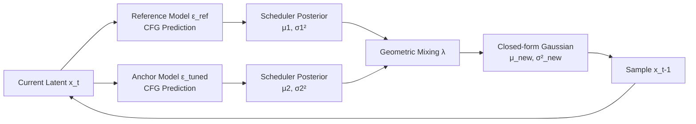

# DeRaDiff: Denoising Time Realignment of Diffusion Models

**Conference**: ICLR 2026  
**OpenReview**: [https://openreview.net/forum?id=TL4cvNviw6](https://openreview.net/forum?id=TL4cvNviw6)  
**Code**: [github.com/itsShahain/DeRaDiff](https://github.com/itsShahain/DeRaDiff)  
**Area**: Image Generation / Diffusion Model Alignment  
**Keywords**: Diffusion Models, RLHF, KL Regularization, Inference-time Alignment, decoding-time realignment, Reward Hacking  

## TL;DR
DeRaDiff transfers "decoding-time realignment" from language models to diffusion models: by aligning for only a single run, the model can simulate an aligned version trained with any KL regularization strength online using a scalar $\lambda$ during sampling, thereby eliminating expensive hyperparameter sweeps for regularization strength.

## Background & Motivation
- **Background**: Aligning diffusion models with human preferences (to enhance aesthetics or reduce artifacts/bias) has become mainstream. This is typically formulated as maximizing a reward subject to a KL divergence constraint from the pre-trained prior, where the regularization strength $\beta$ controls this trade-off.
- **Limitations of Prior Work**: Selecting an appropriate $\beta$ is difficult—too large results in under-alignment and model underfitting, while too small leads to "reward hacking" (high reward scores but collapsing image quality). Finding the optimal $\beta$ requires aligning from scratch multiple times at different strengths, which is prohibitively expensive for large diffusion models (SDXL requires approximately 336 GPU hours for a single $\beta$ value).
- **Key Challenge**: The correct regularization strength is highly task-dependent and cannot be determined a priori, yet the cost of hyperparameter search compounds the already high cost of alignment training.
- **Goal**: Align only once and cheaply explore the entire regularization strength spectrum at **inference time** to locate the optimal $\beta$, avoiding repetitive re-training.
- **Key Insight**: **[Inference-time Geometric Mixing]** Drawing inspiration from decoding-time realignment in language models (which geometrically mixes reference and aligned distributions with complementary powers), this work generalizes it to the continuous latent iterative denoising process of diffusion models, deriving an analytical, closed-form Gaussian update at each step controlled by a single online tunable parameter $\lambda$.

## Method

### Overall Architecture
DeRaDiff maintains a reference model $p_\text{ref}$ (pre-trained) and an "anchor model" $p_\theta[\beta]$ aligned at a specific $\beta$. During sampling, each denoising step performs a geometric mixture of the posteriors from these two models. The mixture weight is determined by $\lambda$: $\lambda=0$ reverts to the reference model, $\lambda=1$ yields the anchor model, $0<\lambda<1$ represents a stable convex interpolation (equivalent to a regularization strength of $\beta/\lambda$), and $\lambda>1$ extrapolates to weaker regularization. Under common schedulers, the mixed posterior remains Gaussian, resulting in closed-form mean and variance updates with zero additional training.

### Key Designs

**1. From full-sample geometric mixing to step-wise approximation: making interpolation computable.** The ideal realigned model is a normalized geometric mixture of the reference and aligned full-sample distributions $p^*_\theta[\beta/\lambda](x_0|c)\propto p_\text{ref}(x_0|c)^{1-\lambda}\,p^*_\theta[\beta](x_0|c)^{\lambda}$. However, computing this directly requires marginalization over all intermediate latents, which is intractable for diffusion models. The authors propose applying the geometric mixture **at each denoising step** to approximate the step-wise posterior: $\hat p_\theta[\beta/\lambda](x_{t-1}|x_t,c)\propto p_\text{ref}(x_{t-1}|x_t,c)^{1-\lambda}\,p^*_\theta[\beta](x_{t-1}|x_t,c)^{\lambda}$. This converts a globally intractable integral into a sequence of locally computable step-wise mixtures, where each step balances "adhering to the prior" and "following the reward" based on $\lambda$.

**2. Closed-form Gaussian posterior (Theorem 1): a geometric mixture of two Gaussians is still Gaussian.** This is the theoretical foundation. Given a reference posterior $p_\text{ref}=\mathcal N(\mu_1,\sigma_1^2 I)$ and an aligned posterior $p^*_\theta[\beta]=\mathcal N(\mu_2,\sigma_2^2 I)$, their product with exponents $1-\lambda$ and $\lambda$ yields a new quadratic form in the exponent. Thus, the mixture is Gaussian with closed-form parameters:

$$\Sigma_\text{new}=\left(\frac{1-\lambda}{\sigma_1^2}+\frac{\lambda}{\sigma_2^2}\right)^{-1}I,\quad \mu_\text{new}=\Sigma_\text{new}\left(\frac{1-\lambda}{\sigma_1^2}\mu_1+\frac{\lambda}{\sigma_2^2}\mu_2\right)$$

This represents a linear interpolation of inverse variances (precisions) and a precision-weighted average of means. When $\lambda\in[0,1]$, $\Sigma_\text{new}$ is strictly positive-definite (Corollary 1), ensuring a valid posterior. Since deterministic schedulers like DDIM/DDPM preserve Gaussianity, these updates can be iteratively applied throughout the sampling trajectory.

**3. Single-scalar online control and extrapolation boundaries.** The realignment process exposes only one knob $\lambda$, equivalent to a regularization strength of $\beta/\lambda$, which can be switched at any time during sampling. $\lambda=0$ recovers the prior, $\lambda=1$ the anchor, and $0<\lambda<1$ is a convex combination of log-densities (stablest and best performance). For $\lambda>1$, $1-\lambda<0$, causing the mixture to cease being convex. The new covariance may lose positive-definiteness or become ill-conditioned, leading to image quality degradation and inducing reward-hacking artifacts—consistent with the intuition of "weak regularization." Thus, Theorem 1 assumes $\lambda\in[0,1]$, though experiments show moderate $\lambda>1$ can approximate weaker regularization before instability occurs.

**4. Sampling algorithm and multi-reward extension.** Algorithm 1 details the workflow: at each step, perform CFG predictions $\epsilon_\text{ref}$ and $\epsilon_\text{tuned}$, compute scheduler posteriors $(\mu_1,\sigma_1^2)$ and $(\mu_2,\sigma_2^2)$, apply the scalar closed-form updates for $\sigma_\text{new}^2$ and $\mu_\text{new}$ via Corollary 1, and finally compute $x_{t-1}=\mu_\text{new}+z\sqrt{\sigma_\text{new}^2}$. The derivation does not require $\sigma_1^2=\sigma_2^2$, naturally supporting cases with unequal variances. The authors further prove that this geometric mixture extends to multi-reward modeling (Appendix A.4).

## Key Experimental Results

Experiments use SDXL 1.0 (and SD1.5 in the Appendix) as the base. Models are aligned from scratch using DiffusionDPO at $\beta\in\{500,1000,2000,5000,8000,10000\}$. One is selected as the anchor, and DeRaDiff adjusts $\lambda$ to approximate the others, comparing results against the "aligned from scratch" ground truth using 500 prompts from Pick-a-Pic v1 + HPS. Metrics include PickScore, HPS v2, and CLIP.

### Main Results ($\lambda\in[0,1]$ Training-free Approximation Error)

| Model | CLIP MAE | CLIP MAE(% of μ) | HPS MAE | HPS MAE(% of μ) | PickScore MAE | PickScore MAE(% of μ) |
|---|---|---|---|---|---|---|
| SDXL | 0.001604 | 0.430% | 0.000770 | 0.265% | 0.000355 | 0.154% |
| SD1.5 | 0.001557 | 0.448% | 0.001175 | 0.425% | 0.000718 | 0.332% |

The Mean Absolute Error (MAE) for all metrics is < 0.02 in absolute terms and < 0.5% relative to the mean, indicating that for $\lambda\in[0,1]$, DeRaDiff perfectly reproduces the average behavior of models aligned from scratch.

### Ablation Study (Absolute Error % for Anchor $\beta=2000$ Approximating Target $\beta$)

| Metric | β=500 | β=1000 | β=2000 | β=5000 | β=8000 | β=10000 |
|---|---|---|---|---|---|---|
| PickScore | 1.3451 | 0.7831 | 0.0000 | 0.0611 | 0.1399 | 0.0987 |
| HPS | 0.5890 | 0.0299 | 0.0000 | 0.1701 | 0.2688 | 0.2061 |
| CLIP | 0.4022 | 0.5077 | 0.0000 | 0.3041 | 0.0310 | — |

Approximation is most accurate when the **target $\beta$ is higher than the anchor $\beta$** (the convex interpolation direction $\lambda\in[0,1]$). Errors increase slightly when the target $\beta$ is lower than the anchor (extrapolation $\lambda>1$), consistent with the theory.

### Key Findings
- **Reversing reward hacking**: Using a reward-hacked model (small $\beta$) as an anchor and selecting a smaller $\lambda$ can pull the images back toward stronger regularization (e.g., $\beta=2000$), restoring detail and style (Fig. 7).
- **Minimal error**: The median PickScore approximation error is $2.83\times10^{-4}$ (approx. 20% of its standard deviation), with ~87% of errors $\le5\times10^{-4}$. CLIP Bland–Altman plots show no systematic bias, with a mean difference of only $-0.273\%\,\mu$.
- **Computational savings**: Aligning a single $\beta$ for SDXL from scratch takes ≈336 GPU hours (≈188.7 EFLOPs). DeRaDiff requires aligning only once to traverse the regularization spectrum online, virtually eliminating the training cost of multiple sweeps.

## Highlights & Insights
- **Upgrade from discrete logit mixing to continuous trajectory mixing**: LM realignment only requires mixing a single token distribution; diffusion involves multi-step denoising of continuous latents. The authors elegantly bypass the intractability of full-sample marginalization via "step-wise geometric mixing + Gaussian closed-form."
- **Single scalar, zero retraining, online switching**: $\lambda$ acts as an "alignment strength knob," turning expensive offline hyperparameter sweeps into nearly free inference-time exploration that can be adjusted dynamically during generation.
- **Consistency between theoretical boundaries and empirical phenomena**: The loss of positive-definiteness for $\lambda>1$ corresponds to reward-hacking artifacts. This mapping between mathematical instability and visual degradation clearly defines the method's usable range (primarily $\lambda\in[0,1]$).
- **Closed-form step-wise posterior for DDPM**: Unlike previous SDE/score-based approaches (e.g., Diffusion Blend), this work fills the theoretical gap for the DDPM paradigm.

## Limitations & Future Work
- **Unreliable extrapolation**: For $\lambda>1$, the covariance may not be positive-definite, leading to reduced accuracy and potential artifacts. The method is primarily guaranteed for $\lambda\in[0,1]$, limiting exploration toward "weaker regularization."
- **Reliance on Gaussian/Isotropic assumptions**: The closed-form posterior relies on the assumption that step-wise posteriors are (scalar/diagonal) Gaussians. Conclusions may not hold for non-Gaussian schedulers or highly correlated covariances.
- **Dual-model inference requirement**: Each step requires concurrent CFG predictions for both reference and anchor models, doubling the inference compute per sample (though still significantly cheaper than repeated training).
- **Cumulative approximation error**: Step-wise mixing is an approximation of full-sample mixing; there may be edge cases where RLHF scores match well but visual results differ slightly.
- **Outlook**: Extensions to non-Gaussian/flow-matching paradigms, more robust $\lambda>1$ extrapolation, and systematic evaluation of multi-reward online weighting are natural directions.

## Related Work & Insights
- **Diffusion Alignment**: DDPO, DRaFT, DPOK, AlignProp, and Diffusion DPO explore efficient alignment but treat $\beta$ as a fixed hyperparameter requiring sweeps. DeRaDiff serves as a "sweep-free" companion tool for these methods.
- **Decoding-time Control**: Methods based on pre-trained diffusion + external networks or SMC sampling from reward distributions often do not utilize "already aligned conditional models." DeRaDiff specifically reuses aligned models as anchors.
- **Language Model Realignment** (Liu et al. 2024) is the direct inspiration. While Diffusion Blend performed similar work under score-based SDEs, this paper provides the closed-form step-wise posterior for the DDPM paradigm, offering a more complete theory.
- **Insight**: Converting "training-time hyperparameters" into "inference-time knobs" is a universal paradigm for cost reduction—provided a closed-form interpolation structure for the training objective can be found.

## Rating
- **Novelty**: ⭐⭐⭐⭐ Rigorously generalizes decoding-time realignment from discrete tokens to continuous diffusion trajectories and provides the first step-wise closed-form Gaussian posterior for the DDPM paradigm.
- **Experimental Thoroughness**: ⭐⭐⭐⭐ Covers SDXL/SD1.5, six $\beta$ levels, and three preference/semantic metrics. Uses ECDF, scatter plots, and Bland–Altman for statistical faithfulness testing and quantifies compute savings. Lacks large-scale human evaluation and systematic analysis of the extrapolation zone.
- **Writing Quality**: ⭐⭐⭐⭐ Clear chain of logic from motivation to theory, algorithm, and experiments; theorems and corollaries effectively explain the behavior of $\lambda$. Some experimental details are relegated to the Appendix.
- **Value**: ⭐⭐⭐⭐ Directly addresses the real-world pain point of expensive parameter sweeps in diffusion alignment. Provides a nearly free inference-time exploration tool with the ability to reverse reward hacking.

<!-- RELATED:START -->

## Related Papers

- [\[ICLR 2026\] Inference-Time Scaling of Diffusion Models Through Classical Search](inference-time_scaling_of_diffusion_models_through_classical_search.md)
- [\[ICLR 2026\] Asynchronous Denoising Diffusion Models for Aligning Text-to-Image Generation](asynchronous_denoising_diffusion_models_for_aligning_text-to-image_generation.md)
- [\[ICLR 2026\] Latent Denoising Makes Good Tokenizers](latent_denoising_makes_good_tokenizers.md)
- [\[ICLR 2026\] Mitigating Noise Shift in Denoising Generative Models with Noise Awareness Guidance](mitigating_noise_shift_in_denoising_generative_models_with_noise_awareness_guida.md)
- [\[ICLR 2026\] Diffusion Blend: Inference-Time Multi-Preference Alignment for Diffusion Models](diffusion_blend_inference-time_multi-preference_alignment_for_diffusion_models.md)

<!-- RELATED:END -->
