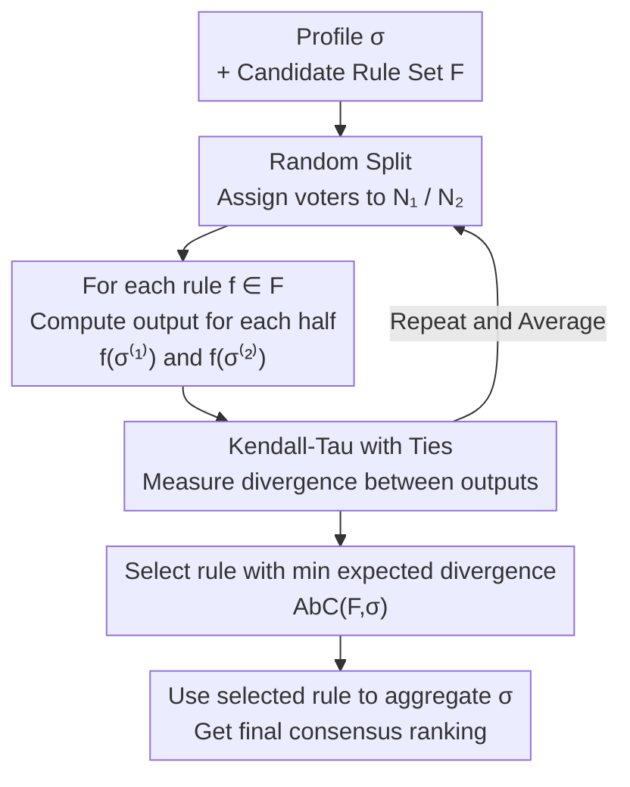

# Designing Rules to Pick a Rule: Aggregation by Consistency

**Conference**: ICLR2026  
**OpenReview**: [https://openreview.net/forum?id=xxsacQ3tdb](https://openreview.net/forum?id=xxsacQ3tdb)  
**Code**: To be confirmed  
**Area**: Learning Theory / Social Choice / Rank Aggregation  
**Keywords**: Rank Aggregation, Social Choice, Rule Selection, Consistency, Axiomatic Analysis

## TL;DR
Addressing the challenge of choosing among various rank aggregation rules (Borda, plurality, veto, etc.) with diverse pros and cons, this paper proposes the "Rule Picking Rule" (RPR) framework and a specific instantiation called AbC. By randomly splitting voters into two groups and selecting the rule that yields the most consistent rankings across both halves, AbC automatically identifies the most suitable aggregation rule for any given dataset without prior commitment to specific axioms or generative models.

## Background & Motivation
**Background**: Aggregating rankings or scores from multiple evaluators (human annotators, benchmarks, reviewers) into a single consensus ranking is a fundamental problem in AI. It appears in RLHF for aggregating preferences into reward models, in constitutional AI for merging multiple principles, in AI agent evaluation across benchmarks, and in peer review for consolidating reviewer rankings into acceptance decisions. Social choice and statistics have provided numerous aggregation methods, each possessing elegant properties but also inherent weaknesses.

**Limitations of Prior Work**: Different methods can yield **drastically different** aggregate rankings on the same data, directly impacting final outcomes. Instances where a poorly chosen rule led to results contradicting evaluator intent have been noted in both RLHF and agent evaluation. The fundamental question remains: how to determine which aggregation method is "good" or which one to use? Existing approaches have significant flaws.

**Key Challenge**: The first path is the **axiomatic approach**—selecting desired axioms first and then designing rules to satisfy them. However, famous impossibility theorems like Arrow and Gibbard-Satterthwaite prove that certain basic axioms are mutually contradictory; a "perfect rule" does not exist. Even when axioms are compatible, multiple rules often satisfy them, making the final choice arbitrary. The second path is the **statistical approach**—viewing rankings as noisy estimates of an objective ground truth (e.g., Plackett-Luce or Mallows models) and selecting the ranking that maximizes the likelihood. This assumes a unique ground truth, which is untenable in AI alignment scenarios involving "reasonable disagreement." Furthermore, many high-quality voting rules are not the MLE of any noise model and are thus excluded by this approach.

**Goal**: To reframe the question: given a multitude of rules and no a priori preference, **how can one pick which rule to use** for a specific scenario? That is: what constitutes a good "Rule Picking Rule" (RPR)?

**Key Insight**: The authors observe that "picking a rule" rather than "picking a ranking" offers three benefits: ① enhanced interpretability—formally explaining why other rules were not used; ② principled trade-offs, as different (rational) rules fit different scenarios; ③ extensibility, as the framework can select from **any** set of candidate rules. To evaluate rule quality, the authors focus on **consistency**—a good rule should yield similar results if the data collection process were repeated.

**Core Idea**: Randomly split voters into two halves to simulate "repeating the process" and select the rule that outputs the most consistent (least divergent) rankings across the two halves. This uses consistency as a proxy for quality, bypassing the need for "axiom commitment" or "ground truth assumptions."

## Method

### Overall Architecture
The paper addresses the meta-problem of "which aggregation rule to use" rather than just "which ranking to output." This is formalized as an RPR: given a set of candidate rules $F$ (where each rule is a Social Welfare Function, SWF, mapping a profile to a ranking) and a profile $\sigma$, an RPR is a function $Z(F,\sigma)\subseteq F$ that selects the most suitable rule(s). The candidate set $F$ functions similarly to a hypothesis class in machine learning and is not restricted.

Under this framework, the authors instantiate AbC (Aggregation by Consistency). Its operation is remarkably simple: randomly split the voters into two equal groups $N_1, N_2$ to obtain two sub-profiles $\sigma^{(1)}, \sigma^{(2)}$. Each candidate rule is applied to both sub-profiles, and the divergence between the two output rankings is measured (using Kendall-Tau distance with ties). Finally, the rule with the **minimum expected divergence** is selected:

$$\text{AbC}(F,\sigma)=\arg\min_{f\in F}\ \mathbb{E}\big[\,\text{KT}\big(f(\sigma^{(1)}),\,f(\sigma^{(2)})\big)\,\big],$$

where the expectation is taken over random splits. Crucially, the algorithm is agnostic to the input/output types of the rules—it only requires a "divergence metric" to compare outputs. Thus, it can handle rankings, scores, or approval sets, and the output can be a full ranking, a single winner, or a reward function. This paper focuses on the case of outputting full rankings. The framework diagram illustrates the core process:

### Key Designs

**1. RPR Framework: Elevating the Problem to Rule Selection**
While prior literature focuses on choosing an aggregate ranking, this work shifts the decision target up one level to "picking a rule." Formally, an SWF maps a profile $\sigma\in L(A)^n$ to a weak ranking (allowing ties to maintain neutrality/anonymity). An RPR $Z(F,\sigma)\subseteq F$ selects a subset of candidates, with a final tie-breaking order to ensure a unique rule. This elevation enables formal justification for why certain rules are discarded, provides a unified interface for scenario-specific rules, and allows the candidate set to be expanded like a hypothesis class. By restricting candidates to specific MLEs or axiom-satisfying rules, benefits from statistical or axiomatic approaches can be "inherited."

**2. Consistency as Quality: Approximating Repeated Trials via Splitting**
AbC uses consistency as its quality signal: if the data collection were repeated, a good rule should yield similar results. Since the process cannot be truly repeated in reality, AbC uses **random split-half** as a proxy. This intuition is supported by the theory of Minimum Variance Unbiased Estimators (MVUE); the variance of a random variable is equal to half the expected squared difference between two i.i.d. copies. By interpreting unbiasedness as a basic constraint (satisfied by restricted candidate sets of neutral/anonymous rules), the most consistent rule corresponds to the MVUE. This principle aligns with peer review practices, stability-based model selection in clustering, and robustness requirements in RLHF. If a generative model fits the data, its MLE will naturally exhibit the lowest divergence under splitting, allowing AbC to automatically adopt its benefits.

**3. Kendall-Tau Distance with Ties and Partial Rankings**
To quantify inconsistency, the paper employs Kendall-Tau with ties. For any pair of candidates $a,b$, let $D^{a,b}_{r_1,r_2}$ indicate a **strict disagreement** in relative order between rankings $r_1, r_2$, and let $T^{a,b}_{r_1,r_2}$ indicate if at least one ranking treats $a,b$ as a tie:

$$\text{KT}(r_1,r_2)=\sum_{\{a,b\}:a\neq b}\Big(D^{a,b}_{r_1,r_2}+\tfrac{1}{2}T^{a,b}_{r_1,r_2}\Big).$$

The tie term is crucial: standard KT only counts strict disagreements, which would incorrectly reward a rule that "always outputs a total tie" with perfect consistency. The $\tfrac12$ weighted tie term (inspired by Kendall's Tau-b) punishes such indecisiveness. For **partial rankings** (common in peer review or RLHF where voters only rank subsets $A_i$), the authors use a weighted KT. Weights are assigned based on how evenly a candidate pair is represented across the split to avoid unfairly penalizing divergence when one side lacks sufficient information.

**4. Axiomatic Analysis: Capabilities and Theoretical Impossibilities**
The authors define natural axioms for RPRs and evaluate AbC. **Reversal Symmetry**: If every voter's ranking is reversed, the RPR-selected rule should correspond to its reversed version (e.g., plurality becomes veto; Borda is self-dual); AbC satisfies this. **Plurality-Shuffling Consistency (PSC)**: If the 2nd to $m$-th positions in every ranking are shuffled uniformly (concentrating signal at the top), a reasonable RPR should pick plurality. The authors prove that a large class of "welfare-maximizing" RPRs ($Z(F,\sigma)=\arg\max_f u(\sigma,f(\sigma))$) **violate** PSC, whereas AbC satisfies it (Theorem 1). However, AbC does not satisfy **Union Consistency (UC)** and **Monotonicity Preservation**. Impossibility results prove these are **incompatible** with AbC's axioms (no anonymous RPR can satisfy Reversal Symmetry, PSC, and UC simultaneously). Theorem 2 further shows that if candidate rules satisfy certain properties (e.g., Smith criterion, Condorcet consistency, Majority winner, Unanimity), AbC **preserves** these classic social choice axioms.

**5. Complexity and Implementation: Hardness and Sampling**
When the candidate set consists of all positional scoring rules $F_S$, the authors define the PERFPOS problem: given a split, does a scoring vector $s$ exist such that the outputs for both halves are identical ($\text{KT}=0$)? Theorem 3 uses a 3SAT reduction to prove **PERFPOS is NP-complete**. This implies that minimum divergence is **hard to approximate** by any multiplicative factor. In practice, AbC is implemented via Monte Carlo sampling to estimate the expected divergence. Even with infinite candidates (all scoring rules), optimization techniques like SGD or Simulated Annealing can be used. Experiments show that Simulated Annealing finds lower divergence vectors more efficiently than SGD.

## Key Experimental Results

### Main Results: Consistency as a Proxy for Quality
Using partial rankings sampled from Mallows and Plackett-Luce noise models, the authors plot "errors (KT to ground truth)" against "inconsistency (KT between split halves)" on a log-log scale. A clear positive correlation is observed. Under both distributions, the MLE (Kemeny for Mallows, PL MLE for Plackett-Luce) is **optimal on both axes**—yielding the highest accuracy and the highest consistency. Since AbC selects the rule with minimal divergence, it correctly identifies the MLE for data generated by these models.

| Evaluation Scenario | AbC Conclusion | Comparison with Practice |
|----------|-----------|----------------|
| Synthetic Data (Mallows / PL) | Selects the MLE (Kemeny / PL MLE) | Validates "Consistency ≈ Quality" (MVUE intuition) |
| Political Elections (25 cases, IRV) | Zero-divergence rules exist in 21/25; **optimal rule varies per case** | Confirms "no universal rule"; IRV is occasionally the worst |
| Formula 1 Racing (Each race = 1 voter) | Historic scoring rule changes **all improved consistency** | AbC evaluates the impact of rule changes |
| ALMA Telescope Peer Review | Outlier rejection (Trimmed Borda) **increased divergence** | Refutes a proposed modification for ALMA |

### Findings on Scoring Data: Mean is More Consistent than Max
On astronomer peer review scoring data (Kerzendorf et al., 2020), the authors ran 1000 random splits for various "score-to-rank" functions to measure average KT distance:

| Aggregation Function | Arithmetic Mean | Min | Max | Median | Geometric Mean |
|----------|---------|-----|-----|--------|----------|
| KT Distance (1000 splits) | **0.364 ± 0.001** | 0.444 ± 0.001 | 0.409 ± 0.001 | 0.371 ± 0.001 | 0.369 ± 0.001 |

While peer review practice often favors projects with "the highest scores" (Max), AbC shows that **mean-based functions** are significantly more consistent (Mean 0.364 vs. Max 0.409). This provides data-driven evidence for a counter-intuitive improvement in review processes.

### Key Findings
- **Positive correlation between consistency and error** is the experimental foundation: validated on synthetic data with ground truth, it justifies using "split consistency" as a proxy when ground truth is absent.
- **"No one-size-fits-all rule"**: Optimal rules varied across 25 political elections, justifying the RPR/AbC approach of Picking a rule per dataset. Using a fixed rule (like IRV) can be suboptimal.
- **AbC as a Governance Tool**: F1 rule changes were judged as improvements, while ALMA's Trimmed Borda and "Max score" preference in peer review were judged as detrimental to consistency.
- An implementation of this method was one of four winners in the 2nd Computational Social Choice Competition (IJCAI 2024), demonstrating strong general performance.

## Highlights & Insights
- **The Shift from "Picking Rankings" to "Picking Rules"**: This perspective shift is elegant, allowing formal justification for rule selection and unifying axiomatic and statistical approaches within a single framework.
- **Random Split-Half as "Process Repetition"**: This is a simple yet universal engineering trick. It calculates a "consistency" signal without generative models or ground truth and remains agnostic to data types.
- **Statistical Grounding via MVUE**: Linking consistency to variance provides a rigorous theoretical bridge between a heuristic sampling approach and classical estimation theory.
- **Robust Tie-Breaking Design**: By penalizing ties, the authors prevent "always tying" rules from gaming the consistency metric—a critical detail that ensures the measure's integrity.
- **Theory-Practice Balance**: Acknowledging NP-completeness while providing practical approximations via Monte Carlo and Simulated Annealing makes the work both theoretically honest and practically useful.

## Limitations & Future Work
- The framework treats voter rankings as **fixed** inputs and does not consider **strategic voting**. If voters manipulate their preferences, the validity of evaluating rules on historical data may decrease.
- AbC **violates** Union Consistency and Monotonicity. While proven to be a necessary theoretical trade-off, this may make AbC unsuitable for applications where these specific properties are paramount.
- The axiomatic analysis focuses primarily on the "Full Ranking + Kendall-Tau" case. Performance and properties under other metrics (e.g., NDCG for top-heavy rankings, Jaccard for subsets) remain open questions.
- The NP-completeness of PERFPOS means that for large-scale applications with infinite candidate rules, results depend on optimizer quality and lack a global optimality guarantee.

## Related Work & Insights
- **vs. Axiomatic Approach**: Unlike traditional methods that commit to axioms regardless of data, AbC takes a data-driven approach to select rules, inheriting the axioms of whoever is in the candidate set without hitting a dead end at impossibility theorems.
- **vs. Statistical/MLE Approach**: AbC does not require a ground truth assumption. However, if the data does follow a model, AbC naturally converges to its MLE, offering the best of both worlds.
- **vs. Welfare-maximizing RPRs**: AbC's satisfaction of PSC distinguishes it from utility-based approaches, which fail to prioritize the top-rank signals correctly in certain scenarios.
- **vs. Clustering Stability / MVUE**: The analogy to model selection in unsupervised learning reinforces the validity of consistency as a quality proxy, suggesting that the AbC framework could be generalized to other stability-based estimation problems.

## Rating
- Novelty: ⭐⭐⭐⭐⭐ Shifting decision-making to the "rule layer" via the RPR framework and AbC is a clean, original perspective.
- Experimental Thoroughness: ⭐⭐⭐⭐ Extensive testing across synthetic models, political elections, sports, and peer review. Provides valuable insights, though more quantitative baselines could be included.
- Writing Quality: ⭐⭐⭐⭐⭐ Logical progression from motivation to theoretical results and implementation. Excellent use of examples and algorithms.
- Value: ⭐⭐⭐⭐⭐ Directly addresses a core pain point in RLHF, peer review, and agent evaluation with a practical tool for rule assessment.

<!-- RELATED:START -->

## Related Papers

- [\[CVPR 2025\] AutoPresent: Designing Structured Visuals from Scratch](../../CVPR2025/image_generation/autopresent_designing_structured_visuals_from_scratch.md)
- [\[ICLR 2026\] FACM: Flow-Anchored Consistency Models](facm_flow-anchored_consistency_models.md)
- [\[ICLR 2026\] The Intricate Dance of Prompt Complexity, Quality, Diversity, and Consistency in T2I Models](the_intricate_dance_of_prompt_complexity_quality_diversity_and_consistency_in_t2.md)
- [\[ICLR 2026\] Consis-GCPO: Consistency-Preserving Group Causal Preference Optimization for Vision Customization](consis-gcpo_consistency-preserving_group_causal_preference_optimization_for_visi.md)
- [\[CVPR 2026\] Designing Instance-Level Sampling Schedules via REINFORCE with James-Stein Shrinkage](../../CVPR2026/image_generation/designing_instance-level_sampling_schedules_via_reinforce_with_james-stein_shrin.md)

<!-- RELATED:END -->
