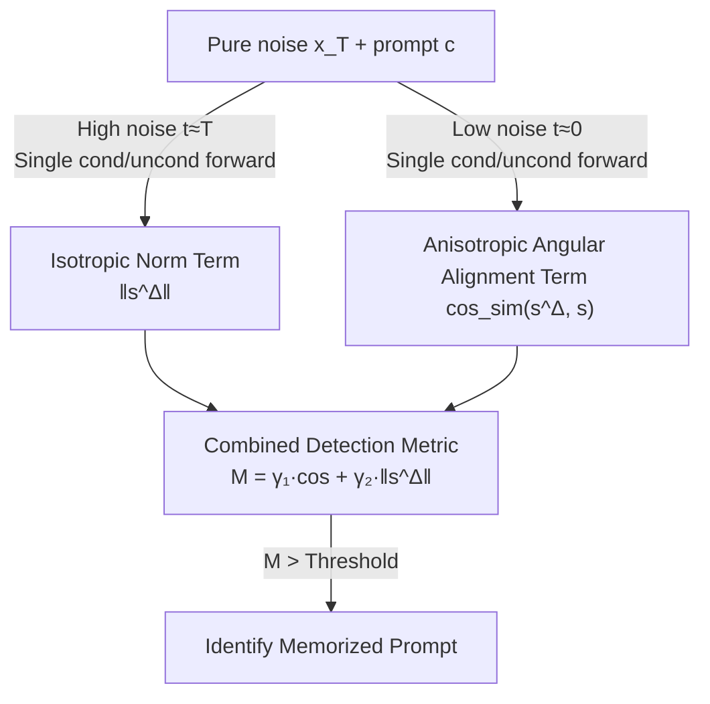

# Detecting and Mitigating Memorization in Diffusion Models through Anisotropy of the Log-Probability

**Conference**: ICLR 2026  
**arXiv**: [2601.20642](https://arxiv.org/abs/2601.20642)  
**Code**: [GitHub](https://github.com/rohanasthana/memorization-anisotropy)  
**Area**: Diffusion Models / Privacy  
**Keywords**: Memorization detection, anisotropy, score function, cosine similarity, denoising-free detection  

## TL;DR

This paper demonstrates that norm-based memorization detection metrics are only effective under isotropic log-probability distributions and fail in low-noise anisotropic regions. It proposes a denoising-free detection metric combining high-noise norm and low-noise angular alignment (cosine similarity), which outperforms existing denoising-free methods on SD v1.4/v2.0 and is over $5\times$ faster.

## Background & Motivation

**Background**: Diffusion models inadvertently memorize exact copies of training samples, leading to concerns regarding data privacy, copyright, and evaluation bias. Memorization detection has become a crucial research direction.

**Limitations of Prior Work**: Mainstream methods (e.g., Wen et al., Jeon et al.) detect memorization based on the norm of the score difference $\|s_\theta^\Delta(\mathbf{x}_t, t, c)\|$, which essentially measures the overall curvature of the log-probability (Hessian trace).

**Key Challenge**: Norm-based metrics implicitly assume that the log-probability distribution is isotropic (i.e., Hessian $\propto \mathbf{I}$, with identical curvature in all directions). However, experiments show that the log-probability in low-noise regions is actually anisotropic (Hessian eigenvalue variance increases sharply), where the norm fails to distinguish between memorized and non-memorized samples (KL divergence drops from 0.166 in isotropic regions to 0.022 in anisotropic regions).

**Goal**: Accurately detect memorization even in anisotropic regions without requiring expensive denoising steps.

**Key Insight**: By analyzing the directional relationship between conditional and unconditional scores in low-noise anisotropic regions, it is observed that the guidance vector of memorized samples is highly aligned with the unconditional score.

**Core Idea**: The signature of memorization in anisotropic regions is angular alignment rather than norm spikes. Memorization can be efficiently detected without denoising using a weighted combination of "isotropic norm + anisotropic cosine similarity."

## Method

### Overall Architecture

The paper addresses the failure of existing norm-based diffusion memorization metrics in low-noise anisotropic regions by finding an alternative criterion that is both accurate and fast without running denoising trajectories. The core strategy decomposes the memorization "signature" into two complementary signals based on noise intervals: norm for high-noise regions and angle for low-noise regions, which are then weighted into a unified criterion. Specifically, for a pure noise input $\mathbf{x}_T \sim \mathcal{N}(\mathbf{0}, \mathbf{I})$ and prompt $c$, conditional/unconditional forward passes are performed only at two manually set timesteps $t \approx T$ and $t \approx 0$ to obtain the **isotropic norm term** and the **anisotropic angular alignment term**, respectively. These are weighted into a **combined detection metric** $\mathcal{M}(\mathbf{x}_T, c)$, where values exceeding a threshold indicate a memorized prompt. Since no denoising trajectory is executed, this approach is more than $5\times$ faster than Hessian-dependent methods.

### Key Designs

**1. Isotropic Norm Term: Capturing validated signals in high-noise regions**

The norm of the score difference $\|s_\theta^\Delta(\mathbf{x}_T, t \approx T, c)\|$ is computed at $t \approx T$, following the metric used by Wen et al. This is retained because the log-probability is approximately isotropic at high noise levels—where Hessian eigenvalue variance approaches zero and curvature is consistent across directions—allowing the norm to reliably reflect the overall log-probability spikes of memorized samples. This signal is restricted to the noise interval where it remains valid.

**2. Anisotropic Angular Alignment Term: Identifying memorization via direction in low-noise regions**

In low-noise regions, log-probability becomes anisotropic and the norm fails (KL divergence drops from 0.166 to 0.022). However, memorization leaves a different signature: directional alignment. The method computes the cosine similarity $\text{cos\_sim}(s_\theta^\Delta, s_\theta)$ between the guidance vector and the unconditional score at $t \approx 0$. The intuition is that for memorized samples, unconditional and conditional modes almost overlap (mode displacement $\delta \to 0$), making the direction of $\nabla \log p_t(c|\mathbf{x}_t)$ and $\nabla \log p_t(\mathbf{x}_t)$ highly consistent. Theorem 1 formalizes this as a provable lower bound:

$$\cos \geq \frac{1-r}{1+r}, \quad r = \varepsilon + \tau$$

where $\varepsilon$ controls covariance approximation error and $\tau$ controls mode displacement. Stronger memorization (smaller $\delta$) leads to a smaller $r$ and a cosine lower bound closer to 1. This term naturally complements the norm term.

**3. Combined Detection Metric: Weighting complementary signals into a denoising-free criterion**

The final criterion is a weighted sum of the two terms:

$$\mathcal{M}(\mathbf{x}_T, c) = \gamma_1 \cdot \text{cos\_sim}(s_\theta^\Delta, s_\theta)|_{t \approx 0} + \gamma_2 \cdot \|s_\theta^\Delta\||_{t \approx T}$$

The weights $\gamma_1, \gamma_2$ are determined using a small-scale Logistic regression fitted with 20 memorized prompts (setting $\gamma_1=\gamma_2=1$ also performs well). The metric only requires passes at $t=0$ and $t=T$, avoiding denoising trajectories and achieving a $5\times$ speedup over Hessian-based methods.

### Loss & Training / Mitigation Strategy

Inference-time mitigation: The detection metric is used as a loss function to optimize prompt embeddings via gradient descent:

$$\mathcal{L}(\mathbf{x}_T, c) = \mathcal{M}(\mathbf{x}_T, c)$$

Optimization yields a corrected embedding $c^\star$ used to generate non-memorized content.

## Key Experimental Results

### Detection Performance (SD v1.4 / SD v2.0)

| Method | AUC↑ (n=1) | TPR@1%FPR↑ (n=1) | Time(s)↓ (10 prompts) |
|------|-----------|------------------|---------------------|
| Ren et al. | 0.846 / 0.848 | 0.116 / 0.000 | 0.05 / 0.07 |
| Wen et al. | 0.976 / 0.948 | 0.896 / 0.739 | 0.40 / 0.80 |
| Jeon et al. | 0.987 / 0.959 | 0.908 / 0.740 | 5.40 / 14.60 |
| **Ours** | **0.994 / 0.953** | **0.935 / 0.791** | **1.10 / 2.20** |

At n=4, the AUC reaches 0.999 (SD v1.4), with a TPR@1%FPR of 0.984.

### Ablation Study (Component Contributions, SD v1.4 n=1)

| Component | AUC↑ | TPR@1%FPR↑ |
|------|------|------------|
| Norm only (Isotropic) | 0.976 | 0.896 |
| Cosine only (Anisotropic) | 0.923 | 0.424 |
| **Combined (Ours)** | **0.992** | **0.934** |

### Key Findings

- While the isotropic norm performs well, it lacks precision under strict FPR constraints (TPR 0.896); adding anisotropic cosine improvement increases this to 0.934.
- Pure cosine similarity performs worse on SD v2.0 (AUC 0.779) because v2.0 memorization often involves local memorization (larger $\delta$), yet the combination still yields gains.
- Speed Advantage: $5\--7\times$ faster than Jeon et al. by avoiding expensive Hessian computations.
- Generalizability: Shown to work on Realistic Vision v5.1 (AUC 0.967).
- In mitigation experiments, the method achieves the lowest SSCD similarity (non-memorized) while maintaining CLIP/Aesthetic scores on par with baselines.

## Highlights & Insights

- **Strong Theoretical Contribution**: Rigorously proves the failure mechanism of norm metrics under anisotropy and provides a theoretical lower bound for angular alignment (Theorem 1).
- **Insight into "Timestep Mismatch"**: Querying at $t=0$ with pure noise $\mathbf{x}_T$ input seems contradictory, but because memorization is encoded in the learned log-probability and is independent of the input sample, this trick enables a completely denoising-free process.
- **Complementary Predictors**: Combining isotropic norm and anisotropic angle covers memorization traces across different noise regimes, enhancing robustness for edge cases.

## Limitations & Future Work

- $\gamma_1, \gamma_2$ require a few labeled memorized prompts for fitting and may not be universally transferable across different models (though $\gamma_1=\gamma_2=1$ is often effective).
- Detection of partial (local) memorization is weaker, as the reliability of the cosine term decreases in such scenarios.
- Evaluation is limited to SD v1.4/v2.0/Realistic Vision, excluding newer architectures like SD3 or Flux.
- The "timestep mismatch" phenomenon lacks a rigorous mathematical proof beyond intuitive explanation.

## Related Work & Insights

- **vs Wen et al.**: Uses an identical norm metric but proves it is only effective under isotropy; improves TPR@1%FPR by up to 5.2% by adding the anisotropic term.
- **vs Jeon et al.**: Employs a Hessian-approximated sharpness metric which is accurate but takes $5\--14\times$ longer; this work uses only first-order score information.
- **vs Ross et al.**: Analyzes memorization through Local Intrinsic Dimensionality, which requires denoising trajectories; this work is entirely denoising-free.
- **Insight**: Anisotropy analysis could be generalized to memorization detection in other generative models, such as flow matching.

## Rating

- Novelty: ⭐⭐⭐⭐⭐ Introduces anisotropy analysis to memorization detection with a theory-driven design.
- Experimental Thoroughness: ⭐⭐⭐⭐ Comprehensive detection, mitigation, and ablation; could expand model coverage.
- Writing Quality: ⭐⭐⭐⭐⭐ Rigorous derivation, clear experimental setup, and intuitive visualizations.
- Value: ⭐⭐⭐⭐ Provides a new theoretical perspective and a practical, efficient method for memorization detection.

<!-- RELATED:START -->

## Related Papers

- [\[ICML 2025\] Understanding and Mitigating Memorization in Generative Models via Sharpness of Probability Landscapes](../../ICML2025/image_generation/understanding_and_mitigating_memorization_in_generative_models_via_sharpness_of_.md)
- [\[ICLR 2026\] Inference-Time Scaling of Diffusion Models Through Classical Search](inference-time_scaling_of_diffusion_models_through_classical_search.md)
- [\[ICLR 2026\] Generalization of Diffusion Models Arises with a Balanced Representation Space](generalization_of_diffusion_models_arises_with_a_balanced_representation_space.md)
- [\[ICML 2025\] Localizing and Mitigating Memorization in Image Autoregressive Models](../../ICML2025/image_generation/localizing_and_mitigating_memorization_in_image_autoregressive_models.md)
- [\[ICLR 2026\] Mitigating Noise Shift in Denoising Generative Models with Noise Awareness Guidance](mitigating_noise_shift_in_denoising_generative_models_with_noise_awareness_guida.md)

<!-- RELATED:END -->
