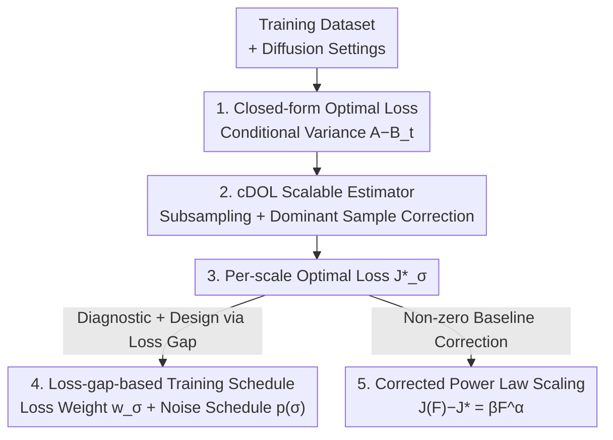

# Diagnosing and Improving Diffusion Models by Estimating the Optimal Loss Value

**Conference**: ICLR 2026  
**OpenReview**: [https://openreview.net/forum?id=X7JfjLKKLQ](https://openreview.net/forum?id=X7JfjLKKLQ)  
**Code**: The paper promises open-source release upon acceptance (not yet public)  
**Area**: Diffusion Models  
**Keywords**: Diffusion models, Optimal loss, Training schedule, Scaling laws, Denoising conditional variance

## TL;DR
This paper points out that the optimal loss value of diffusion models is not 0 but an unknown positive constant. Consequently, a "high loss" fails to distinguish between "intrinsically hard-to-fit data" and "insufficient model capacity." The authors derive a closed-form solution for this optimal loss, design a scalable estimator (cDOL) for large datasets, and utilize it to diagnose diffusion training, design superior training schedules (improving FID by 2%–25% on CIFAR-10/ImageNet), and make diffusion scaling laws more consistent with power laws.

## Background & Motivation

**Background**: Diffusion models have become the mainstream for high-dimensional generative modeling. Researchers continuously improve them across various dimensions, including prediction targets (score/$\epsilon/x_0/v$ prediction), diffusion process design (VP/VE/FM), and training schedules (noise distribution + loss weighting). Compared to GANs, their primary advantage is stable training with smooth, monitorable loss curves.

**Limitations of Prior Work**: Diffusion loss only reflects "relative" data-fitting quality—it is effective for comparing two models under the same settings or monitoring convergence trends, but it cannot measure "absolute" fitting degree to training data. The issue is that the optimal loss value (the lowest loss any model can achieve) **is not 0, but an unknown positive value**. Thus, upon convergence, it remains unclear whether the residual loss indicates the model has approached the oracle and cannot improve further, or if the model is underfitting and could be improved with better tuning. In practice, researchers rely on sampling to evaluate models, which is computationally expensive and confounded by sampler configurations.

**Key Challenge**: The actual loss value = Optimal Loss (a baseline related to data/diffusion settings) + Optimization Gap (related to model capacity). These two terms are conflated. When analyzing learning quality across different diffusion steps (noise scales) or designing training schedules, it is difficult to identify which steps have room for improvement. During scaling law research, using the actual loss directly as a metric "contaminates" the conclusions with this unknown baseline, leading to biased scaling results.

**Goal**: (1) "Subtract" the optimal loss from the actual loss by deriving a closed-form solution and creating a scalable estimator for large datasets; (2) Diagnose the fitting quality of mainstream diffusion models across various noise scales; (3) Design principled training schedules based on these findings; (4) Formalize a corrected version of diffusion scaling laws.

**Key Insight**: Start from the true learning objective of the loss function. While diffusion models nominally predict $x_0/\epsilon$, information theory prevents precise reconstruction of clean data from noisy samples; the model actually learns the **conditional expectation** $\mathbb{E}_{p(x_0\mid x_t)}[x_0]$. Since it learns the conditional expectation, even at the global optimum, a residual **conditional variance** remains in the loss—this is the source of the optimal loss, which depends solely on the dataset and diffusion settings, independent of model architecture.

**Core Idea**: Explicitly estimate the diffusion optimal loss and use the "loss gap" (actual loss minus optimal loss) instead of the "actual loss itself" as the true metric for data-fitting quality. This metric is then used to redo diagnostics, schedule design, and scaling law research.

## Method

### Overall Architecture

The work can be viewed as "one tool + three applications." The tool is the **estimation of the diffusion optimal loss**: first, a closed-form expression for the optimal loss is derived under a unified formula (the difference between a squared mean term and the expected squared conditional expectation), then a stochastic estimator, cDOL, is designed to scale to large datasets. Once equipped with this tool, the authors convert all mainstream diffusion models (different processes × different targets) into a common coordinate system (VE process with $x_0$ prediction) to compare their loss gaps across noise scales, leading to new observations used for training schedule design and scaling law correction.

### Key Designs

**1. Closed-form Optimal Loss: Pinning Residual Loss to "Denoising Conditional Variance"**

The pain point is that while researchers knew the optimal diffusion loss was non-zero, its exact value was unknown. Starting from the true learning target—conditional expectation—the authors derive the closed-form optimal loss for the $x_0$ prediction target (Theorem 1):

$$J^{(x_0)\star}_t = \underbrace{\mathbb{E}_{p_0(x_0)}\|x_0\|^2}_{A} - \underbrace{\mathbb{E}_{p(x_t)}\big\|\mathbb{E}_{p(x_0\mid x_t)}[x_0]\big\|^2}_{B_t}, \qquad J^\star = \mathbb{E}_{p(t)} w^{(x_0)}_t J^{(x_0)\star}_t.$$

This is equivalent to $J^{(x_0)\star}_t = \mathbb{E}_{p_t(x_t)}\,\mathrm{tr}\,\mathrm{Cov}_{p(x_0\mid x_t)}[x_0]$, which is the **average conditional variance** of the clean data given the noisy sample; thus, it is always positive (unless $t=0$ or the data collapses to a single point). This quantity has a clear physical meaning: when the noise scale $\sigma$ is very small, the noisy sample corresponds almost uniquely to its source, the conditional variance $\to 0$, and the optimal loss $\to 0$. As $\sigma$ increases, the sample becomes dominated by noise, correlation with $x_0$ disappears, $p(x_0\mid x_t) \approx p_{\text{data}}$, and the optimal loss converges to the **data variance**. Crucially, it **depends only on the dataset and diffusion settings, independent of model architecture or parametrization**, allowing it to be estimated offline once as a shared baseline. Optimal losses for other targets ($\epsilon$/score/v) can be converted via fixed ratios per Eqs.(3,4,5).

**2. cDOL Estimator: Reducing Quadratic Complexity via Subsampling and Correcting Bias**

In the closed-form solution, $A$ can be estimated in a single pass over the data. The difficulty lies in $B_t$, which contains nested expectations, with the inner posterior $p(x_0\mid x_t)$ not directly samplable. Expanding the posterior into a computable form via Bayes' rule, the standard empirical estimator $\hat B_t$ (Eq.9) requires normalizing a weighted kernel $K_t(x_t, x_0) = \exp(-\|x_t - \alpha_t x_0\|^2 / 2\sigma_t^2)$ over the entire dataset for every $x_t$, resulting in **quadratic complexity** $O(N^2)$, which is infeasible for large datasets.

A naive approach uses **Self-Normalized Importance Sampling (SNIS)** on a random subset of size $L \ll N$. However, diffusion brings a specific complication: when $\sigma_t$ is small, the kernel weights $K_t$ are almost exclusively dominated by the $x_0$ closest to $x_t/\alpha_t$. If this dominant sample is not in the random subset, variance explodes. The authors' clever fix: since each $x_t$ is generated by adding noise to a specific source sample $x_0^{(n_m)}$, and $\alpha_t \approx 1$ at low $\sigma$, that source sample is almost certainly the dominant one. Thus, they **force the source sample used to construct $x_t$ into the subset** (DOL estimator, Eq.10). However, this artificially introduces a correlation between $x_t$ and $x_0$, causing $B_t$ to be overestimated and the optimal loss underestimated. Finally, they use a coefficient $C$ to downweight this "self-pairing," resulting in the **corrected DOL (cDOL)** (Eq.11). Theoretically (Theorem 2), as $M\to\infty, C\to\infty$, cDOL (subset size $L$) and SNIS (subset size $L-1$) share the same expectation, making it a consistent estimator. In practice, setting $C \approx 4N/L$ achieves the lowest estimation error between the extremes of bias ($C=1$ DOL) and variance ($C=\infty$ SNIS), showing low sensitivity to $C$.

**3. Principled Training Schedule via Loss Gap: Aligning Weights and Noise to "Under-learned" Regions**

With per-scale optimal loss, the authors first convert mainstream models to the common $x_0$-prediction coordinate system under a VE process (using preconditioning coefficients in Eq.12, Table 1). Comparing the loss gap ("actual loss - optimal loss") reveals two new observations: ① $\epsilon$-prediction has large errors at high $\sigma$, dragging down generation quality (e.g., NCSN vs. EDM). ② Near the critical point $\sigma^\star$ (the largest $\sigma$ where optimal loss starts becoming positive), the loss gap is actually **negatively correlated** with FID—a trade-off exists where sacrificing fitting near $\sigma^\star$ to improve fitting in the region to the left of $\sigma^\star$ improves generation.

Accordingly, they design a training schedule (noise distribution $p(\sigma)$ + loss weights $w_\sigma$). Loss weights are set as the reciprocal of the optimal loss to bring all scales to the same magnitude, with a truncation $w^\star$ at small noise to prevent divergence. This is combined with a Gaussian weight $f(\sigma)$ to concentrate focus on the positively correlated region to the left of $\sigma^\star$:

$$w_\sigma = a\,\min\!\big(1/J^\star_\sigma,\; w^\star\big) + f(\sigma)\,\mathbb{I}_{\sigma<\sigma^\star},\qquad f(\sigma)=\mathcal N(\log\sigma;\mu,\varsigma^2).$$

The noise distribution is adaptively allocated based on the optimization gap: $p(\sigma) \propto w_\sigma(J_\sigma(\theta) - J^\star_\sigma)$, investing more training steps into scales where the gap positively correlates with performance. This schedule only requires estimating $J^\star_\sigma$ on the dataset and **requires no pre-trained models**.

**4. Corrected Power Law: Subtracting Non-zero Optimal Loss as a Bias Term**

When studying diffusion scaling laws, the traditional power law $J(F) = \beta F^\alpha$ assumes loss approaches 0 as compute $F$ increases. However, diffusion loss has a non-zero lower bound $J^\star$, causing the log-log curve to deviate from a straight line. The authors subtract the optimal loss as a bias term, using $J(F) - J^\star = \beta F^\alpha$, making $\log(J(F) - J^\star)$ linear against $\log F$. Validation using EDM2 (120M–1.5B) on ImageNet-64/512 shows that at high noise scales, the correlation coefficient $\rho$ improves from 0.82 to 0.94. For total loss, $\rho$ reaches 0.9917, yielding $J(F) = 0.3675\,F^{-0.014} + 0.015$. This demonstrates that a "cleaner" scaling law is obtained using the loss gap instead of raw loss.

## Key Experimental Results

### Main Results

Improvements in generation FID (lower is better) for advanced models (EDM, Flow Matching) on CIFAR-10 and ImageNet-64 using the proposed schedule:

| Dataset / Setting | Metric | Original Schedule | Ours | Gain |
|-------------------|--------|-------------------|------|------|
| CIFAR-10 · EDM (Cond.) | FID↓ | 1.79 | 1.75 | ↓2% |
| CIFAR-10 · FM (Cond., +EDM sampler) | FID↓ | 2.07 | 1.77 | ↓14% |
| ImageNet-64 · EDM (Cond.) | FID↓ | 2.44 | 2.25 | ↓8% |
| ImageNet-64 · FM (Cond., +EDM sampler) | FID↓ | 3.06 | 2.29 | ↓25% |

On ImageNet-256 (VA-VAE tokenizer + improved LightningDiT):

| Method | FID↓ (w/o CFG) | IS↑ (w/o CFG) | FID↓ (w/ CFG) | IS↑ (w/ CFG) |
|--------|----------------|---------------|---------------|---------------|
| LightningDiT (repro) | 2.29 | 206.2 | 1.42 | 292.9 |
| + Ours | **2.08** | **220.8** | **1.30** | **301.3** |

### Ablation Study

| Configuration / Analysis | Key Result | Description |
|--------------------------|------------|-------------|
| Estimator $C=1$ (DOL) | Large bias, underestimation | Failed to correct self-pairing correlation |
| Estimator $C=\infty$ (SNIS) | High variance, large error | Dominant samples rarely sampled |
| Estimator $C\approx 4N/L$ (cDOL) | Consistently lowest error | Optimal bias-variance trade-off |
| Scaling Law $J(F)=\beta F^\alpha$ (Orig) | $\rho=0.82$ | High noise scales, optimal loss not subtracted |
| Scaling Law $J(F)-J^\star=\beta F^\alpha$ (Corr) | $\rho=0.94$ | Same scale, more linear after subtracting optimal loss |

### Key Findings
- **Optimal loss increases monotonically with noise scale**: It remains near 0 before the critical point $\sigma^\star$ (where noisy samples retain clean information for perfect denoising), rises rapidly after $\sigma^\star$, and eventually converges to data variance. $\sigma^\star$ depends on the dataset—CIFAR-10 has the smallest $\sigma^\star$ due to its low resolution (32×32) making samples overlap easily under noise; ImageNet-64 has a smaller $\sigma^\star$ than the same-resolution FFHQ-64 due to more samples/diversity, and converges to a higher data variance.
- **Counter-intuitive trade-off near criticality**: The loss gap near $\sigma^\star$ is negatively correlated with FID, while the region further to the left is positively correlated. Thus, "abandoning" $\sigma^\star$ to strengthen the left region improves generation quality.
- **$\epsilon$-prediction struggles at high noise**: The $\epsilon$-prediction target exhibits significant errors at high $\sigma$, directly leading to poor generation quality, highlighting this region as a bottleneck for $\epsilon$-based models.

## Highlights & Insights
- **Decoupling "High Loss" from "Poor Learning"**: Decomposing diffusion loss into a "data-determined optimal baseline + model-determined optimization gap" is the most insightful aspect of this work—it gives absolute meaning to a metric previously treated as purely relative.
- **Training-free Estimator**: cDOL estimates the optimal loss using only the dataset, without needing to train models first. This allows it to guide schedule design **before** training begins at negligible cost.
- **"Forcing a Dominant Sample" as a General Trick**: In importance sampling where weights are dominated by a few neighbors (e.g., kernel density/expectation estimation), forcing known dominant samples into the subset and correcting the bias is an elegant, transferable technique for bias-variance balancing.
- **"Subtracting the Baseline" for Scaling Laws**: For any task with a non-zero loss lower bound (not just diffusion), subtracting the theoretical floor before fitting power laws yields cleaner scaling relations—a perspective worth transferring to other generation/regression tasks.

## Limitations & Future Work
- **Estimator Complexity**: While cDOL reduces $O(N^2)$ to subset scales, $M$ still often needs to reach 2–3x of $N$ for convergence. The trade-off between cost and precision on ultra-large datasets requires more validation.
- **Optimal Loss $\neq$ Generation Quality**: The authors emphasize that estimating optimal loss is not for "reaching" it (which would cause overfitting) but for providing an absolute metric. Its relationship with inference (FID) is complex, as evidenced by the negative correlation near the critical point.
- **Empirical Components in Schedule**: Hyperparameters like the truncation $w^\star$ and Gaussian parameters $\mu, \varsigma$ still require manual selection; the paper provides principles but not a fully automated method.
- **Extensions**: Applying this absolute metric to generalization analysis (training vs. test loss gap) or extending it to text/video diffusion models with higher dimensions and complex conditioning is the natural next step.

## Related Work & Insights
- **vs. Bao et al. (Analytic-DPM)**: They derive optimal ELBO under discrete Gaussian reverse processes to determine optimal reverse (co)variance; this work considers the general continuous case and provides a **training-free** estimator for the optimal loss value itself.
- **vs. Karras et al. (EDM / EDM2)**: EDM models decompose the design space and tune weights empirically; this work provides a more principled basis for such schedules using the "loss gap" and further improves FID even on top of EDM2.
- **vs. Existing Diffusion Scaling Studies**: Prior works often use raw training loss, which is "contaminated" by the optimal loss floor. This work uses the loss gap to correct the power law form.

## Rating
- Novelty: ⭐⭐⭐⭐⭐ Systematically proposes and estimates "optimal loss" for diffusion, turning a relative metric into an absolute one.
- Experimental Thoroughness: ⭐⭐⭐⭐ Extensive coverage of CIFAR-10/ImageNet across scales (120M–1.5B).
- Writing Quality: ⭐⭐⭐⭐ Logical progression from theory to application; however, heavy use of notation might pose a barrier to general readers.
- Value: ⭐⭐⭐⭐⭐ Provides a reusable diagnostic tool + plug-and-play schedule + cleaner scaling framework with universal value for diffusion research.

<!-- RELATED:START -->

## Related Papers

- [\[ICLR 2026\] Shortcut Diffusion Training with Cumulative Consistency Loss: An Optimal Control View](shortcut_diffusion_training_with_cumulative_consistency_loss_an_optimal_control_.md)
- [\[ICLR 2026\] AlignFlow: Improving Flow-based Generative Models with Semi-Discrete Optimal Transport](alignflow_improving_flow-based_generative_models_with_semi-discrete_optimal_tran.md)
- [\[ICLR 2026\] Improving Diffusion Models for Class-imbalanced Training Data via Capacity Manipulation](improving_diffusion_models_for_class-imbalanced_training_data_via_capacity_manip.md)
- [\[ICLR 2026\] Foresight Diffusion: Improving Sampling Consistency in Predictive Diffusion Models](foresight_diffusion_improving_sampling_consistency_in_predictive_diffusion_model.md)
- [\[ICLR 2026\] Steer Away From Mode Collisions: Improving Composition In Diffusion Models](steer_away_from_mode_collisions_improving_composition_in_diffusion_models.md)

<!-- RELATED:END -->
