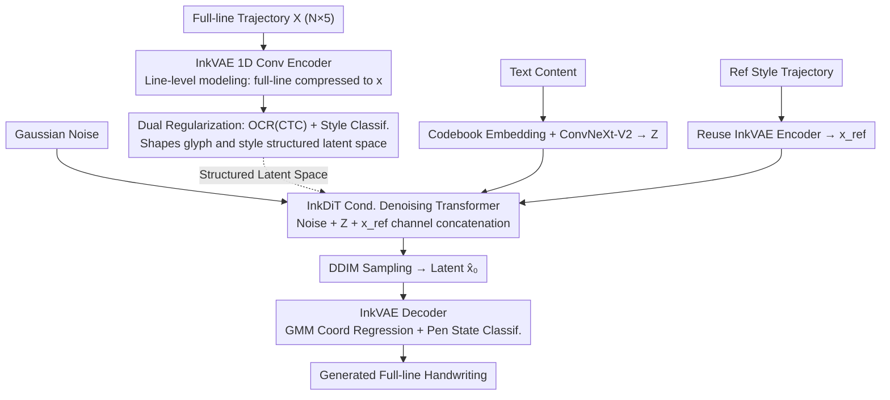

# DiffInk: Glyph- and Style-Aware Latent Diffusion Transformer for Text to Online Handwriting Generation

**Conference**: ICLR 2026  
**arXiv**: [2509.23624](https://arxiv.org/abs/2509.23624)  
**Code**: [https://github.com/awei669/DiffInk](https://github.com/awei669/DiffInk)  
**Area**: Diffusion Models / Handwriting Generation  
**Keywords**: online handwriting generation, latent diffusion transformer, VAE regularization, glyph-style disentanglement, Chinese handwriting  

## TL;DR
This paper proposes DiffInk, the first Latent Diffusion Transformer framework designed for full-line handwriting generation. It comprises InkVAE, which learns a structured latent space through dual regularization (OCR + style classification), and InkDiT, which performs conditional denoising within this latent space. DiffInk significantly outperforms Prev. SOTA on Chinese handwriting generation (AR 94.38% vs 91.48%) with an 800× speedup.

## Background & Motivation

**Background**: Text-to-Online Handwriting Generation (TOHG) primarily focuses on character-level or word-level generation. OLHWG (ICLR'25) is the recent Prev. SOTA, which generates individual characters first and then uses an external layout module to concatenate them into lines.

**Limitations of Prior Work**: (a) Character-level methods lack holistic structural modeling when forming lines, leading to unnatural boundaries; (b) Layout modules introduce extra errors, and decoupling layout from characters ignores structural dependencies between neighbors; (c) OLHWG is extremely inefficient, generating only 0.07 characters per second.

**Key Challenge**: The gap between character-level modeling and line-level coherence. In real handwriting, adjacent characters are closely related in morphology, spacing, and stroke connections; character-by-character generation followed by concatenation fails to capture these relationships.

**Goal**: Directly model full-line handwriting generation to achieve end-to-end line-level generation while ensuring glyph accuracy and style consistency.

**Key Insight**: Utilize a VAE to compress full-line handwriting sequences into a compact latent space, followed by conditional generation using a DiT within that space. The key innovation lies in the dual regularization of the VAE latent space—ensuring the latent space is not only capable of reconstruction but also possesses semantic structure.

**Core Idea**: Good VAE reconstruction does not necessarily imply a well-structured latent space. By applying dual regularization through OCR and style classification, the latent space acquires semantic structures for glyphs and styles, which is critical for diffusion model generation.

## Method

### Overall Architecture

DiffInk decomposes "Text → Full-line Handwriting" into two stages: first, a pre-trained variational autoencoder, InkVAE, compresses the full-line handwriting trajectory into a compact latent space; then, a Diffusion Transformer, InkDiT, performs conditional denoising generation within this latent space. InkVAE uses a 1D convolutional encoder to compress the entire line sequence $X \in \mathbb{R}^{N \times 5}$ (coordinates plus pen state) into a latent representation $x \in \mathbb{R}^{l \times d}$ in a single pass. Extra OCR and style supervision branches are attached to the latent space to shape it such that it is "both reconstructible and semantically structured for glyphs/styles." InkDiT is conditioned on text content $Z$ and a reference style $x_{\text{ref}}$, starting from Gaussian noise to denoise a clean latent representation $\hat{x}_0$. During inference, DDIM sampling obtains the latent representation, which is then passed to the InkVAE decoder (GMM regression for coordinates + pen state classification) to restore the visible full-line handwriting trajectory. The crux of the design is not the diffusion model itself, but the structuralization of the InkVAE latent space—the stability of downstream generation relies almost entirely on this.

### Key Designs

**1. Line-level Modeling: Directly modeling full-line trajectories to eliminate artifacts from "char-by-char generation and concatenation"**

Previous methods (e.g., OLHWG) generate characters one by one and rely on external layout modules, which artificially severs structural dependencies like inter-character spacing, cursive connections, and overall layout, leading to inconsistencies at joins. DiffInk avoids splitting characters: it uses a 1D convolutional encoder to compress the entire line into a latent representation, and the decoder uses a Gaussian Mixture Model (GMM) for coordinate regression and classification for pen states. Since the entire line is modeled together within one latent representation, the morphological and spacing relationships between adjacent characters are naturally preserved. This explains why style consistency scores jumped from 44.74 to 77.38. This "line-level compression—latent generation" paradigm also delivers an 800× speedup by removing the need for per-character diffusion and layout prediction.

**2. InkVAE Dual Regularization: Ensuring the latent space has glyph and style semantic structure, beyond mere reconstruction**

This step addresses a core pain point: "good reconstruction does not equal a good latent space." A standard VAE can reconstruct handwriting nearly perfectly (AR 97.59%), but its latent space is loose: small perturbations during diffusion generation can lead to incorrect characters or style drifts. DiffInk's approach is to add two supervisory constraints directly onto the latent space in addition to the standard VAE objective. The total loss is defined as:

$$\mathcal{L}_{\text{VAE}} = \lambda_{\text{rec}} \mathcal{L}_{\text{rec}} + \lambda_{\text{kl}} \mathcal{L}_{\text{kl}} + \lambda_{\text{ocr}} \mathcal{L}_{\text{ocr}} + \lambda_{\text{sty}} \mathcal{L}_{\text{sty}}$$

The OCR constraint is implemented via a Transformer recognition head with CTC loss, forcing the latent representation to retain readable glyph information. The style constraint uses an LSTM with attention pooling followed by classification loss, forcing the latent representation to encode writing styles. Both act directly on the latent space, causing latent vectors of the same character or style to cluster together. Once the latent space is structured this way, diffusion sampling becomes much more stable—this is the root cause of the AR jump from 74.77% to 94.38% in the ablation study.

**3. InkDiT Condition Design: Cleanly injecting text content and reference style into the diffusion model**

For controllable generation, the model must know "what to write" and "what style to use." The text content path starts with learnable codebook embeddings, followed by a ConvNeXt-V2 content encoder to produce $Z$. Large-kernel depthwise convolutions are chosen deliberately for their wide receptive field, allowing them to capture long-range dependencies across variable-length text, easing the alignment challenge between full-line text and handwriting trajectories. The style path reuses the InkVAE encoder to encode the reference trajectory into $x_{\text{ref}}$, saving the cost of training a separate style encoder. Finally, noise, content, and style are concatenated along the channel dimension and fed into the DiT, steering the denoising process with both conditions.

### Loss & Training

- InkVAE: 100 epochs, batch size 128, lr $5 \times 10^{-4}$
- InkDiT: 200k steps, batch size 256, lr $7.5 \times 10^{-5}$
- Diffusion Objective: Predicting the clean latent representation $x_0$ (instead of noise) using a masked MSE loss.

## Key Experimental Results

### Main Results (CASIA-OLHWDB 2.0-2.2, Chinese Handwriting)

| Method | Output Level | AR% ↑ | CR% ↑ | Style ↑ | DTW ↓ | Speed (char/s) ↑ |
|------|---------|-------|-------|---------|-------|----------------|
| OLHWG (ICLR'25) | Char+Layout | 91.48 | 91.71 | 44.74 | 1.326 | 0.07 |
| SDT (CVPR'23) | Char-level | 82.53 | 83.00 | 50.51 | 1.270 | 3.35 |
| **DiffInk (Ours)** | **Line-level** | **94.38** | **94.58** | **77.38** | **1.049** | **58.47** |

### Ablation Study (Impact of InkVAE Regularization on InkDiT)

| Config | VAE AR% | DiT AR% | DiT Style ↑ |
|------|---------|---------|-------------|
| $\mathcal{L}_{\text{rec+kl}}$ only | 97.59 | 74.77 | 60.68 |
| + $\mathcal{L}_{\text{ocr}}$ | 97.60 | 82.09 | 66.07 |
| + $\mathcal{L}_{\text{sty}}$ | 97.59 | 79.64 | 68.99 |
| + both (InkVAE) | **97.65** | **94.38** | **77.38** |

### Key Findings
- **VAE reconstruction performance is almost unaffected by regularization** (AR 97.59→97.65), yet diffusion generation performance skyrocketed from 74.77% to 94.38%—proving that latent space structure, rather than reconstruction quality, is the key to generation.
- Dual regularization outperforms the sum of individual parts (82.09 + 79.64 < 94.38), indicating a synergy in the joint decoupling of glyph and style.
- Line-level modeling is 800× faster than OLHWG (58.47 vs 0.07 char/s) because direct full-line generation avoids per-character diffusion and layout prediction.
- Style consistency scores rose from 44.74 to 77.38 (+32.64), demonstrating that line-level modeling maintains style coherence better than concatenation.

## Highlights & Insights
- **"Good VAE reconstruction ≠ good latent space"** is a profound insight. This explains why many VAE-based Latent Diffusion Models (LDMs) perform poorly—the latent space can perfectly reconstruct but lacks the semantic structure to handle the small perturbations introduced during diffusion, leading to uncontrollable semantic changes. This insight is transferable to LDMs in other domains like image, video, or 3D.
- **Lightweight latent space regularization** (requiring only two small classifiers) significantly improves downstream generation quality at a very low cost. This is a generalizable design principle.
- The comparison between **line-level modeling vs. character-level concatenation** highlights the inherent advantage of end-to-end methods in capturing global dependencies.

## Limitations & Future Work
- Validated only on Chinese handwriting; lack of experiments on English/Arabic or other script systems.
- Requires a known character set (codebook); generalization to open-vocabulary/rare characters is untested.
- Reference style still requires samples from the same author; zero-shot generation from descriptions is not supported.
- Absolute values for the DTW metric (1.049) still have room for improvement.
- While 800× faster than OLHWG, it is only about 2× faster than autoregressive methods (WLU 25 char/s).

## Related Work & Insights
- **vs OLHWG**: DiffInk uses direct line-level generation, avoiding extra errors from layout modules. It leads in all metrics, particularly with the 800× speedup.
- **vs SDT**: SDT uses dual-branch contrastive learning for content/style decoupling; DiffInk simplifies this by applying regularization to the latent space, which is cleaner and more effective.
- **vs Image-domain LDMs**: DiffInk proves that latent diffusion is equally effective for sequential data (handwriting trajectories) and that the importance of latent space regularization may have been previously overlooked.

## Rating
- Novelty: ⭐⭐⭐⭐ First line-level latent diffusion framework; valuable latent space regularization insight.
- Experimental Thoroughness: ⭐⭐⭐⭐ Comprehensive ablation, though limited to one dataset (Chinese).
- Writing Quality: ⭐⭐⭐⭐⭐ Clear figures and logical flow from motivation to method and experiments.
- Value: ⭐⭐⭐⭐ Significant advancement for the handwriting generation field; latent space regularization is a broadly applicable idea.

<!-- RELATED:START -->

## Related Papers

- [\[ICLR 2026\] W-Edit: A Wavelet-based Frequency-aware Framework for Text-driven Image Editing](w-edit_a_wavelet-based_frequency-aware_framework_for_text-driven_image_editing.md)
- [\[ICLR 2026\] Learning to Generate Stylized Handwritten Text via a Unified Representation of Style, Content, and Noise](learning_to_generate_stylized_handwritten_text_via_a_unified_representation_of_s.md)
- [\[ICLR 2026\] LaTo: Landmark-tokenized Diffusion Transformer for Fine-grained Human Face Editing](lato_landmark-tokenized_diffusion_transformer_for_fine-grained_human_face_editin.md)
- [\[ICLR 2026\] ColorCtrl: 基于多模态扩散 Transformer 的免训练文本引导颜色编辑](training-free_text-guided_color_editing_with_multi-modal_diffusion_transformer.md)
- [\[ICLR 2026\] MOSAIC: Multi-Subject Personalized Generation via Correspondence-Aware Alignment and Disentanglement](mosaic_multi-subject_personalized_generation_via_correspondence-aware_alignment_.md)

<!-- RELATED:END -->
