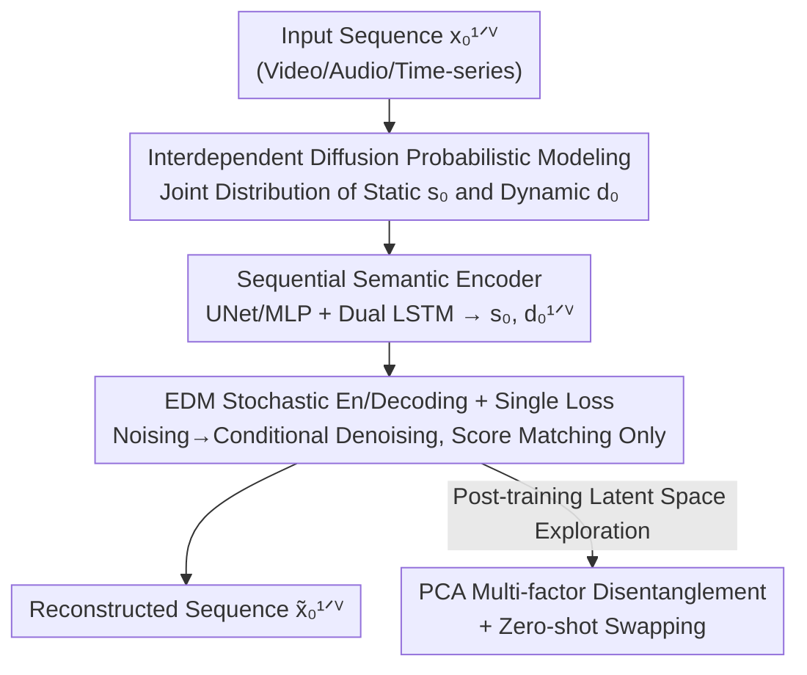

# DiffSDA: Unsupervised Diffusion Sequential Disentanglement Across Modalities

**Conference**: ICLR2026  
**OpenReview**: [https://openreview.net/forum?id=tooDJHBSvO](https://openreview.net/forum?id=tooDJHBSvO)  
**Code**: https://github.com/azencot-group/DiffSDA  
**Area**: Diffusion Models / Unsupervised Representation Learning / Sequential Disentanglement  
**Keywords**: Sequential Disentanglement, Diffusion Models, Static/Dynamic Factors, Modality-Agnostic, Unsupervised Representation Learning

## TL;DR
DiffSDA utilizes a diffusion-based probabilistic framework to unsupervisedly decompose video, audio, and time-series data into "static factors" and "dynamic factors." It achieves disentanglement using only a **single score matching loss** (instead of the usual array of regularization terms in VAE/GANs). It is the first to achieve high-quality swapping, zero-shot transfer, and multi-factor exploration on real high-resolution videos.

## Background & Motivation
**Background**: Sequential disentanglement aims to decompose a sequence into "time-invariant static factors" and "time-varying dynamic factors"—for example, in a talking head video, the static factor is the facial identity, while the dynamic factor consists of mouth movements and head motion. As a valuable branch of unsupervised representation learning, it enhances interpretability, mitigates bias, and improves generalization.

**Limitations of Prior Work**: Existing mainstream methods (C-DSVAE, SPYL, DBSE, etc.) are almost entirely built on VAEs or GANs, relying on **multiple loss terms** (mutual information regularization, prior constraints, etc.) to force disentanglement. For instance, C-DSVAE requires tuning 5 hyperparameters just to balance its loss terms; SPYL also employs 5 losses. This makes optimization fragile and difficult to tune. Furthermore, these methods are mostly validated on toy datasets (like MNIST animations) and fail to produce decent samples on real high-resolution videos.

**Key Challenge**: While diffusion models provide state-of-the-art (SOTA) generation quality, **no probabilistic modeling theory exists for "sequential disentanglement via diffusion models"**—existing diffusion autoencoders (DiffAE, InfoDiffusion) either do not target sequences or do not inherently produce disentangled representations. Consequently, the field lacks a mathematical framework to combine the high quality of diffusion with the benefits of disentanglement.

**Goal**: (1) Provide a diffusion-process-based probabilistic modeling framework for sequential disentanglement; (2) Enable it to work on real-world multi-modal data using only a single loss term; (3) Establish a label-free evaluation protocol for video disentanglement.

**Key Insight**: The authors hypothesize that if static and dynamic factors are provided as conditions to a standard diffusion denoising process, **disentanglement can "naturally emerge" from the structure** without the need for extra regularization. This is due to two reasons: static factors are shared across the entire sequence and thus cannot store dynamic information; dynamic factors have restricted dimensions and thus cannot capture static details.

**Core Idea**: Replace "VAE/GAN + multiple regularizations" with "a pair of interdependent diffusion processes + a shared low-dimensional semantic encoder," allowing a single standard diffusion loss to drive modality-agnostic sequential disentanglement.

## Method

### Overall Architecture
DiffSDA is a diffusion autoencoder that takes a sequence $x_0^{1:V}$ ($V$ is the sequence length; superscript denotes sequence time, subscript denotes diffusion time) and outputs a reconstructed or swapped sequence. The pipeline consists of three components: a **sequential semantic encoder** that compresses the input into a sequence-wide shared static factor $s_0$ and frame-wise dynamic factors $d_0^{1:V}$; a **stochastic encoder** that adds noise per frame in an EDM fashion to obtain $x_t^{1:V}$; and a **stochastic decoder** $D_\theta$ that denoises the latent variables back to a clean sequence $\tilde{x}_0^{1:V}$ conditioned on the static and dynamic factors. The entire system is trained using a single score matching loss. Swapping, zero-shot transfer, and multi-factor PCA exploration are downstream operations performed on the trained latent space.

### Key Designs

**1. Interdependent Diffusion Probabilistic Modeling: Establishing the Mathematical Foundation**

Previous methods (C-DSVAE, SPYL) assume static and dynamic factors are **independent**. DiffSDA takes the opposite approach, modeling them as **interdependent**. Specifically, it characterizes the joint distribution using two diffusion processes: one for the prior distribution of the static/dynamic factors themselves, and another for the dependency of the observed sequence on these factors. The joint distribution is defined as:

$$p(x_0^{1:V}, x_T^{1:V}, s_0, s_T, d_0^{1:V}, d_T^{1:V}) = p_{T0}(s_0, d_0^{1:V}\mid s_T, d_T^{1:V})\prod_{\tau=1}^{V} p_{T0}(x_0^\tau\mid x_T^\tau, s_0, d_0^\tau)$$

The posterior explicitly assumes temporal dependency for the dynamic factors: $p(x_t^{1:V}, s_0, d_0^{1:V}\mid x_0^{1:V}) = p_{0t}(x_t^{1:V}\mid x_0^{1:V})\,p(s_0\mid x_0^{1:V})\prod_\tau p(d_0^\tau\mid d_0^{<\tau}, x_0^{\le\tau})$, meaning the static factor observes the full sequence while dynamic factors observe only current and previous steps. The authors provide three reasons for this dependency: **Expressivity**—dependency allows the marginal distribution $p_{t0}$ to learn richer trajectories; **Efficiency**—the sampler is non-autoregressive, allowing fast parallel sampling; **Causality**—the model can learn complex relationships between static and dynamic features when necessary. Empirically, switching from independent to interdependent modeling improves generation quality by approximately **13%**. This modeling is the core theoretical contribution, integrating sequential disentanglement into a diffusion probabilistic framework for the first time.

**2. Sequential Semantic Encoder: Forcing Disentanglement via Shared Static and Low-dimensional Dynamic Structures**

The encoder extracts $s_0$ and $d_0^{1:V}$ from the sequence. It first uses a backbone (U-Net for video, MLP for other modalities) with linear layers to process each sequence element independently, followed by an LSTM to aggregate the sequence into hidden states $h^{1:V}$. The final hidden state $h^V$ passes through a linear layer to produce the **sequence-wide shared static factor** $s_0$, while $h^{1:V}$ is processed by another LSTM and linear layer to yield **frame-wise dynamic factors** $d_0^{1:V}$. This structural design is the source of disentanglement: $s_0$ is shared across all $\tau$ and thus cannot capture frame-by-frame changes; the dimension $k$ of $d_0^\tau\in\mathbb{R}^k$ is intentionally small, so it cannot hold static appearance details. Switching modalities only requires minor changes, such as replacing the U-Net with an MLP, forming the basis for its "modality-agnostic" nature.

**3. EDM-based Stochastic Decoding + Single Loss: Discarding Regularization for a Single Score Matching Term**

The decoder $D_\theta$ utilizes the preconditioning parametrization from EDM:

$$\tilde{x}_0^\tau = D_\theta(x_t^\tau, t, z_0^\tau) = c^{\text{skip}}_t x_t^\tau + c^{\text{out}}_t F_\theta(c^{\text{in}}_t x_t^\tau, z_0^\tau, c^{\text{noise}}_t)$$

Where $z_0^\tau := (s_0, d_0^\tau)$ are the disentangled factors for the frame, injected into the network $F_\theta$ via AdaGN; $c^{\text{skip}}, c^{\text{in}}, c^{\text{out}}, c^{\text{noise}}$ are standard EDM scaling/modulation terms. The training objective is a single denoising score matching loss:

$$\mathbb{E}_{t,x_t^\tau,z_0^\tau,x_0^\tau}\Big[\lambda_t (c^{\text{out}}_t)^2\big\|F_\theta - \tfrac{1}{c^{\text{out}}_t}(x_0^\tau - c^{\text{skip}}_t x_t^\tau)\big\|_2^2\Big]$$

**No mutual information terms, KL terms, adversarial terms, or extra regularizations are used**—this is a significant simplification compared to SPYL (5 terms) or DBSE (2 terms). The EDM framework also allows inference in just **63 Number of Function Evaluations (NFE)**, much faster than standard diffusion. To support high-resolution videos, the decoder is wrapped in a Latent Diffusion Model (LDM) framework: high-dimensional frames are compressed using a pre-trained VQ-VAE, and diffusion is performed in the latent space (denoted as $x_0^{1:V}$).

**4. Post-training Multi-factor Disentanglement + Zero-shot Transfer: Refining Latents and Generalizing to Unseen Data**

After training, the authors discovered that the learned latent space can be **further decomposed unsupervisedly**. Inspired by DiffAE, PCA is performed on a large set of sampled static vectors $\{\hat s_j\}_{j=1}^{b}$ ($b=2^{15}$) to find principal components $\{v_i\}$. Static codes of real samples can then be shifted along these components:

$$\bar s = \Big(\tfrac{s-\mu_{\hat s}}{\sigma_{\hat s}} + \alpha v_i\cdot\sqrt{h}\Big)\cdot\sigma_{\hat s} + \mu_{\hat s}$$

Setting $\alpha=0$ recovers the original, while non-zero $\alpha$ values continuously modify interpretable attributes (e.g., on VoxCeleb, moving in one direction increases masculinity while the other increases femininity, with other factors remaining stable). Additionally, the model supports **zero-shot disentanglement**: a model trained on VoxCeleb can perform swapping on MUG or CelebV-HQ samples by freezing the target static code and applying source dynamics. The model modifies expressions and poses correctly, demonstrating cross-dataset generalization.

### Loss & Training
The model optimizes only the denoising score matching loss (Eq. 5), with weights $\lambda_t$ set according to EDM and $t\sim U[0,T]$ sampled uniformly. The prior diffusion $p_{T0}(s_0,d_0^{1:V})$ is not part of this loss and can be optimized separately. High-resolution videos use LDM (VQ-VAE latent space), while other modalities are trained in the original space. Modality switching involves only backbone replacement (U-Net ↔ MLP).

## Key Experimental Results

### Main Results
On video, audio, and time-series data, DiffSDA is compared against modality-agnostic SOTAs (SPYL, DBSE). Video is evaluated using AED (static/object preservation) and AKD (dynamic/motion preservation) in swapping tasks.

| Dataset | AED↓ (Static Fixed) Ours | AED Best Baseline | AKD↓ (Dynamic Fixed) Ours | AKD Best Baseline |
|--------|------|----------|------|------|
| MUG (64²) | **0.751** | 0.766 (SPYL) | **0.802** | 1.118 (DBSE) |
| VoxCeleb (256²) | **0.846** | 1.026 (DBSE) | **2.793** | 4.705 (SPYL) |
| CelebV-HQ (256²) | **0.540** | 0.631 (SPYL) | **6.932** | 28.69 (DBSE) |
| TaiChi-HD (64²) | 0.326 | **0.325** (DBSE) | **2.143** | 6.312 (DBSE) |

The leads in AKD are particularly substantial (e.g., 6.9 vs 28.7 on CelebV-HQ). Reconstruction errors (AED/AKD/MSE) are also orders of magnitude better; on MUG, MSE is $3\times10^{-7}$ compared to $10^{-3}$ for SPYL/DBSE.

For audio speaker identification (TIMIT/LibriSpeech), EER is used: effective disentanglement should yield low Static EER (capturing identity) and high Dynamic EER (content only), maximizing the Dis. Gap.

| Dataset | Method | Static EER↓ | Dynamic EER↑ | Dis. Gap↑ |
|--------|------|------|------|------|
| TIMIT | DBSE | 3.50% | 34.62% | 31.11% |
| TIMIT | **Ours** | 4.43% | **46.72%** | **42.29%** |
| LibriSpeech | SPYL | 24.87% | 49.76% | 24.89% |
| LibriSpeech | **Ours** | **11.02%** | 45.94% | **34.93%** |

On TIMIT, the Dis. Gap is over 11 percentage points higher than DBSE. Time-series tasks (prediction and classification on PhysioNet/ETTh1/Air Quality) also outperform GLR/SPYL/DBSE and even supervised baselines.

### Ablation Study

| Configuration | Key Finding | Description |
|------|---------|------|
| Interdependent vs Independent Modeling | Gen. Quality +13% | Interdependent modeling is more expressive for joint distributions. |
| Single Loss vs Multiple Losses | Still Disentangles | Disentanglement stems from structure (shared static/low-dim dynamic), not regularization. |
| EDM Sampling | 63 NFE | Inference is significantly faster than standard diffusion models. |

### Key Findings
- **Disentanglement is squeezed out by structure, not forced by regularization**: Shared static factors and restricted-dimension dynamic factors are sufficient to separate information naturally.
- **Interdependent modeling is a source of quality**: Shifting from independent to interdependent factors improves generation quality by 13%, challenging the common "independence" assumption.
- **Real high-resolution video is the benchmark**: While SPYL/DBSE fail on 256² videos, DiffSDA succeeds by utilizing LDM and EDM.

## Highlights & Insights
- The **structural argument for "single-loss disentanglement"** is compelling: attributing disentanglement to verifiable structural properties (shared static + low-dim dynamic) simplifies training and provides an interpretable mechanism.
- **Engineering simplicity in modality-agnosticism**: Moving across video, audio, and time-series only requires changing the backbone, making this a general framework for cross-modal disentangled representation learning.
- **Zero-shot swapping and PCA exploration** extend the interpretability of diffusion autoencoder latent spaces from single images (DiffAE) to sequences.
- The new **AED/AKD unsupervised evaluation** protocol bypasses the need for labels or high-quality discriminators, contributing to standardized evaluation in real-world sequential disentanglement.

## Limitations & Future Work
- **Frame-by-frame generation limits spatiotemporal consistency**: Current video decoding is per-frame; the authors suggest that future integration with latent video diffusion models (e.g., LVDM) could improve fidelity.
- **Computational efficiency**: Although EDM reduces NFE to 63, the combination of LDM, dual LSTMs, and per-frame decoding remains computationally heavy.
- **Multi-factor disentanglement is exploratory**: While PCA identifies components like gender or skin tone, systematically decomposing multiple interacting factors remains an open challenge.
- **Expansion to heterogeneous time-series**: Modalities with drastically different temporal characteristics, like sensor data, may require specific architectural adaptations.

## Related Work & Insights
- **vs. SPYL / DBSE (VAE-based Modality-agnostic)**: These rely on 2–5 loss terms and independent priors, primarily working on toy data. DiffSDA uses a single diffusion loss with interdependent modeling and LDM to achieve SOTA on high-resolution real data.
- **vs. DiffAE / InfoDiffusion (Diffusion-based/Non-sequential)**: These target single images. DiffSDA extends the interpretability of these latent spaces to sequences and explicitly models temporal dependencies.
- **vs. FOM / AA / MA (Animation-based)**: While these perform well on videos, they are modality-specific (dependent on video priors). DiffSDA offers a unified framework across video, audio, and time-series.

## Rating
- Novelty: ⭐⭐⭐⭐⭐ Establishes the first probabilistic framework for diffusion-based sequential disentanglement and disrupts the VAE/GAN paradigm with interdependent modeling.
- Experimental Thoroughness: ⭐⭐⭐⭐⭐ Covers three modalities and various downstream tasks with a new evaluation protocol.
- Writing Quality: ⭐⭐⭐⭐ Clear links between theory and implementation, though symbol-dense.
- Value: ⭐⭐⭐⭐⭐ A practical and reproducible step for unsupervised sequential representation learning via single-loss modality-agnostic diffusion.

<!-- RELATED:START -->

## Related Papers

- [\[ICLR 2026\] From Parameters to Behaviors: Unsupervised Compression of the Policy Space](from_parameters_to_behaviors_unsupervised_compression_of_the_policy_space.md)
- [\[CVPR 2026\] Towards Robust Sequential Decomposition for Complex Image Editing](../../CVPR2026/image_generation/towards_robust_sequential_decomposition_for_complex_image_editing.md)
- [\[ICML 2026\] SURF: Separation via Unsupervised Remixing Flow](../../ICML2026/image_generation/surf_separation_via_unsupervised_remixing_flow.md)
- [\[ICCV 2025\] FlowTok: Flowing Seamlessly Across Text and Image Tokens](../../ICCV2025/image_generation/flowtok_flowing_seamlessly_across_text_and_image_tokens.md)
- [\[ICML 2026\] Transferable Multi-Bit Watermarking Across Frozen Diffusion Models via Latent Consistency Bridges](../../ICML2026/image_generation/transferable_multi-bit_watermarking_across_frozen_diffusion_models_via_latent_co.md)

<!-- RELATED:END -->
