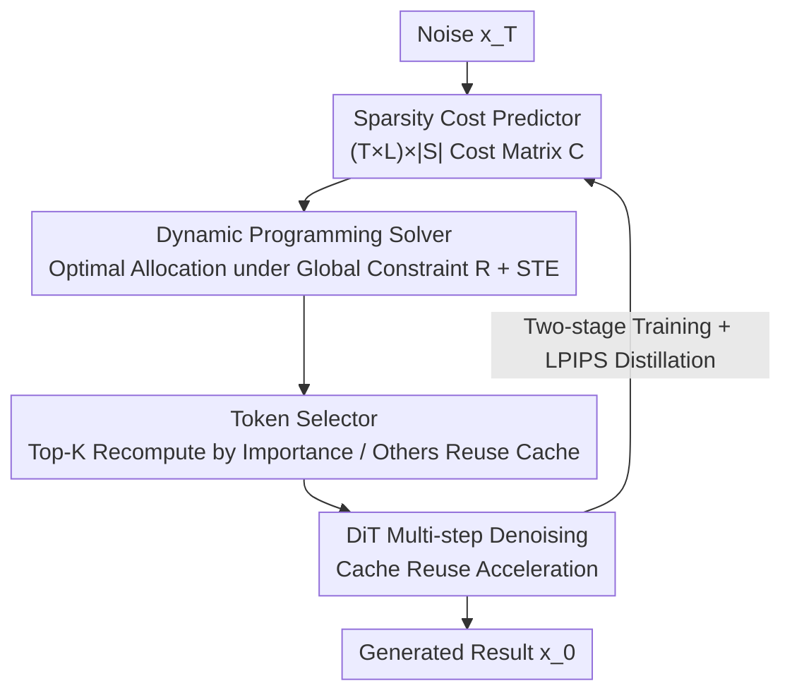

# DiffSparse: Accelerating Diffusion Transformers with Learned Token Sparsity

**Conference**: ICLR2026  
**OpenReview**: [https://openreview.net/forum?id=V3eUas3VCL](https://openreview.net/forum?id=V3eUas3VCL)  
**Code**: To be confirmed  
**Area**: Diffusion Models / Generative Model Acceleration  
**Keywords**: Diffusion Transformer, Token Cache, Layer-wise Sparsity, Dynamic Programming, Perceptual Distillation

## TL;DR
DiffSparse reformulates token cache acceleration for Diffusion Transformers as a differentiable optimization problem of "allocating sparsity rates per layer and time step under a fixed compression rate." It uses a learnable sparsity cost predictor to output a cost matrix, solves for the global optimal allocation via dynamic programming, and employs a two-stage training process to eliminate "full-step computation" required by traditional methods. On PixArt-α, it saves 54% GFLOPs while surpassing the original model's FID.

## Background & Motivation
**Background**: Diffusion models provide high generation quality, but multi-step denoising entails significant inference costs. Training-free "feature caching" is a popular acceleration route—since intermediate features are highly similar between adjacent denoising steps, features calculated in the previous step are cached and reused, avoiding redundant computation. Early methods cached coarse-grained features at the layer-level, while subsequent token caching methods (ToCa, DuCa, etc.) refined the granularity to individual tokens, sorting by importance to reuse some and recompute others for more pronounced acceleration.

**Limitations of Prior Work**: Existing token caching methods have two major drawbacks. First, the reuse sparsity rate for each layer and time step must be **manually set**, creating a massive parameter space that is difficult to tune and limits scalability. Second, to maintain image quality, they must preserve several **full-forward (full-step) computation** denoising steps—no caching is performed in these steps, effectively abandoning acceleration where it is most needed and wasting the potential of token caching.

**Key Challenge**: The "quality-speed" trade-off in sparsity allocation is essentially a **combinatorial optimization problem**—distributing a limited "computational budget" to the most critical locations across $L$ layers × $T$ steps under a total compression rate $R$. Manual heuristics can neither achieve global optimality nor bypass the "full-step" fallback design.

**Goal**: (1) Transform layer-wise sparsity rates from manual tuning to end-to-end learnable; (2) Eliminate dependency on predefined full steps by adaptively shifting computation to where it is most needed.

**Core Idea**: Explicitly model "acceleration under fixed compression" as a **layer-wise sparsity allocation problem across time steps**. A small learnable network predicts the "cost" for each (layer, step, sparsity level), then dynamic programming finds the optimal allocation under global constraints. Finally, Straight-Through Estimation (STE) allows discrete masks to backpropagate gradients, making the entire pipeline end-to-end trainable.

## Method

### Overall Architecture
DiffSparse builds upon existing token caching mechanisms: the input is noise $x_T$, and the output is the denoised result $x_0$. At each intermediate step, the model decides "which tokens to recompute and which to reuse from cache." It forms a decision chain with three components: the **Sparsity Cost Predictor** first predicts a normalized cost matrix $C \in \mathbb{R}^{(T\times L)\times |S|}$ for all (time step $t$, layer $l$, candidate sparsity level $s$); the **Dynamic Programming Solver** identifies the sparsity allocation with the minimum cumulative cost under the global constraint "total sparsity = $R$" and generates binary masks for each layer; the **Token Selector** then determines which top-$K$ tokens to recompute based on the masks and token importance, while reusing the cache for the rest. During training, the original unpruned model acts as the teacher and the pruned model as the student; an LPIPS perceptual distillation loss aligns their multi-step sampling outputs. Gradient approximation for the discrete DP masks is handled via STE to train the cost predictor. This two-stage strategy gradually replaces "full steps" with cached steps. Note that DP is only executed during training (~30 seconds); at inference, the model uses precomputed masks with zero overhead.

### Key Designs

**1. Learnable Sparsity Cost Predictor: Making "how much sparsity per layer" learnable**

To address the pain point of manually setting sparsity rates, DiffSparse parameterizes costs using a set of $(T\times L)\times |S|$ learnable parameters. Given $L$ layers and $T$ denoising steps, the goal is to generate a binary mask $M\in\{0,1\}^N$ for each (layer $l$, step $t$), selecting $K_{l,t}$ tokens for full computation and $N-K_{l,t}$ for cache reuse. Candidate sparsity levels come from a discrete set $S$; for example, with sequence length $N=256$ and a step size of 32, $S=\{0, 0.25, 0.5, 0.75, 1.0\}$ (corresponding to retaining $\{0, 64, 128, 192, 256\}$ tokens). Each element $C_{(t,l),s}$ in the predictor's normalized cost matrix $C$ quantifies the cost of applying sparsity level $s$ at step $t$ and layer $l$. A key insight is that **the predictor's size depends only on $T, L, |S|$, and is independent of the token sequence length $N$**. This allows natural cross-resolution transfer: allocations learned at 256×256 remain effective at 512×512 (Table 4), bypassing the memory explosion issues of direct training at high resolutions. Ablations show diminishing or negative returns as $|S|$ increases beyond a certain point (Table 7, $|S|=5$ with 0.25 intervals is optimal).

**2. Dynamic Programming Sparsity Allocation Solver: Optimal layer-wise allocation under global constraints**

Given the cost matrix, how is the minimum cost scheme selected under the hard constraint "total sparsity must equal $R$"? This is a constrained combinatorial optimization problem that DiffSparse solves exactly using dynamic programming. Define the state $F(\hat l, r)$ as the "minimum cost when allocating sparsity to the first $\hat l$ layers with a cumulative sparsity of $r$." The transition equation is:

$$F(\hat l, r) = \min_{s\in S,\, s\le r}\big( F(\hat l-1,\, r-s) + C_{\hat l, s} \big),$$

iteratively solved for $\hat l = 1,\dots,L\cdot T$ and $r=0,\dots,\hat R$ (where $\hat R = R\cdot L\cdot T$), followed by backtracking to reconstruct the optimal allocation. The complexity is $O((L\cdot T)^2\cdot |S|)$, which takes approximately 30 seconds under actual configurations with pre-pruning of redundant states. Since the "cost matrix → discrete mask" step is non-differentiable, DiffSparse uses a Straight-Through Estimator (STE) to approximate the gradient of the discrete mask with respect to the cost prediction, enabling end-to-end optimization. Compared to traditional searches like random search or genetic algorithms, DP + learnable costs find better allocations (FID 26.91 vs 28.34 / 27.94) while reducing training time from ~16 hours to ~4 hours.

**3. Token Selector: Determining which tokens to recompute per layer**

The DP solver provides the number of tokens to retain (the sparsity level) per layer, while the Token Selector determines which specific tokens to keep. It assigns each token $\hat x_i$ a composite importance score:

$$S(\hat x_i) = B\Big(\sum_{q=1}^{Q}\lambda_q\, s_q(\hat x_i)\Big),$$

where each $s_q$ represents a signal characterizing token importance (e.g., self-attention influence, cross-attention focus, cache reuse frequency), and $\lambda_q$ are weighting hyperparameters. $B(\cdot)$ is an optional "spatial reward" operator that encourages uniform spatial distribution of selected tokens (e.g., rewarding local maxima in $k\times k$ neighborhoods). Tokens are sorted by score in descending order; the top-$K$ (where $K$ is determined by the DP-selected sparsity) are recomputed, while others reuse the cache. The authors emphasize that this scoring module is **orthogonal** to the specific sorting heuristic; replacing it with cosine similarity or $\ell_2$ norm sorting still benefits from DiffSparse's allocation (Table 5), with attention scores performing best (FID improvement -1.44) and norm scores worst (introducing noise).

**4. Two-stage Training Strategy: Gradually removing "full-step" dependency**

Traditional methods rigidly retain several full steps to correct noise errors. DiffSparse aims to release this computational power, but immediate full caching degrades quality. Thus, a two-stage training strategy is designed. In the first stage, following existing practices, $T_f$ full-step positions are preset. Two cost matrices are optimized **independently**: a step cost $C_f\in\mathbb{R}^{T\times 2}$ for temporal sparsity decisions and a layer sparsity cost $C_l\in\mathbb{R}^{(L\times T)\times|S|}$ for token retention. DP selects the $|T_f|$ full-step positions with the lowest cost on $C_f$, and a "warm-start" is applied to these positions by subtracting a constant $\delta$ from the full-level ($s=N$) predicted cost:

$$C_l^{(t,l,s)} \leftarrow C_l^{(t,l,s)} - \delta,\quad \forall t\in T_f,\, l\in\{1,\dots,L\},\, s=N.$$

This retains the relative cost ranking across layers while leveraging the error-correction capability of full steps as guidance. In the second stage, step costs are merged into layer sparsity (via the same warm-start formula), and the unified cost matrix is fine-tuned to systematically reallocate FLOPs among sampling steps, allowing the influence of full steps to fade and be replaced by adaptive cached steps. Ablation shows that two-stage training is superior to single-stage (FID 26.91 vs 27.40); a warm-start intensity of $\delta=10$ is optimal (Table 8).

## Loss & Training
Training utilizes the **LPIPS Perceptual Distillation Loss**: the original unpruned model serves as the teacher and the pruned version as the student. Both perform a complete multi-step sampling to obtain outputs $x_0$ (teacher) and $x_0'$ (student). The loss is defined as:

$$\mathcal{L}_{\text{LPIPS}} = \text{LPIPS}(x_0, x_0'),$$

with gradients backpropagated only to the student (teacher parameters are detached). Compared to L2 (over-smoothing, loss of detail) and SSIM (excessive penalty for spatial offsets), LPIPS measures distance in a learned perceptual feature space, which best preserves image quality (Table 6). Training is conducted in two stages using AdamW; for models like PixArt-α, only caption/class conditions are used without real image data, taking approximately 4–10 hours on 8 AMD MI250 GPUs. At inference, only the precomputed masks are used; DP is not involved.

## Key Experimental Results

### Main Results

Text-to-Image (PixArt-α, 20 DPM++ steps, MS-COCO2017):

| Method | MACs(T)↓ | Speedup↑ | FID-30k↓ | CLIP↑ |
|------|----------|-------|----------|-------|
| PixArt-α (Base) | 2.86 | 1.00× | 28.20 | 0.163 |
| ToCa | 1.64 | 1.75× | 28.35 | 0.164 |
| TaylorSeer | 1.57 | 1.83× | 29.08 | 0.163 |
| DuCa | 1.63 | 1.78× | 27.98 | 0.164 |
| **DiffSparse (R=43%)** | 1.64 | 1.74× | **26.91** | 0.164 |
| **DiffSparse (R=54%)** | 1.30 | **1.91×** | 27.79 | 0.164 |

At R=43%, FID 26.91 is a +5.1% relative improvement over ToCa (28.35). At R=54%, accelerating further to 1.91×, the FID of 27.79 even **surpasses the original model**, indicating that the learned sparsity schedule accelerates the convergence of the generation distribution and enhances visual fidelity. For class-conditional generation (DiT-XL/2, 50 DDIM steps, ImageNet), FID dropped from ToCa's 3.05 to 2.81 at the same compression ratio (2.07× speedup, 8% better than ToCa). For text-to-video (Wan2.1-1.3B, VBench), DiffSparse achieved the highest VBench score of 43.83 with 2.05× speedup.

### Ablation Study

| Configuration | FID↓ | Description |
|------|------|------|
| Full Model (Attn Score + LPIPS + 0.25 Interval + Two-stage + δ=10) | 26.91 | Optimal |
| Single-stage Training | 27.40 | Without two-stage, -0.49 |
| Norm-based Token Ranking | 28.89 | Swapping to the worst ranking, -2.0 |
| L2 Loss / SSIM Loss | 27.68 / 27.46 | Other losses perform worse than LPIPS |
| $|S|$ Interval 1.0 ($|S|=2$) | 28.22 | Candidate levels are too coarse |
| $\delta=0$ (No Warm-start) | 27.40 | Without Stage-1 priors |

### Key Findings
- **Decoupling the cost predictor from token length** is key for cross-resolution transfer: allocations trained on 256×256 applied directly to 512×512 remain superior to ToCa (Table 4), avoiding memory issues during high-resolution training.
- **Differentiable DP learning significantly outperforms traditional search**: after 1000 iterations, random search and genetic algorithms achieved FIDs of only 28.34 and 27.94 respectively (~16h), compared to DiffSparse's 26.91 (~4h).
- **Token importance estimation is critical**: attention scores are best (-1.44) and norm scores worst, but the allocation scheme provides consistent Gains across various sorting methods.
- A sparsity interval of 0.25 ($|S|=5$) is the "sweet spot": finer intervals (0.125) make intra-layer changes too small to converge, while coarser ones (0.5/1.0) restrict the selection space too much.

## Highlights & Insights
- **Reformulating "acceleration" as differentiable combinatorial optimization**: Replacing manual sparsity tuning with "learnable cost matrix + DP + STE." This paradigm of "small network predicts costs, classical algorithm finds global optimum, STE enables gradients" is generalizable to any "discrete resource allocation under hard constraints" problem (e.g., layer-wise quantization bit-widths or pruning rates).
- **predictor size independent of sequence length** is a brilliant design—keeping parameters minimal while supporting zero-cost cross-resolution transfer, effectively bypassing the memory wall of high-resolution training.
- **Eliminating "full-step" insurance**: The two-stage + warm-start approach allows the error-correction capability of full steps to be "learned into" the cost matrix and then phased out, releasing previously wasted acceleration potential. This is the root cause of surpassing the base model's performance at high compression.
- The orthogonality of the token scoring module means DiffSparse acts as a plug-and-play "allocation layer" that can be stacked on existing token caching methods, making it highly deployment-friendly.

## Limitations & Future Work
- **DP Complexity $O((L\cdot T)^2\cdot |S|)$** grows quadratically with layer count × step count. Although it only runs during training for ~30 seconds, ultra-deep or many-step models still require pre-pruning to manage overhead.
- Weights such as $\lambda_q$ in importance scoring remain hyperparameters; the "end-to-end" aspect primarily covers sparsity allocation, while the weighting of token ranking signals is not yet learned.
- Evaluation was mostly conducted at 256×256; higher resolutions were primarily validated via "transfer" rather than direct training. Robustness for extreme high-resolution or long-form video requires more evidence.
- Future directions: Incorporating token scoring weights into differentiable optimization or replacing DP with more efficient approximate solvers to support larger configurations.

## Related Work & Insights
- **vs ToCa / DuCa (Token Caching)**: These perform fine-grained token-level caching but use manual sparsity rates and retain full steps. DiffSparse converts allocation into end-to-end learnable DP optimization and removes full steps, consistently yielding better FID at similar compression.
- **vs TaylorSeer (cache-then-forecast)**: TaylorSeer predicts and updates cached features, excelling in long-range caching. DiffSparse does not predict features but optimizes "which layer saves how much," providing a better speed-quality balance on few-step DiTs.
- **vs Sampler Optimization / Distillation / Pruning**: These modify sampling steps or model parameters. DiffSparse follows the feature caching route, avoiding changes to the sampler or weights, and is orthogonal/stackable with these methods.

## Rating
- Novelty: ⭐⭐⭐⭐⭐ Reformulates token cache acceleration as differentiable DP sparsity allocation with a resolution-agnostic cost predictor; clean and generalizable.
- Experimental Thoroughness: ⭐⭐⭐⭐⭐ Covers four model types (DiT-XL/2, PixArt-α, FLUX, Wan2.1); includes comprehensive main experiments and 6 sets of ablations.
- Writing Quality: ⭐⭐⭐⭐ Method is clear with complete formulas, though some details on scoring signals $s_q$ are slightly ambiguous in the appendix.
- Value: ⭐⭐⭐⭐⭐ A plug-and-play allocation layer; surpassing the original model while saving 54% of PixArt-α's computation makes it highly attractive for industrial deployment.

<!-- RELATED:START -->

## Related Papers

- [\[ICLR 2026\] Diffusion Transformers with Representation Autoencoders](diffusion_transformers_with_representation_autoencoders.md)
- [\[CVPR 2025\] TinyFusion: Diffusion Transformers Learned Shallow](../../CVPR2025/image_generation/tinyfusion_diffusion_transformers_learned_shallow.md)
- [\[ICLR 2026\] SPRINT: Sparse-Dense Residual Fusion for Efficient Diffusion Transformers](sprint_sparse-dense_residual_fusion_for_efficient_diffusion_transformers.md)
- [\[ICLR 2026\] Scaling Laws for Diffusion Transformers](scaling_laws_for_diffusion_transformers.md)
- [\[ICLR 2026\] Rethinking Global Text Conditioning in Diffusion Transformers](rethinking_global_text_conditioning_in_diffusion_transformers.md)

<!-- RELATED:END -->
## Related Papers

- [\[CVPR 2025\] TinyFusion: Diffusion Transformers Learned Shallow](../../CVPR2025/image_generation/tinyfusion_diffusion_transformers_learned_shallow.md)
- [\[ICLR 2026\] Diffusion Transformers with Representation Autoencoders](diffusion_transformers_with_representation_autoencoders.md)
- [\[ICLR 2026\] Scaling Laws for Diffusion Transformers](scaling_laws_for_diffusion_transformers.md)
- [\[ICLR 2026\] Rethinking Global Text Conditioning in Diffusion Transformers](rethinking_global_text_conditioning_in_diffusion_transformers.md)
- [\[ICLR 2026\] A Hidden Semantic Bottleneck in Conditional Embeddings of Diffusion Transformers](a_hidden_semantic_bottleneck_in_conditional_embeddings_of_diffusion_transformers.md)

<!-- RELATED:END -->
