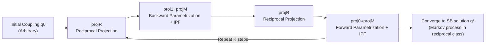

# Diffusion & Adversarial Schrödinger Bridges via Iterative Proportional Markovian Fitting

**Conference**: ICLR 2026  
**OpenReview**: [https://openreview.net/forum?id=38fGCBhFF5](https://openreview.net/forum?id=38fGCBhFF5)  
**Code**: [https://github.com/gregkseno/ipmf](https://github.com/gregkseno/ipmf)  
**Area**: Generative Models / Schrödinger Bridge / Optimal Transport  
**Keywords**: Schrödinger Bridge, Iterative Markovian Fitting, Iterative Proportional Fitting, Entropic Optimal Transport, Unpaired Image Translation, Diffusion Bridge  

## TL;DR
This paper reveals that the "alternating forward-backward" heuristic used in practice to stabilize IMF training implicitly involves IPF iterations. By unifying IMF and IPF into **IPMF (Iterative Proportional Markovian Fitting)**, the authors provide the first convergence proof for bidirectional IMF and transform the "initial coupling" into a tunable knob to navigate the trade-off between generation quality and input-output similarity.

## Background & Motivation
- **Background**: Schrödinger Bridge (SB) models, inspired by the link between optimal transport and stochastic processes, have become powerful tools for unpaired domain translation (e.g., image style transfer, single-cell analysis). Two main paths exist for solving SB: the earlier **IPF (Iterative Proportional Fitting, i.e., Sinkhorn algorithm)** and the more recent **IMF (Iterative Markovian Fitting)**.
- **Limitations of Prior Work**: Both paths have shortcomings. IPF starts from a prior process satisfying optimality and iteratively approaches marginal matching, but approximation errors lead to **prior forgetting**—matching the margins while losing optimality. Conversely, IMF starts from a process satisfying marginal matching and approaches optimality, but error accumulation in one-way fitting causes a loss of marginal matching properties.
- **Key Challenge**: To make IMF practical (as in DSBM's diffusion or ASBM's GAN implementations), researchers introduced a **heuristic without theoretical explanation**: alternating between learning "forward diffusion" and "backward diffusion" in each round. While critical for stable training, this modification has long been treated as "black magic," lacking analysis or an explanation for why it prevents error accumulation.
- **Goal**: To understand the mechanism of this bidirectional heuristic, establish a convergence theory, and unify fragmented understandings of SB solvers (IPF/IMF, discrete/continuous, online) into a single framework.
- **Core Idea**: **Bidirectional IMF "secretly" utilizes IPF projections**. The paper proves that one step of bidirectional IMF is equivalent to a combination of "two IMF projections + two IPF projections," hence naming it IPMF. It demonstrates that both IPF and IMF are special cases of IPMF under specific initial couplings.

## Method

### Overall Architecture
The SB problem (with a Wiener prior) is equivalent to **Entropic Optimal Transport (EOT)** with quadratic cost: finding a Markov process with endpoint marginals $p_0, p_1$ that minimizes the KL divergence to the prior Wiener process. This requires satisfying both "optimality" (input-output similarity) and "marginal matching" (correct domain translation). The key observation is that practical bidirectional IMF, which alternates between forward and backward learning, actually oscillates between "moving toward optimality" (IMF projection = reciprocal projection $\mathrm{proj}_R$ + Markov projection $\mathrm{proj}_M$) and "moving toward marginal matching" (IPF projections $\mathrm{proj}_0, \mathrm{proj}_1$), thus stitching the two historical paths into the unified IPMF.

### Key Designs

**1. Bidirectional IMF = IPMF: Decomposing the heuristic into IMF + IPF projections.** The core theoretical decomposition lies in showing that each round of $q_{4k+2}$ (backward parametrization), written as $p(x_1)\prod_n q_{4k+1}(x_{t_n}|x_{t_{n+1}})$, is actually the composition of a Markov projection $\mathrm{proj}_M$ followed by an IPF projection $\mathrm{proj}_1$ that replaces the final marginal with $p_1$: $q_{4k+2}=\mathrm{proj}_1(\mathrm{proj}_M(q_{4k+1}))$; symmetrically for $q_{4k+4}$. Thus, one IPMF step = two reciprocal projections $\mathrm{proj}_R(q)=q(x_0,x_1)p_{W^\epsilon}(x_{\mathrm{in}}|x_0,x_1)$ (re-laying the Brownian Bridge) + two Markov projections + two IPF marginal replacements. Because the IPF steps "anchor" the marginals back to $p_0, p_1$, IPMF avoids the error accumulation of pure one-way IMF.

**2. Optimality Matrix: Quantifying the "optimality" of Gaussian plans.** To quantitatively analyze convergence, the authors introduce an **optimality matrix** $A(q)$ for Gaussian couplings. Theorem 3.1 proves that any 2D Gaussian $q(x_0,x_1)$ (with marginals $\mathcal{N}(\eta,Q)$ and $\mathcal{N}(\nu,S)$) is the unique solution to an EOT problem under a cost $c_A(x_0,x_1)=-x_1^\top A x_0$, where $A=\Xi(P,Q,S)=S^{-1}P^\top(Q-PS^{-1}P^\top)^{-1}$. This matrix encodes which transport cost the coupling is optimizing for. $q$ is a static SB solution under the prior $W^\epsilon$ if and only if $A(q)=\epsilon^{-1}I_D$. The distance between the optimality matrix and $\epsilon^{-1}I_D$ serves as a natural metric for how far the coupling is from the SB solution.

**3. First Convergence Proof for Bidirectional IMF: IPF preserves the copula, IMF contracts it.** Using the optimality matrix, the paper provides the first convergence analysis for bidirectional IMF (IPMF). The proof decomposes each step into two effects: **IPF steps change marginals but keep the copula fixed** (the part of the joint distribution independent of marginals, leaving $A_k$ invariant), while **IMF steps preserve marginals and change the copula** to pull $A_k$ toward $\epsilon^{-1}I_D$. Theorem 3.2 proves **exponential convergence** for Gaussians ($D=1$ for any $\epsilon$, or $D>1$ in discrete time with $\epsilon \gg 0$): $\|A_k-\epsilon^{-1}I_D\|_2 \le \beta^{2k}\|A_0-\epsilon^{-1}I_D\|_2$, with mean and covariance terms also contracting, causing both forward and backward KL to approach zero. Theorem 3.3 further proves **weak convergence** to $q^*$ for bounded support.

**4. Initial Coupling as a Knob: Balancing quality and similarity.** Since IPMF converges from any initial coupling, $q_0(x_0,x_1)$ transforms from a constrained form into a **tunable hyperparameter**. The authors design various initial couplings: classical IMF-like (independent coupling $p_0p_1$), IPF-like, Identity ($x_1=x_0$), IMF-OT (via mini-batch OT), and SDEdit couplings pre-generated with DDPM or Stable Diffusion v1.5. The intuition is that a starting point closer to the target distribution improves generation quality, while one closer to the input improves input-output similarity.

## Key Experimental Results

### Main Results (SB benchmark, cBW²₂-UVP ↓ %, against ground truth SB)
Covers $\epsilon \in \{0.1,1,10\}$ and $D \in \{2,16,64,128\}$. Different initial couplings yield similar results under the same solver (DSBM or ASBM), confirming the convergence from arbitrary starting points. Representative values ($\epsilon=1$):

| Algorithm | Type | D=2 | D=16 | D=64 | D=128 |
| :--- | :--- | :--- | :--- | :--- | :--- |
| Best on benchmark† | Varies | 1.04 | 9.08 | 18.05 | 15.23 |
| DSBM-IMF | IPMF | 0.68 | 0.63 | 5.8 | 29.5 |
| DSBM-IPF | IPMF | 0.29 | 0.76 | 4.05 | 29.59 |
| DSBM-Identity | IPMF | 0.26 | 0.69 | 7.46 | 29.5 |
| ASBM-IMF† | IPMF | 0.19 | 1.6 | 5.8 | 10.5 |
| ASBM-IPF | IPMF | 0.18 | 1.68 | 9.25 | 20.47 |
| ASBM-Identity | IPMF | 0.19 | 2.44 | 8.28 | 11.61 |

### Ablation Study (CelebA 64×64 male→female, FID↓ / MSE↓)
Varying initial couplings under the same solver to observe the quality-similarity trade-off:

| Initial Coupling | DSBM FID↓ | DSBM MSE↓ | ASBM FID↓ | ASBM MSE↓ |
| :--- | :--- | :--- | :--- | :--- |
| IMF | 35.23 | 0.16 | 14.84 | 0.16 |
| DDPM SDEdit | 28.77 | 0.02 | 22.65 | 0.09 |
| SD SDEdit | 61.56 | 0.02 | 33.11 | 0.04 |
| Identity | 13.65 | 0.00 | 19.32 | 0.17 |

### Key Findings
- **Convergence Experiments**: On 128D Gaussians, forward/backward KL and errors in $A_k, \nu_k, S_k$ all decay exponentially over 100 IPMF steps, matching theory perfectly.
- **Consistency across Origins**: On 2D Swiss roll, SB benchmarks, and Colored MNIST, various starting points (IMF, IPF, Identity, Inverted-7) converge to qualitatively consistent results.
- **Controllable Trade-offs**: For DSBM, SDEdit and Identity couplings **drastically improve similarity while maintaining quality** (MSE drops from 0.16 to 0.00–0.02).

## Highlights & Insights
- **Turning "Black Magic" into Mathematics**: The widely used but unexplained engineering trick of alternating forward-backward steps is precisely decomposed into a composite of IMF and IPF, providing the fundamental reason why it prevents error accumulation.
- **Unified Perspective**: IPF and IMF are no longer competing paths but special cases of IPMF under different initial couplings. This unified framework covers discrete, continuous, and online versions.
- **The Optimality Matrix** is an elegant tool: By encoding the OT cost for which a Gaussian coupling is optimal into a matrix, the authors make "optimality" measurable and contractible, providing the technical pivot for the convergence proof.
- **Theory-driven Practical Hub**: The "convergence from any origin" property is not just a theoretical curiosity; it liberates the initial coupling as a hyperparameter for users to tailor models for higher fidelity or stronger semantic alignment.

## Limitations & Future Work
- **General Convergence remains a Conjecture**: Exponential convergence is strictly proven only for Gaussians (requiring large $\epsilon$ for high dimensions). For bounded support, only weak convergence is proven; general exponential convergence relies on experimental evidence.
- **Lacks Direct SOTA Benchmarking**: Since the paper argues IPMF differs from existing algorithms only in the initial coupling, it avoids direct performance comparisons, making it harder to gauge absolute superiority over the latest SB solvers.
- **Degradation in High-Dim Large $\epsilon$**: cBW²₂-UVP values spike in 128D with $\epsilon=10$, indicating numerical instability in high-noise regimes.
- **SDEdit Results**: SDEdit starting points showed mixed results (e.g., high FID on DSBM), suggesting the hypothesis that designed couplings improve both properties is only partially supported.

## Related Work & Insights
- **IPF / Sinkhorn Path**: De Bortoli et al. (DSB, 2021) and Vargas et al. (2021) proved sublinear or geometric convergence for IPF but suffered from prior forgetting.
- **IMF / Bridge Matching Path**: Shi et al. (DSBM, 2023) and Gushchin et al. (ASBM, 2024) are the direct sources of the bidirectional heuristic for which this paper provides the missing theory.
- **Initial Coupling Tools**: Mini-batch OT (Tong et al.) and SDEdit (Meng et al.) are leveraged here to construct specialized starting points.

## Rating
- **Novelty**: ⭐⭐⭐⭐⭐ — Precisely decomposes a "black magic" heuristic into an IPF+IMF composite and provides a unified framework with the first convergence proof.
- **Experimental Thoroughness**: ⭐⭐⭐⭐ — Validates across various scales, though lacks competitive benchmarking against the most recent SOTA solvers.
- **Writing Quality**: ⭐⭐⭐⭐ — Rigorous derivation and clear motivation, though notation-heavy for those unfamiliar with SB.
- **Value**: ⭐⭐⭐⭐⭐ — Unifies the SB solver family, explains critical engineering tricks, and introduces a practical knob for the community.

<!-- RELATED:START -->

## Related Papers

- [\[ICLR 2026\] Entering the Era of Discrete Diffusion Models: A Benchmark for Schrödinger Bridges and Entropic Optimal Transport](entering_the_era_of_discrete_diffusion_models_a_benchmark_for_schrödinger_bridge.md)
- [\[ICLR 2026\] Branched Schrödinger Bridge Matching](branched_schrödinger_bridge_matching.md)
- [\[ICML 2026\] Geometry-based Schrödinger Bridges for Trustworthy Multimodal Fusion](../../ICML2026/image_generation/geometry-based_schrödinger_bridges_for_trustworthy_multimodal_fusion.md)
- [\[NeurIPS 2025\] Grasp2Grasp: Vision-Based Dexterous Grasp Translation via Schrödinger Bridges](../../NeurIPS2025/image_generation/grasp2grasp_vision-based_dexterous_grasp_translation_via_schrödinger_bridges.md)
- [\[NeurIPS 2025\] Schrödinger Bridge Matching for Tree-Structured Costs and Entropic Wasserstein Barycentres](../../NeurIPS2025/image_generation/schrödinger_bridge_matching_for_tree-structured_costs_and_entropic_wasserstein_b.md)

<!-- RELATED:END -->
