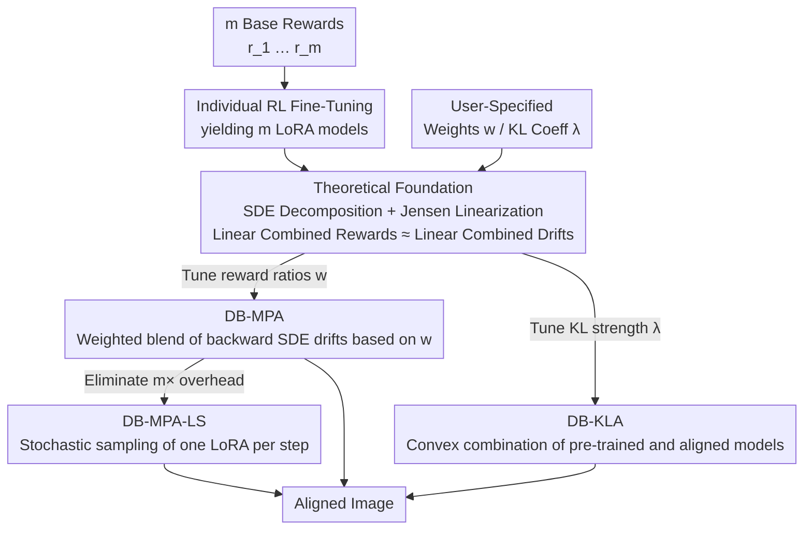

# Diffusion Blend: Inference-Time Multi-Preference Alignment for Diffusion Models

**Conference**: ICLR 2026  
**arXiv**: [2505.18547](https://arxiv.org/abs/2505.18547)  
**Code**: Yes (GitHub)  
**Area**: Diffusion Models / Multi-Objective Alignment  
**Keywords**: multi-preference alignment, inference-time, backward SDE blending, KL regularization control, Pareto-optimal  

## TL;DR
Diffusion Blend is proposed to achieve multi-preference alignment by blending the backward diffusion processes of multiple reward-finetuned models at inference time. DB-MPA supports arbitrary linear combinations of rewards; DB-KLA enables dynamic KL regularization control; and DB-MPA-LS eliminates inference overhead through stochastic LoRA sampling. The method theoretically proves error bounds for the blending approximation and approaches the MORL oracle upper bound in experiments.

## Background & Motivation

**Background**: RL fine-tuning of diffusion models typically fixes a single reward function and a KL regularization weight $\alpha$. After fine-tuning, the model is locked into a specific $(r, \alpha)$ configuration, making it unable to adapt to diverse user preferences.

**Limitations of Prior Work**: (a) Users may require different trade-offs between aesthetics, semantic consistency, and human preference, necessitating a separate fine-tuned model for every preference combination (prohibitive cost); (b) Weak KL regularization causes reward hacking, while excessive strength results in under-alignment, with the optimal value requiring grid search; (c) Rewarded Soup (linear combination in parameter space) is too coarse, while guidance methods require differentiable rewards and high computational costs.

**Key Challenge**: Flexibility of preferences post-deployment vs. the fixity of fine-tuning. How to adapt to arbitrary preference combinations at inference time without retraining?

**Goal**: Given $m$ models fine-tuned on separate base rewards, generate images aligned with $r(w) = \sum w_i r_i$ at inference time according to user-specified weights $w$, while supporting dynamic adjustment of KL strength.

**Key Insight**: From the perspective of the backward SDE of diffusion models, the drift term $f^{(r,\alpha)}$ of an aligned model can be expressed as the pre-trained drift plus a control term. By linearizing the control term via a Jensen gap approximation, linear blending of backward SDEs can be achieved.

**Core Idea**: The backward SDE drift terms of reward-aligned diffusion models can be linearly combined to approximate the alignment effect of an arbitrary linear combination of rewards.

## Method

### Overall Architecture

This paper addresses the issue where RL fine-tuning locks diffusion models into a fixed "reward + KL weight" configuration. Diffusion Blend shifts "preference adaptation" from the training phase to the inference phase—off-line, only $m$ LoRA models are RL-finetuned for each base reward $r_i$ individually. On-line, during each denoising step, the backward diffusion processes of these models are "blended" according to real-time user weights, requiring no additional fine-tuned.

This blending capability relies on a theoretical foundation: reward alignment only modifies a control term within the backward SDE drift, which is approximately linear with respect to the reward. Consequently, a "linear combination of rewards" corresponds to a "linear combination of drifts." Based on this, three inference algorithms are derived: DB-MPA allows users to tune multi-reward ratios via weights $w$; DB-KLA allows users to tune KL regularization strength via $\lambda$; and DB-MPA-LS reduces the $m\times$ inference overhead of DB-MPA back to $1\times$.

### Key Designs

**1. Theoretical Foundation: Isolating "Alignment" from Drift and Linearizing into Additive Control Terms**

To blend multiple aligned models at inference time, it is necessary to first clarify how "alignment" modifies the backward diffusion and ensure these modifications are linearly additive. The paper proves this in two steps. First, SDE decomposition (Proposition 1): the backward SDE drift of any model fine-tuned with reward $r$ and KL weight $\alpha$ can be cleanly decomposed into a pre-trained drift plus a control term, $f^{(r,\alpha)}(x_t, t) = f^{\text{pre}}(x_t, t) - \beta(t)\, u^{(r,\alpha)}(x_t, t)$. Here, $f^{\text{pre}}$ is shared across all models, and the control term $u^{(r,\alpha)} = \nabla_{x_t} \log \mathbb{E}_{x_0 \sim p_{0|t}^{\text{pre}}}[\exp(r(x_0)/\alpha)]$ encapsulates the entire "pull" exerted by the reward—thus reducing multi-preference blending to the combination of these control terms.

Second, the control term is linearized. Since $\log \mathbb{E}[\exp(\cdot)]$ is non-linear, rewards cannot be directly added. The paper swaps the order of log-exp and expectation, using $\bar{u}^{(r,\alpha)} = \nabla_x \mathbb{E}[r(x_0)/\alpha]$ to approximate $u^{(r,\alpha)}$ (a Jensen gap approximation commonly used in diffusion guidance methods like DPS and RGG; the error tends to 0 as $t \to 0$). Once the control term becomes a linear operator on the reward, the linearity of expectation applies: for a linear reward $r(w) = \sum w_i r_i$, we obtain

$$f^{(r(w),\alpha)} \approx \sum_i w_i\, f^{(r_i, \alpha)}.$$

This means to achieve generation aligned with $r(w)$, one simply needs to sum the drifts of individual reward models weighted by $w$—the shared foundation for the subsequent algorithms.

**2. DB-MPA: Direct Blending of Backward SDEs at Inference Time via User Weights**

With the aforementioned linearization, multi-reward ratioing is implemented as a minimal inference change: given weights $w$, each denoising step uses a weighted average of the noise predictions from the $m$ fine-tuned models, $\hat{\epsilon}_t = \sum_i w_i\, \epsilon_{\theta_i^{\text{rl}}}(x_t, t)$. This requires no retraining, no differentiable rewards, and no inference-time search, allowing users to adjust the aesthetics-alignment trade-off in real-time. The cost is $m \times$ forward passes per step—a bottleneck addressed by Design 4.

**3. DB-KLA: Making KL Regularization Strength an Inference-Time Knob**

The same decomposition can also adjust KL strength rather than just reward ratios. The paper scales the target KL weight from $\alpha$ to $\alpha/\lambda$ and approximates it as a convex combination of the pre-trained and aligned models: $f^{(r, \alpha/\lambda)} \approx (1-\lambda) f^{\text{pre}} + \lambda f^{(r,\alpha)}$. Higher $\lambda$ shifts toward stronger alignment (risking reward hacking), while lower $\lambda$ remains conservative, preserving pre-trained quality. This turns KL weight selection from a grid-search fine-tuning task into a continuously adjustable scalar at inference time.

**4. DB-MPA-LS: Eliminating $m\times$ Overhead with Stochastic LoRA Sampling**

DB-MPA's requirement to evaluate all $m$ models per step is its primary practical bottleneck. The solution: instead of averaging all models at each step, treat weights $w$ as a probability distribution and randomly sample one LoRA adapter (Bernoulli for two rewards, Categorical for multi-reward) for that specific step. Proposition 2 proves that this step-wise stochastic SDE has the same marginal distribution as the weighted blend SDE. This equivalence stems from the noise injection inherent to diffusion processes, making "stochastic selection" statistically equivalent to "weighted averaging." Consequently, inference overhead is reduced from $m\times$ back to $1\times$ with minimal quality loss. Note that this equivalence is unique to diffusion models and does not hold for DB-KLA, where convex combination coefficients may be negative.

### Loss & Training

- RL fine-tuning on SD v1.5 using DPOK (policy gradient). Each base reward is used to train an independent rank-4 LoRA with AdamW and a learning rate of $1\times10^{-5}$.
- No training is required at inference; only the noise prediction in the denoising step is modified (via weighted blending or stochastic LoRA sampling).

## Key Experimental Results

### Main Results (SD v1.5, ImageReward + VILA/PickScore)

DB-MPA consistently outperforms Rewarded Soup (RS), CoDe, and RGG across the Pareto front, closely approaching the MORL oracle upper bound.

Key numerical feature: At $w=0.5$, DB-MPA achieves approximately 85-90% of the performance of individual fine-tuned models for both rewards, whereas RS only reaches 60-70%.

### Ablation Study

| Method | Inference Overhead | Performance (vs MORL) |
|------|---------|--------------|
| DB-MPA | $m \times$ | ~95% of MORL |
| DB-MPA-LS | $1 \times$ | ~90% of MORL |
| RS | $1 \times$ | ~70% of MORL |
| RGG | $1 \times$ (+ gradient) | ~60% of MORL |
| CoDe | $N \times$ (search) | ~65% of MORL |

DB-KLA provides smooth control over KL: $\lambda > 1$ strengthens alignment but may lead to overfitting, while $\lambda < 1$ is conservative and preserves pre-trained quality.

### Key Findings
- DB-MPA significantly outperforms RS (parameter space blending) on the Pareto front, demonstrating that **backward SDE blending is superior to parameter space blending**.
- DB-MPA-LS stochastic LoRA sampling approximation results in negligible performance loss (~5% gap) while reducing overhead to 1×.
- DB-KLA offers a more flexible method for KL control compared to repeated fine-tuning.
- The Jensen gap approximation remains effective for JPEG compressibility ( a reward that competes with aesthetics).

## Highlights & Insights
- **SDE Blending vs. Parameter Blending**: The comparison is robust—Rewarded Soup linearizes in parameter space, while DB-MPA linearizes in the SDE drift space. The latter is better grounded theoretically and performs better because the drift linearization error is bounded (Lemma 1), whereas parameter-space linearization lacks such guarantees.
- **Proposition 2 (Stochastic LoRA Sampling Equivalence)**: This is an elegant theoretical contribution. By leveraging diffusion noise injection, step-wise random sampling becomes equivalent to weighted averaging. This is unique to diffusion models and impossible for LLMs due to their discrete token space.
- **Inference-Time Flexibility**: Users can adjust the aesthetics vs. alignment trade-offs in real-time using sliders.

## Limitations & Future Work
- The Jensen gap approximation error increases as $\alpha$ becomes very small (the $L_{t,2}$ term in Lemma 1), making it less effective for extreme alignment requirements.
- Validation was primarily performed on SD v1.5; only small-scale feasibility tests were done on SDXL, and larger models (e.g., Flux) were not tested.
- DB-MPA incurs an $m \times$ inference overhead, which is impractical for many rewards (though mitigated by DB-MPA-LS).
- The linear reward combination assumption limits expressiveness; non-linear preference relationships cannot be handled.
- Comparison with recent alignment methods such as DAV or DenseGRPO is missing.

## Related Work & Insights
- **vs Rewarded Soup**: Parameter space linearization vs. SDE drift linearization. DB-MPA is more theoretically rigorous and achieves higher performance.
- **vs Guidance (RGG/CoDe)**: Does not require differentiable rewards or inference-time search, while providing better performance.
- **vs LLM DeRa**: Shares similar inspiration (blending aligned and base models) but introduces SDE theoretical analysis and stochastic LoRA sampling specifically for diffusion models.

## Rating
- Novelty: ⭐⭐⭐⭐⭐ The theoretical framework for SDE blending and the stochastic LoRA sampling equivalence are significant contributions.
- Experimental Thoroughness: ⭐⭐⭐⭐ Comprehensive experiments across rewards and Pareto analysis, though limited to SD v1.5.
- Writing Quality: ⭐⭐⭐⭐⭐ Theoretical derivations are clear, visualizations are intuitive, and the logic from motivation to experiment is tight.
- Value: ⭐⭐⭐⭐⭐ Provides a practical and theoretically sound solution for multi-preference deployment of diffusion models.

<!-- RELATED:START -->

## Related Papers

- [\[ICLR 2026\] Inference-Time Scaling of Diffusion Models Through Classical Search](inference-time_scaling_of_diffusion_models_through_classical_search.md)
- [\[ICLR 2026\] $\alpha$-DPO: Robust Preference Alignment for Diffusion Models via $\alpha$ Divergence](alpha-dpo_robust_preference_alignment_for_diffusion_models_via_alpha_divergence.md)
- [\[ICLR 2026\] Inference-Time Scaling of Discrete Diffusion Models via Importance Weighting and Optimal Proposal Design](inference-time_scaling_of_discrete_diffusion_models_via_importance_weighting_and.md)
- [\[ICLR 2026\] RNE: plug-and-play diffusion inference-time control and energy-based training](rne_plug-and-play_diffusion_inference-time_control_and_energy-based_training.md)
- [\[ICLR 2026\] Compositional Visual Planning via Inference-Time Diffusion Scaling](compositional_visual_planning_via_inference-time_diffusion_scaling.md)

<!-- RELATED:END -->
