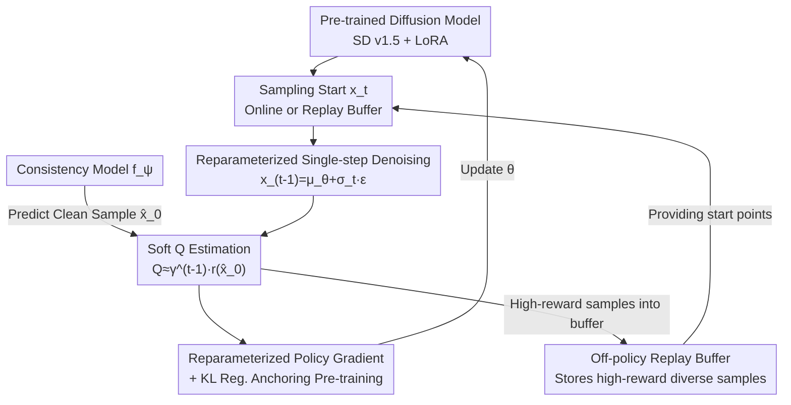

# Diffusion Fine-Tuning via Reparameterized Policy Gradient of the Soft Q-Function

**Conference**: ICLR 2026  
**arXiv**: [2512.04559](https://arxiv.org/abs/2512.04559)  
**Code**: [https://github.com/Shin-woocheol/SQDF](https://github.com/Shin-woocheol/SQDF)  
**Area**: Image Generation  
**Keywords**: Diffusion Model Fine-Tuning, KL-Regularized RL, Soft Q-Function, Reward Over-optimization, Text-to-Image Alignment

## TL;DR

The authors propose SQDF (Soft Q-based Diffusion Finetuning), which fine-tunes diffusion models within a KL-regularized RL framework using a training-free differentiable soft Q-function estimation and reparameterized policy gradients. Combined with three innovative components—a discount factor, consistency models, and an off-policy replay buffer—it effectively mitigates reward over-optimization while optimizing target rewards, maintaining sample naturalness and diversity.

## Background & Motivation

Diffusion models have become the mainstream paradigm for high-quality sample generation; however, practical applications require alignment with downstream objectives (e.g., aesthetic quality, text-to-image alignment, human preferences). Existing fine-tuning methods face severe reward over-optimization issues, manifesting as:

**Semantic Collapse**: High-reward samples gradually lose semantic alignment with the original prompt, turning into unrecognizable abstract textures.

**Diversity Collapse**: Generation results tend toward highly similar patterns.

**Limitations of Prior Work**:
- **RL Methods (DDPO)**: These do not utilize reward gradients, leading to low optimization efficiency and rapid diversity collapse.
- **Direct Backpropagation (DRaFT, ReFL)**: Although they utilize reward gradients, they are prone to over-optimization.
- **KL Regularization Methods**: These require training an additional value function network—which is extremely unstable in the diffusion MDP—or rely on high-variance Monte Carlo gradient estimation.

**Key Challenge**: How to maintain KL regularization to avoid over-optimization while utilizing strong reward gradient signals?

**Core Idea**: Model the diffusion process as an MDP and use the posterior mean approximation from the Tweedie formula to provide a training-free, differentiable soft Q-function estimation. This allows for direct model updates via reparameterized policy gradients.

## Method

### Overall Architecture

SQDF treats the reverse diffusion process as a finite-horizon MDP where the state is $s_t = (x_{T-t}, T-t)$, the action is $a_t = x_{T-t-1}$, and the policy is the single-step denoising distribution $\pi_\theta(a_t|s_t) = p_\theta(x_{T-t-1}|x_{T-t})$. A sparse reward $r(x_0)$ is obtained only at the final state $x_0$, and the optimization objective is the KL-regularized expected reward. The key to the method is not training a value function, but using the Tweedie formula to approximate the soft Q-function as a "single-step reward evaluation of the current denoising result." Consequently, reward gradients can backpropagate directly to model parameters via reparameterization. This loop—"sampling start → reparameterized denoising → predicted clean sample → soft Q scoring → policy gradient update"—forms the backbone of SQDF. Additionally, three components—a discount factor, consistency models, and an off-policy replay buffer—complete the framework from the perspectives of credit assignment, Q-estimation accuracy, and diversity.

### Key Designs

**1. Training-free Soft Q-function + Reparameterized Policy Gradient: Replacing Unstable Value Function Training and High-variance REINFORCE**

Standard KL-regularized RL typically involves training an explicit value function network, which is notoriously unstable in diffusion MDPs. Conversely, avoiding value functions by using REINFORCE-like estimators (as in DDPO) suffers from high variance and low efficiency. The **Core Insight** of SQDF is that after recursively expanding the soft Bellman equation and applying a single-step posterior mean approximation (Tweedie formula) to intermediate states, the soft Q-function collapses to $Q_{\text{soft}}^*(x_t, x_{t-1}) \approx r(\hat{x}_0(x_{t-1}))$. This involves predicting a clean sample $\hat{x}_0$ from $x_{t-1}$ and scoring it with the reward model. This step bypasses value function training and remains differentiable because the entire path is a single forward pass through a parameterized reward model.

With this differentiable Q-approximation, updates can use low-variance reparameterized gradients instead of REINFORCE. Using the reparameterization trick $x_{t-1} = \mu_\theta(x_t, t) + \sigma_t \epsilon$, the policy gradient is formulated as:

$$\nabla_\theta \mathcal{L} = \mathbb{E}_{x_t, \epsilon}\big[-\nabla_{x_{t-1}} r(\hat{x}_0) \cdot \nabla_\theta \mu_\theta + \alpha \nabla_\theta D_{KL}\big]$$

The first term represents a low-variance gradient signal directly through the reward model, which is far more efficient than REINFORCE. The second term, the KL divergence, anchors the fine-tuned distribution near the pre-trained distribution, which is crucial for mitigating over-optimization and preserving naturalness.

**2. Discount Factor γ: Preventing Early High-Noise Steps from Over-Contribution**

Previous methods implicitly use $\gamma=1$, treating all denoising steps equally. However, early high-noise steps have little impact on the final sample; uniform weighting misleads credit assignment. SQDF introduces $\gamma<1$ to exponentially decay weights of early steps. The authors derive that under a discounted MDP, the Q-approximation becomes $Q^* \approx \gamma^{t-1} r(\hat{x}_0)$, with first-order bounds suggesting this weighting is theoretically sound. In experiments, $\gamma$ serves as a clean "knob" for the trade-off between optimization speed and sample quality: $\gamma=1$ yields the highest reward but collapses alignment and diversity, while $\gamma=0.9$ achieves balance.

**3. Consistency Models to Improve Q-estimation: Correcting Tweedie's Inaccuracy at High Noise**

The soft Q-approximation relies entirely on the prediction quality of $\hat{x}_0$. The Tweedie formula provides highly inaccurate posterior mean estimates at high noise levels (Figure 2-b). SQDF replaces Tweedie with a consistency model $f_\psi$ to predict $\hat{x}_0$. Consistency models, trained via distilling integration results of Probability Flow ODEs, provide uniformly accurate clean sample estimates across all timesteps (Figure 2-c), improving the overall Q-function quality.

**4. Off-policy Replay Buffer: Preserving Diversity with Historical High-Reward Samples**

The SQDF loss naturally supports off-policy updates because the sampling starting point $x_t$ does not need to originate from the current policy. Utilizing this, SQDF maintains a replay buffer to store and reuse rare high-reward and diverse samples, improving mode coverage and balancing rewards with diversity. This off-policy capability is a structural advantage over DDPO/DRaFT, which must use on-policy samples.

### Loss & Training

Combining these components, the final SQDF loss is:

$$\mathcal{L}_{\text{SQDF}} = \mathbb{E}_{x_t \sim \mathcal{D}, x_{t-1} \sim p_\theta}[-\gamma^{t-1} r(f_\psi(x_{t-1})) + \alpha D_{KL}(p_\theta \| p')]$$

Implementation details: DDPM with 50 steps is used for sampling. The base model is Stable Diffusion v1.5 with LoRA fine-tuning, and LCM-LoRA serves as the consistency model. Small-scale experiments use $\gamma=0.9$, $\alpha=2$, lr=$1\times10^{-3}$, LoRA rank=4, batch=64, for 2000 steps. Large-scale experiments use $\gamma=0.93$, $\alpha=0.05$, lr=$5\times10^{-4}$, LoRA rank=32, batch=258, for 500 steps.

## Key Experimental Results

### Main Results

**T2I Fine-tuning (SD v1.5, Aesthetic Score / HPS optimization):**

Based on qualitative and quantitative results from Figure 3 and Figure 4:
- ReFL and DRaFT achieve high aesthetic scores, but alignment scores (ImageReward, HPS) and diversity (LPIPS, DreamSim) drop sharply.
- DDPO fails to reach comparable aesthetic scores and suffers from rapid diversity collapse.
- **Ours (SQDF) consistently maintains the highest alignment and diversity at equivalent reward levels.**

**KL-Regularized Baseline Comparison (Figure 4 Pareto Curves):**
SQDF occupies the Pareto frontier across almost all metrics. By adjusting $\alpha$, SQDF allows flexible trade-offs between higher rewards and better diversity.

**Online Black-box Optimization (Table 1):**

| Method | Objective (Aesthetic↑) | ImageReward↑ | HPS↑ | LPIPS-Div↑ | DreamSim-Div↑ |
|------|-----------|-------------|------|-----------|--------------|
| PPO+KL | 6.63 | -1.35 | 0.24 | 0.47 | 0.44 |
| SEIKO-Bootstrap | 7.80 | -1.69 | 0.23 | 0.36 | 0.24 |
| SEIKO-UCB | 7.49 | -1.08 | 0.24 | 0.40 | 0.32 |
| **SQDF-Bootstrap** | **7.87** | **1.14** | — | — | — |

SQDF leads overwhelmingly across all evaluation metrics, notably improving ImageReward from negative to positive, demonstrating robustness to inaccurate reward proxies in black-box scenarios.

### Ablation Study

| Configuration | Aesthetic Score | DreamSim-Div | LPIPS-Div |
|------|---------|-------------|-----------|
| SQDF (Full) | 7.87 | 0.58 | 0.56 |
| w/o Consistency Model | 7.10 | 0.62 | 0.59 |
| w/o Replay Buffer | 8.06 | 0.56 | 0.55 |

| Discount Factor | Effect |
|---------|-----|
| $\gamma=1$ | Higher aesthetic reward but severe drop in alignment and diversity |
| $\gamma=0.9$ | Balances optimization speed and sample quality |
| $\gamma=0.85$ | Slower optimization but best diversity |

### Key Findings

- Consistency models are key to accelerating convergence; without them, target reward drops from 7.87 to 7.10.
- The replay buffer primarily protects diversity; without it, rewards are slightly higher (8.06) but diversity decreases.
- $\gamma$ provides explicit control over the trade-off between optimization speed and sample quality.
- SQDF is equally effective on SDXL (2.6B), with gains highly consistent with SD 1.5.

## Highlights & Insights

- The "training-free Q-function" approach is elegant—transforming the difficult value function training problem into simple reward evaluation via the Tweedie formula.
- The introduction of the discount factor $\gamma$ is well-supported by both theoretical derivation (consistent first-order bounds) and empirical validation.
- Using consistency models as an upgrade to the Tweedie formula is more stable than multi-step DDIM (which often causes training instability).
- The feasibility of off-policy updates is a structural advantage of SQDF over DDPO/DRaFT.
- Experimental design is comprehensive, comparing not just against baselines but against KL-enhanced versions via Pareto curves to prove the framework's inherent superiority.

## Limitations & Future Work

- The single-step Q-function approximation is mathematically coarse—the first-order approximation of the log-moment generating function may be insufficient when $r/\alpha$ is large.
- Dependence on consistency model quality—if LCM-LoRA is inaccurate, Q-function estimates will be biased.
- Validation is currently limited to the Stable Diffusion family; newer architectures like flow matching have not been tested.
- Replay buffer management (e.g., prioritized sampling) might require task-specific tuning.
- Computational overhead (62s for Aesthetic / 401s for HPS per step) requires further optimization.

## Related Work & Insights

- **DDPO (Black et al., 2023)**: A gradient-free PPO method; simple but inefficient.
- **DRaFT/ReFL**: Efficient direct gradient backpropagation, but suffers from severe over-optimization.
- **SEIKO (Uehara et al., 2024)**: KL-regularized backpropagation that relies on truncated backpropagation through the denoising chain.
- The "training-free Q-function + reparameterization" framework could generalize to other generative models requiring RL (e.g., RLHF for LLMs, protein design).

## Rating

- Novelty: ⭐⭐⭐⭐⭐ — The design of training-free differentiable Q-estimation plus three complementary components is highly ingenious.
- Experimental Thoroughness: ⭐⭐⭐⭐⭐ — Two task settings, comprehensive ablations, Pareto comparisons, and SDXL expansion.
- Writing Quality: ⭐⭐⭐⭐ — Clear framework, though some derivations moving to the appendix makes reading slightly difficult.
- Value: ⭐⭐⭐⭐⭐ — Provides a principled solution for diffusion model alignment with open-source code and high generalizability.

<!-- RELATED:START -->

## Related Papers

- [\[ICLR 2026\] Half-order Fine-Tuning for Diffusion Model: A Recursive Likelihood Ratio Optimizer](half-order_fine-tuning_for_diffusion_model_a_recursive_likelihood_ratio_optimize.md)
- [\[CVPR 2026\] Reward Sharpness-Aware Fine-Tuning for Diffusion Models](../../CVPR2026/image_generation/reward_sharpness-aware_fine-tuning_for_diffusion_models.md)
- [\[ICML 2026\] DGS-Net: Distillation-Guided Gradient Surgery for CLIP Fine-Tuning in AI-Generated Image Detection](../../ICML2026/image_generation/dgs-net_distillation-guided_gradient_surgery_for_clip_fine-tuning_in_ai-generate.md)
- [\[CVPR 2025\] Personalized Preference Fine-tuning of Diffusion Models](../../CVPR2025/image_generation/personalized_preference_fine-tuning_of_diffusion_models.md)
- [\[ICLR 2026\] Direct Reward Fine-Tuning on Poses for Single Image to 3D Human in the Wild](direct_reward_fine-tuning_on_poses_for_single_image_to_3d_human_in_the_wild.md)

<!-- RELATED:END -->
