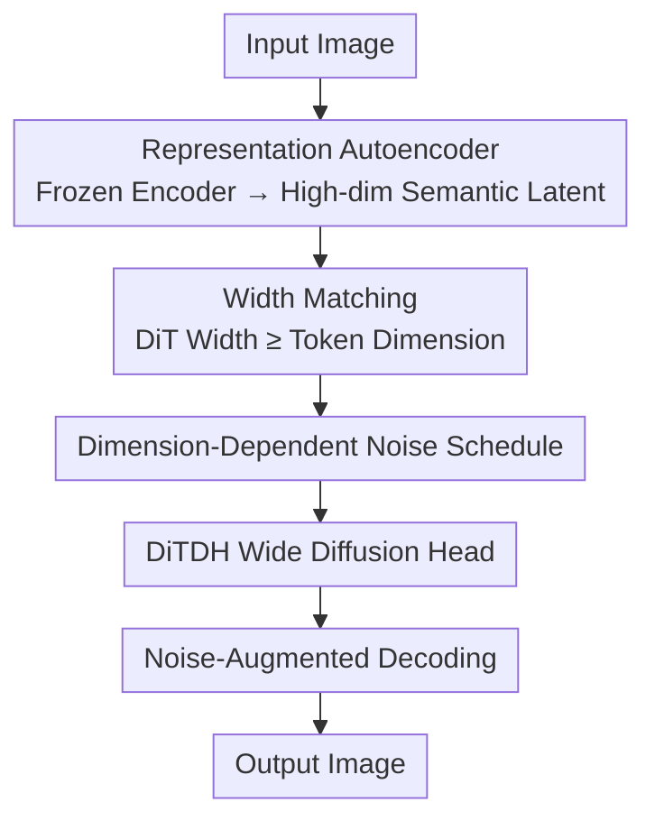

# Diffusion Transformers with Representation Autoencoders

**Conference**: ICLR2026  
**OpenReview**: [https://openreview.net/forum?id=0u1LigJaab](https://openreview.net/forum?id=0u1LigJaab)  
**Code**: To be confirmed  
**Area**: Diffusion Models / Image Generation  
**Keywords**: Representation Autoencoder, Diffusion Transformer, Latent Diffusion, DINOv2, High-dimensional latent

## TL;DR
The long-used VAE in latent diffusion is replaced with a "frozen pretrained representation encoder (DINOv2 / SigLIP2 / MAE) + a trained lightweight ViT decoder." By implementing three specific modifications for high-dimensional latents, the Diffusion Transformer is successfully adapted, achieving an unconditional FID of 1.51 and a guided FID of 1.13 on ImageNet 256×256. The convergence speed is 47× faster than SiT and 16× faster than REPA.

## Background & Motivation
**Background**: From LDM to DiT, mainstream image generation follows the path of "compressing pixels into a latent space using a pretrained autoencoder, then running diffusion on the latent." While diffusion backbones have evolved through generations, the autoencoder defining the latent space has stagnated—most DiT models still utilize the SD-VAE from the Stable Diffusion era.

**Limitations of Prior Work**: SD-VAE suffers from three primary issues: (1) Outdated backbone consisting of convolutional networks with aggressive down/up-sampling (encoder 135 GFLOPs, decoder 310 GFLOPs), costing 3–6× more than equivalent ViTs; (2) Extremely low latent dimensionality (compressing $256^2$ images to $32^2\times4$), which bottlenecks information capacity; (3) Latents trained purely on reconstruction capture only local appearance and lack global semantic structure, yielding only ~8% linear probing accuracy on ImageNet.

**Key Challenge**: Meanwhile, representation learning has advanced rapidly, with self-supervised and multimodal encoders like DINO, MAE, and SigLIP learning features with excellent semantic structure. However, latent diffusion has remained isolated from these advances due to two entrenched "common beliefs": (1) Semantic encoders "only focus on high-level information and cannot reconstruct details," making them unsuitable for reconstruction; (2) Diffusion models are unstable and perform poorly in high-dimensional latent spaces, leading to a preference for low-dimensional VAE latents. Works like REPA attempt to circumvent this by using external alignment losses to "indirectly" improve the latent, at the cost of an additional training stage and multiple auxiliary losses.

**Goal**: This work aims to prove both beliefs wrong by directly transforming a semantic encoder into a diffusion autoencoder and successfully training Diffusion Transformers on high-dimensional semantic latents.

**Key Insight**: The authors discovered that a frozen semantic encoder can perfectly reconstruct pixel-level details when paired with a trained decoder. The failure of diffusion in high-dimensional latent spaces is not caused by "high dimensionality" itself, but by designs (model width, noise scheduling, decoder robustness) tailored for low-dimensional VAEs. By correcting these elements, high dimensionality becomes an advantage: richer semantics, faster convergence, and better generation, with negligible computational increase since token count remains fixed and channels are projected to the DiT hidden dimension in the first layer.

**Core Idea**: Replace the VAE with a **Representation Autoencoder (RAE)** composed of a "frozen representation encoder + trained decoder." Re-adapt the DiT using three modifications for high-dimensional latents to allow semantic and generative modeling to share the same latent space.

## Method

### Overall Architecture
The objective of the RAE is to upgrade the autoencoder from a "compressor" to a "representation foundation." The pipeline is as follows: the input image is processed by a **frozen pretrained representation encoder** to obtain high-dimensional semantic tokens (no compression; token count aligned with the original 256 of SD-VAE). The Diffusion Transformer learns denoising or velocity fields in this high-dimensional latent space. The sampled latent is then restored to an image via a **trained ViT decoder**. The challenges reside in the middle section: standard DiT is designed for low-dimensional VAE tokens, and directly applying it to high-dimensional RAE latents leads to failure (DiT-S reaches a gFID of 215). The authors diagnose three issues and provide three solutions: matching width to token dimension, rescaling noise schedules based on "effective data dimension," and making the decoder tolerant to diffusion noise. Finally, a wide DiTDH head is added to support the width without incurring quadratic computational costs.

### Key Designs

**1. Representation Autoencoder (RAE): Frozen Semantic Encoder + Trained Decoder, No Compression**

To address the "low capacity, weak semantics" of VAE latents, RAE replaces the encoder with a frozen pretrained representation model $E$ (DINOv2-B, SigLIP2-B, or MAE-B, with patch size $p_e$ and hidden dimension $d$). Input $x\in\mathbb{R}^{3\times H\times W}$ is encoded into $N=HW/p_e^2$ tokens of dimension $d$, **without channel compression**. A ViT decoder $D$ is trained to reconstruct pixels using a standard VAE loss combination $L_{\text{rec}}(x)=\omega_L\,\text{LPIPS}(\hat{x},x)+L_1(\hat{x},x)+\omega_G\lambda\,\text{GAN}(\hat{x},x)$, where $z=E(x)$ and $\hat{x}=D(z)$. Results disprove the myth that semantic encoders cannot reconstruct details: RAE reconstruction rFID (0.16 for MAE-B, 0.49 for DINOv2-B) is superior to SD-VAE’s 0.62, and even a ViT-B decoder is 14× more computationally efficient than the SD-VAE decoder. Crucially, as the encoder is frozen, RAE inherits baseline representation capabilities, with linear probing accuracy at 84.5% (DINOv2-B) versus 8% for SD-VAE.

**2. Width Matching: DiT Width Must Be No Less Than Token Dimension**

The first root cause of standard DiT failure on RAE latents is insufficient model "width." Overfitting experiments on single images show that when the DiT hidden dimension $d <$ token dimension $n=768$, the model fails to fit even one image. Once $d \ge n$, the loss drops sharply, achieving near-perfect reproduction. Increasing network depth (12→24) has little effect. The authors provide a theoretical explanation (Theorem 1): for a DiT function family $G_d=\{g(x_t,t)=Bf(Ax_t,t)\}$ with width $d<n$, the velocity field loss has a lower bound:

$$L(g,\theta)\ge\sum_{i=d+1}^{n}\lambda_i$$

where $\lambda_i$ are eigenvalues of the covariance matrix of $W=\varepsilon-x$. $G_d$ contains the unique optimal solution only when $d \ge n$. Intuitively, injecting Gaussian noise during training expands the low-intrinsic-dimension data manifold into a full-rank space, requiring model capacity to match the full data dimension. Thus, DINOv2-B (768-dim) requires a wide backbone like DiT-XL.

**3. Dimension-Dependent Noise Schedule Shift: Generalizing from "Resolution" to "Effective Data Dimension"**

The second root cause is the noise schedule. Previous works noted that high-resolution inputs are less destroyed at the same noise level, which hurts training, leading to resolution-dependent schedule shifts. However, these were derived for low-channel ($C\le16$) inputs. RAE has much higher dimensionality; as Gaussian noise is added to both space and channels, the "effective resolution" of each token increases with the channel count, making information less destructible. The authors propose shifting the schedule based on **effective data dimension** (token count × token dimension) instead of just resolution. Specifically, they use the shift formula $t_m=\frac{\alpha t_n}{1+(\alpha-1)t_n}$ from Esser et al., where the scaling factor $\alpha=\sqrt{m/n}$ depends on the dimension $m$. This single change reduces gFID from 23.08 to 4.81.

**4. DiTDH: Supporting Width with Shallow and Wide DDT Heads to Avoid Quadratic Cost**

Design 2 requires width to match token dimension, but widening the entire DiT backbone causes computational costs to grow quadratically. Inspired by DDT, the authors attach a **shallow but wide Transformer denoising head** $H$ to the standard DiT. The base DiT $M$ produces features $z_t=M(x_t\mid t,y)$, and the wide head predicts velocity $v_t=H(x_t\mid z_t,t)$. This structure is termed DiTDH. Experiments use a 2-layer, 2048-dim DDT head, which satisfies the width requirement while keeping features compact. DiTDH-B outperforms DiT-XL using only ~40% of its training compute. DiTDH-XL achieves an FID of 2.16 under equivalent budgets, nearly half that of DiT-XL (~4.28).

**5. Noise-Augmented Decoding: Enabling Decoder Tolerance for "Dirty" Latents**

The third root cause is training/inference distribution mismatch. VAE decoders naturally tolerate small noise as they were trained on continuous Gaussian latents. RAE decoders are trained on "clean" latents with discrete support $p(z)=\sum_i\delta(x-z_i)$. During inference, diffusion samples latents with slight noise, causing OOD degradation. Borrowing from normalizing flows, the authors add additive noise $n\sim\mathcal{N}(0,\sigma^2 I)$ to the latent during decoder training, effectively training on a smoothed distribution $p_n(z)=\int p(z-n)\,\mathcal{N}(0,\sigma^2 I)(n)\,\mathrm{d}n$. This represents a trade-off: it improves gFID from 4.81 to 4.28 by sacrificing some reconstruction detail (rFID increases from 0.49 to 0.57) for more stable generation.

### Loss & Training
The diffusion side employs a flow matching objective with linear interpolation $x_t=(1-t)x+t\varepsilon$ ($\varepsilon\sim\mathcal{N}(0,I)$). The model predicts the velocity $v(x_t,t)$. The backbone is LightningDiT with patch size 1. For 256×256 images, there are 256 tokens, aligned with VAE-DiT, thus incurring almost no extra computational overhead. Sampling uses 50-step Euler. The decoder is trained using a combination of $L_1$, LPIPS, and GAN losses. Notably, this method **requires no REPA-style representation alignment auxiliary losses** to achieve faster convergence.

## Key Experimental Results

### Main Results
ImageNet 256×256 class-conditional generation (DiTDH-XL + RAE/DINOv2-B) sets a new SOTA:

| Setup | Metric | Ours | Prev. SOTA | Description |
|------|------|------|----------|------|
| 256×256 Uncond. | gFID | **1.51** | 1.70 (REPA-E) / 2.17 (VA-VAE) | Significant lead |
| 256×256 Guided | gFID | **1.13** | 1.15 (REPA-E) | AutoGuidance |
| 512×512 Guided | gFID | **1.13** | 1.25 (EDM-2) | 400 epochs |
| Reconstruction | rFID | 0.49 (DINO) / 0.16 (MAE) | 0.62 (SD-VAE) | RAE is superior |
| Convergence Rate | Training Speed | 47× (vs SiT-XL) / 16× (vs REPA-XL) | — | Same model scale |

### Ablation Study
Contribution of each modification:

| Configuration | Key Metric (gFID) | Description |
|------|---------|------|
| Standard DiT-XL on RAE | 23.08 | Fails without modifications (VAE version is 7.13) |
| + Dim-dependent Noise Schedule | 4.81 | Most critical change (23.08 → 4.81) |
| + Noise-Augmented Decoding | 4.28 | Trade-off: higher rFID (0.49→0.57) for better gFID |
| + DiTDH Wide Head | 2.16 | Halves FID under same budget |
| Width $d<n$ (Overfitting) | No convergence | DiT-S with DINOv2-B fails completely |

### Key Findings
- **Dimension-dependent noise scheduling is the lifeblood** of high-dimensional latent training, providing the largest single gain.
- **Width, not depth, determines success**: Overfitting experiments confirm that increasing width leads to a sharp drop in loss, while increasing depth is ineffective.
- **Good Reconstruction $\neq$ Good Generation**: MAE has the lowest rFID (0.16), but DINOv2 yields the best generation results.
- **Decoupled high-resolution decoding**: Using decoder patch size $p_d=2p_e$ allows 256-trained diffusion models to output 512 images using only 256 tokens, saving 4× compute compared to native 1024-token training while maintaining a competitive gFID of 1.61.

## Highlights & Insights
- **Overturning two "Common Beliefs"**: It proves semantic encoders can achieve pixel-level reconstruction and that high-dimensional latents are actually beneficial for diffusion—moving the debate from "belief" to "engineering."
- **High Dimensionality with Zero Overhead**: Since token count is fixed by patch size and channels are projected to the hidden dimension, switching to 768-dim semantic latents costs almost no extra compute/memory compared to 4-dim VAE latents.
- **Diagnosis-Theory-Modification Loop**: Rather than treating "DiT failure on RAE" as a black box, the authors pin-pointed the issue to width using single-image overfitting and provided a theoretical explanation.
- **DiTDH Decoupling**: Separating individual "width requirements" from the entire backbone into a shallow head is a transferable trick for any task requiring width without quadratic scaling.

## Limitations & Future Work
- **Trade-offs**: Noise-augmented decoding is a clear trade-off; smoothing latents sacrifices reconstruction detail (rFID 0.49→0.57).
- **Dependency on Frozen Base**: RAE's semantic capability is inherited from the pretrained encoder; any biases in the encoder will persist. Currently only validated on ImageNet.
- **Evaluation Consistency**: The authors found that class-balanced sampling yields ~0.1 lower FID than uniform random sampling and re-ran several baselines accordingly—care is needed when comparing numbers across papers.
- **Future Directions**: Extending RAE to more modalities and higher resolutions, exploring trainable instead of frozen encoders, and applying the "width matching" theory to other high-dimensional generative architectures.

## Related Work & Insights
- **vs SD-VAE / LDM**: Traditional latent diffusion uses purely reconstruction-based, heavily compressed convolutional VAEs. RAE uses a frozen semantic encoder + lightweight ViT decoder, which is faster and semantically stronger.
- **vs REPA / REPA-E**: REPA uses alignment losses to "indirectly" inject semantics into VAE latents. RAE directly runs diffusion on semantic latents, requiring no auxiliary losses and converging 16× faster.
- **vs DDT**: DiTDH's wide head is inspired by DDT but serves a different purpose: satisfying the $d \ge n$ constraint in high-dimensional spaces without the quadratic compute cost of a full backbone.

## Rating
- Novelty: ⭐⭐⭐⭐⭐ Refutes established consensus on semantic encoders and high-dimensional diffusion.
- Experimental Thoroughness: ⭐⭐⭐⭐⭐ Diagnosis + theory + ablation + SOTA across resolutions.
- Writing Quality: ⭐⭐⭐⭐⭐ Clear narrative flow from problem diagnosis to theoretical fix.
- Value: ⭐⭐⭐⭐⭐ Likely to change the default choice of autoencoders for latent diffusion.

<!-- RELATED:START -->

## Related Papers

- [\[CVPR 2026\] MeanFlow Transformers with Representation Autoencoders](../../CVPR2026/image_generation/meanflow_transformers_with_representation_autoencoders.md)
- [\[ICLR 2026\] DiffSparse: Accelerating Diffusion Transformers with Learned Token Sparsity](diffsparse_accelerating_diffusion_transformers_with_learned_token_sparsity.md)
- [\[ICLR 2026\] Aligning Visual Foundation Encoders to Tokenizers for Diffusion Models](aligning_visual_foundation_encoders_to_tokenizers_for_diffusion_models.md)
- [\[ICLR 2026\] Scaling Laws for Diffusion Transformers](scaling_laws_for_diffusion_transformers.md)
- [\[ICLR 2026\] Rethinking Global Text Conditioning in Diffusion Transformers](rethinking_global_text_conditioning_in_diffusion_transformers.md)

<!-- RELATED:END -->
