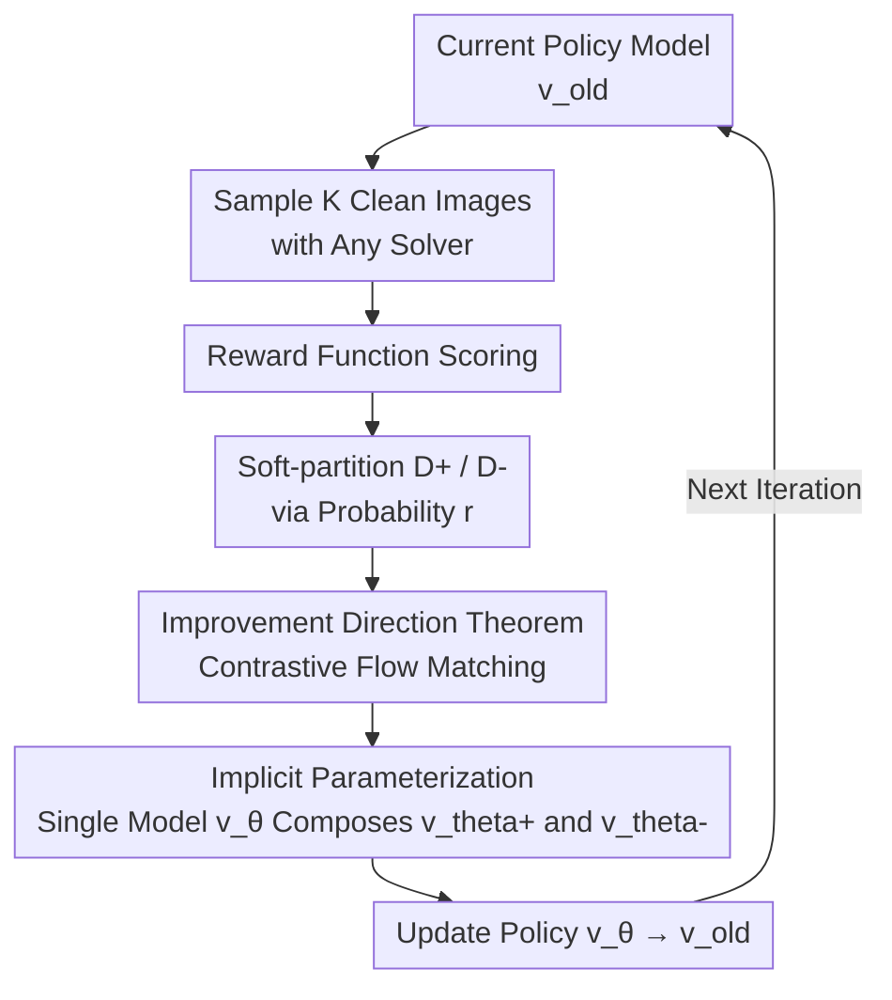

# DiffusionNFT: Online Diffusion Reinforcement with Forward Process

**Conference**: ICLR 2026 Oral  
**arXiv**: [2509.16117](https://arxiv.org/abs/2509.16117)  
**Code**: [https://research.nvidia.com/labs/dir/DiffusionNFT](https://research.nvidia.com/labs/dir/DiffusionNFT)  
**Area**: Diffusion Models / RL Alignment  
**Keywords**: online RL, forward process, negative-aware finetuning, flow matching, CFG-free  

## TL;DR
DiffusionNFT proposes a novel online RL paradigm for diffusion models: instead of performing policy optimization on the reverse sampling process (e.g., GRPO), it utilizes a contrastive training approach on the forward process via a flow matching objective for positive and negative samples. This defines an implicit policy improvement direction, achieving 3-25× speedups over FlowGRPO while eliminating the need for CFG.

## Background & Motivation

**Background**: FlowGRPO/DanceGRPO discretize the reverse sampling process into an MDP, utilizing SDE samplers and GRPO to achieve online RL alignment for diffusion models, which has yielded significant results.

**Limitations of Prior Work**: GRPO-style methods face three fundamental limitations: (a) **Forward Inconsistency**—optimizing only the reverse process may cause the model to degenerate into cascaded Gaussians; (b) **Solver Constraints**—optimization is restricted to first-order SDE samplers, preventing the use of more efficient ODE or high-order solvers; (c) **CFG Complexity**—the requirement to optimize both conditional and unconditional models simultaneously leads to low efficiency and engineering complexity.

**Key Challenge**: Reverse process RL requires likelihood estimation, but the likelihood of diffusion models cannot be calculated exactly. Discretization approximations introduce systematic bias.

**Goal**: Can RL be performed on the **forward process** (flow matching objective) to completely circumvent likelihood estimation, solver constraints, and CFG reliance?

**Key Insight**: A diffusion policy has a unique forward process even though it may have multiple reverse processes (depending on the solver). Optimizing on the forward process is more fundamental—it directly uses the contrast between positive and negative samples to define the policy improvement direction, embedding this into the supervised learning framework of flow matching.

**Core Idea**: Transform RL signals into a contrastive flow matching objective for positive and negative samples in the forward process, utilizing implicit parameterization to integrate reinforcement guidance directly into a single policy model.

## Method

### Overall Architecture

DiffusionNFT aims to solve the issues where existing diffusion RL methods (FlowGRPO, DanceGRPO, etc.) perform policy gradients on the **reverse sampling process**, thereby being hindered by likelihood estimation, SDE solver constraints, and CFG dependencies. It adopts a fundamental shift in perspective—the forward process of a diffusion policy is uniquely determined while the reverse process varies with the solver, making RL on the **forward process** more essential. The workflow is an iterative loop: sample a batch of images with the current model, soft-partition them into a positive set $\mathcal{D}^+$ and a negative set $\mathcal{D}^-$ according to rewards, and then apply a contrastive flow matching objective on the forward process to "approach positive samples and move away from negative samples." After updating the model, the cycle repeats; only clean images are saved, and sampling trajectories do not need to be stored.

### Key Designs

**1. Improvement Direction Theorem: Binding "Approaching Positives" and "Avoiding Negatives" into a Single Direction**

To perform RL on the forward process, the relationship between the velocity fields of positive samples, negative samples, and the old policy must first be established. Theorem 3.1 proves that their directional differences are proportional:

$$\Delta := \alpha(\mathbf{x}_t)[\mathbf{v}^+(\mathbf{x}_t) - \mathbf{v}^{\text{old}}(\mathbf{x}_t)] = [1-\alpha(\mathbf{x}_t)][\mathbf{v}^{\text{old}}(\mathbf{x}_t) - \mathbf{v}^-(\mathbf{x}_t)]$$

where $\alpha(\mathbf{x}_t)$ is a scalar related to the density ratio of the positive policy. The significance lies in characterizing "moving towards the positive policy $\mathbf{v}^+$" and "moving away from the negative policy $\mathbf{v}^-$" as the same direction $\Delta$. This avoids individual likelihood estimation—the primary bottleneck in reverse RL—by focusing solely on this improvement direction. Formally, it resembles the guidance term in CFG, but the direction is derived entirely from RL principles rather than a heuristic conditional/unconditional difference.

**2. Implicit Parameterization: Learning Both Branches with a Single Model**

Given the improvement direction, the next step is applying it to a trainable flow matching loss. Theorem 3.2 provides an objective that consumes both positive and negative data:

$$\mathcal{L}(\theta) = \mathbb{E}\big[r \,\|\mathbf{v}_\theta^+ - \mathbf{v}\|^2 + (1-r)\,\|\mathbf{v}_\theta^- - \mathbf{v}\|^2\big]$$

The key is that the positive and negative branches are not two independent networks but are composed from the same $\mathbf{v}_\theta$ via implicit parameterization: the positive policy $\mathbf{v}_\theta^+ = (1-\beta)\mathbf{v}^{\text{old}} + \beta \mathbf{v}_\theta$ and the negative policy $\mathbf{v}_\theta^- = (1+\beta)\mathbf{v}^{\text{old}} - \beta \mathbf{v}_\theta$. Consequently, training the single model $\mathbf{v}_\theta$ is equivalent to simultaneously approaching the positive policy and moving away from the negative one. Solving for the optimum yields $\mathbf{v}_{\theta^*} = \mathbf{v}^{\text{old}} + \frac{2}{\beta}\Delta$—reinforcement guidance is automatically integrated into the policy itself. Inference no longer requires an additional guidance model, which is the root cause for eliminating CFG.

**3. Three Corollary Advantages of Forward Process Optimization: Forward Consistency, Solver Freedom, and CFG-free**

Moving RL to the forward process does more than just changing the loss; it sheds three burdens of reverse RL. First, **Forward Consistency**: GRPO-style methods optimize only the reverse sampling process without ensuring self-consistency between forward and reverse, which can lead to model degeneration. Since the forward process of a diffusion policy is uniquely determined, training on it with standard flow matching naturally ensures the model remains a valid forward process. Second, **Solver Freedom**: Reverse RL discretizes sampling into an MDP, locking it to first-order SDE samplers. In DiffusionNFT, the training objective is decoupled from the sampling process, allowing any ODE or high-order solver for data collection without storing sampling trajectories. Third, **CFG-free**: The $\Delta$ in Theorem 3.1 is formally equivalent to a guidance term, meaning the RL process itself learns the guidance direction and absorbs it into a single policy via Design 2, removing the need to maintain dual models like in GRPO.

### Loss & Training

- Based on SD3.5-Medium, rectified flow parameterization.
- Sample $K$ images per round, partitioned into positive/negative sets based on rewards.
- $\beta$ controls guidance intensity (analogous to CFG scale).
- Supports joint training with multiple reward models.

## Key Experimental Results

### Main Results (SD3.5-Medium, Head-to-Head vs FlowGRPO with Single Reward)

| Task | DiffusionNFT | FlowGRPO | Efficiency Gain |
|------|-------------|----------|---------|
| GenEval | 0.98 (1k steps) | 0.95 (5k steps) | **25×** |
| PickScore | Higher | — | 3-5× |
| Aesthetic | Higher | — | 3× |
| OCR | Higher | — | 5× |

**Multi-Reward Joint Training (SD3.5-Medium → SD3.5-Medium-NFT)**:
- GenEval: 0.63 → **0.98** (w/o CFG)
- DPG-Bench: 81.65 → **92.82**
- T2I-CompBench: 0.54 → **0.75**
- HPS v2.1: 29.95 → **32.52**

### Ablation Study

| Configuration | Effect |
|------|-----|
| Positive Samples Only (RFT) | Rapid collapse |
| DiffusionNFT (Full) | Stable improvement |
| Increasing $\beta$ | More aggressive but risks overfitting |
| Different Solvers (ODE/High-order) | Fully compatible, no performance drop |

### Key Findings
- **Negative samples are crucial**: Training only on positive samples (RFT) leads to mode collapse, whereas incorporating negative samples provides stability.
- DiffusionNFT is entirely CFG-free yet rapidly improves from a very low baseline (GenEval 0.24 w/o CFG) to 0.98, surpassing FlowGRPO + CFG (0.95).
- It allows for any solver (ODE/high-order) and does not require storing sampling trajectories, leading to significantly higher training efficiency.
- Shows generalized improvements even for out-of-distribution rewards.

## Highlights & Insights
- The shift from **Reverse RL to Forward RL** is the core contribution. The forward process is unique while the reverse process is solver-dependent; performing RL on the former is more fundamental and avoids the difficulties of likelihood estimation.
- The **implicit parameterization** technique is highly ingenious—by defining $\mathbf{v}_\theta^+ = (1-\beta)\mathbf{v}^{\text{old}} + \beta \mathbf{v}_\theta$, training one model becomes equivalent to "approaching the good while avoiding the bad." This is far more efficient than explicitly training a guidance model.
- The **NFT vs GRPO** analogy is similar to DPO vs PPO in LLMs—transforming RL into a supervised learning framework, which simplifies engineering implementation.

## Limitations & Future Work
- The choice of $\beta$ requires tuning; a value too large can lead to reward overfitting.
- Classification of positive/negative samples is based on sampling probability rather than a hard threshold, which may introduce noise.
- Only validated on SD3.5-Medium; not yet tested on other architectures (SDXL/Flux/DiT).
- Theoretical analysis assumes infinite data and model capacity; the approximation error in practice is not quantified.
- Reward weight settings for multi-reward joint training have not been systematically studied.

## Related Work & Insights
- **vs FlowGRPO**: Fundamental difference—Forward RL vs Reverse RL. DiffusionNFT is 3-25× faster and operates without SDE samplers or CFG.
- **vs DPO/DRaFT**: DiffusionNFT is on-policy, avoiding the distribution shift issues inherent in offline methods.
- **vs LLM NFT (Chen et al., 2025c)**: Adapts the NFT paradigm from language models to diffusion models by leveraging the properties of flow matching.

## Rating
- Novelty: ⭐⭐⭐⭐⭐ Forward process RL is a brand-new paradigm, and implicit parameterization elegantly unifies positive/negative training.
- Experimental Thoroughness: ⭐⭐⭐⭐⭐ Clear head-to-head comparison with FlowGRPO and comprehensive multi-reward joint training.
- Writing Quality: ⭐⭐⭐⭐⭐ Theoretical derivations are rigorous and clear, analogies to CFG are intuitive, and chart design is excellent.
- Value: ⭐⭐⭐⭐⭐ Solves several fundamental issues in diffusion RL (solver constraints, CFG reliance, efficiency), with the potential to become a new standard.

<!-- RELATED:START -->

## Related Papers

- [\[ICLR 2026\] Flow Matching with Injected Noise for Offline-to-Online Reinforcement Learning](flow_matching_with_injected_noise_for_offline-to-online_reinforcement_learning.md)
- [\[AAAI 2026\] ORVIT: Near-Optimal Online Distributionally Robust Reinforcement Learning](../../AAAI2026/image_generation/orvit_near-optimal_online_distributionally_robust_reinforcement_learning.md)
- [\[ICLR 2026\] Forward-Learned Discrete Diffusion: Learning how to noise to denoise faster](forward-learned_discrete_diffusion_learning_how_to_noise_to_denoise_faster.md)
- [\[ICLR 2026\] EditScore: Unlocking Online RL for Image Editing via High-Fidelity Reward Modeling](editscore_unlocking_online_rl_for_image_editing_via_high-fidelity_reward_modelin.md)
- [\[CVPR 2026\] DRiffusion: Draft-and-Refine Process Parallelizes Diffusion Models with Ease](../../CVPR2026/image_generation/driffusion_draft-and-refine_process_parallelizes_diffusion_models_with_ease.md)

<!-- RELATED:END -->
