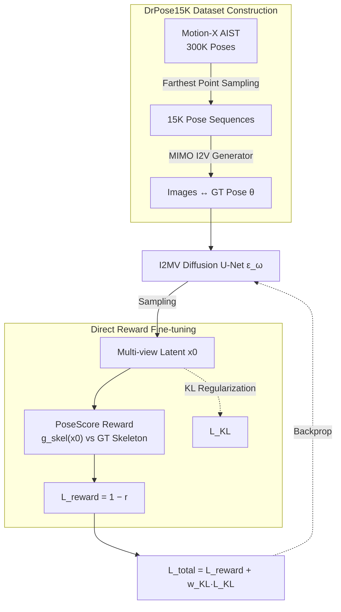

# Direct Reward Fine-Tuning on Poses for Single Image to 3D Human in the Wild

**Conference**: ICLR 2026  
**arXiv**: [2603.02619](https://arxiv.org/abs/2603.02619)  
**Code**: [Project Page](https://seunguk-do.github.io/drpose)  
**Area**: Image Generation  
**Keywords**: single-view 3D human reconstruction, multi-view diffusion, direct reward fine-tuning, pose alignment, PoseScore  

## TL;DR
The paper proposes DrPose, which enhances 3D human reconstruction quality in challenging/acrobatic poses by maximizing PoseScore (joint consistency between multi-view latent images and GT 3D poses) via direct reward fine-tuning and KL regularization. It utilizes the DrPose15K dataset (synthesized from Motion-X poses and the MIMO video generator) to bridge the gap in 3D human data diversity.

## Background & Motivation

**Background**: Single-view 3D human reconstruction based on multi-view diffusion models (e.g., PSHuman, Era3D) has become a standard paradigm, involving an "input image → multi-view generation → 3D reconstruction" pipeline. Diffusion priors offer superior texture details compared to earlier PIFu-based methods.

**Limitations of Prior Work**: Existing models struggle with dynamic or extreme poses (e.g., breakdance, acrobatics) due to the limited scale and narrow pose distribution of available 3D training datasets (e.g., THuman2.1).

**Key Challenge**: Acquiring 3D human scan data is expensive and difficult to scale, whereas motion capture data (e.g., Motion-X) provides rich 3D poses but lacks corresponding multi-view images.

**Key Insight**: Instead of expensive 3D scans, use motion datasets for pose supervision by designing a differentiable PoseScore reward function to align multi-view diffusion models.

**Core Idea**: Pose supervision from motion data + differentiable reward fine-tuning allows models to "learn" accurate generation for difficult poses without additional 3D assets.

## Method

### Overall Architecture

DrPose corrects pose distortion by leveraging motion capture data in three stages: 1) Constructing the DrPose15K dataset using Motion-X poses and the MIMO video generator; 2) Applying direct reward fine-tuning with PoseScore to align generated images with GT poses while using KL regularization to maintain image quality; 3) Finalizing 3D reconstruction with explicit carving.

### Key Designs

**1. DrPose15K Dataset**: Combines Motion-X (300K poses) with the MIMO generator to create 15K pairs of diverse poses and single-view images, significantly increasing pose variance over datasets like THuman2.1.

**2. PoseScore Reward Function**: Evaluates pose consistency in 2D skeleton space. Multi-view latents $\mathbf{x}_0$ are mapped to skeletons via a pre-trained $g_{\text{skel}}$ and compared to GT skeletons rendered from 3D joints $J(\theta)$ using distance metrics (BCE + LPIPS):

$$r(\mathbf{x}_0, \theta) = -\mathbb{E}(\|g_{\text{skel}}(\mathbf{x}_0) - \mathcal{R}(J(\theta))\|)$$

The differentiable 23-channel skeleton representation ensures precise structural alignment.

**3. Direct Reward Fine-tuning**: Adopts the DRTune framework to optimize rewards via backpropagation through sparse denoising steps ($K=2$) for efficiency.

**4. KL Divergence Regularization**: Preserves image quality and prevents "reward hacking" by penalizing deviations from the original model's noise predictions:

$$\mathcal{L}_{\text{KL}} = \mathbb{E}(\|\hat{\epsilon} - \hat{\epsilon}_0\|)$$

### Loss & Training
- Total Loss: $\mathcal{L}_{\text{total}} = \mathcal{L}_{\text{reward}} + w_{\text{KL}} \cdot \mathcal{L}_{\text{KL}}$ ($w_{\text{KL}} = 0.01$).
- Training: Fine-tuned on a single NVIDIA H200 for 18K iterations.

## Key Experimental Results

### Main Results (Geometric Quality, Table 1)
| Method | THuman2.1 CD↓ | CustomHumans CD↓ | MixamoRP CD↓ |
| :--- | :---: | :---: | :---: |
| SiTH | 63.30 | 71.94 | 158.27 |
| PSHuman | 52.96 | 52.22 | 137.28 |
| **Ours (PSHuman)** | **42.05** | **44.13** | **126.53** |

### Key Findings
- **Significant gains on MixamoRP**: DrPose reduces error on this difficult pose benchmark, proving its value for extreme scenarios.
- **Improved in-the-wild results**: Qualitative improvements are seen in real-world images (e.g., dancing or yoga), where generated multi-view poses appear more natural.

## Highlights & Insights
- **Creative Data Transfer**: Successfully utilizes MoCap pose diversity for 3D generation without requiring new 3D scan assets.
- **Skeleton-based Alignment**: Using skeleton maps as an intermediate representation allows for stable and differentiable pose optimization.
- **Lightweight Paradigm**: As a post-training strategy, it is architecture-agnostic and easy to apply to existing multi-view diffusion models.

## Limitations & Future Work
- Dependent on input segmentation quality; errors cause geometry artifacts.
- High VRAM overhead due to multi-step differentiable denoising.
- Potential synthetic domain shifts introduced by the MIMO generator.

## Related Work & Insights
DrPose extends direct reward tuning concepts to the 3D human generation task by introducing domain-specific pose rewards.

## Rating
- Novelty: ⭐⭐⭐⭐
- Experimental Thoroughness: ⭐⭐⭐⭐
- Writing Quality: ⭐⭐⭐⭐
- Value: ⭐⭐⭐⭐

<!-- RELATED:START -->

## Related Papers

- [\[CVPR 2026\] Reward Sharpness-Aware Fine-Tuning for Diffusion Models](../../CVPR2026/image_generation/reward_sharpness-aware_fine-tuning_for_diffusion_models.md)
- [\[ICLR 2026\] EditReward: A Human-Aligned Reward Model for Instruction-Guided Image Editing](editreward_a_human-aligned_reward_model_for_instruction-guided_image_editing.md)
- [\[ICLR 2026\] Diffusion Fine-Tuning via Reparameterized Policy Gradient of the Soft Q-Function](diffusion_fine-tuning_via_reparameterized_policy_gradient_of_the_soft_q-function.md)
- [\[NeurIPS 2025\] GeneMAN: Generalizable Single-Image 3D Human Reconstruction from Multi-Source Human Data](../../NeurIPS2025/image_generation/geneman_generalizable_single-image_3d_human_reconstruction_from_multi-source_hum.md)
- [\[ICLR 2026\] Half-order Fine-Tuning for Diffusion Model: A Recursive Likelihood Ratio Optimizer](half-order_fine-tuning_for_diffusion_model_a_recursive_likelihood_ratio_optimize.md)

<!-- RELATED:END -->
## Related Papers

- [\[ICLR 2026\] WILD-Diffusion: A WDRO-Inspired Training Method for Diffusion Models under Limited Data](wild-diffusion_a_wdro_inspired_training_method_for_diffusion_models_under_limite.md)
- [\[CVPR 2026\] Reward Sharpness-Aware Fine-Tuning for Diffusion Models](../../CVPR2026/image_generation/reward_sharpness-aware_fine-tuning_for_diffusion_models.md)
- [\[ICLR 2026\] EditReward: A Human-Aligned Reward Model for Instruction-Guided Image Editing](editreward_a_human-aligned_reward_model_for_instruction-guided_image_editing.md)
- [\[ICLR 2026\] Diffusion Fine-Tuning via Reparameterized Policy Gradient of the Soft Q-Function](diffusion_fine-tuning_via_reparameterized_policy_gradient_of_the_soft_q-function.md)
- [\[ICLR 2026\] Reinforcing Diffusion Models by Direct Group Preference Optimization](reinforcing_diffusion_models_by_direct_group_preference_optimization.md)

<!-- RELATED:END -->
