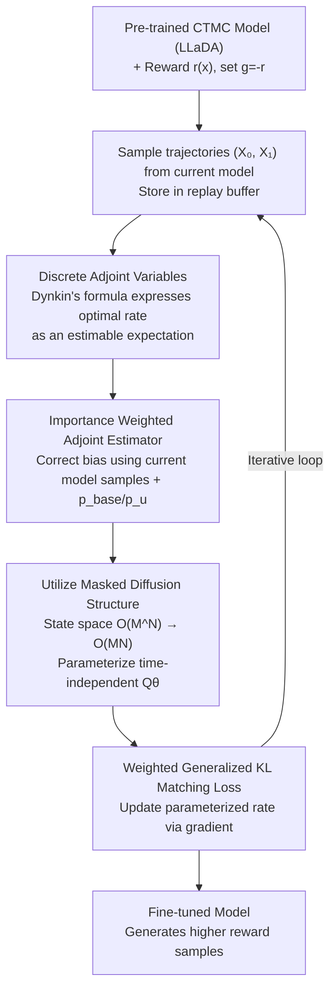

# Discrete Adjoint Matching

**Conference**: ICLR 2026  
**arXiv**: [2602.07132](https://arxiv.org/abs/2602.07132)  
**Code**: None  
**Area**: Image Generation / Discrete Generative Model Fine-tuning  
**Keywords**: Adjoint Matching, discrete adjoint variables, CTMC, diffusion LLM fine-tuning, entropy-regularized reward optimization

## TL;DR

This paper proposes Discrete Adjoint Matching (DAM), which derives adjoint variables on discrete state spaces from a purely statistical perspective (rather than control theory). By generalizing continuous Adjoint Matching to discrete generative models based on Continuous-Time Markov Chains (CTMC), it achieves effective fine-tuning of diffusion-based LLMs (LLaDA-8B), increasing accuracy on Sudoku from 11.5% to 89.2%.

## Background & Motivation

**Background**: Entropy-regularized reward optimization $\min_u \mathbb{E}[g(X_1)] + D_{\text{KL}}(p^u \| p^{\text{base}})$ is the standard paradigm for fine-tuning generative models, widely used in RLHF and conditional generation. The analytical form of the optimal solution is $p^\star(X) \propto p^{\text{base}}(X) e^{-g(X_1)}$, which shifts the model distribution toward high-reward regions while remaining close to the reference distribution. In continuous state spaces, Adjoint Matching (AM) converts the optimization into a matching problem by introducing adjoint variables, achieving significant success in image fine-tuning and molecule generation.

**Limitations of Prior Work**: The core of AM relies on gradient information in continuous space—the terminal adjoint is $\tilde{a}_1(X) = \nabla g(X_1)$, and the dynamics involve the Jacobian $\nabla u^{\text{base}}$. However, discrete state spaces are non-differentiable everywhere, $g(x)$ has no gradient, and rate functions $u_t(y,x)$ replace the drift terms of SDEs. These fundamental differences prevent continuous AM from being directly applied to discrete domains.

**Key Challenge**: Recently, CTMC-based discrete diffusion models (e.g., MDLM, LLaDA) have emerged in text generation. However, how to perform principled reward optimization for such models remains an open question. Existing methods like D1 use policy gradient approximations, which suffer from limited training stability due to hard-to-estimate likelihoods and non-differentiable rewards.

**Key Insight**: The authors observe that the essence of adjoint variables in AM is a statistical quantity rather than a control-theoretic concept—it estimates the ratio between the optimal solution and the base model. In discrete domains, this ratio can be estimated using Dynkin's formula (a tool expressing function values as expectations of stochastic processes), completely bypassing the requirement for differentiability.

**Core Idea**: Use Dynkin's formula to derive discrete adjoint variables from a purely statistical perspective, transforming the estimation of optimal CTMC rates into a matching problem to enable principled fine-tuning of CTMC discrete generative models.

## Method

### Overall Architecture

The input to DAM is a pre-trained CTMC-based discrete generative model (e.g., LLaDA) and a reward function $r(x)$ (where $g(x) = -r(x)$). The output is a fine-tuned model capable of generating higher-reward samples. Its logic reformulates "reward fine-tuning" as a **rate matching** problem: the entropy-regularized optimal solution $p^\star \propto p^{\text{base}} e^{-g}$ corresponds to an optimal CTMC rate $u_t^\star(y,x)$. By training a parameterized rate to approximate this, the model is pushed toward high-reward regions. The challenge lies in the "optimal rate" matching target itself—it is **non-differentiable, non-sampleable, and exists in an exponentially large state space**. DAM addresses these three obstacles: using Dynkin's formula to construct **discrete adjoint variables** (bypassing non-differentiability); employing **importance weighting** so the expectation can be estimated unbiasedly using samples from the current model (bypassing non-sampleability); and utilizing the **masked diffusion structure** to compress the state space from $O(M^N)$ to $O(MN)$ (bypassing the curse of dimensionality). Training involves a weighted generalized KL loss to iteratively match the parameterized rate to the target provided by the adjoint estimator on a replay buffer.

### Key Designs

**1. Discrete Adjoint Variables: Unbiased Estimator via Dynkin's Formula**

Discrete domains are non-differentiable, so the gradient-based terminal $\nabla g$ used in continuous AM does not exist. DAM instead expresses the optimal CTMC rate in its analytical form $u_t^\star(y,x) = u_t^{\text{base}}(y,x) \cdot e^{-V_t(y)+V_t(x)}$, where $V_t(x) = -\log \sum_z p_{1|t}^{\text{base}}(z|x) e^{-g(z)}$ is the value function. The problem reduces to estimating the exponential value difference $e^{-V_t(y)+V_t(x)}$. Using Dynkin's formula on the CTMC, the authors obtain the discrete adjoint variable $\tilde{a}_t(y;X)$, which satisfies a linear ODE with the terminal condition:

$$\tilde{a}_1(y;X) = e^{-g(y)+g(X_1)}$$

This is an exponential terminal loss difference rather than a gradient. The derivation involves no derivatives, avoiding differentiability issues. Notably, discrete adjoints modify the base rate **multiplicatively** ($u^{\text{base}} \cdot \mathbb{E}[\tilde{a}]$), whereas continuous AM uses **additive** correction ($u^{\text{base}} - \mathbb{E}[\tilde{a}]$), reflecting the "scaling" rather than "translation" of the optimal solution in discrete domains.

**2. Importance Weighted Adjoint Estimator: Debias with Current Model Samples**

The adjoint ODE has an analytical solution $\tilde{a}_t(y;X_1) = \sum_z p_{1|t}^{\text{base}}(z|y) e^{-g(z)+g(X_1)}$, but it requires samples $X_1 \sim p^\star$—the target distribution we don't yet have. DAM instead samples $X_1 \sim p^u$ (the current model) and uses self-normalized importance sampling to correct the distribution mismatch:

$$\hat{a}_t(y;Z,\{X_1^{(k)}\}) = \frac{p_{1|t}^{\text{base}}(Z|y)}{p_{1|t}^u(Z|y)} e^{-g(Z)} \cdot \left(\frac{1}{K}\sum_k \frac{p_{1|t}^{\text{base}}(X_1^{(k)}|x)}{p_{1|t}^u(X_1^{(k)}|x)} e^{-g(X_1^{(k)})}\right)^{-1}$$

The importance weights are ratios of $p^{\text{base}}/p^u$, which are efficiently computable for CTMC models. This step is critical: in synthetic tasks like Pinwheel, DAM with weighting is a consistent estimator ($K \to \infty$), whereas the raw analytical solution exhibits higher bias and variance.

**3. Utilizing Masked Diffusion: Compressing $O(M^N)$ to $O(MN)$**

Calculating adjoints on the full discrete state space is infeasible (e.g., $10^{300}$ states for vocab=1000). DAM leverages the fact that most base CTMCs are masked diffusion models (transitioning from [MASK] to unmasked states), where the rate matrix $u_t^{\text{base}}(y,x) = \lambda_t^{\text{base}}(x) Q^{\text{base}}(y|x)$ only allows unmasking one token at a time. The authors prove (Proposition 2.5) that the optimal rate $u_t^\star$ automatically preserves this masked structure. Thus, one only needs to parameterize a time-independent $Q^\theta(y|x)$ using an LLM.

### Loss & Training

DAM uses the Generalized KL (gKL) divergence as the matching function: $D_{\text{gKL}}(u,w) = \sum_{y \neq x} [u(y,x) - w(y,x) + w(y,x)\log \frac{w(y,x)}{u(y,x)}]$, which preserves the probability structure (like non-negativity) better than a naive $\ell_2$ loss. During training, trajectories are sampled from the current model and stored in a replay buffer. Intermediate states $X_t$ are sampled via reciprocal projection. For each iteration, $K$ model trajectories are sampled to compute the importance-weighted adjoint estimate, and the weighted gKL loss is used to update the model.

## Key Experimental Results

### Synthetic Experiments: Convergence to Optimal Distribution

On 91×91 discrete grids (Checkerboard and Pinwheel), DAM is compared with D1 and SVDD.

| Method | Checkerboard Visual Match | Pinwheel $D_{\text{KL}}(p^\star \| p^u)$ | Explanation |
|------|---------------------|----------------------------------------------|------|
| DAM (Importance Weighted) | Closest to $p^\star$ | Stable convergence to $\sim 10^{-3}$ | Both jumps stable |
| DAM (Analytical Abation) | Slightly worse | Converged, but higher bias | Validates weighting |
| D1 | Significant bias | Plateaued, no convergence | Policy gradient limit |
| SVDD | Significant bias | Plateaued, no convergence | Value regression limit |

### Mathematical Reasoning: Fine-tuning LLaDA-8B-Instruct

| Task | Seq Len | LLaDA Base | + D1 | + DAM | DAM Gain |
|------|---------|------------|------|-------|---------|
| GSM8K | 128 | 68.6% | 75.6% | **75.7%** | +7.1 pp |
| GSM8K | 256 | 76.8% | 79.8% | **79.9%** | +3.1 pp |
| MATH500 | 128 | 28.8% | 31.2% | **32.6%** | +3.8 pp |
| Countdown | 128 | 34.8% | 43.8% | **60.2%** | +25.4 pp |
| Sudoku | 128 | 11.5% | 23.8% | **89.2%** | +77.7 pp |
| Sudoku | 256 | 6.4% | 12.9% | **88.1%** | +81.7 pp |

### Key Findings

- **DAM significantly outperforms D1 on Countdown and Sudoku**: The 65+ percentage point gap in Sudoku indicates that principled optimization is far superior to policy gradient approximations for precise constraint satisfaction.
- **Smaller gap on GSM8K and MATH500**: D1's approximate assumptions may be "good enough" for these tasks.
- **Robust Generalization**: DAM-tuned models maintain stable performance across different test sequence lengths (Sudoku: 89.2 → 88.6 → 84.9), while D1 degrades severely (23.8 → 16.9 → 10.0).

## Highlights & Insights

- **Statistical Perspective Bypassing Non-differentiability**: The derivation relies on Dynkin's formula rather than gradients. This suggests that adjoint variables are fundamentally statistical estimators, and the continuous case is just a special instance where they align with derivatives.
- **Meaning of Multiplicative vs Additive Correction**: Continuous AM uses additive correction ($u - \mathbb{E}$), while discrete DAM uses multiplicative correction ($u \cdot \mathbb{E}$). This reflects the geometric difference between "translating" a drift in continuous space and "scaling" a transition rate in discrete space.
- **Masked Structure Preservation**: Proposition 2.5 proves the optimal rate maintains the masked diffusion structure, ensuring DAM can be seamlessly implemented with existing LLM architectures.

## Limitations & Future Work

- **Restricted to Masked CTMC**: All experiments used masked models (LLaDA). Verification on non-masked CTMC (e.g., uniform transition) is future work.
- **Narrow Application Domain**: Limited to synthetic and math tasks; lacks evidence in code generation or protein design.
- **Incompatible with Autoregressive LLMs**: Designed for discrete diffusion; cannot be directly used for GPT-style RLHF.

## Related Work & Insights

- **vs Adjoint Matching (AM)**: DAM proves the statistical perspective is more universal than the control-theoretic one.
- **vs D1**: Move from policy gradient approximations to principled rate matching.
- **vs SVDD**: Estimates exponential value ratios directly instead of regressing value functions, leading to better theoretical properties.

## Rating

- Novelty: ⭐⭐⭐⭐⭐
- Experimental Thoroughness: ⭐⭐⭐
- Writing Quality: ⭐⭐⭐⭐
- Value: ⭐⭐⭐⭐

<!-- RELATED:START -->

## Related Papers

- [\[ICLR 2026\] Discrete Guidance Matching: Exact Guidance for Discrete Flow Matching](discrete_guidance_matching_exact_guidance_for_discrete_flow_matching.md)
- [\[ICLR 2026\] ReDDiT: Rehashing Noise for Discrete Visual Generation](reddit_rehashing_noise_for_discrete_visual_generation.md)
- [\[ICLR 2026\] Discrete Variational Autoencoding via Policy Search](discrete_variational_autoencoding_via_policy_search.md)
- [\[ICLR 2026\] Delay Flow Matching](delay_flow_matching.md)
- [\[ICLR 2026\] Terminal Velocity Matching](terminal_velocity_matching.md)

<!-- RELATED:END -->
