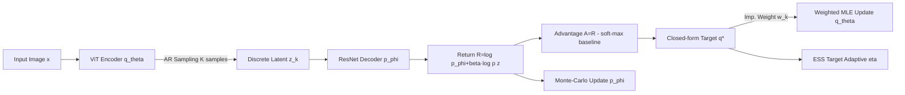

# Discrete Variational Autoencoding via Policy Search

**Conference**: ICLR 2026  
**OpenReview**: [https://openreview.net/forum?id=wJhhCmbFzY](https://openreview.net/forum?id=wJhhCmbFzY)  
**Code**: [drolet.io/daps](https://drolet.io/daps)  
**Area**: Image Generation / Discrete Representation Learning / Autoencoders  
**Keywords**: Discrete VAE, Policy Search, ELBO, Autoregressive Encoder, Trust Region, Effective Sample Size, ImageNet Reconstruction  

## TL;DR
The training of discrete VAE encoders is reformulated as a KL-regularized policy search problem. By using natural gradients of a non-parametric target distribution to update the parametric encoder through weighted maximum likelihood, this approach completely bypasses Gumbel-Softmax, straight-through estimators, and backpropagation through sampling paths. This allows autoregressive discrete encoders to train stably on high-dimensional data like ImageNet, outperforming quantization-based methods.

## Background & Motivation
**Background**: Discrete latent bottlenecks in VAEs are attractive due to high bit efficiency, compatibility with autoregressive transformers for multimodal search, and applicability of combinatorial optimization tools. However, since discrete stochastic variables lack exact differentiable parameterizations, mainstream methods must rely on approximations.

**Limitations of Prior Work**: Three categories of methods face distinct bottlenecks. (1) **Approximate Reparameterization** (Gumbel-Softmax + Straight-Through) is extremely sensitive to the temperature $\tau$—low temperatures lead to exploding gradient variance, while high temperatures cause large approximation errors; for large bottlenecks, memory costs of soft-assignment and gradient vanishing/exploding accumulate with autoregressive sampling. GR-MCK uses Rao-Blackwellization for variance reduction but does not address the root cause. (2) **Vector Quantization** (VQ-VAE, FSQ) avoids reparameterization via straight-through estimation, but since the latent distribution is not analytic, **the ELBO cannot be calculated**. This prevents maximizing latent space entropy in the objective, necessitating specialized losses and codebook utilization tricks. (3) **Gradient-free Methods** (REINFORCE and its control variate variants like REBAR/MuProp) provide unbiased gradients of the ELBO but suffer from high variance, making them historically unsuccessful in high-dimensional tasks like image reconstruction.

**Key Challenge**: Expressive autoregressive discrete encoders are desirable but cannot be precisely reparameterized nor withstand the gradient sensitivity of BPTT, while unbiased score function estimators exhibit prohibitive variance.

**Goal**: Train an autoregressive discrete encoder capable of working on ImageNet by directly optimizing the true ELBO (including entropy/bitrate control) with stable training that exceeds the performance of quantization methods.

**Core Idea**: <u>Policy search in reinforcement learning has long solved the problem of "performing gradient optimization with trust regions on non-differentiable sampling distributions," a development largely ignored by the discrete VAE community (e.g., KL trust regions, zero-order natural gradients, REPS).</u> By treating the encoder as a policy and reconstruction log-likelihood as a return, and adopting the framework of REPS/V-MPO—which solves for a closed-form non-parametric target distribution and then pulls the parametric policy toward it via weighted maximum likelihood—one can entirely avoid backpropagation through the sampling path.

## Method

### Overall Architecture
DAPS (Discrete Autoencoding via Policy Search) treats the ELBO as an entropy-regularized return maximization problem, using coordinate descent to alternately update the encoder and decoder. The encoder update consists of two steps: first, solving for a **closed-form non-parametric target distribution** $q^*$ given existing samples; second, using **self-normalized importance sampling + weighted maximum likelihood** to pull the parametric encoder $q_\theta$ toward $q^*$. No backpropagation through the autoregressive sampling is required. A scalar trust region parameter $\eta$ is automatically adjusted via an Effective Sample Size (ESS) target, providing stable step sizes across tasks and loss scales.

### Key Designs

**1. ELBO as Entropy-Regularized Return: Turning Encoders into Policies.** DAPS introduces a return $R(z,x)=\log p_\phi(x\mid z)+\beta\log p(z)$, making the $\beta$-ELBO equivalent to $J(q)=\mathbb{E}_x\sum_z q_\theta(z\mid x)R(z,x)+\beta H(q(z\mid x))$. This is exactly the objective of maximum entropy RL, but without sequential decisions, corresponding to episode-based policy search. The encoder $q_\theta(z\mid x)$ acts as the policy and the reconstruction log-likelihood as the return. This mapping allows the direct application of the policy search toolbox while keeping the entropy term explicit in the objective—something VQ methods cannot do as their latent distributions are not analytic. To reduce Monte-Carlo variance without bias, DAPS uses a **soft-max return over $K$ samples as an optimistic baseline**, yielding the advantage $A(z,x)=R(z,x)-\log\sum_{k=1}^K\exp R(z_k,x)$. This is an optimistic estimate of the soft-Value, accurate under the assumption that samples come from the optimal encoder.

**2. Closed-form Non-parametric Target $q^*$: One-step Optimality with KL Trust Region.** Drawing from REPS, DAPS solves a constrained optimization problem: maximize expected advantage plus entropy within a trust region where the KL divergence relative to the previous parametric policy $q_\theta$ does not exceed $\epsilon_\eta$: $\max_q \int_x p(x)\sum_z q\,A + \beta H(q)$ s.t. $D_{KL}(q\|q_\theta)\le\epsilon_\eta$. Solving with Lagrange multipliers yields the closed-form solution $q^*(z\mid x)\propto\exp\!\big(\frac{A(z,x)+\eta\log q_\theta(z\mid x)}{\eta+\beta}\big)$, where $\eta$ controls the trust region size and $\beta$ controls policy entropy. The key insight: while the normalization constant of $q^*$ is intractable in high-dimensional latent spaces, **it is not needed**—only point-wise ratios of $q^*$ to $q_\theta$ on sampled particles are required to construct importance weights.

**3. Weighted MLE + Self-normalized Importance Sampling: Eliminating Sample-Path Backprop.** Once $q^*$ is obtained, $q_\theta$ is updated via maximum likelihood, equivalent to minimizing $\int_x p(x)D_{KL}(q^*\|q_\theta)$. Since direct sampling from $q^*$ is impossible, $q_\theta$ is used as a proposal distribution for importance sampling, resulting in the objective $L(\theta)\approx-\frac1N\sum_i\sum_k w_{ik}\log q_\theta(z_k\mid x_i)$ with weights $w_i=q^*(z\mid x_i)/q_\theta(z\mid x_i)$. Because the normalization constant of $q^*$ is unknown, **self-normalized weights** $\tilde w_i=w_i/\sum_j w_j$ are used, which reduces variance at the cost of a bias that vanishes asymptotically with sample size. This is the core of DAPS: gradients flow only through $\log q_\theta(z_k\mid x)$ (the log-likelihood of already sampled discrete sequences), **never passing through the autoregressive sampling process**. The decoder $p_\phi$ is updated independently via coordinate descent on $L(\phi)=-\sum_i\mathbb{E}_{z\sim q_\theta}[\log p_\phi(x_i\mid z)]$.

**4. ESS-Adaptive Trust Region: A Single Scalar for All Step Sizes.** The trust region multiplier $\eta$ is not manually tuned. DAPS treats it as a trainable parameter, adjusted automatically using Effective Sample Size (ESS) as a tractable proxy for the second-order Rényi divergence: $\widehat{\mathrm{ESS}}_\eta=\frac1N\sum_i\frac{(\sum_k w_{ik})^2}{\sum_k w_{ik}^2}$. This is optimized via SGD to minimize $(\widehat{\mathrm{ESS}}_\eta-\mathrm{ESS}_{\text{target}})^2$. Setting $\mathrm{ESS}_{\text{target}}\in[K/4,3K/4]$ ensures stable convergence. During training, $\eta$ smoothly decays, providing naturally decreasing step sizes and adaptively absorbing differences in tasks and loss scales.

## Key Experimental Results

### Main Results (Table 1: Validation Metrics across 4 Datasets, Mean of multiple seeds)

| Method | MNIST β-ELBO/PSNR | CIFAR β-ELBO/PSNR/FID | ImageNet β-ELBO/PSNR/FID | LAFAN β-ELBO/PSNR |
|---|---|---|---|---|
| FSQ | – / 18.42 | – / 24.19 / 163.00 | – / 24.24 / 54.54 | – / 36.19 |
| VQ-VAE | – / 18.45 | – / 24.19 / 164.30 | – / 23.83 / 65.01 | – / 31.04 |
| GR-MCK | -62.25 / 16.78 | 217.45 / 22.69 / 179.88 | 60.7k / 23.01 / 73.21 | -1008.12 / 34.11 |
| Gumbel | -68.07 / 16.30 | 704.92 / 23.74 / 169.87 | – / – / – | -998.49 / 34.51 |
| Gumbel-NA | -47.09 / 18.21 | 785.35 / 24.27 / 162.04 | 85.2k / 24.49 / 51.66 | -1400.05 / 27.89 |
| **Ours** | -46.54 / 18.23 | 1185.51 / **25.21** / 157.27 | 87.0k / **24.66** / **48.65** | -949.78 / **36.81** |
| **Ours-NA** | -46.96 / **18.36** | 977.39 / 25.02 / **156.33** | 78.8k / 24.40 / 57.43 | -1050.25 / 32.90 |

- **Best Reconstruction on CIFAR/ImageNet**: DAPS leads in CIFAR PSNR 25.21 (vs FSQ 24.19) and ImageNet PSNR 24.66/FID 48.65 (vs FSQ 54.54, VQ-VAE 65.01), proving superior reconstruction under high-dimensional, compact bottlenecks compared to quantization and approximate reparameterization.
- **LAFAN Robotics Motion**: DAPS achieves the highest PSNR (36.81), demonstrating that the learned discrete latent space effectively drives full-body expressive motion generation for the Unitree H1 robot.

### Ablation Study (CIFAR-10, Grid search on β and ESS target)

| Hyperparameter | Range | Observation |
|---|---|---|
| $\beta$ | {0.1, 1.0, 5.0, 10.0} + Annealing | **Annealing $\beta$ is strongest**: High entropy early for exploration, low entropy late for reconstruction quality; most critical hyperparameter. |
| ESS target | {K/4, K/2, 3K/4} | Mostly insensitive, only affects the adaptive trajectory of $\eta$, highlighting robustness. |
| Codebook Usage | Fig 2 | DAPS exhibits significantly higher codebook utilization than FSQ and VQ-VAE. |

### Key Findings
- **Autoregressive Gradient Estimation is the Bottleneck**: Gumbel-NA (non-autoregressive) outperforms autoregressive Gumbel on most datasets, indicating that gradient estimates passing through AR sampling are highly unstable. In contrast, since DAPS does not pass gradients through sampling, the AR version (Ours) generally outperforms the NA version.
- **Superior Stability**: AR Gumbel was unstable at baseline learning rates and required per-dataset tuning, leading to its exclusion from ImageNet experiments. DAPS used a constant learning rate of $3\times10^{-4}$ across all tasks without retuning.
- **Entropy/Bitrate Control + High Utilization**: Explicit $\beta$ entropy regularization allows DAPS to achieve peak codebook utilization, avoiding the codebook collapse issues of VQ-like methods that require specialized heuristics.

## Highlights & Insights
- **Paradigm for Cross-Domain Knowledge Transfer**: The problem of discrete VAE training, long stuck between approximate reparameterization and quantization, is reformulated in the context of policy search. It directly inherits mature RL successes in trust regions, natural gradients, and ESS adaptation.
- **The "No Normalization Constant" Breakthrough**: While the closed-form solution for $q^*$ contains an intractable normalization term, self-normalization of importance weights neatly cancels it out, making updates in high-dimensional discrete bottlenecks computationally feasible.
- **One Scalar $\eta$ to Rule Them All**: ESS adaptation unifies step size, trust region, and loss scale into a single parameter adjustment, explaining DAPS's ability to generalize across datasets without retuning.
- **True ELBO vs. Proxy Losses**: Unlike VQ-VAE/FSQ which use proxy losses, DAPS optimizes the ELBO directly, providing explicit bitrate control and stochastic discrete latents suitable for downstream search.

## Limitations & Future Work
- **Computational Cost of $K$**: Sampling $K$ sequences per data point to calculate advantages and weights adds overhead. Small $K$ increases bias from the soft-max baseline and self-normalization, while large $K$ increases cost; the accuracy-cost frontier is not fully characterized.
- **Self-Normalization Bias**: While asymptotically vanishing, the impact of bias in self-normalized weights under small mini-batches or small $K$ lacks quantitative analysis.
- **$\beta$ Annealing Schedule**: The strongest results depend on a $\beta$ schedule. While easier to tune than Gumbel temperatures, it still requires design rather than being entirely parameter-free.
- **Generative Capability**: The paper focuses on reconstruction. The quality of unconditional generation using the discrete latent space with autoregressive priors, and the promised benefits for "combinatorial search," are only briefly addressed.
- **Scale and Modalities**: ImageNet-256 is the current limit. Applying DAPS to other modalities like text or audio, and integration with modern diffusion or AR generation stacks, remains for future work.

## Related Work & Insights
- **Discrete Reparameterization**: Gumbel-Softmax (Jang 2016), GR-MCK (Paulus 2020)—the primary points of comparison and replacement for DAPS.
- **Vector Quantization**: VQ-VAE (van den Oord 2017), FSQ (Mentzer 2023)—main competitors for reconstruction and utilization; DAPS differs by enabling analytic ELBO and explicit entropy regularization.
- **Score Function Estimators**: REINFORCE (Williams 1992), REBAR (Tucker 2017), MuProp (Gu 2015)—unbiased but high-variance; DAPS improves upon these via policy search with trust regions and natural gradients.
- **Policy Search Frameworks**: REPS (Peters 2010), V-MPO (Song 2019), and LBPS (Watson & Peters 2023) provided the building blocks for the $q^*$ target, weighted MLE updates, and ESS adaptation used in DAPS.
- **Insight**: When a subfield is bottlenecked by a set of imperfect approximations, looking at adjacent fields (in this case, RL) often reveals that the same structural problem has already been solved. Differentiability is not the only path; weighted MLE + trust regions are powerful tools for bypassing non-differentiable sampling.

## Rating
- **Novelty**: ⭐⭐⭐⭐⭐ Completely reformulates VAE training as a policy search problem. The approach is entirely fresh for this area and utilizes clear, well-founded components.
- **Experimental Thoroughness**: ⭐⭐⭐⭐ Covers 4 datasets of increasing scale with multiple seeds and controlled baselines. Minor deduction for lack of generative quality analysis and $K$ cost-accuracy trade-offs.
- **Writing Quality**: ⭐⭐⭐⭐ Theoretically sound with a clear mapping between RL and VAE. Complete pseudocodes are provided, though the density of equations may challenge readers without an RL background.
- **Value**: ⭐⭐⭐⭐⭐ Provides the first discrete autoencoder framework that stably outperforms quantization on ImageNet while optimizing the true ELBO, offering high utility for discrete representation learning and downstream search tasks.

<!-- RELATED:START -->

## Related Papers

- [\[ICLR 2026\] Variational Autoencoding Discrete Diffusion with Enhanced Dimensional Correlations Modeling](variational_autoencoding_discrete_diffusion_with_enhanced_dimensional_correlatio.md)
- [\[ICLR 2026\] Embracing Discrete Search: A Reasonable Approach to Causal Structure Learning](embracing_discrete_search_a_reasonable_approach_to_causal_structure_learning.md)
- [\[ICLR 2026\] Pareto Variational Autoencoder](pareto_variational_autoencoder.md)
- [\[CVPR 2026\] VA-π: Variational Policy Alignment for Pixel-Aware Autoregressive Generation](../../CVPR2026/image_generation/va-p_variational_policy_alignment_for_pixel-aware_autoregressive_generation.md)
- [\[ICLR 2026\] Latent Diffusion Model without Variational Autoencoder](latent_diffusion_model_without_variational_autoencoder.md)

<!-- RELATED:END -->
