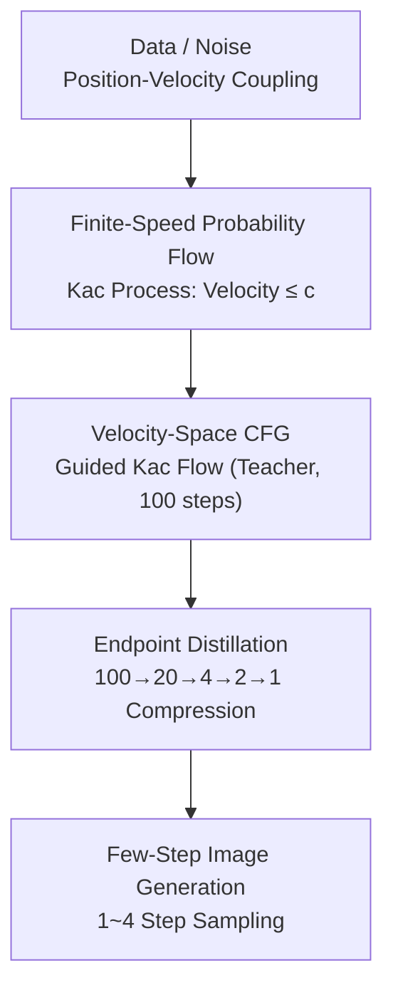

# DistillKac: Few-Step Image Generation via Damped Wave Equations

**Conference**: ICLR 2026  
**arXiv**: [2509.21513](https://arxiv.org/abs/2509.21513)  
**Code**: None  
**Area**: Diffusion Models / Few-step Generation / New PDE Framework  
**Keywords**: damped wave equation, Kac process, finite-speed flow, endpoint distillation, few-step generation

## TL;DR
The telegrapher equation (damped wave equation) and its stochastic Kac representation are proposed as the foundation for generative probability flows to replace the Fokker-Planck equation. This framework achieves finite-speed propagation, and an endpoint distillation method is introduced for few-step generation, achieving FID=4.14 in 4 steps and FID=5.66 in 1 step on CIFAR-10.

## Background & Motivation

**Background**: Diffusion models are based on the Fokker-Planck equation (a parabolic PDE), where the reverse velocity field becomes stiff near the terminal time because the diffusion process allows for infinite propagation speed.

**Limitations of Prior Work**: The norm of the reverse ODE velocity can grow unboundedly as $t \to T$, leading to instability in terminal sampling and requiring many steps to ensure precision. During distillation, student models easily deviate from teacher trajectories at large step sizes.

**Key Challenge**: Infinite speed propagation $\to$ velocity field stiffness $\to$ sampling instability $\to$ requirement for many steps. Can this be resolved at the PDE level?

**Goal**: Introduce a hyperbolic PDE (damped wave equation) as an alternative to leverage its finite-speed propagation characteristics for more stable few-step generation.

**Key Insight**: The damped wave equation is a generalization of the Fokker-Planck equation—diffusion is the limit when damping and velocity tend toward infinity. The Kac process naturally possesses a velocity upper bound $c$, ensuring globally bounded kinetic energy and Lipschitz regularity in Wasserstein space.

**Core Idea**: Probability flows with finite speed allow endpoint matching to automatically guarantee path proximity, making few-step distillation more stable.

## Method

### Overall Architecture

This paper addresses the "terminal velocity field stiffness" in few-step generation by modifying the underlying PDE. The Fokker-Planck equation (parabolic) is replaced with the damped wave equation $\partial_{tt} p + \lambda \partial_t p = c^2 \nabla^2 p$ (hyperbolic, also known as the telegrapher equation). The pipeline consists of three stages: first, constructing a **finite-speed** probability flow using the Kac representation (position-velocity coupling where velocity is bounded by $c$); second, applying classifier-free guidance in the velocity space to obtain a Guided Kac Flow (the 100-step teacher); and finally, using endpoint distillation to compress the teacher into a 1-step student. The key is that since the flow is velocity-bounded and trajectories stay within causal cones, aligning endpoints "for free" ensures path alignment.

### Key Designs

**1. Finite-Speed Probability Flow: Using the Kac process to bound the velocity field $c$ and eliminate terminal stiffness**

The norm of the reverse ODE velocity in diffusion models grows unboundedly near $t \to T$ because Fokker-Planck allows infinite propagation speed. This paper adopts the stochastic Kac representation of the damped wave equation: the particle's position $X_t$ and velocity $V_t$ evolve together, with $|V_t| \leq c$. Velocity direction flips according to a Poisson process in 1D or resamples in high dimensions. With a hard speed limit, trajectories are confined to causal cones, resulting in globally bounded kinetic energy and Lipschitz regularity in Wasserstein space. This removes terminal stiffness, making numerical integration more stable for few-step sampling.

**2. Velocity-Space CFG: Guidance in the velocity field to preserve speed constraints**

Traditional CFG operates in the score space, which might produce extrapolated fields that violate finite-speed constraints. This work applies guidance directly to the Kac velocity field:

$$u_{\text{guided}} = (1+w)\, u_\theta^{\text{cond}} - w\, u_\theta^{\text{uncond}}$$

It is proven that under mild conditions, this guided field remains square-integrable, meaning the finite-speed structure is preserved. The resulting Guided Kac Flow serves as the stable teacher for distillation.

**3. Endpoint Distillation + Path Stability (Theorem 8): Aligning endpoints ensures trajectory alignment**

Standard distillation fails when students deviate from teacher paths at large steps. This method trains the student to match the teacher's output at interval endpoints $t_k$ (endpoint MSE). Theorem 8 proves that due to the Lipschitz regularity of Kac flows, aligning endpoints ensures the student and teacher remain close throughout the interval $[t_{k+1}, t_k]$, with the error decaying as $O(M^{-1})$ (where $M$ is the Euler student steps). Finite-speed flows uniquely provide this endpoint-to-path stability guarantee.

### Loss & Training

The teacher is a 100-step Guided Kac Flow integrated using AB-2 (second-order Adams-Bashforth), which provides second-order precision with one function evaluation per step. The distillation target is endpoint MSE, performed iteratively in stages (100→20→4→2→1). The backbone is a UNet trained on CIFAR-10, CelebA-64, and LSUN Bedroom-256.

## Key Experimental Results

### Main Results

| Method | NFE | FID (CIFAR-10) | FID (CelebA-64) |
|------|-----|---------------|----------------|
| Guided Kac Flow (100 steps, AB-2) | 100 | 3.58 | 3.50 |
| **DistillKac** | **20** | **3.72** | **3.42** |
| DistillKac | 4 | 4.14 | 4.36 |
| DistillKac | 2 | 4.68 | 5.66 |
| DistillKac | 1 | 5.66 | 7.45 |
| DDIM (100 steps) | 100 | 4.16 | 6.53 |
| DDIM (20 steps) | 20 | 6.84 | 13.73 |
| Progressive Distillation | 4 | 3.00 | — |
| iCT | 2 | 2.46 | — |

### Key Findings
- Distilling from 100 to 1 step only increases FID by 2.08 (3.58→5.66), demonstrating the endpoint stability of finite-speed flows.
- At 20 steps, DistillKac (3.72) significantly outperforms DDIM (6.84); the gap widens at 4 steps.
- The AB-2 integrator is highly efficient, providing high precision with optimized function evaluations.
- Absolute FID values are currently higher than EDM (1.79) or iCT (2.46), suggesting the base Kac flow model capability needs further improvement.

## Highlights & Insights
- **PDE Innovation**: Expanding generative models from parabolic PDEs (Fokker-Planck) to hyperbolic PDEs (damped wave equation) is a fundamental paradigm shift.
- **Endpoint-Path Stability**: Theorem 8 is a core theoretical contribution, showing that the geometric properties of finite-speed flows allow "free" path consistency from endpoint supervision.
- **Potential**: The stability benefits of finite-speed flows might become more significant in large-scale models (e.g., using DiT).

## Limitations & Future Work
- Absolute generation quality lags behind SOTA (FID 3.58 vs EDM 1.79).
- Validation is limited to small-scale datasets (CIFAR-10, CelebA-64); lacks ImageNet or high-resolution experiments.
- Hyperparameters like speed bound $c$ and damping rate $\lambda$ require tuning.
- Comparison with consistency models (iCT, sCT) is not exhaustive.

## Related Work & Insights
- **vs Kac Flow (Duong et al., 2026)**: DistillKac adds CFG and distillation, improving 100-step FID from 6.42 to 3.58.
- **vs Progressive Distillation**: Similar concept but different theoretical foundation—DistillKac offers endpoint-path stability guarantees.
- **vs Flow Matching**: Both use ODE flows, but Kac introduces finite-speed constraints for better terminal stability.

## Rating
- Novelty: ⭐⭐⭐⭐⭐ Pioneering hyperbolic PDE framework for generative models.
- Experimental Thoroughness: ⭐⭐⭐ Restricted to small datasets; absolute performance is not yet top-tier.
- Writing Quality: ⭐⭐⭐⭐⭐ Rigorous theoretical derivation and clear mapping from PDE to generative modeling.
- Value: ⭐⭐⭐⭐ Opens a new direction (hyperbolic generative models), though large-scale feasibility requires further validation.

<!-- RELATED:START -->

## Related Papers

- [\[ICLR 2026\] FALCON: Few-step Accurate Likelihoods for Continuous Flows](falcon_few-step_accurate_likelihoods_for_continuous_flows.md)
- [\[ICLR 2026\] PairFlow: Closed-Form Source-Target Coupling for Few-Step Generation in Discrete Flow Models](pairflow_closed-form_source-target_coupling_for_few-step_generation_in_discrete_.md)
- [\[ICLR 2026\] BézierFlow: Learning Bézier Stochastic Interpolant Schedulers for Few-Step Generation](bézierflow_learning_bézier_stochastic_interpolant_schedulers_for_few-step_genera.md)
- [\[ICLR 2026\] Generalised Flow Maps for Few-Step Generative Modelling on Riemannian Manifolds](generalised_flow_maps_for_few-step_generative_modelling_on_riemannian_manifolds.md)
- [\[CVPR 2026\] Uni-DAD: Unified Distillation and Adaptation of Diffusion Models for Few-step Few-shot Image Generation](../../CVPR2026/image_generation/uni-dad_unified_distillation_and_adaptation_of_diffusion_models_for_few-step_few.md)

<!-- RELATED:END -->
