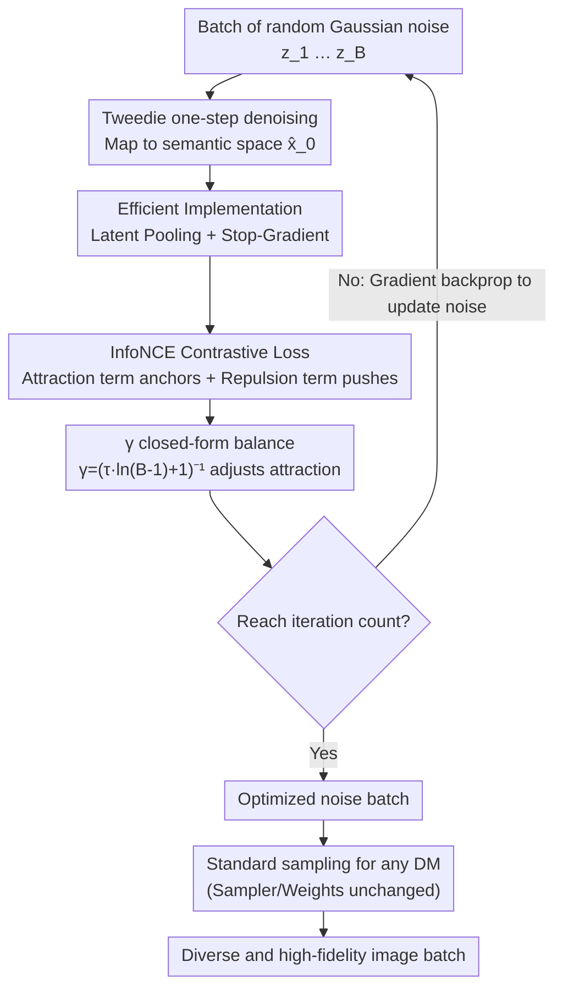

# Diverse Text-to-Image Generation via Contrastive Noise Optimization

**Conference**: ICLR 2026  
**arXiv**: [2510.03813](https://arxiv.org/abs/2510.03813)  
**Code**: Yes (Official Open Source)  
**Area**: Diffusion Models / Image Generation  
**Keywords**: Diffusion Models, Text-to-Image Generation, Diversity, Contrastive Learning, Noise Optimization, InfoNCE

## TL;DR

Ours proposes Contrastive Noise Optimization (CNO), which enhances the generation diversity of diffusion models through a pre-processing approach by imposing an InfoNCE contrastive loss on initial noise within the Tweedie denoising prediction space, maintaining fidelity without modifying the sampling process or the model itself.

## Background & Motivation

**Diversity bottleneck of diffusion models**: Current text-to-image diffusion models (e.g., SD1.5, SDXL, SD3) often generate highly similar results (mode collapse) when given the same prompt, especially under deterministic samplers (e.g., DDIM, FM-ODE), where output diversity is severely lacking.

**Root cause in noise space distribution**: Randomly sampled Gaussian initial noise does not guarantee uniform dispersion in the post-denoising semantic space, leading to multiple noises mapping to similar generation results.

**Limitations of Prior Work**: Increasing randomness (e.g., stochastic samplers) sacrifices quality; post-processing methods (e.g., rejection sampling) involve high computational overhead; modifying model architecture or training pipelines is highly intrusive.

**Key Insight from contrastive learning**: The InfoNCE loss naturally possesses a structure that "pulls positive samples closer and pushes negative samples apart," making it suitable for simultaneously maintaining fidelity (attraction term) and enhancing diversity (repulsion term) within a noise batch.

**Goal of the pre-processing paradigm**: If the initial noise can be optimized solely before sampling, it can be combined with any diffusion model and sampler, offering extreme versatility and plug-and-play characteristics.

**Need for theoretical controllability**: A parsable parameter is required to balance diversity and fidelity, rather than relying on manual hyperparameter tuning.

## Method

### Overall Architecture

CNO addresses the mode collapse problem where diffusion models under deterministic samplers produce highly repetitive results for the same prompt. The Core Idea is to completely decouple "diversity enhancement" from the sampling process, treating it as a one-time pre-processing step. Given a batch of random Gaussian noises $\{z_i\}_{i=1}^B$, a few steps of gradient optimization are performed before feeding them into the diffusion model: at each step, a single denoising step of the diffusion model maps each noise to the semantic space, where a contrastive loss is calculated. This loss ensures each noise anchors to its original position (fidelity) while pushing the batch of noises away from each other (diversity). The gradient is then backpropagated to update the noise itself. After several iterations, a batch of noises that are "semantically dispersed yet remain within the distribution" is obtained and fed into any standard diffusion sampling pipeline. The entire process only modifies the noise vectors without touching model weights, making it orthogonal to samplers and model architectures.

### Key Designs

**1. Tweedie denoising prediction space: Measuring distance in semantic space instead of noise space**

Pushing two noises apart directly in the original noise space is ineffective because the Euclidean distance between Gaussian noises is almost unrelated to the semantic differences of their final generated images—two distant noises could be denoised into nearly identical images. CNO's Mechanism is to first use the one-step denoising (Tweedie's formula) of the diffusion model to map each $z_i$ into the optimal estimate of the clean latent $\hat{z}_{0|T}^{i}$, and then calculate the distance in this semantic space. This step translates "whether noise is dispersed" into "whether generation results are dispersed," allowing optimization to act directly on meaningful semantic signals.

**2. InfoNCE Contrastive Loss: Fidelity via attraction, diversity via repulsion**

CNO adopts the InfoNCE form from representation learning to unify fidelity and diversity into a single loss. For each anchor noise $z_i$, the attraction term in the numerator anchors its denoising prediction $\hat{z}_{0|T}^{i}$ near its original (unoptimized) version $\hat{z}_{0|T}^{i,\text{ref}}$, acting as a fixed reference point to prevent noise deviation and quality degradation. The remaining $B-1$ samples in the denominator form the repulsion term, pushing different noises apart in the denoising prediction space to enhance output diversity. The base loss is written as:

$$\mathcal{L}_{\text{InfoNCE}} = \frac{1}{B}\sum_{i=1}^{B}\left[-\log\frac{\exp(f(\hat{z}_{0|T}^{i}, \hat{z}_{0|T}^{i,\text{ref}})/\tau)}{\sum_{j=1}^{B}\exp(f(\hat{z}_{0|T}^{i}, \hat{z}_{0|T}^{j})/\tau)}\right]$$

where $f(\cdot,\cdot)$ is cosine similarity and $\tau$ is the temperature. This structure naturally fits diverse generation: one term maintains quality while the other expands the distribution, eliminating the need to manually weight two independent objectives.

**3. γ closed-form formula: Auto-adaptive diversity-fidelity balance per batch**

The above loss has a hidden risk: as the batch size $B$ increases, each anchor is pushed by more negative samples, and the cumulative repulsion force expands, potentially pushing the noise out of the original Gaussian distribution and generating unreasonable or outlier images. CNO introduces a coefficient $\gamma$ to specifically regulate the attraction—changing the temperature of the attraction term in the numerator from $\tau$ to $\gamma\tau$:

$$\mathcal{L}_{\text{CNO}}^{\gamma} = \frac{1}{B}\sum_{i=1}^{B}\left[-\log\frac{\exp(f(\hat{z}_{0|T}^{i}, \hat{z}_{0|T}^{i,\text{ref}})/(\gamma\tau))}{\sum_{j=1}^{B}\exp(f(\hat{z}_{0|T}^{i}, \hat{z}_{0|T}^{j})/\tau)}\right]$$

Crucially, CNO does not leave $\gamma$ for grid search; instead, it sets "maximum attraction = sum of maximum of $B-1$ repulsion terms" to solve for the closed-form solution $\gamma = (\tau \cdot \ln(B-1) + 1)^{-1}$. It automatically decreases as $B$ increases, strengthening attraction to counteract repulsion expansion. For instance, with $\tau=0.1$ and $B=5$, $\gamma\approx 0.88$, which aligns closely with commonly used fixed values, effectively removing a round of parameter tuning. $\gamma$ effectively acts as a regularization term pulling noise back toward the Gaussian prior.

**4. Efficient Implementation: Latent Pooling + Stop-Gradient**

The first two designs calculate pairwise similarities on the original full-resolution latent $(B,C,S,S)$ and require backpropagation through the diffusion model at each step, which is computationally prohibitive for modern T2I backbones. CNO reduces this via two components. First, **adaptive latent pooling**: the latent space is downsampled to $(B,C,w,w)$ using window $w$ before calculating the contrastive loss, significantly reducing similarity matrix computation and VRAM. $w=16$ is found to be optimal. Second, **stop-gradient**: a truncation operator is added to the diffusion model path used for the Tweedie estimate, avoiding expensive backpropagation through the entire model. Ablations show this results in negligible loss in diversity and quality (MSS 0.1321 vs 0.1317) while significantly saving training costs.

### Loss & Training

The entire optimization targets the noise vectors $z_i$ without updating any model parameters. With the goal of minimizing $\mathcal{L}_{\text{CNO}}^{\gamma}$, a few iterations are run on a batch of noises using a standard optimizer. The temperature $\tau$ is the only hyperparameter required, and it is linked with $\gamma$ through the closed-form formula to automatically determine the balance point, leaving almost no knobs to tune during deployment.

## Key Experimental Results

### Main Results

Comparison of diversity and quality metrics between CNO and baseline methods across multiple diffusion models:

| Model | Method | MSS ↓ | Vendi Score ↑ | Coverage ↑ | PickScore ↑ |
|------|------|-------|--------------|------------|-------------|
| SD1.5 | DDIM | 0.1657 | 4.6949 | - | - |
| SD1.5 | **Ours** | **0.1317** | **4.7855** | - | - |
| SDXL | DDIM | 0.2169 | - | - | - |
| SDXL | **Ours** | **0.1623** | - | **0.7568** | - |
| SD3 | FM-ODE | - | 4.2205 | - | - |
| SD3 | **Ours** | - | **4.2644** | - | - |

### Ablation Study

| Component | MSS ↓ | Vendi ↑ | Note |
|------|-------|---------|------|
| Full CNO (w=16) | **0.1317** | **4.7855** | Optimal configuration |
| w/o Attraction | 0.1285 | 4.8012 | Higher diversity but lower quality |
| w/o Repulsion | 0.1648 | 4.7011 | Insignificant diversity gain |
| w=4 | 0.1325 | 4.7801 | High cost, limited gains |
| w=32 | 0.1398 | 4.7512 | Too much information loss |
| w/o Stop-gradient | 0.1321 | 4.7830 | Similar results but 2x computation |

### Key Findings

1. **Pareto Optimal**: CNO occupies the dominant Pareto frontier in the PickScore (Quality) vs. Vendi Score (Diversity) scatter plot.
2. **Compatibility with Few-step Sampling**: Remains effective on few-step samplers like FLUX and SDXL-Lightning, proving the versatility of the pre-processing paradigm.
3. **$\gamma$ Closed-form Verification**: The theoretically derived $\gamma$ values match grid-searched optimal values, removing hyperparameter tuning.
4. **Window size robustness**: Performance is stable within $w \in [8, 32]$, with $w=16$ being optimal.

## Highlights & Insights

- **Plug-and-play**: As a pre-processing method, it is orthogonally combined with any diffusion model and sampler, with very low engineering deployment costs.
- **Theoretical Elegance**: The closed-form formula for $\gamma$ unifies the effects of batch size and temperature into a single interpretable parameter.
- **New Perspective on Contrastive Learning**: Migrating InfoNCE from representation learning to noise space optimization is a clever conceptual transfer.
- **Tweedie Space Insight**: Measuring distance in the semantically relevant denoising prediction space rather than the noise space is key to the method's effectiveness.

## Limitations & Future Work

1. **Extra Computational Overhead**: Requires additional optimization iterations per generation (though one-shot), affecting latency for real-time applications.
2. **Batch Dependency**: The method requires optimizing a batch of noises simultaneously and cannot be used for single-image generation.
3. **Insufficient Semantic Diversity Verification**: MSS and Vendi Score primarily measure pixel-level diversity; in-depth analysis of semantic-level diversity is lacking.
4. **Tweedie Prediction Accuracy**: Depends on the quality of the one-step denoising prediction, which may be inaccurate for certain models or timesteps.
5. **Scalability**: For very large batch sizes, the computation and memory overhead of the contrastive loss may become a bottleneck.

## Related Work & Insights

- **DDIM / DPM-Solver**: Deterministic samplers are efficient but lack diversity; CNO effectively fills this gap.
- **DPP (Determinantal Point Process)**: A classic diversity sampling method; CNO's contrastive loss can be viewed as a continuous version of DPP.
- **Contrastive Learning (SimCLR/MoCo)**: InfoNCE is widely validated in representation learning; CNO transfers it to the noise space of generative models.
- **Noise scheduling research**: Previous works focused on the impact of noise scheduling on quality; CNO is the first to focus on the impact of noise initialization on diversity.

## Rating

- **Novelty**: ⭐⭐⭐⭐ — Applying contrastive learning to noise optimization is a concise and novel idea; the closed-form $\gamma$ formula adds theoretical depth.
- **Experimental Thoroughness**: ⭐⭐⭐⭐ — Covers multiple models (SD1.5/SDXL/SD3/FLUX), complete ablation studies, and convincing Pareto analysis.
- **Writing Quality**: ⭐⭐⭐⭐ — Clear motivation, smooth derivation, and high-quality charts.
- **Value**: ⭐⭐⭐⭐ — High practical utility as a plug-and-play solution for the diversity problem in diffusion model generation.

<!-- RELATED:START -->

## Related Papers

- [\[CVPR 2025\] Learning to Sample Effective and Diverse Prompts for Text-to-Image Generation](../../CVPR2025/image_generation/learning_to_sample_effective_and_diverse_prompts_for_text-to-image_generation.md)
- [\[ICLR 2026\] Scaling Group Inference for Diverse and High-Quality Generation](scaling_group_inference_for_diverse_and_high-quality_generation.md)
- [\[ICLR 2026\] TIPO: Text to Image with Text Pre-sampling for Prompt Optimization](tipo_text_to_image_with_text_pre-sampling_for_prompt_optimization.md)
- [\[ICLR 2026\] PCPO: Proportionate Credit Policy Optimization for Aligning Image Generation Models](pcpo_proportionate_credit_policy_optimization_for_aligning_image_generation_mode.md)
- [\[ICLR 2026\] From Broad Exploration to Stable Synthesis: Entropy-Guided Optimization for Autoregressive Image Generation](from_broad_exploration_to_stable_synthesis_entropy-guided_optimization_for_autor.md)

<!-- RELATED:END -->
## Related Papers

- [\[CVPR 2025\] Learning to Sample Effective and Diverse Prompts for Text-to-Image Generation](../../CVPR2025/image_generation/learning_to_sample_effective_and_diverse_prompts_for_text-to-image_generation.md)
- [\[ICLR 2026\] Scaling Group Inference for Diverse and High-Quality Generation](scaling_group_inference_for_diverse_and_high-quality_generation.md)
- [\[ICLR 2026\] TIPO: Text to Image with Text Pre-sampling for Prompt Optimization](tipo_text_to_image_with_text_pre-sampling_for_prompt_optimization.md)
- [\[ICLR 2026\] PCPO: Proportionate Credit Policy Optimization for Aligning Image Generation Models](pcpo_proportionate_credit_policy_optimization_for_aligning_image_generation_mode.md)
- [\[ICLR 2026\] Mitigating Noise Shift in Denoising Generative Models with Noise Awareness Guidance](mitigating_noise_shift_in_denoising_generative_models_with_noise_awareness_guida.md)

<!-- RELATED:END -->
