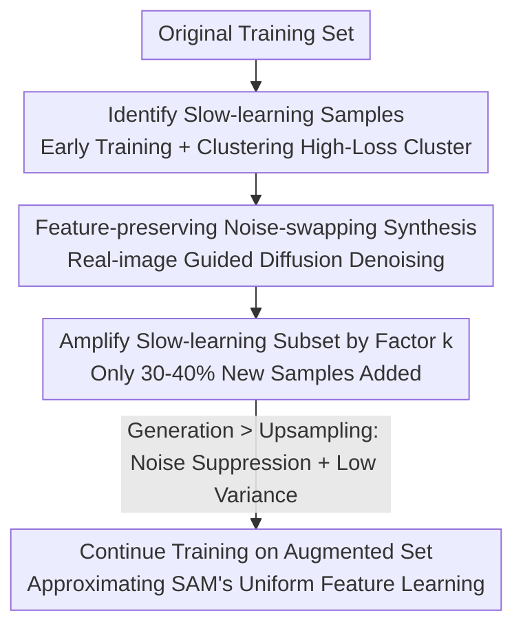

# Do We Need All the Synthetic Data? Targeted Image Augmentation via Diffusion Models

**Conference**: ICLR2026  
**OpenReview**: [https://openreview.net/forum?id=VaGvbAgBmd](https://openreview.net/forum?id=VaGvbAgBmd)  
**Code**: https://github.com/BigML-CS-UCLA/TADA  
**Area**: Diffusion Models / Data Augmentation / Image Classification  
**Keywords**: Targeted Data Augmentation, Diffusion Models, Slow-learnable Features, SAM, Generalization

## TL;DR
TADA shifts away from expanding the entire training set by 10–30x using diffusion models. Instead, it identifies the 30–40% "slow-learning" samples that are difficult to learn early in training and selectively augments them using real-image-guided diffusion to generate synthetic images that "preserve semantic features while replacing noise." Theoretical and experimental results demonstrate that augmenting only this subset is more effective than full-set augmentation, enabling SGD to outperform SAM on CIFAR-100/TinyImageNet.

## Background & Motivation
**Background**: Utilizing diffusion models (e.g., Stable Diffusion, GLIDE) to generate synthetic images for training set expansion has become an effective means to enhance image classification generalization. Its performance generally surpasses weak augmentations (Random Crop/Flip) and strong augmentations (PixMix/DeepAugment).

**Limitations of Prior Work**: Dominant methods conditionally generate large volumes of synthetic data based on class labels or by noising the entire dataset. These methods struggle with diversity and typically require expanding the training set to 10× (Azizi 2023) or even 30× (DreamDA) its original size, incurring massive generation and training overhead. Even "1× augmentation" schemes like Boomerang/DiffCoRe-Mix remain complex and costly.

**Key Challenge**: While research has focused on generating "more complex and realistic synthetic images," the fundamental necessity of augmenting *every* sample remains unquestioned. Intuitively, augmenting only a subset might introduce train/test distribution shifts and harm in-distribution performance—making "less is more" seem counterintuitive.

**Key Insight**: The authors leverage a finding in optimization theory (Nguyen 2024): generalization improves when features are learned at a more uniform rate. This explains why SAM (Sharpness-Aware Minimization) outperforms standard SGD—SAM accelerates the learning of "slow-learnable features" while suppressing overfitting to noise. Consequently, if the learning of slow-learning samples can be specifically accelerated, the benefits of SAM might be replicated.

**Core Idea**: Identify "slow-learning samples" that the model fails to learn during early training, then use a real-image-guided diffusion model to generate synthetic images where "semantics are preserved but noise is replaced." This selectively amplifies these samples. This is TArgeted Diffusion Augmentation (TADA).

## Method

### Overall Architecture
TADA aims to push training dynamics toward SAM-like "uniform feature learning" by performing high-quality targeted augmentation on "difficult-to-learn" samples without expanding the entire dataset. The pipeline is as follows: Train on the original set for a few epochs → Cluster early model outputs to identify the high-average-loss cluster as slow-learning samples → Perform "noise-denoise" generation for each slow-learner using real-image guidance to produce feature-preserving, noise-swapped synthetic images → Expand only this slow-learning subset by an amplification factor $k$ (up to 5×, resulting in 30–40% new samples total) → Continue training on the augmented data. A theoretical analysis using a two-layer CNN explains why generation is superior to simple upsampling.

### Key Designs

**1. Identifying "Slow-learning Samples": Clustering via Early Training**

Targeted augmentation requires identifying difficult samples. The authors use a data distribution hypothesis where each sample consists of two feature types: fast-learnable features $\beta_e \cdot y \cdot v_e$ (occurring with probability $\alpha$) and slow-learnable features $\beta_d \cdot y \cdot v_d$ ($\beta_e > \beta_d$), plus Gaussian noise patches. Samples with fast-learnable features allow the model to reduce loss rapidly; conversely, **samples containing only slow-learnable features maintain high loss in early stages**. TADA clusters model outputs after several epochs into two groups, selecting the high-loss cluster as slow-learners. The contribution is not the identification method itself (high loss or misclassification also work) but how to **amplify features without amplifying noise**.

**2. Real-image Guided Synthesis: Feature-Preserving Noise-Swapping**

The simplest amplification is copying slow-learners $k$ times (upsampling), but this also copies the noise $k$ times, reinforcing it and leading to overfitting. TADA uses diffusion for "gentle repainting": instead of starting from pure Gaussian noise $x_T \sim \mathcal{N}(0,I)$, a real reference image $x_0^{\text{ref}}$ is noised to an intermediate step $t^*$, and then GLIDE denoises it from $t^*$ using a class prompt (e.g., "a photo of a dog"). The resulting image **preserves the semantics of the slow-learner but introduces independent noise**. Since the new noise $\gamma_i$ is independent of the original, noise learning is "diluted" while features are amplified, mimicking SAM's behavior.

**3. Targeted Augmentation + Amplification Factor $k$**

TADA only augments the slow-learning subset. The final training set size is approximately $\alpha N + k(1-\alpha)N$, adding only 30–40% new samples compared to the +100% of full-set augmentation (Syn-all). Crucially, the amplification factor $k$ can be much higher: upsampling peaks at $k=2$ and degrades due to noise overfitting, whereas TADA remains optimal up to $k=5$ (CIFAR-10/100) or $k=4$ (TinyImageNet). Theorem 4.2 provides the tolerance: as long as synthesis noise $\|\gamma_i\|_2$ is manageable, generation causes less noise alignment than copying: $\mathbb{E}[\text{NoiseAlign}(I^{G}_{j,+})] < \mathbb{E}[\text{NoiseAlign}(I^{U}_{j,+})]$.

**4. Mechanism: Why Generation Outperforms Upsampling**

Theorem 4.1 proves that **SAM suppresses noise learning more than GD** in a two-layer CNN. SAM "looks ahead" toward sharp directions via adversarial perturbations, reducing the noise gradient component. TADA pushes training dynamics toward this behavior. Theorem 4.3 compares mini-batch SGD gradient variance: upsampling adds extra variance $\propto \frac{k(k-1)(1-\alpha)}{(\alpha+k(1-\alpha))^2}\cdot\frac{B}{N}$ due to dependent noise in repeated samples, whereas generation lacks this term. Lower variance leads to faster convergence (Corollary 4.4).

### Loss & Training
The objective remains the standard logistic empirical risk $L(W)=\frac{1}{N}\sum_i \log(1+\exp(-y_i f(x_i;W)))$. TADA modifies the data distribution rather than the loss function. Optimizers can be SGD or SAM. For generation, GLIDE is used with a guidance scale of 3 and 100 denoising steps. Ablations show that **approximately 50 steps** is optimal (fewer steps resemble the original too closely; more steps inject excessive noise). TADA uses $k=4\!-\!5$, while upsampling (USEFUL) is limited to $k=2$.

## Key Experimental Results

### Main Results
Test classification error (%, lower is better; TADA $k$: 5 for CIFAR, 4 for TinyImageNet):

| Dataset | Optimizer | Original | USEFUL | TADA |
|--------|--------|----------|--------|------|
| TinyImageNet | SAM | ~33 | ~31 | **-2.8%** Gain |
| CIFAR-100 | SGD | Baseline | Better | **SGD+TADA > SAM** |
| TinyImageNet | SGD | Baseline | Better | **SGD+TADA > SAM** |

> Note: Error rates are summarized from charts in the paper. Precise values should be referenced from the original Figures 2/3/4.

Test error (%) across different architectures (CIFAR-10, SGD):

| Method | ConvNeXt-T | Swin-T |
|------|-----------|--------|
| Original | 37.33 ± 3.12 | 16.10 ± 0.19 |
| USEFUL | 34.16 ± 2.47 | 14.93 ± 0.07 |
| **Ours (TADA)** | **27.40 ± 1.99** | **14.57 ± 0.10** |

Transfer Learning (Fine-tuning ImageNet-pretrained ResNet18, Test Error %):

| Method | Flowers-102 | Aircraft | Stanford Cars |
|------|-------------|----------|---------------|
| Original | 8.55 | 26.02 | 15.45 |
| DiffuseMix | 8.92 | 25.65 | 15.19 |
| **Ours (TADA+DiffuseMix)** | **8.08** | **25.12** | **14.96** |

### Ablation Study

| Configuration | Key Finding |
|------|---------|
| Syn-all vs TADA(k=2) | TADA achieves lower error with only 30-40% new samples vs 100% for Syn-all, reducing generation time to 0.3-0.4×. |
| Syn-rand vs TADA | Targeted augmentation is significantly superior to random augmentation at the same cost. |
| Factor $k$ | Upsampling peaks at $k=2$; TADA thrives at $k=5/4$ because generation avoids noise amplification. |
| Initialization | Real-image guidance is much better than starting from random noise. |
| Denoising Steps | 50 steps is the sweet spot between swapping noise and preserving semantics. |
| Identification | Clustering outperforms simple high-loss or misclassification methods. |

### Key Findings
- **"Less is More"**: Augmenting only 30-40% of slow-learning samples consistently outperforms full-set augmentation (Syn-all) with only 0.3–0.4× the generation cost.
- **Generation vs Copying**: While both amplify slow-learners, diffusion generation (noise-swapping) allows $k$ up to 5, whereas copying (noise-retaining) overfits at $k=2$.
- **Real-image Guidance is Essential**: Synthetic images from random noise fail to amplify slow-learnable features effectively and can perform worse than the original set.
- **Surpassing Optimizers**: SGD+TADA outperforms the SOTA optimizer SAM on CIFAR-100/TinyImageNet. TADA also stacks with TrivialAugment/DiffuseMix.
- **Cross-task Generalization**: In YOLOv5m training on MS-COCO, TADA outperforms InstanceAugmentation using 25% fewer augmented images, showing applicability beyond classification.

## Highlights & Insights
- **Focusing on "Who" rather than "How"**: While others optimize complex generation pipelines, TADA shows that choosing the right samples is more critical. It is simple, generator-agnostic, and plug-and-play.
- **Theory-Practice Alignment**: The two-layer CNN theory explains why targeted generation works and correctly predicts the experimental observation that generation permits a larger $k$ than upsampling.
- **Noise-Swapping Perspective**: Viewing diffusion augmentation as "amplifying slow features while replacing noise" provides a more fundamental understanding of generalization than the "realism/diversity" narrative.

## Limitations & Future Work
- **Reliability of Identification**: Clustering works for standard benchmarks, but its accuracy in identifying slow-learning features under noisy labels or extreme class imbalance requires further study.
- **Theoretical Constraints**: The theory relies on a two-layer CNN and strong assumptions (e.g., orthogonal noise).
- **Generation Cost**: While lower than full-set methods, 100-step diffusion denoising per slow-learner remains computationally expensive for massive datasets.
- **Adaptive $k$**: Future work could automate the selection of the amplification factor $k$ based on training dynamics.

## Related Work & Insights
- **Comparison to USEFUL**: USEFUL uses upsampling (copying) for difficult samples; TADA replaces this with "noise-swapping" generation, enabling higher $k$ and better performance.
- **Comparison to Syn-all/DreamDA**: These methods conditioned on labels for the full set (10-30x expansion). TADA disproves the necessity of full-set synthesis, achieving better results at ~0.3x the cost.
- **Comparison to SAM**: SAM suppresses noise learning via the optimizer; TADA achieves a similar effect (uniform learning) via data. SGD+TADA outperforms SAM without the 2x training time penalty.

## Rating
- Novelty: ⭐⭐⭐⭐⭐ Reframes diffusion augmentation from a generation problem to a selection problem with predictive theory.
- Experimental Thoroughness: ⭐⭐⭐⭐ Extensive coverage of datasets, architectures, and tasks; precise numerical tables for main results are missing (charts only).
- Writing Quality: ⭐⭐⭐⭐ Clear connection between theory and method.
- Value: ⭐⭐⭐⭐⭐ High practical value for cost-effective synthetic augmentation and theoretical grounding of "less is more."

<!-- RELATED:START -->

## Related Papers

- [\[CVPR 2026\] Do Less, Achieve More: Do We Need Every-Step Optimization for RL Fine-tuning of Diffusion Models?](../../CVPR2026/image_generation/do_less_achieve_more_do_we_need_every-step_optimization_for_rl_fine-tuning_of_di.md)
- [\[ICLR 2026\] Constantly Improving Image Models Need Constantly Improving Benchmarks](constantly_improving_image_models_need_constantly_improving_benchmarks.md)
- [\[CVPR 2026\] Low-Resolution Editing is All You Need for High-Resolution Editing](../../CVPR2026/image_generation/low-resolution_editing_is_all_you_need_for_high-resolution_editing.md)
- [\[ICML 2026\] You Don't Need All That Attention: Surgical Memorization Mitigation in Text-to-Image Diffusion Models](../../ICML2026/image_generation/you_dont_need_all_that_attention_surgical_memorization_mitigation_in_text-to-ima.md)
- [\[CVPR 2026\] OntoAug: Rethinking Generative Data Augmentation via Ontology Guidance](../../CVPR2026/image_generation/ontoaug_rethinking_generative_data_augmentation_via_ontology_guidance.md)

<!-- RELATED:END -->
