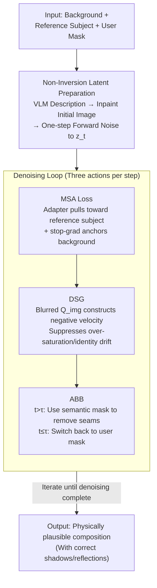

# Does FLUX Already Know How to Perform Physically Plausible Image Composition?

**Conference**: ICLR2026  
**arXiv**: [2509.21278](https://arxiv.org/abs/2509.21278)  
**Code**: [GitHub](https://github.com/ZhumingLian/SHINE)  
**Area**: Image Generation  
**Keywords**: image composition, training-free, diffusion model, FLUX, physically plausible

## TL;DR
The paper proposes SHINE, a training-free image composition framework. By utilizing three components—Manifold-Steered Anchor Loss, Degradation-Suppression Guidance, and Adaptive Background Blending—it leverages the inherent physical priors of pre-trained T2I models (such as FLUX) to achieve high-quality object insertion under complex lighting conditions (shadows, water reflections, etc.).

## Background & Motivation
**Background**: Image composition aims to seamlessly insert user-specified objects into new scenes. Despite the significant progress of multimodal large models (GPT-5, Gemini-2.5, etc.), they still perform poorly on image composition tasks, often suffering from imprecise object placement, inconsistent lighting, and subject identity drift.

**Limitations of Prior Work**: Existing methods face two major dilemmas:
1. **Limitations of training-based methods**: Fine-tuning-based composition models are limited by the quality of synthetic data, making it difficult to handle complex lighting (such as accurate shadow generation and water reflections). These models are also often bound to fixed resolutions. A key observation is that these issues do not exist in foundation models, suggesting that physical priors already exist in foundation models but are damaged during the fine-tuning process.
2. **Bottlenecks of training-free methods**: (a) Methods relying on image inversion lock the object pose to the orientation of the reference image and perform poorly on CFG-distilled models (like FLUX); (b) Attention surgery-based methods are unstable and sensitive to hyperparameters.

**Key Insight**: Modern T2I diffusion models have already encoded rich physical and resolution priors. The key is how to release them without destroying these priors.

## Core Problem
How to fully utilize the physical priors of pre-trained T2I models to achieve physically plausible (with correct shadows, reflections, etc.) high-fidelity image composition without additional training and without relying on inversion or attention manipulation?

## Method

### Overall Architecture
SHINE (Seamless, High-fidelity Insertion with Neutralized Errors) aims to answer a question: since pre-trained T2I models (FLUX, SDXL, SD3.5) already contain correct lighting/shadow/reflection priors, can these priors be "borrowed" for object insertion without fine-tuning, inversion, or attention surgery? The approach divides the task into "preparing a good starting point" and "gradually adjusting the object during the denoising process." The first stage uses **Non-Inversion Latent Preparation** to bypass traditional inversion: a VLM describes the reference subject, and an inpainting model generates an initial image in the background target area, followed by a single-step forward noise addition to obtain $\bm{z}_t$, preventing the object pose from being locked. The second stage enters the standard denoising loop, where three actions are performed at each step: **MSA Loss** pulls the latents toward the reference subject while anchoring the background, **DSG** suppresses over-saturation and identity drift using image-side negative guidance, and **ABB** switches masks according to denoising progress to eliminate seams while preserving shadows and reflections. This pipeline is model-agnostic and relies only on the standard functions of modern T2I models.

### Key Designs

**1. Non-Inversion Latent Preparation: Bypassing pose locking from inversion**

Traditional training-free methods rely on image inversion to obtain noise latents, but inversion locks the object pose to the reference image orientation and performs poorly on CFG-distilled models like FLUX. SHINE adopts a one-step forward diffusion approach instead: first, a VLM (BLIP-3) generates a description for the subject image; then, this description drives an inpainting model (FLUX.1-Fill) to generate an initial image $\bm{x}^{\text{init}}$ in the target area of the background; finally, one-step noise is added: $\bm{z}_t = (1 - \sigma_t)\bm{z}^{\text{init}} + \sigma_t \bm{\epsilon}$. Since the initial latent comes from forward generation rather than backward inversion, the object can appear freely in an orientation suitable for the scene, and physical priors are preserved.

**2. Manifold-Steered Anchor (MSA) Loss: Approximating the reference subject while preserving the background**

The object must resemble the reference subject without disrupting the background structure—these requirements are naturally in conflict. MSA treats pre-trained customization adapters (IP-Adapter, InstantCharacter, etc.) as implicit priors and directly optimizes noise latents during denoising. The loss is:

$$\mathcal{L}_{\text{MSA}}(\bm{z}_t) = \|\bm{v}_{\bm{\theta}+\bm{\Delta\theta}}(\bm{z}_t, t, \bm{c}, \bm{z}^{\text{subj}}) - \text{sg}[\tilde{\bm{v}}_t]\|_2^2$$

where the foundation model's prediction on the original latent $\tilde{\bm{v}}_t$ is fixed as an anchor via stop-gradient to lock the background structure, while the adapter-enhanced prediction $\bm{v}_{\bm{\theta}+\bm{\Delta\theta}}$ pulls the latent toward the reference subject. Gradients are updated only within the masked region, and the Jacobian term is omitted following the SDS strategy. Its effectiveness stems from the mathematical intuition that optimizing latents for a frozen generative model is equivalent to implicitly projecting it back to the data manifold learned by the model, resulting in a faithful and natural output.

**3. Degradation-Suppression Guidance (DSG): Using image-side negative guidance to suppress over-saturation and identity drift**

MSA optimization sometimes leads to color over-saturation and decreased identity consistency. While text negative prompts are conventional, the authors found them ineffective for FLUX—providing nonsensical text still yields high-quality images. Instead, they construct a negative velocity $\bm{v}_t^{\text{dsg}} = \bm{v}_t + \eta(\bm{v}_t - \bm{v}_{\bm{\theta}+\Delta\bm{\theta}}^{\text{neg}})$ within the attention mechanism. The key is how to derive $\bm{v}^{\text{neg}}$. The authors systematically blurred various components in the attention layers: blurring text-side $Q_{\text{txt}}$/$K_{\text{txt}}$/$V_{\text{txt}}$ had almost no impact; blurring image values $V_{\text{img}}$ caused the output to collapse; blurring $K_{\text{img}}$ had moderate impact; only blurring the image queries $Q_{\text{img}}$ produced significant degradation while maintaining structural integrity. Thus, it was chosen to construct the negative velocity. This aligns with theory—blurring $Q_{\text{img}}$ is equivalent to blurring self-attention weights, and suppressing attention activation reduces generation quality, serving as an ideal "negative" reference.

**4. Adaptive Background Blending (ABB): Multi-stage mask switching to eliminate visible seams**

Using a fixed user mask for blending leaves visible seams at composition boundaries and risks cutting off shadows or reflections cast by the object. ABB switches masks based on denoising progress: in early steps ($t > \tau$), it uses a semantic adaptive mask $M^{\text{attn}}$ generated from cross-attention maps to allow natural transitions at boundaries; in later steps ($t \leq \tau$), it switches back to the user mask $M^{\text{user}}$ to ensure physical effects like shadows and reflections outside the original mask are not cropped.

## Key Experimental Results

### Main Results (DreamEditBench, 220 pairs)

| Method | DINOv2↑ | DreamSim↓ | ImageReward↑ | VisionReward↑ |
|------|---------|-----------|--------------|---------------|
| AnyDoor | 0.7283 | 0.3764 | 0.4511 | 3.3946 |
| UniCombine | 0.7332 | 0.3984 | 0.4565 | 3.6108 |
| EEdit | 0.6590 | 0.6160 | 0.0216 | 3.3606 |
| **SHINE-Adapter** | **0.7415** | **0.3730** | **0.5709** | **3.6234** |
| **SHINE-LoRA** | **0.7452** | **0.3577** | **0.5906** | **3.6161** |

Ours significantly outperforms all baselines across human preference alignment metrics (DreamSim, ImageReward, VisionReward). On the ComplexCompo benchmark (300 pairs including multi-resolution, diverse lighting, and reflections), the advantage is even more pronounced as other methods experience significant performance drops in non-square resolutions and complex scenes.

### Ablation Study
- MSA contributes most: significantly improves subject identity consistency (DINOv2 from 0.6745 → 0.7204).
- DSG improves image quality scores (ImageReward and VisionReward increases).
- ABB effectively eliminates visible seams (visionally significant, though difficult for LPIPS/SSIM to fully capture).

## Highlights & Insights
1. **Training-free framework design**: Fully utilizes pre-trained model priors, avoiding the synthetic data contamination issues of data-driven methods.
2. **Ingenious DSG design**: Systemic experiments revealed that blurring $Q_{\text{img}}$ is the optimal strategy for constructing negative velocity, with an elegant theoretical explanation.
3. **Comprehensive model-agnosticism**: Runs on FLUX, SDXL, SD3.5, and PixArt, depending only on standard model functions.
4. **ComplexCompo benchmark contribution**: Fills the gap in image composition evaluation under complex lighting conditions.

## Limitations & Future Work
1. When inpainting prompts specify the wrong color, the final result inherits it.
2. The similarity between the inserted object and the reference depends on the quality of the customized adapter; LoRA requires per-concept test-time fine-tuning.
3. MSA optimization requires multiple forward passes ($k$ gradient descent steps), incurring high computational overhead.
4. The dependency on VLM description quality is not fully discussed.

## Related Work & Insights
- **vs Training methods (AnyDoor, UniCombine)**: Training methods are limited by synthetic data quality and perform poorly under complex lighting; AnyDoor tends to "copy-paste," leading to unnatural results.
- **vs Training-free inversion methods (TF-ICON, EEdit)**: Inversion locks poses and is ineffective for CFG-distilled models like FLUX.
- **vs SDS**: MSA loss borrows the strategy of omitting the Jacobian term from SDS, but the goals differ—SDS is for 3D generation, while MSA is for constrained 2D composition.

## Rating
- Novelty: 8/10 — The three components each have innovations; the analysis of attention perturbation in DSG is particularly clever.
- Experimental Thoroughness: 9/10 — Multiple benchmarks, metrics, and baselines; complete ablation; proposed a new benchmark.
- Writing Quality: 8/10 — Clear structure; good integration of mathematical derivation and intuitive explanation.
- Value: 8/10 — Training-free methods are highly practical, and the ComplexCompo benchmark has long-term value.

<!-- RELATED:START -->

## Related Papers

- [\[ICLR 2026\] PICABench: How Far are We from Physically Realistic Image Editing?](picabench_how_far_are_we_from_physical_realistic_image_editing.md)
- [\[ICCV 2025\] ScoreHOI: Physically Plausible Reconstruction of Human-Object Interaction via Score-Guided Diffusion](../../ICCV2025/image_generation/scorehoi_physically_plausible_reconstruction_of_human-object_interaction_via_sco.md)
- [\[CVPR 2026\] SketchDeco: Training-Free Latent Composition for Precise Sketch Colourisation](../../CVPR2026/image_generation/sketchdeco_training-free_latent_composition_for_precise_sketch_colourisation.md)
- [\[ICLR 2026\] FLUX-Reason-6M & PRISM-Bench: A Million-Scale Text-to-Image Reasoning Dataset and Comprehensive Benchmark](flux-reason-6m_prism-bench_a_million-scale_text-to-image_reasoning_dataset_and_c.md)
- [\[ICLR 2026\] What Exactly Does Guidance Do in Masked Discrete Diffusion Models](what_exactly_does_guidance_do_in_masked_discrete_diffusion_models.md)

<!-- RELATED:END -->
