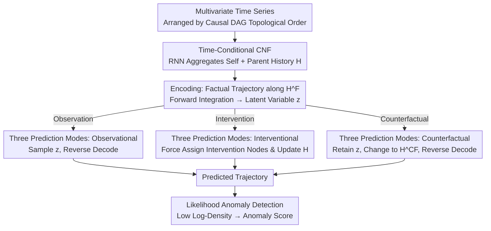

# DoFlow: Flow-based Generative Models for Interventional and Counterfactual Forecasting

**Conference**: ICLR 2026  
**arXiv**: [2511.02137](https://arxiv.org/abs/2511.02137)  
**Code**: [Available](https://github.com/StatFusion/DoFlow_Causal_Time_Series)  
**Area**: Image Generation  
**Keywords**: Causal Inference, Continuous Normalizing Flows, Time Series Forecasting, Counterfactual Reasoning, Anomaly Detection

## TL;DR

Ours proposes DoFlow, a causal generative model based on Continuous Normalizing Flows (CNF) that unifiedly implements observational, interventional, and counterfactual time series forecasting on a causal DAG. It also enables anomaly detection through explicit likelihood and demonstrates effectiveness on synthetic and real-world medical data.

## Background & Motivation

Time series forecasting is a core problem in statistics and machine learning. Traditional forecasting models (ARIMA, LSTM, Transformer, etc.) are **purely observational**—learning historical correlations and extrapolating them. However, practical applications often require answering causal "what if" questions:

**Interventional query**: "How will the system evolve if control variables are modified?" For instance, in a hydroelectric plant, how does power output change if the turbine control signal is altered. Observational predictors only provide a fixed prediction for a fixed history and cannot simulate different control schemes.

**Counterfactual query**: "How would the observed trajectory have changed if a different intervention had been taken at that time?" For example, in healthcare, after observing a patient's treatment and outcome trajectory, one might ask if the outcome would have been better for this specific patient under a different drug regimen.

**Key Challenge**: Existing causal generative models are primarily oriented toward static data, and there is no general framework for causal counterfactual forecasting in time series. A model that possesses both causal structure and generative capabilities is required.

## Method

### Overall Architecture

DoFlow treats each variable of a $K$-dimensional multivariate time series as a node on a causal DAG, arranged in topological order. It characterizes the generation mechanism of each node using a Structural Causal Model (SCM)—node $X_{i,t}$ is jointly determined by its own history $X_{i,t-}$, its parents' history $X_{\text{pa}(i),t-}$, and independent exogenous noise $U_{i,t}$, i.e., $X_{i,t} := f_i(X_{i,t-}, X_{\text{pa}(i),t-}, U_{i,t})$. The sequence is divided into a context window $\{1,\dots,\tau\}$ and a prediction window $\{\tau+1,\dots,T\}$, where the former acts as the condition and the latter as the prediction target. The core idea is to equip each node with a Continuous Normalizing Flow (CNF), mapping the three steps of causal inference—"Abduction-Action-Prediction"—onto the flow's "Encoding-Condition Change-Decoding." This allows a single model to unifiedly output observational, interventional, and counterfactual predictions, while simultaneously utilizing the explicit density of the flow for anomaly detection.

### Key Designs

**1. Time-Conditional Continuous Normalizing Flows: Binding Causal Structure with Flows**

If an unconditional flow were shared across all nodes, the information regarding "who depends on whom" in the causal DAG would be lost. DoFlow learns a shared CNF across time steps for each node $i$ and injects the causal history as a condition. The flow is defined by a Neural ODE that continuously transports the data distribution to a base distribution $\mathcal{N}(0,1)$ over $s\in[0,1]$: $\frac{dx_{i,t}(s)}{ds} = v_i(x_{i,t}(s), s; H_{i,t-1})$. The condition $H_{i,t-1}=\text{concat}(h_{i,t-1}, h_{\text{pa}(i),t-1})$ is aggregated by an RNN from the hidden states of itself and its parent nodes—thus, the velocity field $v_i$ explicitly depends on causal parents, and the DAG structure is encoded into the flow dynamics.

**2. Reversible Encoding-Decoding Mapping: One Flow for Both Noise Inference and Prediction Generation**

CNFs are inherently reversible, with the forward and backward directions each corresponding to half of causal inference. The forward direction (encoding) integrates the observed value $x_{i,t}^F$ along the factual hidden state $H_{i,t-1}^F$ to the latent variable $z_{i,t}^F = x_{i,t}^F + \int_0^1 v_i(x_{i,t}(s), s; H_{i,t-1}^F)\,ds$, which is equivalent to inferring the exogenous noise for that sample. The reverse direction (decoding) starts from the latent variable and integrates backward along the new hidden state $\hat{H}_{i,t-1}$ as $\hat{x}_{i,t} = z_{i,t} - \int_0^1 v_i(x_{i,t}(s), s; \hat{H}_{i,t-1})\,ds$ to generate the predicted value. It is this "encode noise, change condition, then decode" structure that enables counterfactuals to change interventions while retaining individual noise without requiring additional counterfactual-specific modules.

**3. Three Prediction Modes: One Architecture Switching Between Observation, Intervention, and Counterfactual**

Observational prediction is the simplest: directly sample $z\sim\mathcal{N}(0,1)$ and reverse decode node-by-node according to the topological order. Interventional prediction involves forcing assignments $\hat{x}_{i,t}\leftarrow\gamma_{i,t}$ for the intervention set $(i,t)\in\mathcal{I}$ during decoding, while non-interventional nodes are decoded normally. However, since the post-intervention values are written back to the hidden states and propagated downstream, downstream nodes naturally "perceive" the upstream modifications—something baselines without causal structures cannot achieve. Counterfactual prediction follows all three steps: first, encode the factual trajectory into $z_{i,t}^F$ using the factual hidden state $H^F$ (Abduction, locking the individual noise); then apply the intervention (Action); finally, decode the same $z_{i,t}^F$ into the counterfactual trajectory using the counterfactual hidden state $\hat{H}^{CF}$ (Prediction).

**4. Likelihood Anomaly Detection: Explicit Density for Free**

CNF can not only sample but also calculate the exact log-density of predicted trajectories, as the Jacobian of the transformation can be obtained via the divergence integral of the velocity field: $\log p_{\theta}(\hat{x}_{\tau+1:T}\mid\hat{H}_\tau) = \sum_{t=\tau+1}^{T}\big[\log q(z_t) + \int_0^1 \nabla\cdot v_\theta(x_t(s), s; \hat{H}_{t-1})\,ds\big]$. When the context is anomalous, the predicted trajectory provided by the model will fall into a low-density region; thus, this log-likelihood naturally serves as an anomaly score without needing an additional discriminator.

### A Complete Example

Consider medical counterfactuals: after observing a patient's treatment and outcome trajectory under a factual medication regimen, one asks, "Would the outcome have been better with a different dose?" DoFlow first integrates forward using the factual hidden state $H^F$, encoding this factual trajectory node-by-node into latent variables $z_{i,t}^F$; this step fixes the exogenous noise of "this specific patient." Next, it applies the intervention on the counterfactual dose and recomputes the hidden states $\hat{H}^{CF}$ for downstream nodes. Finally, it reverse decodes the same $z_{i,t}^F$ along $\hat{H}^{CF}$ to obtain the counterfactual outcome for this patient under the new dose. Because the encoding and decoding share the same reversible flow and the latent variables are preserved, the result reflects the difference for the same individual under different interventions, rather than the average treatment effect of the population.

### Loss & Training

Training utilizes the Conditional Flow Matching (CFM) loss. The reference path takes a linear interpolation $\phi(x_{i,t},z;s)$ between the data point and the base sample, regressing against the corresponding constant velocity $z-x_{i,t}$: $\mathcal{L}_{\text{CFM}}(\theta) = \mathbb{E}\big[\frac{1}{K(T-\tau)}\sum_{i,t}\|v_i(\phi(x_{i,t},z;s), s; H_{i,t-1}) - (z - x_{i,t})\|_2^2\big]$. Hidden states are updated via autoregression using real observations (teacher forcing) to ensure alignment between conditions and data during training. Theoretically (Corollary 4.5), under the assumption that the SCM is monotonic and training is exact, the aforementioned encoding-decoding process can accurately recover the true counterfactual trajectory, providing an identifiability guarantee for the method.

## Key Experimental Results

### Main Results

**RMSE for Observational/Interventional/Counterfactual Predictions on Synthetic Data (Various DAG Structures)**

| Method | Tree-Obs | Tree-Int | Tree-CF | Diamond-Obs | Diamond-Int | Diamond-CF |
|------|:---:|:---:|:---:|:---:|:---:|:---:|
| DoFlow | **0.57** | **0.54** | **0.11** | **0.55** | **0.57** | **0.12** |
| GRU | 0.65 | 1.01 | NA | 0.58 | 0.94 | NA |
| TFT | 0.58 | 0.97 | NA | 0.63 | 1.18 | NA |
| TiDE | 0.60 | 1.15 | NA | 0.50 | 1.05 | NA |

**Key Observations**:
- DoFlow leads significantly in interventional prediction (RMSE gap ~0.5) because baselines lack causal structure.
- Counterfactual prediction is a unique capability of DoFlow; baselines cannot implement it.
- Robust performance is maintained in Non-Linear Non-Additive (NLNA) scenarios.

**Real Data: Hydroelectric Plant Interventional Prediction**

DoFlow successfully predicts changes in downstream signals for different turbine control schemes on hydroelectric data, where the causal structure is consistent with physics.

**Real Data: Cancer Treatment Effect Estimation**

| Method | RMSE of PEHE ↓ |
|------|:---:|
| DoFlow | **Best** |
| CRN | Second Best |

### Ablation Study

- Additive vs. Non-Linear Non-Additive noise models: DoFlow performs well under both settings.
- Different DAG structures (Chain/Tree/Diamond/FC-Layer): Excellent consistency.
- Anomaly Detection AUROC: DoFlow effectively detects anomalies on both synthetic and real hydroelectric data.

### Key Findings

1. DoFlow unifies observational, interventional, and counterfactual queries, serving as the first general framework for time series counterfactuals.
2. The reversibility of CNF is central: Encoding → Modifying conditions → Decoding naturally supports counterfactuals.
3. Hidden state propagation carries interventional effects, allowing downstream nodes to naturally perceive upstream interventions.
4. Explicit likelihood density provides an additional capability for anomaly detection.

## Highlights & Insights

- **Unified Framework**: Supports three types of causal queries with a single model; the architectural design is natural and elegant.
- **Causal Alignment of CNF**: The reversibility of the flow perfectly aligns with the three-step Abduction-Action-Prediction method of causal inference.
- **Theoretical Support**: Proves the property of exact counterfactual recovery under monotonic SCMs.
- **Explicit Likelihood**: Obtains anomaly detection capabilities for free alongside prediction, increasing practical value.
- **RNN+CNF Combination**: RNNs encode temporal context while CNFs handle uncertainty and reversible mapping.

## Limitations & Future Work

- Assumes the causal DAG is known; in practice, causal discovery might be required.
- Assumes no instantaneous causal effects (all causal influences have at least a one-step time lag).
- Counterfactual recovery theory requires SCM monotonicity and exact training assumptions.
- One independent CNF per node; scalability might be tested when the number of nodes is large.
- Counterfactual ground truth is unobservable in real scenarios, limiting quantitative evaluation to synthetic data.
- Lacks in-depth comparison with more complex time series causal effect estimation methods.

## Related Work & Insights

- **vs. Traditional Causal Effect Methods**: The latter focuses on short-term expected differences of discrete actions, while DoFlow supports interventions for continuous variables at any time.
- **vs. Static Causal Generative Models** (Javaloy et al.): DoFlow extends to time series, capturing causal dependencies across time.
- **vs. Modern Predictors** (TFT/TiDE/TSMixer): These are observational and cannot answer causal questions.
- **Medical Application Potential**: Comparison of individual treatment plans, optimization of drug dosages, and clinical decision support.

## Rating

| Dimension | Score |
|------|:---:|
| Novelty | ★★★★★ |
| Theoretical Depth | ★★★★☆ |
| Experimental Thoroughness | ★★★★☆ |
| Value | ★★★★☆ |
| Writing Quality | ★★★★☆ |

<!-- RELATED:START -->

## Related Papers

- [\[ICLR 2026\] Conditionally Whitened Generative Models for Probabilistic Time Series Forecasting](conditionally_whitened_generative_models_for_probabilistic_time_series_forecasti.md)
- [\[ICLR 2026\] FlowCast: Trajectory Forecasting for Scalable Zero-Cost Speculative Flow Matching](flowcast_trajectory_forecasting_for_scalable_zero-cost_speculative_flow_matching.md)
- [\[ICLR 2026\] Flow Along the $K$-Amplitude for Generative Modeling](flow_along_the_k-amplitude_for_generative_modeling.md)
- [\[ICLR 2026\] FastFlow: Accelerating The Generative Flow Matching Models with Bandit Inference](fastflow_accelerating_the_generative_flow_matching_models_with_bandit_inference.md)
- [\[ICML 2026\] Barriers to Counterfactual Credit Attribution for Autoregressive Models](../../ICML2026/image_generation/barriers_to_counterfactual_credit_attribution_for_autoregressive_models.md)

<!-- RELATED:END -->
