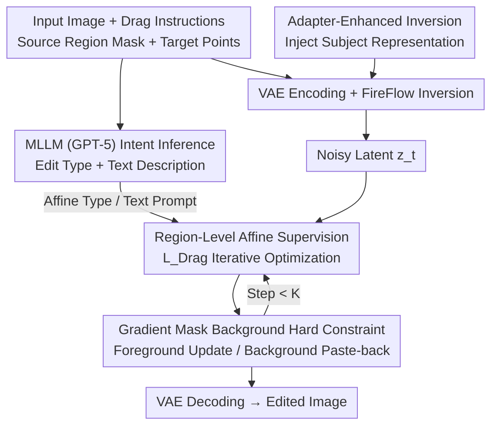

# DragFlow: Unleashing DiT Priors with Region Based Supervision for Drag Editing

**Conference**: ICLR 2026  
**arXiv**: [2510.02253](https://arxiv.org/abs/2510.02253)  
**Code**: [GitHub](https://github.com/Edennnnnnnnnn/DragFlow)  
**Area**: Diffusion Models / Image Editing  
**Keywords**: Drag Editing, DiT, Region-Based Supervision, FLUX, Affine Transformation  

## TL;DR
The first framework to introduce the strong generative priors of FLUX (DiT) into drag editing. It replaces traditional point-level supervision with region-level affine supervision, combined with gradient mask hard constraints and adapter-enhanced inversion, significantly improving the quality of drag editing.

## Background & Motivation
**Background**: Drag editing allows users to specify local spatial movements through interactive drag instructions, achieving fine-grained controllable editing. However, existing methods mostly rely on Stable Diffusion (UNet-based DDPM), which often leads to unnatural deformations and distortions in the editing results.

**Limitations of Prior Work**: The generative priors of SD are insufficient to pull optimized latents back into the natural image manifold. Although DiT + Flow Matching models (e.g., SD3.5, FLUX) possess significantly stronger priors, drag editing has not yet benefited from them.

**Key Challenge**: Direct migration of point-level drag frameworks to DiT performs poorly—the UNet bottleneck produces spatially compact, highly compressed features (broad receptive field), whereas DiT features are more fine-grained and spatially precise (narrow receptive field). Single-point supervision provides insufficient semantic evidence. Furthermore, FLUX is a CFG-distilled model with more severe inversion drift; traditional KV injection is insufficient to maintain subject consistency.

**Goal**: How to effectively utilize the strong priors of DiT for high-quality drag editing?

**Key Insight**: Shift from point-level supervision to region-level supervision, utilizing affine transformations to provide richer and more consistent feature supervision, while redesigning background preservation and inversion enhancement strategies.

**Core Idea**: Replace point-level motion supervision with region-level affine transformation supervision to unleash the potential of DiT in drag editing.

## Method

### Overall Architecture
The input image is first encoded by VAE and then inverted to a noise latent $\bm{z}_t$ using FireFlow. Subsequently, several iterative optimizations are inserted during the denoising process, where region-level affine supervision gradually moves the source region features to the target position. Three auxiliary mechanisms are utilized: the background is fixed by a gradient mask hard constraint, subject consistency is maintained by KV injection plus Adapter-enhanced inversion, and user intent (relocation / deformation / rotation and text description) is handled by MLLM (GPT-5) inference, eliminating manual editing type labeling.

The three contribution nodes D / F / G in the figure correspond to the three key designs below, while MLLM and VAE+FireFlow serve as the general pipeline.

### Key Designs

**1. Region-Level Affine Supervision: Replacing Short-sighted Single-Point Gradients with Richer Semantic Evidence**

The failure of porting point-level drag directly to DiT lies in the narrow and spatially precise receptive field of DiT features; a single point provides too little semantic evidence, making optimization short-sighted. DragFlow lets the user provide a source region mask $\{\bm{M}_i\}$ and target points $\bm{t}_i$, then uses affine transformation to smoothly push the source mask toward the target along a linear schedule $k/K$. Relocation and deformation parameters are determined by the vector from the target point to the centroid, while rotation is determined by the angle and anchor point. The optimization goal is to align the current region's DiT features with the initial region features:
$$\mathcal{L}_{\text{Drag}} = \sum_{i=1}^{N} \gamma_i \cdot \| \bm{M}_i^{(k)} \odot F(\bm{z}_t^{(k)}) - \text{sg}[\bm{M}_i^{(0)} \odot F(\bm{z}_t^{(0)})] \|_1$$
where $F(\cdot)$ extracts DiT features, $\bm{M}_i^{(k)}$ is the mask after affine transformation at step $k$, and $\text{sg}[\cdot]$ denotes gradient stopping. Since it compares the entire region rather than single points, the supervision signal naturally includes context and completely bypasses the point tracking step—neither requiring step-by-step point localization nor accumulating tracking errors.

**2. Gradient Mask Background Hard Constraint: Switching Background from "Soft Loss Game" to "Direct Locking"**

Traditional methods rely on an auxiliary consistency loss $\mathcal{L}_{\text{BG}}$ to hold the background, but this competes with the editing goal, and CFG-distilled models like FLUX exhibit large inversion drift, making descriptions themselves unreliable. DragFlow uses a hard constraint: gradient updates are applied only within the foreground region $\bm{B}$, while the outside area is directly pasted back from the original latent:
$$\bm{z}_t^{(k+1)} = \bm{B} \odot \Big(\bm{z}_t^{(k)} - \alpha \cdot \frac{\partial \mathcal{L}_{\text{Drag}}}{\partial \bm{z}_t^{(k)}}\Big) + (1 - \bm{B}) \odot \bm{z}_t^{\text{orig}}$$
This requires an additional reconstruction branch to provide $\bm{z}_t^{\text{orig}}$; the cost is moderate, but the benefit is significant—it raises background fidelity IF_bg from 0.757 to 0.925 in ablations.

**3. Adapter-Enhanced Inversion: Leveraging Off-the-Shelf Personalization Adapters to Inject Subject Representations into Priors**

Inversion drift from CFG-distillation causes subject identity to shift after editing. DragFlow does not require additional training; instead, it reuses pre-trained open-domain personalization adapters (e.g., IP-Adapter, InstantCharacter) as subject feature extractors to inject subject representations into the model prior. This improves inversion quality without fine-tuning costs—FLUX inversion LPIPS drops from 0.283 to 0.173, close to the 0.167 of DPM-Solver inversion on SD.

### Loss & Training
Only $\mathcal{L}_{\text{Drag}}$ is used throughout, as the background consistency loss is replaced by the hard constraint. Inversion uses the FireFlow algorithm with 25 diffusion steps, skipping the first 6 steps, starting editing from step 19, and performing 70 optimization iterations at the 7th denoising step (learning rate 1000 for the first 50, 1200 for the last 20). Adaptive weights $\gamma_i$ for each region are determined by the relative size of the operation area to balance supervision strength.

## Key Experimental Results

### Main Results

| Method | Category | IF_bg↑ | IF_s2t↑ | IF_s2s↓ | MD1↓ | MD2↓ |
|------|------|--------|---------|---------|------|------|
| RegionDrag | NFT | 1.000 | 0.957 | 0.957 | 33.69 | 6.38 |
| GoodDrag | OPT | 0.935 | 0.956 | 0.942 | 20.38 | 4.50 |
| InstantDrag | FT | 0.930 | 0.949 | 0.946 | 24.38 | 4.54 |
| **DragFlow (Ours)** | OPT | **0.992** | **0.958** | **0.934** | **19.46** | **4.48** |

*Results on ReD Bench. DragFlow is optimal across all Mean Distance metrics, with IF_bg second only to RegionDrag (which directly copy-pastes background).*

A similar trend is observed on DragBench-DR: DragFlow MD1=31.59 (second best 35.96), IF_bg=0.969 (second best 0.962). Consistent leads on both benchmarks demonstrate robustness.

### Adapter Inversion Quality Comparison (3000 images)

| Method | LPIPS↓ | SSIM↑ | PSNR↑ |
|------|--------|-------|-------|
| DPM-Solver Inv. (SD) | 0.167 | 0.799 | 26.31 |
| FireFlow Inv. w/o adapter (FLUX) | 0.283 | 0.703 | 20.43 |
| FireFlow Inv. w/ adapter (FLUX) | 0.173 | 0.784 | 25.87 |

### Ablation Study

| Configuration | IF_bg↑ | IF_s2t↑ | IF_s2s↓ | MD1↓ | MD2↓ |
|------|--------|---------|---------|------|------|
| Baseline (Point-based FLUX) | 0.765 | 0.932 | 0.962 | 51.21 | 9.38 |
| + Region-Level Affine | 0.757 | 0.946 | 0.936 | 31.26 | 5.88 |
| + Background Preservation | 0.925 | 0.948 | 0.943 | 29.67 | 5.39 |
| + Adapter-Enhanced Inversion | 0.991 | 0.959 | 0.938 | 20.15 | 4.48 |

### Key Findings
- Shift from point-level to region-level: MD1 decreased by 19.95 and IF_s2t increased by 0.027, validating the region strategy as a more suitable paradigm for DiT.
- The gradient mask design caused IF_bg to soar from 0.757 to 0.925.
- Adapter-enhanced inversion increased IF_s2t from 0.948 to 0.959, confirming foreground consistency enhancement.
- All three modules are effective and complementary.

## Highlights & Insights
- **First systematic analysis of why point-level drag fails on DiT**: Clear visualization of feature map differences between UNet vs DiT granularity.
- **Region-level paradigm elegantly solves point tracking**: Eliminates tracking and error accumulation.
- **Hard constraints replace soft loss**: Avoids the trade-off between background preservation and editing goals.
- **MLLM for intent inference**: Automatically determines drag type (relocation/deformation/rotation), reducing user burden.
- **Proposed ReD Bench**: The first drag benchmark with region-level annotations and task labels.

## Limitations & Future Work
- FLUX is a CFG-distilled model; inversion drift remains significant, with detail loss still occurring for highly complex structures.
- Dependency on external MLLM (GPT-5) for intent inference increases deployment costs.
- Requires an additional reconstruction branch for $\bm{z}_t^{\text{orig}}$, increasing inference overhead.
- Non-affine deformations (e.g., non-rigid free-form deformation) have not yet been explored.

## Related Work & Insights
- **RegionDrag**: Also uses region-level input but requires manual pre-definition of target masks and uses handcrafted mapping. DragFlow only needs target points. RegionDrag moves noisy latent patches via point-wise copy-paste, which can destroy internal structure; DragFlow extracts regional features as a whole for supervision.
- **GoodDrag**: The best optimization-based point-level baseline (ReD Bench MD1=20.38) but still limited by SD priors.
- **DragDiffusion**: Pioneering point-level drag work using LoRA to fine-tune SD; direct transfer to DiT performs poorly.
- **InstantDrag**: A fine-tuning approach limited by the mismatch between video data and drag instructions; model size reaches 914M.
- **CLIPDrag**: Introduces CLIP semantic guidance to point-level methods, but often misinterprets relocation as deformation, producing artifacts.
- **FastDrag**: Optimization-free and tuning-free method; maps latent patches directly. Quick, but relies on handcrafted priors leading to unnatural edits.
- **Insight**: When the geometric characteristics of base model features change fundamentally (UNet → DiT), the editing paradigm must be redesigned accordingly. As the DiT ecosystem matures, the value of the DragFlow framework will increase.

## Rating
- Novelty: ⭐⭐⭐⭐ — Analysis of point-level failure from feature granularity is insightful; region-level design is elegant.
- Experimental Thoroughness: ⭐⭐⭐⭐⭐ — Dual benchmarks + full ablation + new benchmark proposal.
- Writing Quality: ⭐⭐⭐⭐ — Motivation is clear; visuals are rich.
- Value: ⭐⭐⭐⭐ — Points the way for drag editing in the DiT era.

<!-- RELATED:START -->

## Related Papers

- [\[ICLR 2026\] UniEdit-Flow: Unleashing Inversion and Editing in the Era of Flow Models](uniedit-flow_unleashing_inversion_and_editing_in_the_era_of_flow_models.md)
- [\[ICLR 2026\] RegionE: Adaptive Region-Aware Generation for Efficient Image Editing](regione_adaptive_region-aware_generation_for_efficient_image_editing.md)
- [\[ICLR 2026\] LazyDrag: Enabling Stable Drag-Based Editing on Multi-Modal Diffusion Transformers via Explicit Correspondence](lazydrag_enabling_stable_drag-based_editing_on_multi-modal_diffusion_transformer.md)
- [\[ICLR 2026\] Follow-Your-Shape: Shape-Aware Image Editing via Trajectory-Guided Region Control](follow-your-shape_shape-aware_image_editing_via_trajectory-guided_region_control.md)
- [\[CVPR 2026\] SpotEdit: Selective Region Editing in Diffusion Transformers](../../CVPR2026/image_generation/spotedit_selective_region_editing_in_diffusion_transformers.md)

<!-- RELATED:END -->
