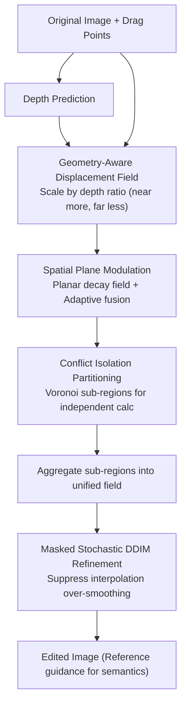

# Dragging with Geometry: From Pixels to Geometry-Guided Image Editing

**Conference**: ICLR2026  
**OpenReview**: [https://openreview.net/forum?id=MBiMt3wp8M](https://openreview.net/forum?id=MBiMt3wp8M)  
**Code**: https://github.com/xinyu-pu/GeoDrag  
**Area**: Diffusion Models / Image Editing  
**Keywords**: Drag editing, geometry-aware, displacement field, multi-point editing, one-step editing

## TL;DR
GeoDrag incorporates the 3D perspective rule "near pixels move more, far pixels move less" into drag-based image editing. By using a unified displacement field that encodes both 3D geometry (depth) and 2D planar priors, it achieves structure-consistent dragging in a single latent-space forward pass. It utilizes Voronoi partitioning to resolve cancellation issues in multi-point dragging, improving drag accuracy (DAI) by 1.4x and Mean Distance (MD) by 1.1x on DragBench compared to the second-best methods, all without requiring LoRA warm-up.

## Background & Motivation
**Background**: Point-based editing allows users to drag "handle points → target points" to precisely move image content, offering finer control than text-based editing. Following DragGAN, methods like DragDiffusion and FreeDrag adopted an iterative optimization paradigm of "motion supervision + point tracking." To increase speed, FastDrag and RegionDrag shifted to "one-step editing," directly constructing a dense displacement field $f$ on user-specified regions to warp the latent variable $z_T$, followed by a single diffusion pass, eliminating stepped gradient optimization.

**Limitations of Prior Work**: These efficient methods reason exclusively on the **2D pixel plane**, ignoring the underlying 3D geometry of the scene. When encountering "geometry-intensive" edits such as rotations or perspective transformations, pure 2D displacement fields tear the structure—for instance, a face might be stretched unnaturally because planar methods decay displacement strength based only on "pixel distance," unaware of varying depths across facial features.

**Key Challenge**: Achieving realistic and semantically consistent editing requires 3D geometric cues. However, 3D information (e.g., depth maps) is not naturally aligned with pixel-level operations. Naive integration introduces three problems: (1) how to map geometry to pixel-level edits; (2) geometry alone causes discontinuous displacements at object boundaries, disrupting the diffusion process; (3) displacement fields from multiple drag points can have opposite directions, leading to cancellation and editing failure.

**Goal**: Construct a unified displacement field that is both "geometry-aware" and "plane-aware" to achieve structure preservation, local precision, and conflict-free multi-point editing in a single forward pass.

**Key Insight**: The authors observe a fundamental fact of perspective projection: for the same 3D displacement, pixels with smaller depth (closer to the camera) exhibit larger pixel displacement, while those with larger depth move less (displacement is inversely proportional to depth). Transforming this rule into a modulation factor for the displacement field maintains 3D structure during dragging.

**Core Idea**: Replace the pure 2D displacement field with a unified field encoding both depth ratios and planar distance decay, while using Voronoi-style hard partitioning to isolate multi-point drags, enabling one-step, high-fidelity, and structure-consistent geometry-aware editing.

## Method

### Overall Architecture
GeoDrag is built upon Latent Consistency Models (LCM). It **directly predicts a dense displacement field** in the noisy latent space at a specific diffusion timestep $T$, bypassing iterative optimization. Given an image and $k$ drag pairs $\{(h_i, t_i)\}_{i=1}^k$ ($h_i$ as handle, $t_i$ as target), the pipeline is as follows: first, the edit mask is partitioned into non-overlapping sub-regions based on handle points. Each sub-region independently calculates a fused "geometry-aware + plane-aware" displacement field. These fields are then stitched into a final conflict-free $f$, which is used for one-step latent relocation and interpolation. Finally, a masked stochastic DDIM update suppresses over-smoothing from interpolation, while reference guidance preserves original semantics.

### Key Designs

**1. Geometry-aware displacement field: Bringing 3D perspective to 2D dragging via depth ratios**

This design addresses the mapping of geometry to pixel edits. Starting from perspective projection: a 3D point $(x,y,z)$ projects to pixel $(u,v)$ via camera intrinsics $K$. Applying a small 3D displacement $(\delta x,\delta y,\delta z)$, and assuming drag occurs on the image plane (ignoring movement along the optical $z$-axis), the 2D displacement simplifies to $\delta u = f_x(\delta x/z)$ and $\delta v = f_y(\delta y/z)$. For another point with depth $z'$, its 2D displacement satisfies $\delta u' = (z/z')\,\delta u$. Thus, displacement is inversely proportional to depth. The geometry-aware field is constructed as:

$$f_d = (\zeta_h/\zeta)^{\alpha} \cdot d = (\zeta_h/\zeta)^{\alpha} \cdot (t - h),$$

where $\zeta$ is the depth map, $\zeta_h$ is the depth at handle $h$, $d=t-h$ is the drag direction, and $\alpha$ modulates sensitivity. This ensures closer pixels undergo stronger projected motion, maintaining 3D consistency and avoiding spatial tearing.

**2. Spatial plane modulation: Compensating for geometric field failures at boundaries/details**

Geometric fields alone can cause discontinuities near object boundaries and lack sensitivity to fine local deformations. Inspired by elastic force propagation, the authors define a plane-aware field that decays from the handle point:

$$f_p = \big(\mathbf{1} - (P/L)^{\beta}\big) \cdot d,$$

where $P$ is the Euclidean distance to the handle and $L$ is the maximum propagation distance along the ray (calculated via intersection with the mask's bounding circle to ensure smooth decay). The fields are fused using **space-adaptive weights**:

$$f = (1-\lambda)\cdot f_p + \lambda\cdot f_d, \qquad \lambda = P/(P+\gamma).$$

As $P$ increases, the influence shifts from local planar deformation to global geometric consistency. The scale $\gamma$ adapts to object size.

**3. Conflict isolation partitioning: Preventing cancellation in multi-point dragging**

When summing displacement fields from multiple drag points, opposite directions cause destructive interference. GeoDrag partitions the edit mask $M$ into non-overlapping Voronoi-like sub-regions based on the nearest handle:

$$S_i = \big\{\, q \in M \;\big|\; i = \arg\min\nolimits_{j} \lVert q - h_j \rVert_2 \,\big\}.$$

Each pixel $q$ belongs to exactly one handle $h_i$, and its displacement $f_i$ is calculated independently within that sub-region. This **hard partitioning** eliminates directional conflicts at the root, allowing precise local multi-point edits.

**4. Masked stochastic DDIM refinement: Eliminating over-smoothing from one-step interpolation**

Interpolation can lead to blurry regions. During sampling, randomness is injected only into the interpolated area defined by mask $M$:

$$z^{*}_{t-1} = \sqrt{\bar\alpha_{t-1}}\,\hat z^{*}_{0} + \sqrt{1-\bar\alpha_{t-1}-\sigma_t^2}\;\odot M\,\epsilon_\theta(z^{*}_t, t) + \sigma_t\,(\epsilon \odot M).$$

This refinement preserves global coherence while recovering details without additional sampling overhead.

### Loss & Training
GeoDrag does not train new networks; it uses pre-trained LCM/diffusion models for one-step inference. The displacement field is **analytically constructed** via the formulas above. There are no learnable drag parameters, enabling zero-shot editing without LoRA fine-tuning.

## Key Experimental Results

### Main Results
On the DragBench benchmark (MD/DAI lower is better, IF higher is better):

| Method | MD ↓ | DAI₁ ↓ | DAI₂₀ ↓ | IF ↑ | Warm-up | Time(s) | Mem |
|------|------|--------|---------|------|------|---------|-----|
| DragDiffusion | 34.57 | 0.181 | 0.160 | 0.871 | ~1min LoRA | 22.46 | 18.63 |
| FreeDrag | 30.80 | 0.183 | 0.151 | 0.845 | ~1min LoRA | 42.90 | 18.90 |
| DragNoise | 33.84 | 0.179 | 0.158 | 0.861 | ~1min LoRA | 21.12 | 18.36 |
| FastDrag | 32.10 | 0.131 | 0.115 | 0.850 | ✗ | 3.23 | 5.85 |
| **GeoDrag (Ours)** | **29.24** | **0.128** | **0.111** | 0.847 | ✗ | 3.95 | **5.44** |

GeoDrag achieves the lowest MD and DAI without LoRA warm-up, maintaining a peak memory of only 5.44 GB.

### Ablation Study

| Configuration | Observation | Explanation |
|------|------|------|
| Full Model | Optimal performance | Geometry + Plane + Partitioning |
| w/o Depth | Inaccurate edits (e.g., failed car rotation) | Loss of 3D structural consistency |
| w/o Plane | Insufficient editing | Failure in local details/boundaries |
| Partitioning → Summation | Opposing drags cancel out | Multi-point edit failure |
| Partitioning → Weighting | Blurred results / ghosting | Hard partitioning outperforms soft weighting |

### Key Findings
- Geometry and planar fields are **complementary**: removing either degrades all metrics.
- Multi-point conflicts stem from displacement summation; **hard partitioning** is superior to soft weighting strategies.
- The refinement step significantly mitigates interpolation blur by conditionally injecting noise.

## Highlights & Insights
- **Analytic 3D injection**: By mapping "displacement $\propto 1/depth$" into the field without camera calibration, the model gains 3D structural awareness for rotations and perspective at minimal cost.
- **Voronoi partitioning for conflict resolution**: Decoupling a global coupling problem into independent local problems is simple, effective, and prevents interference between nearby handles.
- **Adaptive fusion $\lambda=P/(P+\gamma)$**: This provides a continuous schedule that balances local planar responsiveness with global geometric consistency.

## Limitations & Future Work
- **Dependency on monocular depth quality**: Predictions in transparent, reflective, or textureless areas may lead to geometric modulation errors.
- **Modest speed gains**: While faster than iterative methods, 3.95s is slightly slower than FastDrag; it focuses on accuracy and warm-up elimination rather than raw "real-time" speed.
- **Hard partition artifacts**: Voronoi boundaries are non-continuous; though mitigated by interpolation and refinement, dense handles might still cause edge artifacts.
- **Depth-wise movement**: The current model ignores movement along the optical axis ($\delta z$).

## Related Work & Insights
- **vs FastDrag / RegionDrag**: Improves upon pure 2D planar methods by incorporating depth-based modulation and hard partitioning to prevent structural tearing.
- **vs DragDiffusion / FreeDrag**: Replaced slow iterative optimization and LoRA fine-tuning with one-step analytical field construction.
- **vs FlowDrag**: Offers a more lightweight alternative to mesh reconstruction and iterative deformation by leveraging simple depth cues.

## Rating
- Novelty: ⭐⭐⭐⭐ Analytic injection of perspective rules and Voronoi partitioning for multi-point drags is a distinct and clever approach.
- Experimental Thoroughness: ⭐⭐⭐⭐ SOTA on DragBench and user studies; however, lacks a dedicated analysis of depth noise robustness.
- Writing Quality: ⭐⭐⭐⭐ Clear mapping between challenges and designs; rigorous derivations.
- Value: ⭐⭐⭐⭐ High practical value for interactive editing due to zero warm-up, low memory usage, and high precision.

<!-- RELATED:START -->

## Related Papers

- [\[ICLR 2026\] The Spacetime of Diffusion Models: An Information Geometry Perspective](the_spacetime_of_diffusion_models_an_information_geometry_perspective.md)
- [\[ICML 2026\] Geometry-Aware Tabular Diffusion](../../ICML2026/image_generation/geometry-aware_tabular_diffusion.md)
- [\[CVPR 2026\] GeoRK2: Geometry-Guided Runge-Kutta Integration for Diffusion Transformer Acceleration](../../CVPR2026/image_generation/geork2_geometry-guided_runge-kutta_integration_for_diffusion_transformer_acceler.md)
- [\[ICLR 2026\] Learning a Distance Measure from the Information-Estimation Geometry of Data](learning_a_distance_measure_from_the_information-estimation_geometry_of_data.md)
- [\[ICML 2026\] Rethinking FID Through the Geometry of the Reference Dataset](../../ICML2026/image_generation/rethinking_fid_through_the_geometry_of_the_reference_dataset.md)

<!-- RELATED:END -->
## Related Papers

- [\[ICLR 2026\] The Spacetime of Diffusion Models: An Information Geometry Perspective](the_spacetime_of_diffusion_models_an_information_geometry_perspective.md)
- [\[ICML 2026\] Geometry-Aware Tabular Diffusion](../../ICML2026/image_generation/geometry-aware_tabular_diffusion.md)
- [\[CVPR 2026\] GeoRK2: Geometry-Guided Runge-Kutta Integration for Diffusion Transformer Acceleration](../../CVPR2026/image_generation/geork2_geometry-guided_runge-kutta_integration_for_diffusion_transformer_acceler.md)
- [\[ICLR 2026\] Learning a Distance Measure from the Information-Estimation Geometry of Data](learning_a_distance_measure_from_the_information-estimation_geometry_of_data.md)
- [\[CVPR 2026\] SPREAD: Spatial-Physical REasoning via geometry Aware Diffusion](../../CVPR2026/image_generation/spread_spatial-physical_reasoning_via_geometry_aware_diffusion.md)

<!-- RELATED:END -->
