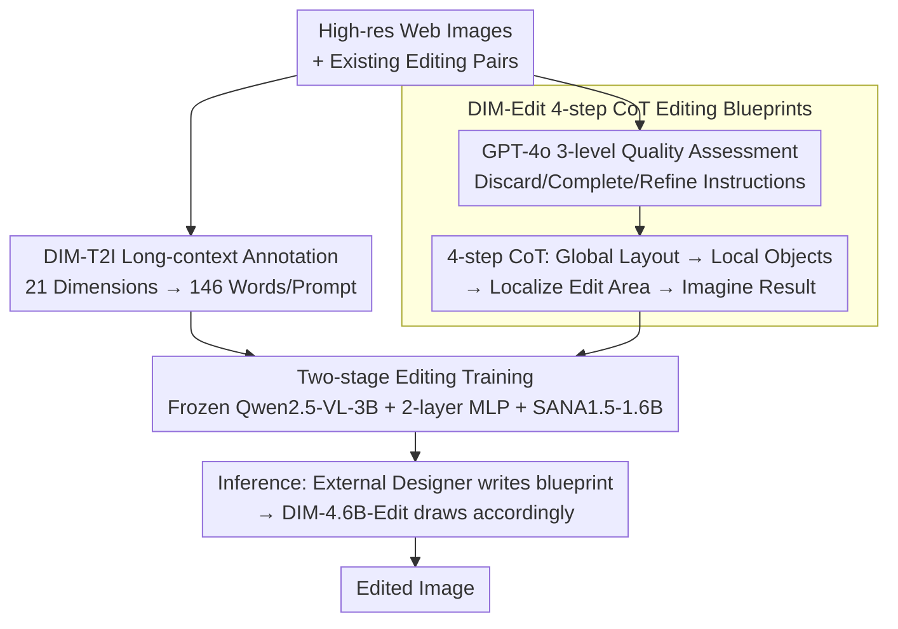

# Draw-In-Mind: Rebalancing Designer-Painter Roles in Unified Multimodal Models Benefits Image Editing

**Conference**: ICLR 2026  
**arXiv**: [2509.01986](https://arxiv.org/abs/2509.01986)  
**Code**: [GitHub](https://github.com/showlab/DIM)  
**Area**: Diffusion Models / Image Editing  
**Keywords**: Unified Multimodal Model, Chain-of-Thought, image editing, Designer-Painter, Data-Centric

## TL;DR
This paper identifies a responsibility imbalance in current unified multimodal models where the understanding module acts merely as a translator, forcing the generative module to simultaneously serve as both "designer" and "painter." By constructing the DIM dataset (14M long-context image-text pairs + 233K CoT editing blueprints), the design responsibility is shifted to the understanding module, allowing a 4.6B parameter model to outperform models five times its size.

## Background & Motivation
**Background**: Unified multimodal understanding and generation models (e.g., Show-o, BAGEL, UniWorld) perform excellently in T2I generation but still lag significantly behind proprietary models like GPT-4o-Image in instruction-guided image editing.

**Limitations of Prior Work**: The understanding modules of existing editing models only encode user instructions into semantic conditions (acting as "translators"), while the generative modules must simultaneously infer the original layout, localize the editing area, and render new content (acting as both "designer" and "painter"). This distribution of responsibilities is highly sub-optimal.

**Key Challenge**: Understanding modules are typically trained on complex reasoning tasks with much larger datasets than generative modules, yet they are underutilized for design planning. Simply scaling the parameter size (e.g., Step1X-Edit's 12.5B generative parameters) is not an effective strategy.

**Goal**: How to rebalance the division of labor between understanding and generation modules for more efficient editing?

**Key Insight**: Data-centric approach—constructing an editing dataset containing CoT reasoning blueprints, allowing an external designer (MLLM) to complete the editing planning in the text space, so the generative module only needs to execute "painting."

**Core Idea**: Shift the "design" responsibility from the generative module to the understanding module, explicitly reducing the cognitive burden on the generative module through CoT editing blueprints.

## Method

### Overall Architecture
DIM aims to resolve the role imbalance in unified multimodal models where the understanding module acts only as a translator and the generative module is forced to be both designer and painter. The architecture is minimalist: a frozen Qwen2.5-VL-3B serves as the understanding module, connected via a two-layer MLP to a trainable SANA1.5-1.6B generative module, totaling only 4.6B parameters. The system is driven by data: a long-context T2I annotation allows the generative module to learn fine-grained text-to-image correspondence, and an instruction dataset with four-step CoT editing blueprints shifts the design responsibility—what to change and how—from the generation side to the text space. These are injected into the model through two-stage training. During inference, an external designer (default GPT-4o) first writes the editing blueprint, and the generative module only needs to follow the blueprint to draw the image.

### Key Designs

**1. DIM-T2I Long-context Annotation: Teaching the understander "Global Perception"**

For the generative module to make fewer mistakes during editing, it must first understand fine-grained image-text correspondences. However, existing T2I prompts are generally short and lack descriptive granularity. DIM collects high-resolution ($\ge 512^2$) images from the web and uses internal models to generate long-context annotations across 21 dimensions, pushing the average prompt length to 146.76 words. This step does not directly teach editing but allows the connector and generative module to adapt to mapping "dense text → fine-grained images" during the T2I pre-training phase, laying the foundation for processing complex CoT blueprints later.

**2. DIM-Edit 4-step CoT Editing Blueprints: Decomposing editing into executable design drafts**

This is the core of the work, addressing the overload where the generative module serves as both designer and painter. For data sources, DIM aggregates 233K image pairs from existing sources like UltraEdit, ShareGPT-4o-Image, and manual edits (using a high-consistency subset of UltraEdit filtered by SSIM/DINO/CLIP). Since original instruction quality varies, GPT-4o first classifies each prompt into three categories: Misaligned (discarded), Partially Aligned (completing missing modifications), and Aligned (disambiguation and refinement). These cleaned instructions and source images are then fed to GPT-4o to write four-step CoT blueprints: Global Layout Perception (identifying key objects and positions), Local Object Perception (describing shapes/colors/textures/states), Edit Area Localization, and Edited Image Imagination. This reasoning chain explicitly defines what and where to change in text, with an average length of 252.64 words. The generative module no longer receives a vague instruction but a blueprint nearly equivalent to a final draft, effectively shifting the cognitive load to the text space.

**3. Two-stage Editing Training: Learning basic editing then blueprint execution**

To prevent interference between T2I and CoT editing capabilities, training is done sequentially. The T2I stage trains the connector and SANA1.5-1.6B on DIM-T2I plus 6.9M public data while freezing Qwen2.5-VL-3B to establish dense mappings. The first editing stage fine-tunes on UltraEdit, where the source image is concatenated with noise along the channel dimension to learn basic editing intuition. The second editing stage fine-tunes on DIM-Edit with CoT blueprints, narrowing the generative module's role to strictly "executing the design draft," resulting in DIM-4.6B-Edit.

### Loss & Training
The entire process uses vanilla flow matching as the objective function without additional distillation or alignment losses. The optimizer is AdamW. The T2I stage uses a learning rate of $2 \times 10^{-5}$ and batch size 256 for 8 epochs. Editing Stage I uses $1 \times 10^{-4}$ and batch size 32 for 10 epochs. Stage II reduces the learning rate to $1 \times 10^{-5}$ for 50 epochs. Distillation data like BLIP3-o-60K is intentionally excluded to avoid data leakage or benchmark hacking. During inference, GPT-4o is used as the default designer, though experiments confirm GPT-5 and Claude are also effective. Crucially, the designer only sees the source image and instruction during inference, matching real-world scenarios.

## Key Experimental Results

### Main Results (ImgEdit Benchmark)

| Model | Params | Add | Replace | Remove | Background | Style | Action | Overall |
|------|--------|-----|---------|--------|------------|-------|--------|---------|
| Step1X-Edit | 7B+12.5B | 3.88 | 3.40 | 2.41 | 3.16 | 4.63 | 2.52 | 3.06 |
| BAGEL | 14B | 3.56 | 3.30 | 2.62 | 3.24 | 4.49 | 4.17 | 3.20 |
| UniWorld-V1 | 7B+12B | 3.82 | 3.47 | 3.24 | 2.99 | 4.21 | 2.74 | 3.26 |
| GPT-4o-Image | — | 4.61 | 4.35 | 3.66 | 4.57 | 4.93 | 4.89 | 4.20 |
| **DIM-4.6B-Edit** | **3B+1.6B** | **4.09** | **4.00** | **3.43** | **3.87** | **4.92** | **4.08** | **3.67** |

*DIM significantly outperforms open-source models in the 14B-19B range with less than 5B parameters, narrowing the gap with GPT-4o-Image.*

### GEdit-Bench-EN (Excluding Text Change tasks)

| Model | BC | CA | MA | MC | SC | SA | SRM | SRP | TT | AVG (w/o TC) |
|------|----|----|----|----|----|----|-----|-----|----|-------------|
| Step1X-Edit | 7.03 | 6.26 | 6.46 | 3.66 | 7.24 | 7.17 | 6.42 | 7.39 | 6.62 | 6.35 |
| **DIM-4.6B-Edit** | **7.02** | **6.81** | **6.00** | **4.67** | **7.16** | **7.48** | **6.67** | **6.76** | **6.55** | **6.50** |

### Key Findings
- 1.6B generative parameters can outperform the 12B FLUX backend of Step1X-Edit, verifying that data quality > parameter scale.
- Janus-4o (7B), trained on similar data (ShareGPT-4o-Image), performs significantly worse than DIM, indicating the gain comes from the CoT blueprint itself rather than the data source.
- Different external designers (GPT-4o, GPT-5, Claude) can effectively drive DIM, proving the framework's generalization.
- Strong T2I quality: GenEval 0.77, and an optimal FID of 5.50 on MJHQ-30K.

## Highlights & Insights
- **Deep Insight**: Attributing editing failure to "role imbalance" rather than insufficient model size is a novel and effective perspective.
- **Superior Data Engineering**: The four-step CoT design (Perception → Localization → Imagination) aligns closely with the human cognitive process of image editing.
- **Extreme Efficiency**: Using only a two-layer MLP as a connector (compared to MetaQuery's 1.6B transformer) proves that complex connectors are not mandatory.
- **Rigorous Data Cleaning**: Three-level prompt quality assessment and multi-dimensional filtering avoid common noise in AI-generated data.
- **Design/Execution Separation Paradigm**: This paradigm can be generalized to other generation tasks requiring complex reasoning.

## Limitations & Future Work
- Dependency on external MLLMs (GPT-4o) as designers increases inference costs and API reliance.
- Performance on Text Change tasks is relatively weak due to a lack of specific training data.
- Internalizing the designer into the model (currently external) was not explored; an end-to-end solution might be superior.
- The two-stage training for editing might introduce forgetting; curriculum learning strategies could be optimized.
- The 14M data scale for DIM-T2I still requires significant computational resources.
- While L1 and CLIP-I metrics on MagicBrush are superior, the DINO metric lags behind some methods, suggesting room for improvement in fine-grained semantic preservation.
- Currently only supports single-turn editing; support for multi-turn iterative editing needs further exploration.

## Related Work & Insights
- **MetaQuery**: Also a connector-based unified model but uses a 1.6B transformer connector; DIM matches it with a 2-layer MLP, indicating the bottleneck is data, not connector architecture.
- **BAGEL**: A 14B integrated unified model whose editing performance is inferior to DIM's 4.6B, confirming "bigger is not always better."
- **Step1X-Edit / UniWorld-V1**: Large-scale editing models (7B+12B backend) surpassed by DIM with fewer parameters.
- **Janus-4o**: Trained on ShareGPT-4o-Image but achieves an overall score of only 3.19 (vs DIM's 3.67), showing CoT blueprints provide gains beyond the raw data source.
- **InstructPix2Pix**: Early editing model; DIM's two-stage training strategy is inspired by its channel concatenation design.
- **UltraEdit**: Large-scale AI editing dataset; DIM uses its high-consistency subset for stage-one training.
- **Insight**: When architectural dividends approach saturation, **high-quality data design** (especially CoT reasoning chains) becomes a more efficient path to breakthroughs. The "think then act" paradigm from human workflows can be directly translated into data design principles.

## Rating
- Novelty: ⭐⭐⭐⭐⭐ — The insight into "Designer-Painter" role separation is highly original and validated through data rather than architecture.
- Experimental Thoroughness: ⭐⭐⭐⭐ — Validated across multiple benchmarks and designers, though ablation could be deeper.
- Writing Quality: ⭐⭐⭐⭐⭐ — Logical, intuitive analogies, and high-quality illustrations.
- Value: ⭐⭐⭐⭐⭐ — Provides a new direction for image editing in unified models; data is open-sourced.

<!-- RELATED:START -->

## Related Papers

- [\[ICLR 2026\] Learning an Image Editing Model without Image Editing Pairs](learning_an_image_editing_model_without_image_editing_pairs.md)
- [\[ICLR 2026\] Uni-X: Mitigating Modality Conflict with a Two-End-Separated Architecture for Unified Multimodal Models](uni-x_mitigating_modality_conflict_with_a_two-end-separated_architecture_for_uni.md)
- [\[ICLR 2026\] MMaDA-Parallel: Multimodal Large Diffusion Language Models for Thinking-Aware Editing and Generation](mmada-parallel_multimodal_large_diffusion_language_models_for_thinking-aware_edi.md)
- [\[ECCV 2024\] LayoutDETR: Detection Transformer Is a Good Multimodal Layout Designer](../../ECCV2024/image_generation/layoutdetr_detection_transformer_is_a_good_multimodal_layout_designer.md)
- [\[ICLR 2026\] UniEdit-Flow: Unleashing Inversion and Editing in the Era of Flow Models](uniedit-flow_unleashing_inversion_and_editing_in_the_era_of_flow_models.md)

<!-- RELATED:END -->
