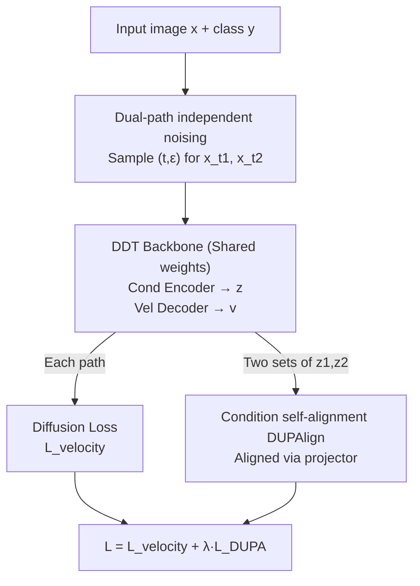

# Dual-Path Condition Alignment for Diffusion Transformers

**Conference**: ICLR 2026  
**OpenReview**: [https://openreview.net/forum?id=ALpn1nQj5R](https://openreview.net/forum?id=ALpn1nQj5R)  
**Code**: https://github.com/PCH-gg/DUPA  
**Area**: Diffusion Models / Image Generation  
**Keywords**: Diffusion Transformer, Representation Alignment, Unsupervised, Self-alignment, Decoupled Architecture

## TL;DR
DUPA replaces the representation alignment in REPA (which uses external vision encoders to label noisy images) with an unsupervised self-alignment mechanism. By independently noising the same image twice and aligning the two sets of conditional features extracted by the model itself, it requires no external images, parameters, or additional compute. On ImageNet 256×256, it achieves FID=1.46 in only 400 epochs, outperforming all methods that do not rely on external supervision.

## Background & Motivation
**Background**: Denoising-based generative models (Diffusion Transformers like DiT and SiT) have progressed rapidly. REPA has become a standard, significantly improving class-to-image generation by aligning intermediate Transformer features with representations from high-performance pre-trained vision encoders (e.g., CLIP, DINOv2). Most subsequent works build upon REPA.

**Limitations of Prior Work**: REPA's reliance on external vision encoders presents two challenges. First is **distribution mismatch (out of distribution)**: when the data distribution of the generative model differs significantly from the encoder's pre-training distribution, the extracted features may "mislead" training rather than help. Second is **extra compute cost**: training or fine-tuning large encoders is expensive—pre-training DINOv2 alone requires 1.1B parameters, 1500 epochs, and 142M images, exceeding the cost of training DiT/SiT itself.

**Key Challenge**: Following observations from REPA ("regularization works better in early layers allowing remaining layers to focus on high frequencies") and DDT ("current Diffusion Transformers are limited by low-frequency semantic encoding"), the authors conclude that REPA's true contribution is providing an **accurate and invariant** "reference representation" from clean images while early Transformer layers extract semantics from noisy images. This is essentially supervised learning, where the vision encoder acts as a "labeler." Consequently, it suffers from both "expensive labeling" and "inaccurate labeling."

**Goal**: To provide representation guidance as effective as REPA without assuming consistent data distributions or introducing expensive external compute.

**Key Insight**: The authors noted a critical fact: for multiple noisy latents generated from the same clean image, the "reference representation" provided by a vision encoder remains **consistent**. During training, these conditional features converge toward the encoder representation, similar to **clustering** in unsupervised learning. Thus, the encoder can be bypassed: by sampling multiple sets of conditional features in one training step and pulling them toward a "cluster centroid," this centroid implicitly plays the role of the external encoder representation in REPA.

**Core Idea**: Noising an image independently $K$ times and using a Decoupled Diffusion Transformer to extract $K$ sets of low-frequency semantic conditions, then aligning these conditions (self-alignment) to replace REPA's external supervised alignment in an unsupervised manner.

## Method

### Overall Architecture
DUPA is built on the **Decoupled Diffusion Transformer (DDT)** backbone, which consists of a "condition encoder + velocity decoder." The workflow involves independently noising the same input image $x$ (and class $y$) twice to obtain two noisy latents. These are passed through two denoising paths in a **weight-sharing** DDT. Each path's condition encoder outputs low-frequency semantic conditions $z_{t_k}$, and the velocity decoder outputs velocity $v_{t_k}$. The training objective combines standard diffusion loss for both paths with **DUPAlign** to align the two sets of conditions.

The following diagram illustrates the "dual-path independent noising → shared DDT forward pass → condition self-alignment" process:

### Key Designs

**1. Decoupled backbone and "conditions" as alignment targets: Bringing alignment to low-frequency semantics**

Instead of aligning arbitrary intermediate features, DUPA utilizes the decoupled structure of DDT to specifically align the **conditional features output by the condition encoder**. DDT splits a traditional DiT: the condition encoder $z_t = \text{Encoder}(x_t, t, y)$ extracts low-frequency semantic conditions, while the velocity decoder $v_t = \text{Decoder}(x_t, t, z_t)$ decodes high-frequency velocity fields under those conditions. This aligns with REPA’s insight that alignment should act on "early semantic layers." Experiments confirm that aligning at layer 8 works best, allowing subsequent layers to focus on details.

**2. Dual-path independent noising: Creating alignable views in one training step**

For a clean image $x$, DUPA independently samples $K$ sets of noise $\epsilon_k$ and timestamps $t_k$ to generate noisy latents $x_{t_k} = \alpha_{t_k}x + \sigma_{t_k}\epsilon_k$ (where $K=2$). This serves two purposes: **training efficiency** (multiple noise states of the same image are trained simultaneously, providing finer gradient guidance) and **generating alignable conditions** (different noise versions of the same image should have similar semantic "destinations," naturally serving as two views for alignment).

**3. Condition self-alignment DUPAlign: "Mutual attraction" instead of "external attraction"**

REPA's alignment loss pulls the DDT condition $z_t$ toward the external encoder output $y_*$:

$$L_{\text{REPA}}(\theta,\phi)=-\mathbb{E}\Big[\frac{1}{N}\sum_{n=1}^{N}\text{sim}\big(y_*^{[n]},z_\phi(z_t^{[n]})\big)\Big]$$

DUPA removes $y_*$ and instead aligns the conditions from the two paths:

$$L_{\text{DUPA}}(\theta,\phi):=-\mathbb{E}\Big[\frac{2}{K(K-1)}\sum_{1\le i<j\le K}\frac{1}{N}\sum_{n=1}^{N}\text{sim}\big(z_\phi(z_{t_i}^{[n]}),z_\phi(z_{t_j}^{[n]})\big)\Big]$$

Where $z_\phi$ is a trainable MLP projector and $\text{sim}$ is cosine similarity. Implicitly, pulling two conditions together is equivalent to converging toward their "cluster centroid," which REPA defines via an external encoder. DUPA defines this implicitly through the data itself. The final loss is $L := L_{\text{velocity}} + \lambda L_{\text{DUPA}}$, with $\lambda=0.5$.

### Loss & Training
- **Total Loss**: $L = L_{\text{velocity}} + \lambda L_{\text{DUPA}}$, where $\lambda=0.5$. Diffusion loss is the sum of $K$-path velocity regression: $\sum_{k}\|v_\theta(x_{t_k},t_k) - \dot\alpha_{t_k}x_* - \dot\sigma_{t_k}\epsilon_k\|^2$.
- **Projector Initialization**: The weights and biases of projector $z_\phi$ **must not be zero-initialized**, otherwise, the conditions for alignment might remain zero, and the model would learn a trivial solution. The first layer uses Kaiming initialization, while subsequent layers use zero-gain Xavier initialization to prevent overfitting.
- **Details**: ImageNet 256×256, batch size 256; VAE from Stable Diffusion ($z \in \mathbb{R}^{32 \times 32 \times 4}$); Adam, LR 1e-4; alignment at layer 8; $K=2$; 8×A100 training.

## Key Experimental Results

### Main Results
System-level comparison on ImageNet 256×256 (DUPA-XL/2):

| Method | Category | Epochs | Ext. Images/Params | FID↓ (w/ CFG) | FID↓ (w/o CFG) | sFID↓ |
| :--- | :--- | :--- | :--- | :--- | :--- | :--- |
| SiT | No auxiliary task | 1400 | 0 / 0 | 2.06 | 8.61 | 4.50 |
| DDT | No auxiliary task | 400 | 0 / 0 | 2.01 | 8.06 | 4.66 |
| ∆FM | Contrastive | 800 | 0 / 0 | 1.97 | – | 4.53 |
| REPA | Supervised alignment | 800 | 142M / 1.1B | **1.42** | 5.90 | 4.70 |
| **DUPA** | Unsupervised alignment | **400** | **0 / 0** | **1.46** | 5.92 | **4.45** |

DUPA outperforms all methods in sFID and reaches an FID of 1.46 in only 400 epochs, which is within 3% of REPA (1.42) despite REPA requiring 800 epochs and an external 1.1B parameter encoder.

### Ablation Study
Component ablation (DUPA-L/2, 400K iterations):

| Configuration | FID↓ | sFID↓ | IS↑ | Note |
| :--- | :--- | :--- | :--- | :--- |
| DDT-L/2 (Baseline) | 14.9 | 5.17 | 87.8 | Standard decoupled backbone |
| + Dual-path sampling | 12.5 | 5.02 | 96.6 | Independent noising only |
| + Cond alignment (Full) | **11.1** | **4.91** | **104.8** | Adding DUPAlign |

DUPA consistently outperforms SiT/DDT across different backbone sizes.

### Key Findings
- **Component Roles**: Dual-path sampling improves training efficiency/gradient guidance (14.9 → 12.5), while condition alignment helps the encoder extract accurate semantics (12.5 → 11.1), contributing most to the Inception Score (IS).
- **Resampling Strategy**: Resampling both $t$ and $\epsilon$ is superior to resampling only one, as diverse noisy views stabilize the implicit centroid.
- **Robustness**: Performance is insensitive to $\lambda$ (0.25 to 1.0).
- **Efficiency**: DUPA achieves roughly **5×** training acceleration and **10×** inference acceleration compared to standard baselines.

## Highlights & Insights
- **Alignment as Clustering**: The most elegant insight is interpreting REPA’s external encoder as a "centroid" provider for different noisy versions and replacing it with self-alignment.
- **Target Selection**: By aligning the decoupled "conditions" at layer 8, DUPA precisely targets the low-frequency semantic layers that benefit most from representation guidance.
- **Zero-Cost Plug-and-Play**: No external assets are needed. It adds only one extra noising forward pass and a small projector MLP during training, making it highly portable.

## Limitations & Future Work
- **Training Duration**: Due to compute constraints, models were trained for only 400 epochs; whether it can fully surpass REPA with longer training is unverified.
- **Backbone Dependency**: The method assumes a decoupled architecture (like DDT). Adapting it to standard DiTs requires defining a "conditional" output layer.
- **K=2 Tradeoff**: While larger $K$ provides marginal gains (FID 11.1 → 10.7), it increases VRAM and time costs.
- **Domain Evidence**: Experiments are concentrated on ImageNet; the advantage in OOD scenarios (e.g., medical imaging) where REPA might fail remains to be directly proven.

## Related Work & Insights
- **vs REPA**: REPA is supervised (external encoder); DUPA is unsupervised (self-alignment). DUPA avoids distribution mismatch and compute overhead.
- **vs Masked Modeling (MaskDiT)**: Masking methods force context reasoning via occlusion; DUPA provides direct semantic guidance similar to REPA.
- **vs Contrastive Learning ($\Delta FM$)**: Contrastive methods typically emphasize discriminating between different classes/samples; DUPA focuses on pulling positive samples (different views of the same image) toward a shared semantic centroid.

## Rating
- Novelty: ⭐⭐⭐⭐⭐ Reinterpreting REPA as clustering and implementing self-alignment is a clean and powerful perspective.
- Experimental Thoroughness: ⭐⭐⭐⭐ Coverage of sizes, components, and efficiency is good, though direct proof of OOD superiority is missing.
- Writing Quality: ⭐⭐⭐⭐ The derivation from supervision to clustering is clear.
- Value: ⭐⭐⭐⭐⭐ Extremely practical for domain-specific generation where external encoders are unavailable.

<!-- RELATED:START -->

## Related Papers

- [\[ICLR 2026\] Scaling Laws for Diffusion Transformers](scaling_laws_for_diffusion_transformers.md)
- [\[ICLR 2026\] Dual-Solver: A Generalized ODE Solver for Diffusion Models with Dual Prediction](dual-solver_a_generalized_ode_solver_for_diffusion_models_with_dual_prediction.md)
- [\[ICLR 2026\] BideDPO: Conditional Image Generation with Simultaneous Text and Condition Alignment](bidedpo_conditional_image_generation_with_simultaneous_text_and_condition_alignm.md)
- [\[ICLR 2026\] Rethinking Global Text Conditioning in Diffusion Transformers](rethinking_global_text_conditioning_in_diffusion_transformers.md)
- [\[CVPR 2025\] Dual Prompting Image Restoration with Diffusion Transformers (DPIR)](../../CVPR2025/image_generation/dual_prompting_image_restoration_with_diffusion_transformers.md)

<!-- RELATED:END -->
