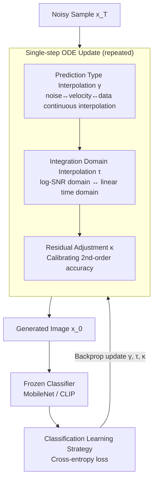

# Dual-Solver: A Generalized ODE Solver for Diffusion Models with Dual Prediction

**Conference**: ICLR 2026  
**arXiv**: [2603.03973](https://arxiv.org/abs/2603.03973)  
**Code**: None  
**Area**: Diffusion Models / Sampling Acceleration  
**Keywords**: ODE solver, learnable sampler, prediction interpolation, domain selection, low-NFE  

## TL;DR
The paper proposes Dual-Solver, which generalizes diffusion model multi-step samplers through three sets of learnable parameters (prediction type interpolation $\gamma$, integration domain selection $\tau$, and residual adjustment $\kappa$). By using the classification loss of a frozen pretrained classifier (MobileNet/CLIP) to learn parameters without requiring teacher trajectories, it outperforms methods like DPM-Solver++ in the low NFE range of 3-9.

## Background & Motivation

**Background**: Inference acceleration is a core challenge for diffusion models. ODE solvers (DPM-Solver, DEIS, etc.) utilize the structure of diffusion dynamics to design efficient sampling. Learnable solvers (BNS-Solver, DS-Solver) optimize time steps and sampling parameters to further improve quality.

**Limitations of Prior Work**: (a) Traditional solvers fix the prediction type (noise/data/velocity) and integration domain (logarithmic/linear), but different choices perform inconsistently across different NFEs, and no universal optimal solution exists; (b) Learnable solvers require massive teacher trajectories or high-NFE sampling to generate target samples, leading to high preparation overhead.

**Key Challenge**: The selection of prediction types and integration domains significantly affects sampling quality, but the optimal choice depends on the backbone and NFE—necessitating an adaptive approach.

**Goal**: To unify different prediction types and integration domains into a continuous parameterized framework and learn the optimal parameters using a classification loss that requires no target samples.

**Key Insight**: It is observed that noise prediction, velocity prediction, and data prediction can be interchanged via linear combinations, and integration in the $\log$ SNR domain versus the linear $t$ domain can also be represented as continuous interpolation. These can all be parameterized and learned end-to-end.

**Core Idea**: Parameterize prediction types, integration domains, and residual terms, and then use the classification accuracy of a frozen classifier as a training signal in the absence of target samples.

## Method

### Overall Architecture

Dual-Solver follows the standard predictor-corrector multi-step sampling skeleton of diffusion models but transforms three previously fixed sampling designs—prediction type, integration domain, and residual terms—into three sets of continuous learnable parameters $\gamma$, $\tau$, and $\kappa$. Each ODE update step is sequentially modulated by these three parameters, solving from $x_T$ to $x_0$. These parameters are not fitted using teacher trajectories or high-NFE target samples; instead, the generated images are fed into a frozen pretrained classifier. The cross-entropy classification loss is used for end-to-end optimization of these parameters via backpropagation (while the backbone and classifier remain frozen), automatically finding the optimal configuration for the current backbone in the low NFE range of 3-9 steps.

### Key Designs

**1. Prediction type interpolation $\gamma$: Allowing single-step updates to move freely between noise, velocity, and data predictions**

Traditional solvers use either noise prediction $\hat{\epsilon}_\theta$ or data prediction $\hat{x}_\theta$, but there is no consensus on which is better at different NFEs. Choosing one fixed type locks the performance. This paper notes that these targets are linear recombinations of the same network output, so it uses a scalar to continuously interpolate them: $\hat{p}_\gamma = (1-\gamma)\,\hat{\epsilon}_\theta + \gamma\,\hat{x}_\theta$, where $\gamma$ varies per step. This allows picking the most suitable prediction form for each step. Ablation shows that fixing $\gamma=-1$ (pure noise prediction) at NFE=3 causes the FID to spike disastrously to 7.87, while adaptive $\gamma$ reduces it to 0.574, demonstrating that this freedom is crucial for low-step sampling.

**2. Integration domain interpolation $\tau$: Continuous transition between log-SNR and linear time domains**

ODE discretization can be performed in the $\lambda=\log(\alpha_t/\sigma_t)$ domain or the linear $t$ domain. Both have different impacts on numerical errors in low-step sampling, yet neither is universally optimal. Dual-Solver no longer chooses between them but uses $\tau$ to weight and mix the two domains into a continuous spectrum, letting the model decide the bias for each step during training, thus converting "domain selection" from a discrete hyperparameter into a differentiable continuous variable.

**3. Residual adjustment $\kappa$: Stabilizing second-order accuracy after relaxing the first two degrees of freedom**

Once the prediction type and integration domain are modified into learnable interpolations, the original balanced residual terms in multi-step updates may become mismatched, potentially dropping to first-order accuracy. $\kappa$ is specifically used to re-calibrate the residual weights in the multi-step formula, ensuring the update sequence maintains second-order local accuracy regardless of the values of $\gamma$ and $\tau$. Ablations show that fixing $\kappa=0$ degrades the FID at NFE=3 from 0.574 to 0.944, confirming its role in low-step stability.

**4. Classification learning strategy: Replacing regression targets with frozen classifier discriminative loss to eliminate target samples**

Learnable solvers usually require pre-sampling a batch of target samples using high NFE and then regressing the low-step outputs toward them, which is computationally expensive. Dual-Solver instead uses a frozen pretrained classifier (e.g., MobileNet / CLIP) to score the generated images. Cross-entropy classification loss (using conditional classes as labels) acts as the training signal for backpropagation to update $\gamma, \tau, \kappa$, while the backbone and classifier remain static. This removes the need for target samples and uses "whether the image falls on the correct class manifold" as a proxy for quality. At NFE=3, this reduced FID from 41.58 (strongest regression baseline, VGG feature regression) to 24.91. The paper also finds a V-shaped curve relative to classifier strength: among 20 tested classifiers, those with medium accuracy performed best—too strong leads to over-constraint, too weak provides insufficient signal.

### Loss & Training

During training, the entire diffusion backbone and classifier are frozen; only the three sets of parameters $\gamma, \tau, \kappa$ are optimized. The objective is the cross-entropy classification loss with conditional class labels. Because there are very few parameters to learn and no target samples are required, this scheme can be migrated plug-and-play to various backbones like DiT, GM-DiT, SANA, and PixArt-α. The learned parameters can also be linearly interpolated across NFEs for steps not seen during training, still outperforming manual solvers.

## Key Experimental Results

### Main Results (ImageNet 256, DiT-XL/2, 50k sample evaluation, CFG=1.5)

Comparison of FID on DiT with different learning strategies:

| Learning Method | NFE=3 FID↓ | NFE=5 FID↓ | NFE=7 FID↓ | NFE=9 FID↓ |
|---------|-----------|-----------|-----------|-----------|
| Sample Regression | 107.13 | 11.71 | 4.60 | 2.99 |
| Trajectory Regression | 100.89 | 11.59 | 3.66 | 2.84 |
| Feature Regression (AlexNet) | 47.75 | 7.24 | 3.42 | 2.91 |
| Feature Regression (VGG) | 41.58 | 5.48 | 3.23 | 2.88 |
| **Classification Learning (Hard-label)** | **24.91** | **3.52** | **2.75** | **2.67** |

Classification learning significantly outperforms regression methods across all NFEs, with FID at NFE=3 dropping from 41.58 to 24.91 (-40% Gain).

### Ablation Study

Ablation of parameter configurations (DiT, p1c2 setup):

| Configuration | NFE=3 FID | NFE=5 FID | NFE=7 FID | NFE=9 FID |
|------|----------|----------|----------|----------|
| All learnable | **0.574** | **0.197** | 0.178 | 0.173 |
| $\gamma=0$ fixed | 0.600 | 0.202 | 0.183 | 0.180 |
| $\gamma=1$ fixed | 0.816 | 0.223 | 0.182 | 0.176 |
| $\gamma=-1$ fixed | 7.871 | 7.676 | 0.238 | 0.196 |
| $\kappa=0$ fixed | 0.944 | 0.256 | 0.202 | 0.190 |
| p1 (No corrector) | 0.667 | 0.225 | 0.183 | 0.175 |
| p2 | 1.023 | 0.253 | 0.222 | 0.181 |

Multiple backbone coverage: Effectiveness was validated across DiT (ImageNet conditional), GM-DiT (flow matching, ImageNet), PixArt-α (T2I, 512px), and SANA (flow matching T2I, 512px).

### Key Findings
- **Adaptivity of $\gamma$ is essential**: Fixing $\gamma=-1$ (noise prediction) leads to catastrophic degradation (FID 7.87) at low NFE, while adaptive $\gamma$ automatically selects the optimal prediction type for different steps.
- **V-shaped curve in classifier selection**: Testing 20 pretrained classifiers revealed that medium-accuracy classifiers yield the best results—excessive strength over-constrains, while insufficient strength lacks helpful signal.
- **Parameters are interpolatable across NFE**: The learned parameter patterns are similar for adjacent NFEs; linear interpolation to unseen NFEs still outperforms manual solvers.
- For GM-DiT (flow matching) at NFE 7-9, Dual-Solver performs slightly worse, but regains its advantage when combined with trajectory regression.

## Highlights & Insights
- **3D parameterization** unifies design choices for a large number of samplers—DPM-Solver++ is a special case where $\gamma=0, \tau=0$.
- **Classification learning** as a replacement for regression learning is a core innovation—it eliminates the need for high-NFE target samples, requiring only a frozen classifier. This logic can be extended to the optimization of any differentiable metric.

## Limitations & Future Work
- Parameters are dependent on the specific backbone and NFE, requiring re-learning for each configuration.
- Classification loss might bias toward classifiability rather than overall visual quality.
- Only validated in the 3-9 NFE range; whether the advantage holds for higher NFEs is unknown.

## Related Work & Insights
- **vs DPM-Solver++**: Dual-Solver is its generalized version, adaptively selecting optimal configurations via learned parameters.
- **vs BNS/DS-Solver**: These are also learnable solvers, but Dual-Solver does not require target samples.
- Can be used orthogonally with methods like Consistency Distillation.

## Rating
- Novelty: ⭐⭐⭐⭐ The combination of a unified parameterization framework and classification learning is innovative.
- Experimental Thoroughness: ⭐⭐⭐⭐ Comprehensive across multiple backbones (DiT/SANA/PixArt) and multiple NFEs.
- Writing Quality: ⭐⭐⭐⭐ Mathematical derivations are clear.
- Value: ⭐⭐⭐⭐ Practical improvements in the low NFE range, plug-and-play.

<!-- RELATED:START -->

## Related Papers

- [\[ICLR 2026\] GAS: Improving Discretization of Diffusion ODEs via Generalized Adversarial Solver](gas_improving_discretization_of_diffusion_odes_via_generalized_adversarial_solve.md)
- [\[CVPR 2026\] Image Diffusion Preview with Consistency Solver](../../CVPR2026/image_generation/image_diffusion_preview_with_consistency_solver.md)
- [\[ICLR 2026\] Dual-Path Condition Alignment for Diffusion Transformers](dual-path_condition_alignment_for_diffusion_transformers.md)
- [\[ICLR 2026\] LVTINO: LAtent Video consisTency INverse sOlver for High Definition Video Restoration](lvtino_latent_video_consistency_inverse_solver_for_high_definition_video_restora.md)
- [\[ICLR 2026\] Generating Directed Graphs with Dual Attention and Asymmetric Encoding](generating_directed_graphs_with_dual_attention_and_asymmetric_encoding.md)

<!-- RELATED:END -->
