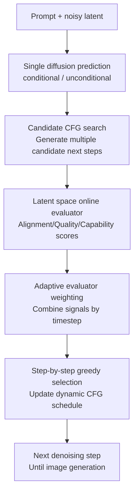

# Dynamic Classifier-Free Diffusion Guidance via Online Feedback

**Conference**: ICLR2026  
**OpenReview**: [https://openreview.net/forum?id=z9YC9bvfUL](https://openreview.net/forum?id=z9YC9bvfUL)  
**Code**: Not yet public  
**Area**: Image Generation / Diffusion Models  
**Keywords**: Dynamic CFG, online feedback, latent space evaluator, T2I sampling, Imagen 3  

## TL;DR

This paper replaces the static classifier-free guidance scale in diffusion models with a dynamic schedule selected online at each step. By using lightweight latent space evaluators to score candidate CFG scales during each reverse diffusion step and greedily selecting the optimal value, the method simultaneously improves text alignment, visual quality, text rendering, and counting capabilities with negligible additional sampling cost.

## Background & Motivation

**Background**: Text-to-image diffusion models typically use classifier-free guidance (CFG) at inference time to control condition signal strength. The approach is straightforward: the model predicts both conditional and unconditional noise, and a guidance scale $s$ is used to amplify the difference. This parameter has become the default sampling knob for models like Stable Diffusion and Imagen, as it allows trading off between text alignment, visual fidelity, and diversity without retraining the main model.

**Limitations of Prior Work**: In practice, the CFG scale is often a fixed constant throughout the process or a hand-crafted schedule based solely on the timestep. The problem is that needs vary across prompts: some require strong alignment (e.g., accurately placing multiple objects or specific text), while others prioritize aesthetics and natural textures where excessive guidance introduces artifacts, stereotypical compositions, and reduced diversity. A fixed value forces all prompts and sampling stages into a single compromise, assuming "all images need the same strength of guidance."

**Key Challenge**: The optimal CFG strength depends on three factors: the requirements of the current prompt, the current generation stage of the sample, and the specific errors the underlying diffusion model might exhibit at that stage. Early high-noise stages are better suited for determining global structure and semantic layout, while late low-noise stages are better for judging text readability or local artifacts. Timestep-only fixed schedules ignore the online state of the prompt and sample; post-processing or multi-seed filtering either significantly increases computation or fails to correct individual trajectories.

**Goal**: The authors aim to provide a unique CFG schedule for each prompt and sample without training new main diffusion models, increasing denoising NFE, or relying on expensive pixel-space auto-raters. Specifically, the method must evaluate the quality of intermediate noisy latents online, combine signals for text alignment, visual quality, and specific capabilities, and generalize across different model families from LDM to Imagen 3.

**Key Insight**: A critical observation is that although the final image is not fully decoded, diffusion latents already contain sufficient signals regarding alignment and quality during sampling. By training small evaluators that directly read noisy latents, one can cheaply predict whether the current trajectory resembles a good or bad image if a certain CFG scale is continued. This is much cheaper than decoding to pixels and running large models at every step and is more sensitive to the current sample state than a fixed schedule.

**Core Idea**: Replace man-made static guidance schedules with latent space online evaluators. Perform a greedy search over a set of candidate CFG scales at each reverse diffusion step to select the scale that maximizes the current evaluation score.

## Method

### Overall Architecture

The method occurs during the diffusion model inference stage without modifying the training of the main model. Given a prompt and the current noisy latent $x_t$, the system first performs standard conditional and unconditional noise predictions. Multiple candidate CFG scales are then applied to the same set of predictions to generate candidate next states. Lightweight latent space evaluators score these candidates directly on the latents, and the scale with the highest score is selected for the next step.

The focus is "online feedback": the choice at each step is determined by the current latent state rather than being pre-defined. Different prompts follow different CFG curves, and guidance strength may vary significantly between early and late stages of the same prompt.

### Key Designs

**1. Latent Space Online Evaluator: Moving "good or bad" judgment forward to noisy latents**

Traditional image quality or text alignment evaluations occur on final images or require decoding intermediate latents back to pixels to run models like CLIP, VQA, or OCR. This is too expensive for every sampling step. This work trains a set of small evaluators that directly read diffusion latents: the inputs are the current noisy latent $x_t$, timestep $t$, and prompt $c$ (where necessary), outputting a quality score $e_t$ for a specific dimension.

The basic alignment evaluator is derived from CLIP. The authors replace the pixel patch embeddings of the CLIP vision tower with embeddings adapted for diffusion latents and make the vision encoder timestep-aware. They continue training with noisy latent-text pairs so it can calculate the similarity between noisy latents and prompts: $e_{CLIP}=CLIP_{vision}(x_t) \cdot CLIP_{text}(c)^T$. The visual quality evaluator acts like a discriminator, judging if a latent looks more like a real image or a generated one, formulated as $e_{Disc}=-\log \frac{p(x_t|t)}{1-p(x_t|t)}$. For Imagen 3, the authors also incorporate human preference rewards, text rendering evaluators, and numerical reasoning evaluators.

The benefit is that signals are fine-grained yet cheap. The latent evaluator only increases LDMlarge sampling FLOPs from 115,489 to 116,739 (approx. 1%), whereas decoding to pixels for evaluation would increase it to 493,239 (over 4x). Thus, online feedback becomes a viable part of the sampling loop rather than a luxury for offline filtering.

**2. Candidate CFG Search: Reusing one noise prediction to compare multiple guidance scales**

The CFG formula is $\epsilon_\theta(x_t|c)=\epsilon_\theta(x_t|\emptyset)+s(\epsilon_\theta(x_t|c)-\epsilon_\theta(x_t|\emptyset))$. While standard sampling uses a fixed $s$, this method prepares a candidate set $S=\{s_1,s_2,...,s_n\}$ at each timestep, constructs candidate next states, and selects the best scale: $\hat{s}_t=\arg\max_{s\in S} e_t(x_t^s,c)$.

Crucially, this search does not increase the NFE (Number of Function Evaluations) of the diffusion model. Since the conditional and unconditional noise predictions only need to be computed once, varying $s$ is simply a linear combination of the same predictions. The only addition is a few lightweight evaluator forward passes. In LDM experiments, candidate scales are $[1, 3, 7.5, 11, 15]$; for Imagen 3, this expands to 24 discrete values.

**3. Adaptive Evaluator Weighting: Letting different quality signals speak at appropriate stages**

Multiple evaluators cannot be simply averaged because their reliability varies across denoising stages. Coarse semantic layout and alignment emerge early, while text rendering, fine artifacts, and aesthetic preferences become meaningful only when noise is low. Fixed weights might allow unreliable detail signals to mislead early stages or cause over-guidance in late stages.

The method uses timestep-dependent adaptive weights, binding each evaluator's influence to its score delta: $\hat{e}_t=\sum_{e\in E}\alpha_{e,t}e_t$, where $\alpha_{e,t}=\frac{e_t-e_{t+1}}{e_{t+1}}$. Intuitively, if an evaluator's score changes significantly between adjacent timesteps, the current stage is informative for its concerned attribute, increasing its influence. This allows general-purpose and capability-specific evaluators to cooperate dynamically.

**4. Capability-Specific Evaluators: Extending dynamic CFG to text and counting**

On powerful models like Imagen 3, standard discriminators struggle to capture subtle quality differences. The framework is thus extended to specific capabilities. The text rendering evaluator is supervised by OCR scores to predict text readability from latents. The numerical reasoning evaluator is trained on image-text data containing countable entities to focus on quantity alignment.

This transforms dynamic CFG from a quality "trick" into a pluggable control framework. For prompts requiring specific text (e.g., MARIO-eval), text rendering signals are added; for counting prompts (e.g., GeckoNum), numerical reasoning signals are used. It is observed that text rendering requires high guidance in late stages, while numerical reasoning benefits from lower guidance early on to avoid stereotypical layouts.

### A Complete Example

Consider the prompt "A sign in a factory that says Safety First". A default CFG might use a fixed scale of 7.5. Early on, it might secure the "factory + sign" structure, but during letter formation, it won't realize text is deforming nor specifically weigh readability signals higher.

With Dynamic CFG, the early alignment evaluator might choose a higher $s$ to preserve the "factory, sign, text" semantics. In the middle, if a visual quality evaluator detects artifacts, it might pull the scale back. In the late stage, as the text rendering evaluator's score delta increases, its weight rises, leading the system to choose scales that make "Safety First" legible.

### Loss & Training

The main diffusion model is not retrained. Training focuses on latent space evaluators. The alignment evaluator is initialized from a pre-trained CLIP-ViT-B/16, with the vision embedding modified for diffusion latents. It is trained on WebLI image-text pairs by encoding images to latents and injecting noise similar to diffusion training, using a CLIP contrastive loss. For LDM, ViT-B/16 is converted to ViT-B/4 to match the $512\times512$ latent token count.

Other evaluators are fine-tuned from the latent alignment evaluator. The visual quality evaluator uses a binary classification loss on real vs. generated images from MS-COCO. The reward evaluator uses generated image pairs with human preference labels using a Bradley-Terry model. The text rendering evaluator uses MSE against OCR scores. Fine-grained evaluators like reward and text rendering utilize timestep-weighted losses, giving near-zero weight at early high-noise stages.

## Key Experimental Results

### Main Results

Comparison on LDMlarge using Gecko score (alignment, higher is better) and FID (fidelity, lower is better).

| Method | Evaluator / Schedule | Gecko score ↑ | FID ↓ | Main Conclusion |
| :--- | :--- | :--- | :--- | :--- |
| Default CFG | Fixed CFG | 43.8 | 25.6 | Default compromise; neither metric is optimal |
| Gradient guidance | Alignment | 46.1 | 25.6 | Improves alignment but not fidelity |
| Gradient guidance | Visual Quality | 44.6 | 25.5 | Limited improvement in fidelity |
| Static schedule | Annealing | 47.0 | 28.9 | Good alignment at the cost of FID |
| Static schedule | Mean of Dynamic CFG | 46.5 | 26.8 | Average curve is worse than per-prompt adaptation |
| Dynamic CFG | Alignment only | 45.5 | 26.4 | Biased toward alignment; fidelity drops |
| Dynamic CFG | VQ only | 44.0 | 24.8 | Biased toward fidelity; alignment limited |
| Dynamic CFG | Alignment + VQ adaptive | 47.2 | 24.8 | Achieves highest alignment and best FID simultaneously |

On Imagen 3, side-by-side human preference win rates relative to default Imagen 3:

| Prompt set / Capability | Best Dynamic Config | Win Rate ↑ | Comparison Detail |
| :--- | :--- | :--- | :--- |
| Gecko / Overall | Alignment + Reward | 53.6% | Significant gains in aesthetics and alignment |
| GenAI-Bench / Overall | Alignment + Reward | 53.8% | Outperforms default on compositional prompts |
| MARIO-eval / Text | Text rendering + Reward | 55.5% | Specialized text evaluator provides maximum gain |
| GeckoNum / Counting | Numerical + Reward | 54.1% | Specialized numerical evaluator most effective |

### Ablation Study

| Configuration | Key Metric | Description |
| :--- | :--- | :--- |
| Latent CLIP filtering @25% | LDMlarge Gecko 45.9 vs baseline 42.9 | Latent alignment evaluator can filter poor trajectories after only 1/4 denoising |
| Pixel CLIP filtering @25% | LDMlarge Gecko 47.1 | Pixel-space evaluation is stronger but too expensive for online use |
| Alignment + VQ linear | Gecko 45.0 / FID 25.4 | Fixed weighting fails to bridge alignment and fidelity stablely |
| Alignment + VQ adaptive | Gecko 47.2 / FID 24.8 | Adaptive weighting is key to improving both targets |

### Key Findings

- Gains do not come from just "average schedule shape." Fixed average curves across all prompts perform worse than per-sample online selection.
- Different evaluators pull toward different guidance ranges: alignment toward high CFG, and visual quality toward low CFG. Adaptive weighting creates a balanced curve.
- Empirical schedules generalize poorly across models. Annealing and limited intervals often fall below the baseline on Imagen 3.
- Optimal guidance patterns differ by task. Text rendering needs high guidance late, while counting needs low guidance early to maintain layout diversity.

## Highlights & Insights

- Framing CFG scale as an "online control variable" rather than a "global hyperparameter" is a clean perspective. It leverages the existing $s$ in the CFG formula with current latent feedback.
- Latent space evaluators are positioned effectively: they trade some absolute accuracy for "actionable accuracy" to guide the next step without the cost of full decoding.
- Adaptive weighting provides a natural explanation for multi-objective sampling. Objectives like alignment and aesthetics are not static; they become observable at different noise levels.
- The method generalizes to other inference-time control problems like safety, style consistency, or identity preservation by training cheap latent evaluators.

## Limitations & Future Work

- Strong dependency on evaluator quality. If a latent evaluator is biased toward some attribute, the search will consistently select scales people might not prefer.
- Greedy search only optimizes the current step. While beam search showed minimal gains in the current setup, complex tasks might require longer-horizon planning.
- The candidate scale set is discrete. While stable, the search space might need redesigning for different models or schedulers.
- Primarily demonstrated on T2I. Video or 3D generation involves stronger temporal/structural constraints that require further verification of latent evaluator stability.

## Related Work & Insights

- **vs. Static/Empirical Schedules**: Methods like annealing vary guidance based only on timestep. This paper allows each prompt to deviate from the average curve.
- **vs. Gradient-based Guidance**: CLIP/discriminator guidance modifies sampling direction via gradients, introducing extra hyperparameters. This method only selects the scale $s$ within the existing CFG framework, offering fewer control variables and lower overhead.
- **vs. Rejection/Restart Sampling**: Rejection sampling or FK steering often picks from multiple seeds/trajectories, increasing NFE. This work focuses on a single trajectory from a fixed seed, concentrating computation on per-step scale selection.

## Rating

- Novelty: ⭐⭐⭐⭐⭐ High. Framing CFG as online feedback control is direct and addresses the core weakness of static guidance.
- Experimental Thoroughness: ⭐⭐⭐⭐⭐ Comprehensive coverage of models, metrics, human evaluation, and specific capabilities.
- Writing Quality: ⭐⭐⭐⭐☆ Clear mainline; some evaluator training details require consulting the appendix for the full picture.
- Value: ⭐⭐⭐⭐⭐ Extremely practical for T2I inference, especially for low-cost quality and capability enhancement on strong models.

<!-- RELATED:START -->

## Related Papers

- [\[ICLR 2026\] Stage-wise Dynamics of Classifier-Free Guidance in Diffusion Models](stage-wise_dynamics_of_classifier-free_guidance_in_diffusion_models.md)
- [\[AAAI 2026\] Studying Classifier(-Free) Guidance From A Classifier-Centric Perspective](../../AAAI2026/image_generation/studying_classifier-free_guidance_from_a_classifier-centric_perspective.md)
- [\[ICLR 2026\] Overshoot and Shrinkage in Classifier-Free Guidance: From Theory to Practice](overshoot_and_shrinkage_in_classifier-free_guidance_from_theory_to_practice.md)
- [\[CVPR 2026\] CFG-Ctrl: Control-Based Classifier-Free Diffusion Guidance](../../CVPR2026/image_generation/cfg-ctrl_control-based_classifier-free_diffusion_guidance.md)
- [\[AAAI 2026\] DICE: Distilling Classifier-Free Guidance into Text Embeddings](../../AAAI2026/image_generation/dice_distilling_classifier-free_guidance_into_text_embedding.md)

<!-- RELATED:END -->
