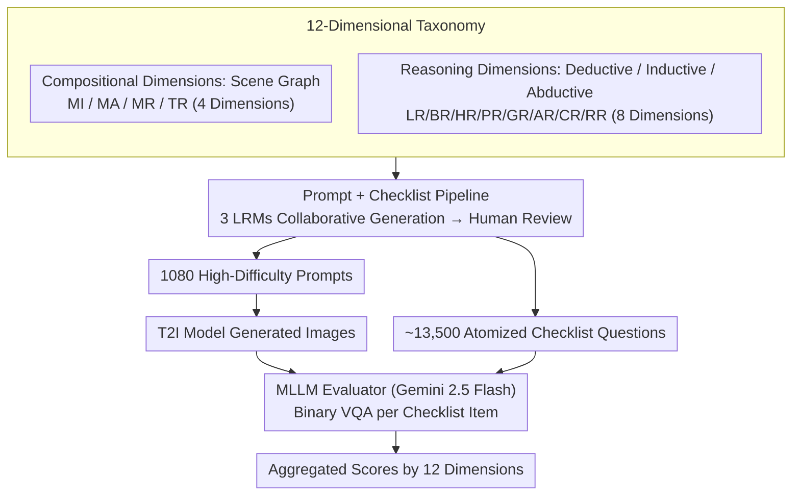

# Easier Painting Than Thinking: Can Text-to-Image Models Set the Stage, but Not Direct the Play?

**Conference**: ICLR 2026  
**arXiv**: [2509.03516](https://arxiv.org/abs/2509.03516)  
**Code**: [GitHub](https://github.com/) (Available, including Leaderboard and Benchmark)  
**Area**: Text-to-Image Generation / Evaluation Benchmark  
**Keywords**: T2I Evaluation, Compositional Generation, Reasoning Capability, Benchmark, Scene Graph

## TL;DR

Proposes T2I-CoReBench, the first comprehensive benchmark to systematically evaluate both the **Composition** and **Reasoning** capabilities of T2I models. It covers 12 evaluation dimensions, 1080 high-difficulty prompts, and approximately 13,500 checklist questions. A large-scale evaluation of 38 models reveals that reasoning capabilities lag far behind compositional ones, identifying reasoning as the core bottleneck in current T2I generation.

## Background & Motivation

In T2I generation, text prompts contain both **explicit descriptions** (content requiring compositional generation) and **implicit cues** (content requiring reasoning to generate correctly). For example, "a ripe tomato held tightly in a fist" implies "tomato juice bursting out." This corresponds to two core capabilities: Composition and Reasoning.

**Limitations of Prior Work**:
- **Lack of comprehensiveness**: Most benchmarks evaluate only composition or only reasoning, using heuristic taxonomies that fail to systematically cover all dimensions.
- **Lack of complexity**: Compositional scenarios typically test only a few visual elements ($\le 5$), while reasoning tasks involve simple one-to-one causality, failing to reflect high-density real-world scenarios.

**Key Insight**: Leverage Scene Graph structures to organize compositional capabilities and the philosophical trichotomy of reasoning (Deductive/Inductive/Abductive) to organize reasoning capabilities, building a comprehensive and complex 12-dimensional evaluation system.

## Method

### Overall Architecture

The core observation of T2I-CoReBench is that a T2I prompt contains both **explicit descriptions** (what to draw, reliant on composition) and **implicit cues** (what to think, reliant on reasoning). Current benchmarks are either restricted in scope or too low in complexity. The pipeline structures "what to evaluate" and "how to evaluate": first, using a 12-dimensional taxonomy to structure **Composition** (4 dimensions from Scene Graphs) and **Reasoning** (8 dimensions from philosophical trichotomy), then employing multiple Large Reasoning Models (LRMs) to collaboratively generate high-complexity prompts and atomized checklists, and finally using MLLMs to verify generated images against the checklist to aggregate scores. The benchmark includes 1080 prompts and ~13,500 checklist questions.

### Key Designs

**1. Composition Dimensions: Increasing Visual Element Density via Scene Graphs**
A common flaw in existing compositional benchmarks is sparse visual elements (usually $\le 5$), which fails to test model performance under density pressure. This work uses the Instance-Attribute-Relation triplets of Scene Graphs to split composition into four dimensions and increases density to $\sim 20$ visual elements per prompt: MI (Multi-Instance) requires ~25 instances (e.g., "busy modern kitchen"), MA (Multi-Attribute) requires ~20 attributes for a single subject, MR (Multi-Relation) requires ~15 relations, and TR (Text Rendering) requires ~15 text entries. The average density is 4-5x higher than DPG-Bench, pushing models to their compositional limits.

**2. Reasoning Dimensions: Systematic Coverage via Philosophical Trichotomy**
Previous reasoning evaluations were often fragmented heuristics and limited to simple causality. This work uses the Deductive/Inductive/Abductive framework to split reasoning into 8 dimensions: Deductive (Premise $\to$ Conclusion) includes LR (Logic), BR (Behavior), HR (Hypothesis), PR (Process); Inductive (Pattern $\to$ Rule) includes GR (Generalization), AR (Analogy); Abductive (Observation $\to$ Explanation) includes CR (Common Sense), RR (Reconstruction). It introduces one-to-many and many-to-one reasoning chains to move beyond simple one-to-one causality.

**3. Prompt + Checklist Pipeline: Ensuring Difficulty and Verifiability**
To ensure prompts are difficult and diverse without model bias, a unified instruction template (task goals + prompt design principles + checklist rules) is used. Three SOTA LRMs (Claude Sonnet 4, Gemini 2.5 Pro, OpenAI o3) collaboratively generate candidates, followed by strict human review. Each prompt is paired with a checklist—a set of independent, binary (Yes/No) questions targeting explicit and implicit cues. This atomization is key to automated MLLM evaluation, preventing ambiguity.

### Loss & Training

As a benchmark, there is no training process. During evaluation, the checklists are fed to an MLLM evaluator (Gemini 2.5 Flash, selected for high alignment with human judgment and scalability). Each checklist question is treated as a binary VQA task ("1"=Yes / "0"=No). Results remain consistent across different evaluators like Qwen2.5-VL-72B and Qwen3-VL.

## Key Experimental Results

### Main Results (38 Models Evaluated)

| Model | Params | Comp. Mean | Reas. Mean | Overall Mean |
|------|--------|---------|---------|--------|
| FLUX.2-dev | 32B | **84.7** | **54.2** | **64.4** |
| Qwen-Image-2512 | 20B | 83.7 | 51.7 | 62.4 |
| FLUX.2-klein-9B | 9B | 78.0 | 52.0 | 60.6 |
| LongCat-Image | 6B | 70.8 | 54.1 | 59.6 |
| HunyuanImage-3.0 | 80B | 78.9 | 48.6 | 58.7 |
| BAGEL w/ Think | 14B | 39.6 | 41.9 | 41.1 |
| OmniGen2-7B | 7B | 49.9 | 39.4 | 42.9 |
| PixArt-α | 0.6B | 25.0 | 23.7 | 24.1 |
| Janus-Pro-1B | 1B | 35.5 | 13.0 | 20.5 |

| Breakdown (FLUX.2-dev) | MI | MA | MR | TR | LR | BR | HR | PR | GR | AR | CR | RR |
|---|---|---|---|---|---|---|---|---|---|---|---|---|
| Score | 89.5 | 83.4 | 72.7 | 93.3 | 48.4 | 33.5 | 53.4 | 83.1 | 62.3 | 64.3 | 62.1 | 26.9 |

### Ablation Study

- Results from different MLLM evaluators (Qwen2.5-VL-72B, Qwen3-VL series) are highly consistent with Gemini 2.5 Flash.
- Utilizing three different LRMs for prompt generation successfully avoided single-model bias.

### Key Findings

1. **Steady Improvement in Composition**: Open-source models are narrowing the gap with closed-source ones (FLUX.2-dev reached 84.7).
2. **Significant Reasoning Gap**: Even the strongest models perform poorly in reasoning compared to composition (FLUX.2-dev: 54.2 Reasoning vs. 84.7 Composition).
3. **Internal Thinking Models Help but are Limited**: BAGEL w/ Think improved reasoning from 34.1 to 41.9 but still lags behind diffusion models.
4. **Huge Variance in Text Rendering**: FLUX.2-dev excels at 93.3, while most autoregressive/unified models are below 10.
5. **Scale is Not Decisive**: The 6B LongCat-Image outperformed the 80B HunyuanImage-3.0 in reasoning (54.1 vs 48.6).

## Highlights & Insights

- Systematically introduces the philosophical trichotomy (Deduction/Induction/Abduction) to T2I evaluation for the first time.
- High-density composition (~20 elements/prompt) and intense reasoning (one-to-many/many-to-one) better reflect real-world applications.
- Reveals a critical insight: **T2I models are better at "painting" (composition) than "thinking" (reasoning)**.
- Checklist design decomposes complex evaluation into atomic questions, improving reliability.

## Limitations & Future Work

- MLLM evaluators may still possess inherent biases despite human validation.
- Reasoning difficulty definitions (one-to-many/many-to-one) remain relatively coarse; reasoning chain lengths could be further refined.
- Only static images are evaluated; no video or interactive generation is included.
- Statistical power might be limited by the sample size per dimension (90 prompts each).

## Related Work & Insights

- **DPG-Bench / ConceptMix**: Early compositional benchmarks, but lacking complexity.
- **R2I-Bench / WISE**: Explorations into reasoning, but covering only limited types.
- **GenAI-Bench**: General evaluation but lacking a systematic taxonomy.
- Insight: The reasoning dimensions in this benchmark could serve as training objectives for future T2I models.

## Rating

- Novelty: ⭐⭐⭐⭐ First systematic integration of composition and reasoning with a theoretical foundation.
- Experimental Thoroughness: ⭐⭐⭐⭐⭐ Comprehensive evaluation of 38 models and cross-validation of evaluators.
- Writing Quality: ⭐⭐⭐⭐⭐ Clear logic, high-quality visualizations, and well-explained taxonomy.
- Value: ⭐⭐⭐⭐⭐ Fills a gap in T2I reasoning evaluation with significant implications for the community.

<!-- RELATED:START -->

## Related Papers

- [\[NeurIPS 2025\] Aligning Text to Image in Diffusion Models is Easier Than You Think](../../NeurIPS2025/image_generation/aligning_text_to_image_in_diffusion_models_is_easier_than_you_think.md)
- [\[ICLR 2026\] Charts Are Not Images: On the Challenges of Scientific Chart Editing](charts_are_not_images_on_the_challenges_of_scientific_chart_editing.md)
- [\[CVPR 2026\] CRAFT: Aligning Diffusion Models with Fine-Tuning Is Easier Than You Think](../../CVPR2026/image_generation/craft_aligning_diffusion_models_with_finetuning_is_easier_than_you_think.md)
- [\[ICLR 2026\] Stage-wise Dynamics of Classifier-Free Guidance in Diffusion Models](stage-wise_dynamics_of_classifier-free_guidance_in_diffusion_models.md)
- [\[ICLR 2026\] Reinforcing Diffusion Models by Direct Group Preference Optimization](reinforcing_diffusion_models_by_direct_group_preference_optimization.md)

<!-- RELATED:END -->
