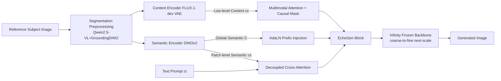

# EchoGen: Generating Visual Echoes in Any Scene via Feed-Forward Subject-Driven Auto-Regressive Model

**Conference**: ICLR 2026  
**OpenReview**: [https://openreview.net/forum?id=ctmyCjo18u](https://openreview.net/forum?id=ctmyCjo18u)  
**Code**: To be confirmed  
**Area**: Image Generation / Subject-Driven Generation  
**Keywords**: Visual Autoregression (VAR), Subject-Driven Generation, Feed-Forward, Dual-Path Injection, Zero-Shot Customization  

## TL;DR
EchoGen introduces "subject-driven generation" to the Visual Autoregressive (VAR/Infinity) framework for the first time. By using a dual-path injection mechanism—a semantic path and a content path—the model decouples subject "identity" from "details." It achieves fidelity comparable to or better than diffusion-based methods on DreamBench, while reducing sampling latency from 10s+ to 0.5–5.2s.

## Background & Motivation
- **Background**: Subject-driven generation (placing a reference subject into a new scene based on a text description) currently follows two main paradigms: "per-subject test-time fine-tuning" (e.g., DreamBooth, Textual Inversion), which yields high quality but requires hundreds of training steps and separate checkpoints for every new subject; and "feed-forward" methods (e.g., IP-Adapter, OminiControl), which offer zero-shot generation after large-scale training but are all built on diffusion models.
- **Limitations of Prior Work**: Although feed-forward methods eliminate the need for per-subject fine-tuning, they inherit the high inference latency of diffusion models' iterative denoising—typically over 10s for a 1024×1024 image—limiting practical deployment.
- **Key Challenge**: The goal is to achieve "feed-forward zero-shot + high fidelity" while maintaining "low latency." VAR models (which predict next-scale from coarse to fine) are naturally fast and high-quality, making them ideal backbones, yet they remain largely unexplored for feed-forward subject-driven tasks.
- **Goal**: To build an efficient, scalable, and highly controllable feed-forward subject-driven system on top of VAR (specifically the text-to-image version, Infinity).
- **Core Idea**: **Decoupled Dual-Path Injection**—a "semantic path" uses DINOv2 to extract abstract subject identity to prevent identity drift, and a "content path" uses the FLUX VAE to extract low-level textural details to restore fidelity. Each path utilizes a distinct injection mechanism, while the backbone is frozen, fine-tuning only the injection modules.

## Method

### Overall Architecture
EchoGen utilizes Infinity (a VAR text-to-image model) as a frozen backbone, inserting "EchoGen blocks" into each Transformer block. These blocks receive subject features from a content encoder and a semantic encoder, treating them as "two sides of the same coin." The input reference image undergoes a segmentation preprocessing pipeline (Qwen2.5-VL for subject description + GroundingDINO for localization/cropping and background whitening) to suppress background noise. Then, the semantic and content paths are injected separately. Training only updates the newly added attention modules. During inference, a dual subject-text CFG is used to flexibly balance "identity fidelity" and "text alignment."

### Key Designs

**1. Dual-Layer Semantic Injection: Preventing Identity Drift** — Semantic features capture the abstract identity of the subject, which is crucial for avoiding "identity drift" during generation. EchoGen extracts two granularities using pretrained DINOv2: patch-level fine-grained semantics $c_s$ are injected via **Decoupled Cross-Attention** in parallel with text conditions. Text and semantics use independent $(W^k,W^v)$ projections concatenated into a context: $Q=ZW^q,\ K=\mathrm{concat}(c_sW^k_s,c_tW^k_t),\ V=\mathrm{concat}(c_sW^v_s,c_tW^v_t)$. Only the semantic projections $(W^k_s,W^v_s)$ are trained to align the visual semantic space with the generator's latent space without disturbing pretrained knowledge. Simultaneously, the **global semantic token $C$** is prefixed to the sequence and used as a condition for AdaLN to provide global structural guidance. Ablations show that DINOv2's fine-grained semantics significantly outperform coarse SigLIP-2 or non-semantic VAE features (DINO 0.632 vs. 0.438/0.433), and the global prefix further improves the DINO score from 0.632 to 0.670.

**2. Content Path for Detail Retrieval: Restoring Texture and Structure Fidelity** — Semantic features are often too abstract, and relying on them alone can lose low-level subject details. The second path uses FLUX.1-dev VAE to extract low-level content $c_c$, injected via **Multimodal Attention**: generation tokens and reference content tokens are concatenated for attention $Q,K,V=\mathrm{concat}(\cdot W,\ c_cW_c)$, but with a carefully designed **attention mask**. This allows generation tokens to access reference tokens to distill details while a causal mask ensures reference tokens cannot see the generated sequence, preventing future information from polluting the autoregressive sampling trajectory. Only the content-side $(W^q_c,W^k_c,W^v_c)$ and associated FFN are trained. Adding this path significantly increases CLIP-I, proving it compensates for local details lost by the semantic path.

**3. Subject Segmentation Preprocessing: Focusing Injection on the Subject** — Real-world reference images often contain complex backgrounds that interfere with injection. EchoGen uses Qwen2.5-VL to identify subject semantics and produce descriptive prompts, which then drive GroundingDINO to precisely locate and crop the bounding box, whitening irrelevant areas. Notably, Qwen2.5-VL is used only for automated labeling during training; it is **optional during inference**, where users can provide a standard DreamBench-style description, thus avoiding inference bottlenecks.

**4. Dual Subject-Text CFG: Balancing Fidelity and Alignment** — During training, the text condition $c_t$ and image conditions $c_s, c_c$ are independently replaced with unconditional tokens with a 10% probability. During inference, assuming text and image conditions are independent, the formula $\hat{l}=l(\varnothing_t,\varnothing_s,\varnothing_c)+\gamma_t\big(l(c_t,\varnothing_s,\varnothing_c)-l(\varnothing_t,\varnothing_s,\varnothing_c)\big)+\gamma_I\big(l(c_t,c_s,c_c)-l(c_t,\varnothing_s,\varnothing_c)\big)$ uses two independent guidance scales $\gamma_t$ and $\gamma_I$ to control text alignment and subject fidelity, providing an explicit knob for the user.

## Key Experimental Results

### Main Results (DreamBench, 30 Subjects × 25 Prompts, Latency measured on H20)

| Method | Backbone | DINO↑ | CLIP-I↑ | CLIP-T↑ | Latency↓ |
| :--- | :--- | :--- | :--- | :--- | :--- |
| DreamBooth (Fine-tuning) | SD-v1.5 | 0.668 | 0.803 | 0.305 | 15min |
| AR-Booth (Fine-tuning) | Infinity-2B | 0.750 | 0.808 | 0.269 | 2.8h |
| OmniGen (Unified Gen.) | OmniGen | 0.693 | 0.801 | 0.315 | 93.4s |
| IP-Adapter (Feed-forward) | SDXL | 0.613 | 0.810 | 0.292 | 16.9s |
| OminiControl (Feed-forward) | FLUX.1-dev | 0.684 | 0.799 | 0.312 | 27.5s |
| EasyControl (Feed-forward) | FLUX.1-dev | 0.652 | 0.789 | 0.325 | 25.4s |
| **EchoGen-0.1B** | Infinity-0.1B | 0.675 | 0.806 | 0.321 | **0.5s** |
| **EchoGen-2B** | Infinity-2B | **0.755** | **0.835** | 0.325 | **5.2s** |

EchoGen-2B achieves the best performance in DINO and CLIP-I, with CLIP-T also among the top, while the latency is 5–50x faster than diffusion feed-forward methods. The 0.1B model produces images in 0.5s while still outperforming several diffusion baselines. In human evaluations (Table 2), EchoGen-2B ranks first in preference for subject fidelity (0.37) and realism (0.34), with text alignment comparable to EasyControl.

### Ablation Study (Conducted on EchoGen-0.1B)

| Ablation Item | Setting | DINO↑ | CLIP-I↑ | CLIP-T↑ |
| :--- | :--- | :--- | :--- | :--- |
| Semantic Encoder (Fine-grained) | SigLIP-2 / FLUX VAE / **DINOv2** | 0.438 / 0.433 / **0.632** | 0.720 / 0.706 / **0.788** | 0.320 / 0.320 / **0.328** |
| Global Semantic Prefix | w/o → w prefix | 0.632 → **0.670** | 0.788 → **0.798** | 0.328 → 0.322 |
| Semantic Injection Method | MM-Attn / **Cross-Attn** | 0.646 / **0.670** | 0.792 / 0.798 | 0.325 / 0.322 |
| Content Detail Injection | baseline / +MM-Attn | 0.670 / **0.672** | 0.798 / **0.806** | 0.322 / 0.321 |

### Key Findings
- **Semantic granularity determines identity fidelity**: Fine-grained DINOv2 semantics are far superior to coarse SigLIP-2 or non-semantic VAE features for maintaining identity.
- **Dual-path division of labor**: The semantic path maintains structure and identity, while the content path supplements local textures (improving CLIP-I), validating the decoupled design.
- **Latency bottleneck lies in the generator**: (Infinity took 4.95s), while GroundingDINO (0.24s) and the two encoders (0.01/0.02s) contribute negligible overhead. The optional Qwen2.5-VL (1.13s) is used only during training.
- **Cross-attention is preferred for semantic injection**: While multimodal attention offers slightly better text alignment, cross-attention achieves significantly higher subject fidelity (DINO).

## Highlights & Insights
- **Paradigm Pioneer**: The first work to build a feed-forward subject-driven generation framework on a VAR autoregressive model, providing a low-latency alternative to the dominant diffusion paradigm.
- **"Two Sides of One Coin" Intuition**: feeding identity (semantic/DINOv2) and details (content/VAE) through different encoders and injection mechanisms avoids the inherent conflict where a single feature must represent both abstract identity and concrete texture.
- **Enginnering of Causal Masks**: Ensuring reference tokens are "blind" to the generated sequence allows the generation side to extract details as needed without breaking the causal nature of AR sampling, which is a key adaptation for porting diffusion-style conditional injection to the AR paradigm.
- **Inference Friendly**: Heavy components (Qwen2.5-VL) are only required during training, making the system highly practical for deployment.

## Limitations & Future Work
- **Absolute latency is constrained by generator scale**: The 5.2s for the 2B model is mostly spent on the Infinity backbone; further speedups require lighter VAR backbones.
- **Reliance on synthetic training data**: The 640K triplets are synthesized by GPT-4o + FLUX.1-dev; the gap between the synthetic subject distribution and real-world long-tail subjects is not fully evaluated.
- **Cascade errors from the segmentation pipeline**: Failure in GroundingDINO's bounding box detection directly impacts injection quality; the paper lacks a sub-discussion on failure recovery.
- **Multi-subject/Attribute binding remains unexplored**: Current focus is on placing a single subject into a new scene; harder controllable generation tasks, such as multi-subject compositions or fine-grained attribute editing, remain for future work.

## Related Work & Insights
- **VAR Lineage**: Built upon VAR (next-scale prediction) and Infinity (bitwise quantization, SOTA text-to-image), utilizing the natural hierarchy of VAR to "determine global composition first, then fill subject details."
- **Feed-forward Subject-Driven Lineage**: Compared to diffusion-based methods like IP-Adapter/OminiControl, the core difference is the replacement of the backbone with AR to gain orders of magnitude in latency benefits.
- **Decoupled Injection Inspiration**: The decoupled cross-attention follows the logic of Custom-Diffusion (Kumari et al.), while the global token + AdaLN follows Infinity; the insight is that the "recipe" of splitting controllable signals into multiple granularities and feeding them into matching injection points can be transferred to other AR controllable generation tasks.

## Rating
- **Novelty**: ⭐⭐⭐⭐ — The first VAR-based feed-forward subject-driven framework is conceptually pioneering. While the dual-path decoupling uses known modules, their application to the AR paradigm with causal masks is a significant adaptation.
- **Experimental Thoroughness**: ⭐⭐⭐⭐ — Comprehensive quantitative results on DreamBench, human evaluations, per-component latency, and 4 sets of ablations; however, it only uses a single benchmark and lacks evaluation on multi-subject or more difficult controllable scenarios.
- **Writing Quality**: ⭐⭐⭐⭐ — The progression from motivation to challenge to method is clear; Figure 2's architecture and mask design are well-explained with standardized formulas.
- **Value**: ⭐⭐⭐⭐ — Reducing subject-driven generation latency to single-digit seconds has direct practical value for real-time creative deployment and provides a reusable template for "AR for controllable generation."

<!-- RELATED:START -->

## Related Papers

- [\[ICLR 2026\] Generate Any Scene: Scene Graph Driven Data Synthesis for Visual Generation Training](generate_any_scene_scene_graph_driven_data_synthesis_for_visual_generation_train.md)
- [\[ICLR 2026\] Generating Metamers of Human Scene Understanding](generating_metamers_of_human_scene_understanding.md)
- [\[CVPR 2025\] Collaborative Decoding Makes Visual Auto-Regressive Modeling Efficient](../../CVPR2025/image_generation/collaborative_decoding_makes_visual_auto-regressive_modeling_efficient.md)
- [\[CVPR 2026\] FlowFixer: Towards Detail-Preserving Subject-Driven Generation](../../CVPR2026/image_generation/flowfixer_towards_detail-preserving_subject-driven_generation.md)
- [\[CVPR 2026\] ChArtist: Generating Pictorial Charts with Unified Spatial and Subject Control](../../CVPR2026/image_generation/chartist_generating_pictorial_charts_with_unified_spatial_and_subject_control.md)

<!-- RELATED:END -->
