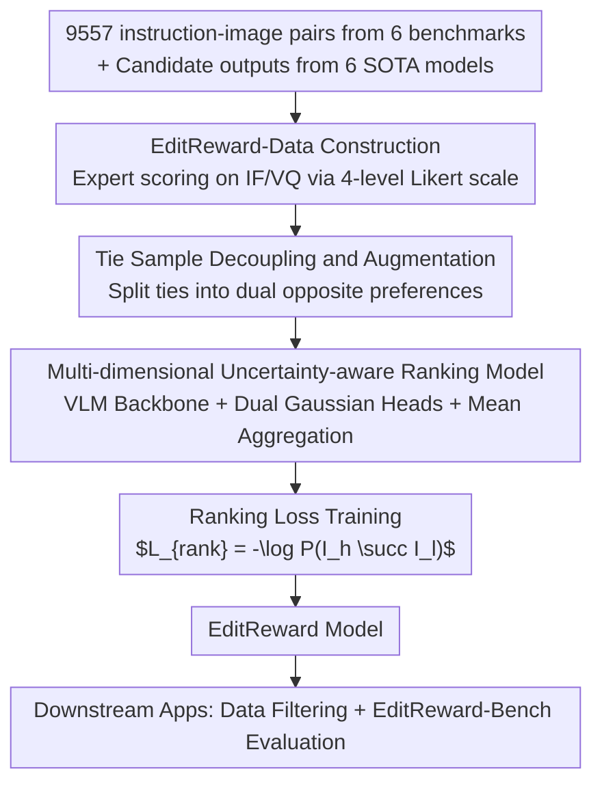

# EditReward: A Human-Aligned Reward Model for Instruction-Guided Image Editing

**Conference**: ICLR 2026  
**arXiv**: [2509.26346](https://arxiv.org/abs/2509.26346)  
**Code**: [GitHub](https://tiger-ai-lab.github.io/EditReward)  
**Area**: Image Editing / Reward Models  
**Keywords**: Image Editing, Reward Model, Human Preference, Data Filtering, VLM

## TL;DR

Constructs a high-quality dataset, EditReward-Data, containing 200K expert-annotated preference pairs, and trains the EditReward model. This model achieves SOTA human alignment across multiple image editing benchmarks and significantly improves downstream editing model performance when used as a data filter.

## Background & Motivation

Instruction-guided image editing has seen significant progress, with closed-source models like GPT-Image-1 and Seedream performing excellently, while open-source models lag behind. **The core bottleneck is the lack of a reliable reward model to filter and scale high-quality training data.**

Existing evaluation/reward methods face three major issues:

**Perceptual scores (e.g., LPIPS)**: Fail to capture semantic alignment with instructions.

**Feature scores (e.g., CLIP)**: Fail to understand editing semantics.

**VLM-as-judge (e.g., VIEScore)**: General VLMs are not optimized for editing tasks.

Existing fine-tuned reward models either rely on noisy crowdsourced annotations (low consistency) or use pseudo-labels from closed-source models (biased). **Key Challenge: Highly reliable reward models require large-scale, high-quality human preference data, which has been severely lacking.**

**Key Insight**: Build a large-scale, high-quality expert preference dataset across multiple dimensions to train a specialized reward model for image editing.

## Method

### Overall Architecture

EditReward integrates data construction and model building into a single pipeline. First, candidate outputs are collected from multiple editing benchmarks and SOTA models. Experts independently score these based on instruction following and visual quality to produce EditReward-Data (200K preference pairs). Tied pairs are not discarded but decoupled into two opposite preferences to augment the training set. Subsequently, a VLM-based multi-dimensional uncertainty-aware ranking model learns human preferences, aiming to rank better editing results higher. Finally, the trained reward model is validated on the EditReward-Bench and used to filter data for downstream models. The design mechanism is centered on the principle that reliable reward signals stem from high-quality expert annotations rather than crowdsourced noise or pseudo-labels.

### Key Designs

**1. EditReward-Data Construction: Trading Expert Annotation for Clean Preference Signals**

Data serves as the foundation of this work. The authors avoided crowdsourcing, collecting 9,557 instruction-image pairs from 6 benchmarks (GEdit-Bench, ImgEdit-Bench, MagicBrush, etc.) and generating outputs from 6 SOTA models (Step1X-Edit, Flux-Kontext, Qwen-Image-Edit, etc.). In the annotation phase, trained experts followed a strict protocol using a 4-level Likert scale to score two independent dimensions: Instruction Following (IF) — semantic accuracy and completeness; and Visual Quality (VQ) — rationality and aesthetics. This decoupling facilitates more precise modeling. The protocol yielded high consistency, with Krippendorff's α reaching 0.668 for IF and 0.597 for VQ, significantly outperforming crowdsourced datasets.

**2. Tie Sample Decoupling and Augmentation: Converting "Ties" into Information**

A large volume of tied samples exists in annotations. Instead of discarding them, the authors observed that a tie often implies a trade-off (e.g., A has better IF, while B has better VQ). Thus, each tied pair $(I_A, I_B)_{\text{tie}}$ is split into two training samples, $I_A \succ I_B$ and $I_B \succ I_A$. This forces the model to learn fine-grained trade-offs between dimensions rather than simply treating them as equivalent, resulting in smoother training curves and maximizing the utility of the collected data.

**3. Multi-dimensional Uncertainty-aware Ranking Model: Modeling Dimensions as Distributions**

Given multi-dimensional labels, the model should not merely regress a scalar score. Inspired by HPSv3, the authors model the score for sample $i$ in dimension $d$ as a Gaussian distribution $s_{i,d} \sim \mathcal{N}(\mu_{i,d}, \sigma_{i,d}^2)$, where $d \in \{1,2\}$ corresponds to IF and VQ. The variance $\sigma$ allows the model to express uncertainty, enhancing robustness to noise. Implementation utilizes multi-task learning (MTL), where reward heads independently predict Gaussian parameters for each dimension, which are then aggregated into a single preference. Aggregation experiments showed that mean aggregation performed best. Preference probability is derived from the integral of the difference between distributions, and the training objective is to maximize the probability that the superior sample $I_h$ is ranked above $I_l$.

### Loss & Training

The backbone utilizes Qwen2.5-VL-7B or MiMo-VL-7B with full parameter unfreezing. Training runs for 2 epochs on 8×A800 GPUs with a 2e-6 learning rate and a cosine schedule. Images are preprocessed to 448x448 while maintaining aspect ratios. The training objective is the ranking loss: $$\mathcal{L}_{\text{rank}} = -\log P(I_h \succ I_l)$$.

## Key Experimental Results

### Main Results

| Method | GenAI-Bench | AURORA-Bench | ImagenHub | EditReward-Bench |
|------|-------------|-------------|-----------|------------------|
| GPT-4o | 53.54 | 50.81 | 38.21 | 28.31 |
| GPT-5 | 59.61 | 47.27 | 40.85 | 37.81 |
| Gemini-2.5-Flash | 57.01 | 47.63 | 41.62 | 38.02 |
| Qwen2.5-VL-7B-Inst | 40.48 | 38.62 | 18.59 | 29.75 |
| **EditReward (Ours, Qwen)** | **63.97** | **59.50** | 36.18 | 36.78 |
| **EditReward (Ours, MiMo)** | **65.72** | **63.62** | 35.20 | **38.42** |

EditReward generally outperforms closed-source models such as GPT-5 and Gemini-2.5-Flash.

### Data Filtering

EditReward was used to filter a high-quality subset from ShareGPT-4o-Image (46K) to fine-tune Step1X-Edit:

| Training Data | GEdit-EN G_O | GEdit-CN G_O |
|---------|-------------|-------------|
| Step1X-Edit Original | 6.444 | 6.779 |
| + Full ShareGPT-4o | 6.780 | 6.583 |
| + Top 10K (EditReward Filtered) | 6.938 | 7.000 |
| + **Top 20K (EditReward Filtered)** | **7.086** | **7.074** |
| + Top 30K (EditReward Filtered) | 6.962 | 6.938 |
| Doubao-Edit | 6.983 | 6.942 |

The Top 20K subset provides the optimal balance, elevating the open-source Step1X-Edit to performance levels competitive with Doubao-Edit.

### Ablation Study

| Variant | Loss Type | Head Type | Aggregation | GenAI-Bench |
|------|---------|----------|---------|-------------|
| I | Pointwise Regression | N/A | N/A | 49.62 |
| II | Pairwise Ranking | Shared | Mean | 60.17 |
| V (Final) | Pairwise Ranking | Multi-Head | Mean | **63.97** |

- Pairwise Ranking outperformed Pointwise Regression (Gain: +14.35).
- Multi-Head design outperformed Shared Head (Gain: +3.80).
- Mean aggregation is the most effective strategy.

### Key Findings

- Post-training, Qwen2.5-VL-7B improved by over 23 points on GenAI-Bench (40.48 → 63.97), demonstrating the framework's effectiveness.
- EditReward performs comparably to GPT-4o on OOD tasks (Text/Style categories) with scores of 46.80 vs 41.69.
- Data quality is more critical than quantity: Top 20K filtered data outperformed the full 46K dataset.

## Highlights & Insights

- The 200K scale expert-annotated preference dataset is of high quality (Krippendorff’s α > 0.59), far exceeding crowdsourced alternatives.
- The multi-dimensional (IF + VQ) decoupling is empirically supported; the higher IAA for IF vs. VQ validates the need for separate modeling.
- Tie decoupling is a simple yet effective technique for extracting maximum information from annotated data.
- The value as a data filter is direct and quantifiable; scoring 46K samples requires only 2.61 GPU hours.

## Limitations & Future Work

- Modeling is limited to 2 dimensions (IF and VQ), which may overlook aspects like spatial consistency or style preservation.
- Evaluations focused mainly on 7B scale VLMs; the effectiveness for larger or smaller models remains unknown.
- Data filtering experiments were limited to a single downstream model (Step1X-Edit), requiring further cross-model validation.
- Accuracy on the multi-way preference ($K=4$) of EditReward-Bench remains low (~11%), indicating the ongoing challenge of the task.

## Related Work & Insights

- **HPSv3**: Pioneer in uncertainty-aware ranking, though limited to single dimensions.
- **ImageRewardDB**: Early preference dataset, but plagued by noise and single-dimensionality.
- **ADIEE**: Uses model-generated labels, introducing bias.
- Insight: The combination of high-quality human annotation and multi-dimensional decoupling is the key path to building reliable reward models.

## Rating

- Novelty: ⭐⭐⭐⭐ Multi-dimensional uncertainty ranking and tie decoupling are highlights; framework is otherwise standard.
- Experimental Thoroughness: ⭐⭐⭐⭐⭐ Evaluation across 4 benchmarks, data filtering apps, detailed ablations, and OOD tests.
- Writing Quality: ⭐⭐⭐⭐ Clear structure and comprehensive data, though some notation is dense.
- Value: ⭐⭐⭐⭐⭐ Both dataset and models will be open-sourced, providing a significant boost to the image editing community.

<!-- RELATED:START -->

## Related Papers

- [\[ICLR 2026\] Visual Autoregressive Modeling for Instruction-Guided Image Editing](visual_autoregressive_modeling_for_instruction-guided_image_editing.md)
- [\[ICLR 2026\] EditScore: Unlocking Online RL for Image Editing via High-Fidelity Reward Modeling](editscore_unlocking_online_rl_for_image_editing_via_high-fidelity_reward_modelin.md)
- [\[CVPR 2025\] Towards Scalable Human-Aligned Benchmark for Text-Guided Image Editing](../../CVPR2025/image_generation/towards_scalable_human-aligned_benchmark_for_text-guided_image_editing.md)
- [\[ICLR 2026\] Learning an Image Editing Model without Image Editing Pairs](learning_an_image_editing_model_without_image_editing_pairs.md)
- [\[ICLR 2026\] Training-Free Reward-Guided Image Editing via Trajectory Optimal Control](training-free_reward-guided_image_editing_via_trajectory_optimal_control.md)

<!-- RELATED:END -->
